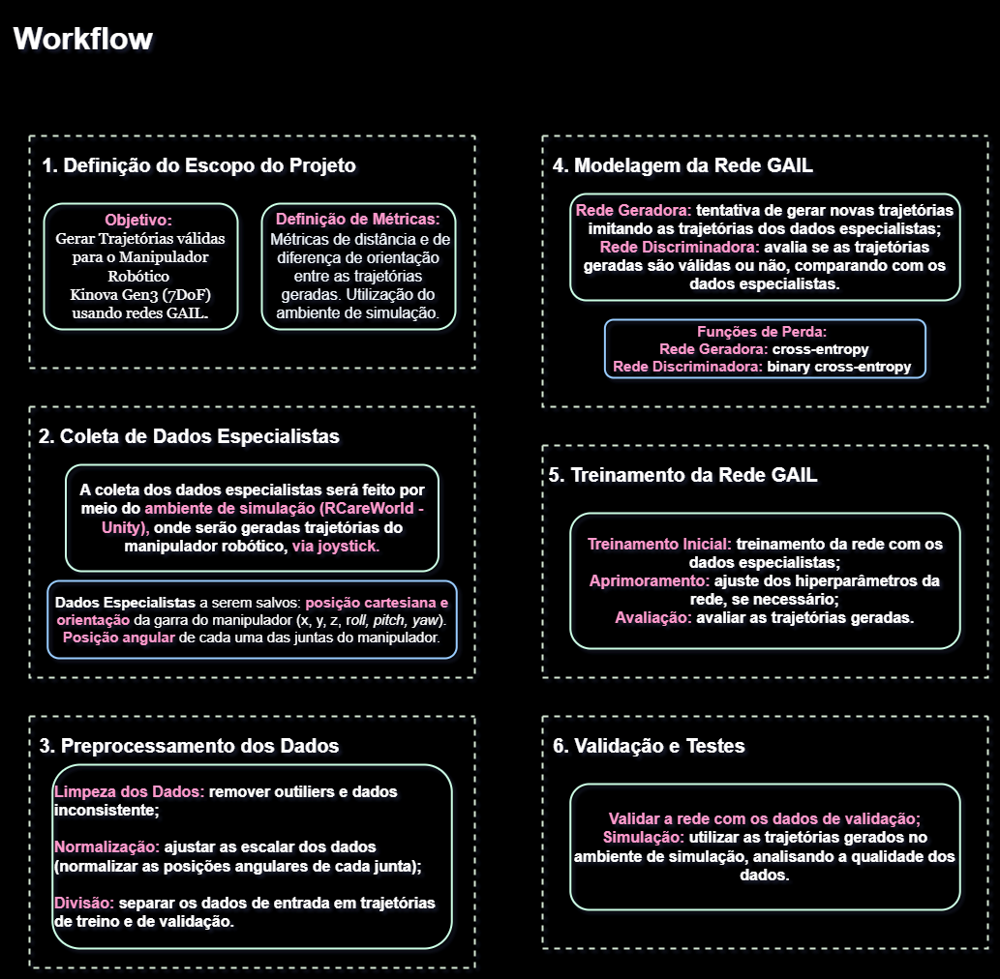
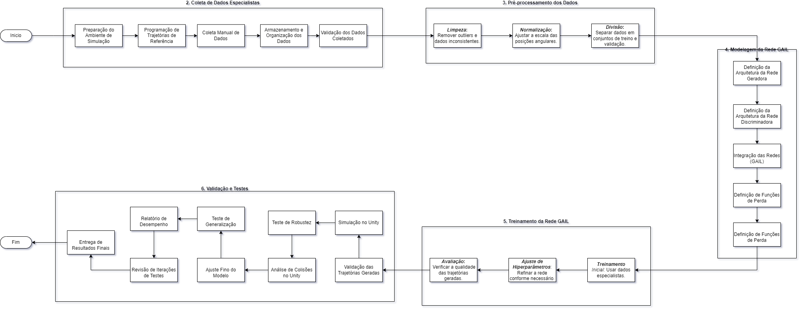

# `Aplicação de Redes GAIL para a Geração de Trajetórias em Manipuladores Robóticos`
# `Application of GAIL Networks for Trajectory Generation in Robotic Manipulators`

## Apresentação

O presente projeto foi originado no contexto das atividades da disciplina de pós-graduação *IA376N - IA generativa: de modelos a aplicações multimodais*, 
oferecida no segundo semestre de 2024, na Unicamp, sob supervisão da Profa. Dra. Paula Dornhofer Paro Costa, do Departamento de Engenharia de Computação e Automação (DCA) da Faculdade de Engenharia Elétrica e de Computação (FEEC).

> |Nome  | RA | Especialização|
> |--|--|--|
> | Maria Fernanda Paulino Gomes  | 206745  | Eng. de Computação|
> | Raisson Leal Silva  | 186273  | Eng. Eletricista|

## Resumo (Abstract)
O objetivo do projeto é desenvolver uma abordagem de aprendizado por imitação para um manipulador robótico Kinova Gen3, visando a geração de trajetórias válidas em tarefas assistivas.
A metodologia envolve a teleoperação do robô com joystick, coletando dados sobre posições angulares das juntas, posição cartesiana da garra e sua orientação, que são armazenados em arquivos JSON.
Para a entrega E2, os resultados parciais incluem a criação de uma estrutura de dados organizada e a implementação bem-sucedida da teleoperação, permitindo a coleta eficiente de dados para treinar uma rede GAIL, preparando o robô para realizar tarefas complexas de forma autônoma.

## Descrição do Problema/Motivação

A proposta inicial era utilizar redes GAIL (Generative Adversarial Imitation Learning) para gerar trajetórias válidas para um manipulador robótico de 3 DoF. Contudo, como um integrante do grupo já trabalhava em paralelo na simulação de um manipulador robótico de 7 DoF,
a aplicação foi adaptada para o Kinova Gen3, um manipulador de 7 DoF. O objetivo é fazer com que o robô consiga vestir um paciente, colocando um jaleco cirúrgico. 
A motivação para utilizar redes generativas surgiu da insatisfação com os resultados obtidos no projeto em paralelo, visando aprimorar a eficácia na geração de trajetórias e alcançar resultados satisfatórios. 
Para a disciplina, o foco é alinhar o jaleco cirúrgico com o braço esquerdo da paciente, conforme ilustrado na imagem.

## Objetivo

O projeto se propõe a desenvolver um sistema utilizando redes GAIL (Generative Adversarial Imitation Learning) para gerar trajetórias válidas para um manipulador robótico de 7 DoF (Kinova Gen3), 
com o intuito de automatizar o processo de vestir um paciente com um jaleco cirúrgico.

### Objetivo Geral
* Gerar trajetórias eficientes e seguras para o manipulador robótico, permitindo que ele realize a tarefa de vestir um paciente de forma autônoma.
### Objetivos Específicos
* Coletar Dados de Teleoperação: Capturar dados das posições angulares das juntas, posição cartesiana e orientação da garra durante a teleoperação.
* Treinar a Rede GAIL: Utilizar os dados coletados para treinar uma rede GAIL que possa replicar as trajetórias observadas.
* Validar as Trajetórias Geradas: Avaliar a eficácia das trajetórias geradas pelo modelo em simulações, garantindo que sejam seguras e realizáveis.

## Metodologia

A metodologia proposta para alcançar os objetivos do projeto envolve as seguintes etapas:

### 1. Coleta de Dados
Para a aplicação proposta, não serão utilizados datasets prontos, será necessário montar o dataset, a metodologia adotada para montar esse dataset, for a seguinte:
Serão coletados dados de teleoperação utilizando o manipulador robótico Kinova Gen3 de 7 DoF no ambiente de simulação. A coleta incluirá:
- **Posições angulares das juntas**: obtidas em tempo real durante a teleoperação.
- **Posição cartesiana da garra**: [x, y, z].
- **Orientação da garra**: Representada por [roll, pitch, yaw].

Os dados serão armazenados em arquivos JSON para fácil acesso e manipulação. 

### 2. Treinamento da Rede GAIL
A GAIL será utilizada para aprender a gerar trajetórias a partir dos dados coletados. O algoritmo foi escolhido por sua capacidade de imitar comportamentos complexos, aproveitando tanto a aprendizagem por reforço quanto o aprendizado por imitação. A rede será treinada com os seguintes passos:
- **Arquitetura da Rede**: Implementação de uma arquitetura de rede neural para o gerador e o discriminador, utilizando bibliotecas como TensorFlow ou PyTorch.
- **Função de Perda**: Utilização da função de perda adversarial para avaliar o desempenho do gerador em relação ao discriminador.

### 3. Validação das Trajetórias
Após o treinamento, as trajetórias geradas serão validadas em simulações. As seguintes métricas serão usadas para avaliar a eficácia:
- **Proximidade do Ponto de Contato**: Medição da distância entre a posição prevista da garra e a posição objetivo.
- **Segurança**: Avaliação da trajetória para evitar colisões e garantir a segurança do paciente simulado.

### 5. Metodologia de Avaliação
Os objetivos do projeto serão avaliados através de:
- **Testes de Simulação**: Execução de simulações para verificar se o manipulador consegue realizar a tarefa proposta.
- **Análise Quantitativa**: Avaliação estatística das trajetórias geradas em comparação com as trajetórias desejadas.

### Referências

#### Artigos de Referência:

* **GAIL**: Ho, J. & Ermon, S. (2016). Generative Adversarial Imitation Learning. [arXiv:1606.03476](https://arxiv.org/abs/1606.03476).
* WANG, Haoxu; MEGER, David. Robotic object manipulation with full-trajectory gan-based imitation learning. In: 2021 18th Conference on Robots and Vision (CRV). IEEE, 2021. p. 57-63. <https://ieeexplore.ieee.org/abstract/document/9469449>
* SYLAJA, Midhun Muraleedharan; KAMAL, Suraj; KURIAN, James. Example-driven trajectory learner for robots under structured static environment. International Journal of Intelligent Robotics and Applications, p. 1-18, 2024. <https://link.springer.com/content/pdf/10.1007/s41315-024-00353-y.pdf>
* TSURUMINE, Yoshihisa; MATSUBARA, Takamitsu. Goal-aware generative adversarial imitation learning from imperfect demonstration for robotic cloth manipulation. Robotics and Autonomous Systems, v. 158, p. 104264, 2022. <https://www.sciencedirect.com/science/article/pii/S0921889022001543>
* REN, Hailin; BEN-TZVI, Pinhas. Learning inverse kinematics and dynamics of a robotic manipulator using generative adversarial networks. Robotics and Autonomous Systems, v. 124, p. 103386, 2020. <https://www.sciencedirect.com/science/article/pii/S0921889019303501>

#### API de Referência:
* Gleave, Adam, Taufeeque, Mohammad, Rocamonde, Juan, Jenner, Erik, Wang, Steven H., Toyer, Sam, Ernestus, Maximilian, Belrose, Nora, Emmons, Scott, Russell, Stuart. (2022). Imitation: Clean Imitation Learning Implementations. [arXiv:2211.11972v1 [cs.LG]](https://arxiv.org/abs/2211.11972). <https://imitation.readthedocs.io/en/latest/index.html>

#### Simulador que será Utilizado (CoppeliaSim):
* **RCareWorld**: <https://github.com/empriselab/RCareWorld>

### Bases de Dados e Evolução

Para esse projeto, não foi utilizada uma base de dados pronta, a base de dados foi montada, colhendo os dados via teleoperação do manipulador robótico (por meio de um joystick)
no ambiente de simulação.

|Base de Dados | Endereço na Web | Resumo descritivo|
|----- | ----- | -----|
|GAIL_Dataset | N/A | Base de dados coletada durante a simulação do manipulador robótico. Inclui informações sobre as posições angulares das juntas, a posição cartesiana da garra e a orientação da garra.|

#### Descrição e Análise da Base de Dados:

* **Formato:** A base de dados é armazenada em arquivos JSON, contendo um dicionário de dados coletados durante as simulações;

* **Tamanho:** O tamanho da base de dados varia conforme o número de de simulações realizadas, onde cada arquivo JSON pode conter dados de diferentes iterações da simulação;

* **Tipo de Anotação:** Os dados incluem anotações sobre as posições angulares de cada junta do manipulador robótico, posição e orientação da garra, que são dados essenciais para a geração de trajetórias válidas;

* **Transformações e Tratamentos:** os dados são coletados em tempo real, logo, não há necessidade de limpeza adicional, visto que foram coletados em um ambiente controlado.

## Workflow

Este projeto adota um workflow bem definido para alcançar o objetivo de gerar trajetórias válidas para manipuladores robóticos de 7 graus de liberdade (DoF), utilizando redes GAIL (Generative Adversarial Imitation Learning). O processo foi dividido em seis etapas principais, que cobrem desde a definição do escopo até a validação e testes, conforme ilustrado nas imagens a seguir.

### 1. Definição do Escopo do Projeto

O objetivo principal é desenvolver um modelo baseado em GAIL para gerar trajetórias seguras e eficientes. Para avaliar a qualidade das trajetórias, utilizamos métricas como a distância cartesiana e a diferença de orientação entre as trajetórias geradas e as trajetórias de referência. 

O ambiente de simulação consiste no simulador RCareWorld, da universidade de Cornell, que é implementado no Unity, permitindo flexibilidade na coleta de dados.

### 2. Coleta de Dados Especialistas

Nesta fase, configuramos o ambiente de simulação no **Unity** e geramos dados especialistas controlando o manipulador robótico manualmente, via joystick. As informações coletadas incluem as posições cartesianas (x, y, z) e as orientações (roll, pitch, yaw) da garra do manipulador, além dos ângulos das juntas. Após a coleta, os dados são organizados e validados para garantir sua qualidade e consistência.

**Atividades principais (Figura 1 e Figura 2, Etapa 2)**:
- Preparação do ambiente de simulação.
- Coleta manual dos dados - Trajetórias geradas via teleoperação.
- Armazenamento e organização dos dados coletados.
- Validação para garantir a integridade dos dados.

### 3. Pré-processamento dos Dados

Antes de treinar o modelo, realizamos uma etapa essencial de pré-processamento dos dados coletados. Isso inclui a limpeza para remover outliers ou dados inconsistentes, além da normalização das posições angulares para garantir escalas compatíveis para o treinamento. Por fim, os dados são divididos em conjuntos de treino e validação, fundamentais para monitorar a performance do modelo durante o treinamento.

**Atividades principais (Figura 1 e Figura 2, Etapa 3)**:
- Limpeza dos dados: Remoção de outliers e inconsistências.
- Normalização: Ajuste das escalas das posições angulares.
- Divisão dos dados: Separação dos dados em conjuntos de treino e validação.

### 4. Modelagem da Rede GAIL

A modelagem da rede GAIL consiste em definir tanto a **rede geradora** quanto a **rede discriminadora**, além de integrar ambas no modelo final. A rede geradora é responsável por criar novas trajetórias a partir dos dados especialistas, enquanto a rede discriminadora avalia a validade dessas trajetórias, comparando-as com as trajetórias de referência. Também definimos as funções de perda para cada uma das redes, essenciais para o processo de aprendizado adversarial.

**Atividades principais (Figura 1 e Figura 2, Etapa 4)**:
- Definição da arquitetura da rede geradora.
- Definição da arquitetura da rede discriminadora.
- Integração das redes GAIL (geradora e discriminadora).
- Definição e ajuste das funções de perda.

### 5. Treinamento da Rede GAIL

Uma vez que a rede GAIL foi modelada, será iniciado o treinamento com os dados especialistas. Deverá ser feito o ajusto dos hiperparâmetros, como a taxa de aprendizado, conforme necessário, para otimizar a performance da rede. Durante o treinamento, as trajetórias geradas são continuamente avaliadas e comparadas às trajetórias especialistas, garantindo que o modelo esteja aprendendo a imitar com precisão.

**Atividades principais (Figura 1 e Figura 2, Etapa 5)**:
- Treinamento inicial utilizando os dados especialistas.
- Ajuste dos hiperparâmetros para otimização do modelo.
- Avaliação contínua das trajetórias geradas para verificar melhorias.

### 6. Validação e Testes

Após o treinamento, as trajetórias geradas passam por uma fase de validação, que inclui simulações no ambiente simulacional para verificar a viabilidade física das trajetórias. Conduzimos testes de robustez e generalização para garantir que o modelo seja capaz de lidar com diferentes condições. Também realizamos uma análise de colisões para assegurar que as trajetórias respeitem as limitações físicas do manipulador. Ao final, geramos um relatório de desempenho detalhado e documentamos os resultados.

**Atividades principais (Figura 1 e Figura 2, Etapa 6)**:
- Validação das trajetórias geradas.
- Simulações no Unity para testar a viabilidade física.
- Testes de robustez e generalização para diferentes cenários.
- Análise de colisões no simulador, para garantir segurança.
- Revisão e ajuste após iterações de testes.
- Geração de relatório de desempenho e documentação final dos resultados.

### Imagens de Fluxograma:

#### Figura 1:

#### Figura 2:

## Experimentos, Resultados e Discussão dos Resultados

> Na entrega parcial do projeto (E2), essa seção pode conter resultados parciais, explorações de implementações realizadas e 
> discussões sobre tais experimentos, incluindo decisões de mudança de trajetória ou descrição de novos experimentos, como resultado dessas explorações.

> Na entrega final do projeto (E3), essa seção deverá elencar os **principais** resultados obtidos (não necessariamente todos), que melhor representam o cumprimento
> dos objetivos do projeto.

> A discussão dos resultados pode ser realizada em seção separada ou integrada à seção de resultados. Isso é uma questão de estilo.
> Considera-se fundamental que a apresentação de resultados não sirva como um tratado que tem como único objetivo mostrar que "se trabalhou muito".
> O que se espera da seção de resultados é que ela **apresente e discuta** somente os resultados mais **relevantes**, que mostre os **potenciais e/ou limitações** da metodologia, que destaquem aspectos
> de **performance** e que contenha conteúdo que possa ser classificado como **compartilhamento organizado, didático e reprodutível de conhecimento relevante para a comunidade**. 

## Conclusão

> A seção de Conclusão deve ser uma seção que recupera as principais informações já apresentadas no relatório e que aponta para trabalhos futuros.
> Na entrega parcial do projeto (E2) pode conter informações sobre quais etapas ou como o projeto será conduzido até a sua finalização.
> Na entrega final do projeto (E3) espera-se que a conclusão elenque, dentre outros aspectos, possibilidades de continuidade do projeto.

## Referências Bibliográficas
> Apontar nesta seção as referências bibliográficas adotadas no projeto.
