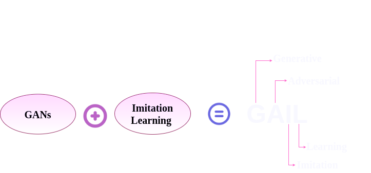
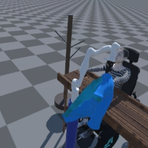
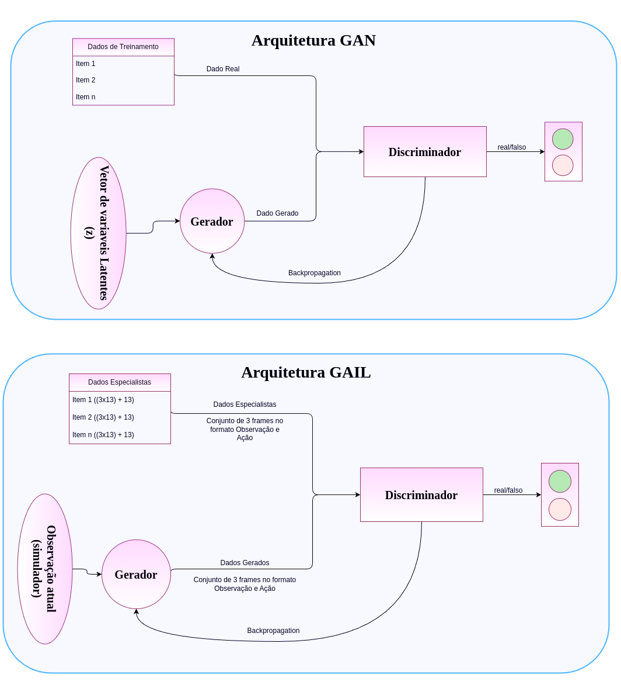

# `Aplicação de Redes GAIL para a Geração de Trajetórias em Manipuladores Robóticos`
# `Application of GAIL Networks for Trajectory Generation in Robotic Manipulators`

## Apresentação

O presente projeto foi originado no contexto das atividades da disciplina de pós-graduação *IA376N - IA generativa: de modelos a aplicações multimodais*, 
oferecida no segundo semestre de 2024, na Unicamp, sob supervisão da Profa. Dra. Paula Dornhofer Paro Costa, do Departamento de Engenharia de Computação e Automação (DCA) da Faculdade de Engenharia Elétrica e de Computação (FEEC).

> |Nome  | RA | Especialização|
> |--|--|--|
> | Maria Fernanda Paulino Gomes  | 206745  | Eng. de Computação|
> | Raisson Leal Silva  | 186273  | Eng. Eletricista|

### Slides e Vídeo apresentando o projeto

- [Slides primeira entrega](https://github.com/user-attachments/files/17291787/E1_Projeto_MariaFernanda_Raisson.pdf)

- [Link para o vídeo da primeira entrega](https://drive.google.com/file/d/10UU3tbpaLdKtSWHwaHwwuAelCnEYYyK1/view?usp=sharing)

- [Slides da segunda entrega](https://docs.google.com/presentation/d/1d-bhS5pN8eW80D_pL8XNPtMwcds4ifCcIb9pqzJnMhk/edit#slide=id.p1)

## Resumo (Abstract)
Este projeto investiga o uso de redes Generative Adversarial Imitation Learning (GAIL), uma abordagem generativa avançada, para a geração de trajetórias válidas e seguras no contexto de manipulação robótica, nesse trabalho será utilizado um manipulador de 7 graus de liberdade - Kinova Gen3 7DoF. As trajetórias geradas, possuem o foco em tarefas assistivas, como vestir de forma autônoma um jaleco cirúrgico em um paciente, o modelo GAIL combina aprendizado por imitação e aprendizado adversarial para replicar trajetórias especialistas a partir de demonstrações capturadas via teleoperação em um ambiente de simulação (RCareWorld).

O modelo gerador foi projetado para aprender padrões temporais utilizando uma técnica de janela deslizante, enquanto o discriminador avalia a fidelidade das trajetórias geradas. Os resultados destacam a capacidade do GAIL de capturar dinâmicas complexas e gerar movimentos naturais, especialmente após o incremento no volume de dados de treinamento. No entanto, o desempenho inicial evidenciou limitações associadas a conjuntos de dados reduzidos, reforçando a necessidade de dados robustos para aprendizado por imitação. Como próximos passos, o projeto busca explorar cenários mais complexos, incorporar variações no ambiente e transitar do ambiente simulado para o mundo real, ampliando o potencial de aplicação das redes GAIL em robótica assistiva.

  
  
Figura 1: Modelo GAIL.

## Descrição do Problema/Motivação

Atividades diárias como vestir-se são cruciais para a autonomia de pessoas com deficiências motoras ou condições de saúde que dificultam a mobilidade. Estudos apontam que vestir-se é uma das tarefas mais desafiadoras no cuidado de idosos e pessoas com deficiências, devido à alta complexidade de manipular objetos deformáveis como roupas em espaços tridimensionais. Além disso, a crescente demanda por cuidados, impulsionada pelo envelhecimento populacional, torna a automação dessas tarefas uma área de pesquisa essencial.

No campo da robótica assistiva, trabalhos anteriores frequentemente assumem configurações fixas, como vestuário pré-posicionado ou poses estáticas, o que limita a aplicabilidade prática em cenários reais. Por exemplo, métodos tradicionais utilizam algoritmos baseados em planeamento de trajetórias ou regras pré-definidas para manipular roupas específicas, como jalecos hospitalares, mas enfrentam dificuldades para generalizar a diferentes tipos de vestuário e variabilidade nas poses humanas. No entanto, abordagens baseadas em aprendizado de máquina, como aprendizado por reforço ou redes neurais convolucionais aplicadas a nuvens de pontos, têm mostrado maior potencial de generalização e flexibilidade, especialmente ao lidar com objetos deformáveis e situações de interação humano-robô.

No contexto deste projeto, propõe-se a utilização de redes GAIL (Generative Adversarial Imitation Learning) para gerar trajetórias válidas de manipuladores robóticos em tarefas assistivas, com foco na tarefa de vestir um jaleco cirúrgico em um paciente, alinhando-o ao braço esquerdo de forma eficiente e segura. Este trabalho se restringe a uma configuração fixa do jaleco e a uma pose específica do paciente, com o objetivo de simplificar o problema e concentrar os esforços no treinamento do modelo para imitar as trajetórias capturadas durante a teleoperação. A limitação do escopo reflete a natureza do projeto, que visa demonstrar os conceitos em um curto espaço de tempo, mas abre caminhos para estudos futuros que poderiam incluir variações nas poses humanas e nos tamanhos dos jalecos.

A motivação para este projeto surgiu da insatisfação com resultados obtidos em projetos paralelos e da busca por maior eficácia na geração de trajetórias, utilizando aprendizado por imitação. Os dados coletados por teleoperação fornecem exemplos ricos de movimentação que servirão como base para treinar o modelo, permitindo ao manipulador replicar padrões humanos de movimento e adaptar-se a cenários controlados. Este trabalho busca contribuir com o avanço na robótica assistiva, explorando métodos de aprendizado generativo adversarial para criar soluções viáveis e seguras para tarefas assistivas em ambientes simulados.

  
  
Figura 2: Exemplo de trajetória a ser gerada.

## Objetivo

O objetivo deste projeto é desenvolver um sistema baseado em redes GAIL (Generative Adversarial Imitation Learning) para gerar trajetórias válidas e seguras para o manipulador robótico Kinova Gen3 (com 7 graus de liberdade), permitindo que ele realize, de forma autônoma, a tarefa assistiva de vestir um jaleco cirúrgico em um paciente. Este sistema busca demonstrar a viabilidade de utilizar aprendizado por imitação em um cenário controlado, contribuindo para o avanço da robótica assistiva em ambientes simulados.

### Objetivo Geral
- Criar um modelo de aprendizado por imitação capaz de gerar trajetórias eficientes, seguras e realizáveis para o manipulador robótico Kinova Gen3 (com 7 graus de liberdade) realizar a tarefa específica de vestir um jaleco cirúrgico em um paciente, respeitando a pose fixa do paciente e a configuração predefinida do jaleco.

### Objetivos Específicos
1. **Coleta de Dados Especialistas por meio de Teleoperação:** 
   - Realizar a coleta de dados de trajetórias realizadas por meio de teleoperação em um ambiente simulado.
   - Capturar as posições angulares de cada junta do manipulador robótico, a posição cartesiana da garra e sua orientação (roll, pitch, yaw), garantindo a precisão dos dados para o treinamento.

2. **Organização e Pré-processamento dos Dados:** 
   - Consolidar os dados coletados em um formato unificado para facilitar o treinamento da rede.
   - Realizar o tratamento dos dados para corrigir inconsistências, como normalização de ângulos e verificação de limites operacionais.

3. **Implementação e Treinamento da Rede GAIL:** 
   - Projetar e implementar as redes geradora e discriminadora, definindo arquiteturas adequadas para lidar com a dinâmica do manipulador robótico.
   - Treinar a rede GAIL utilizando os dados coletados, ajustando hiperparâmetros para maximizar a capacidade do modelo de replicar as trajetórias observadas.

4. **Validação das Trajetórias Geradas:** 
   - Avaliar as trajetórias geradas por meio de simulações, comparando as trajetórias geradas e as trajetórias de referência.

5. **Análise e Documentação dos Resultados:** 
   - Analisar os resultados do treinamento, identificando padrões de sucesso e limitações nas trajetórias geradas.
   - Documentar os processos, resultados e aprendizados do projeto, fornecendo uma base para estudos futuros na área de robótica assistiva.

## Metodologia

A metodologia proposta neste projeto foi elaborada para alcançar os objetivos definidos, utilizando o manipulador robótico Kinova Gen3 com 7 graus de liberdade (DoF) e abordagens de aprendizado por imitação. Esta seção descreve as etapas principais, os conceitos fundamentais relacionados ao projeto, as bases de dados utilizadas e o workflow adotado.

### Conceitos Fundamentais

#### **Aprendizado por Reforço e Aprendizado por Imitação**:

- *Aprendizado por Reforço (Reinforcement Learning)* é uma técnica onde o agente aprende a realizar ações em um ambiente para maximizar uma função de recompensa acumulada. O agente explora o ambiente, avalia as recompensas obtidas e ajusta suas estratégias. Apesar de poderoso, o aprendizado por reforço pode ser desafiador em cenários com recompensas esparsas ou complexas.

- *Aprendizado por Imitação (Imitation Learning)* é uma abordagem que utiliza como base os conceitos do aprendizado por reforço, onde um agente aprende a realizar tarefas observando demonstrações de um especialista. Em vez de depender de uma função de recompensa explícita, o agente tenta replicar as ações observadas em trajetórias fornecidas. Essa técnica é amplamente usada em robótica para tarefas complexas, visto que reduz a necessidade de modelar explicitamente o ambiente ou a recompensa.

#### **Generative Adversarial Imitation Learning (GAIL)**:

A técnica GAIL, combina o aprendizado por imitação com a abordagem de redes generativas, oferecendo uma solução poderosa para replicar comportamentos complexos sem necessidade de definir uma função de recompensa explícita. Essa técnica utiliza a arquitetura tradicional das GANs, tendo como diferença a inclusão de dados especialistas:

1. **Gerador (Generator)**: Representa a política do agente que, dado um estado, gera ações para simular trajetórias. A política é ajustada para gerar comportamentos que se aproximem das demonstrações de especialistas.

2. **Discriminador (Discriminator)**: Um modelo que avalia se uma trajetória é gerada pelo especialista ou pelo agente. Ele fornece um sinal de "recompensa" que orienta o gerador no aprendizado.

##### **Funcionamento**:
- Uma rede do tipo GAIL aprende ao alternar entre otimizar o gerador e o discriminador. O discriminador tenta distinguir trajetórias geradas das demonstradas, enquanto o gerador tenta enganar o discriminador, produzindo trajetórias mais realistas.
- A principal métrica usada no GAIL é a divergência de Jensen-Shannon entre as distribuições de ocupação (state-action pairs) do agente e do especialista. Isso garante que o modelo aprenda políticas que imitam os padrões observados nas demonstrações especialistas.

  
  
Figura 3: Diferença entre as arquiteturas de uma GAN tradicional e de uma rede GAIL.

#### **Ambiente de Simulação RCareWorld:**

- O **RCareWorld** é um ambiente de simulação avançado, desenvolvido no Unity, para testar e validar algoritmos de robótica assistiva em cenários realistas. 
- O ambiente de simulação permite simular tarefas complexas, como a manipulação de objetos deformáveis, interação humano-robô e planejamento de trajetórias.
- No contexto deste projeto, o RCareWorld foi utilizado para integrar o modelo GAIL ao manipulador robótico Kinova Gen3, possibilitando a coleta de dados, o treinamento e a validação das trajetórias geradas.

#### **Técnica de Janela Deslizante (Sliding Window):**

- O uso de uma janela deslizante (*Sliding Window*) é uma abordagem que permite capturar a dinâmica temporal de sistemas robóticos. Ao considerar múltiplos estados consecutivos, essa técnica fornece ao modelo informações contextuais importantes sobre a sequência de movimentos.
- No contexto deste projeto, o **SlidingWindowGenerator** foi implementado para prever ações com base em uma sequência de estados anteriores.
- **Por que utilizar a janela deslizante?**
  - Captura a continuidade das trajetórias, preservando informações temporais cruciais.
  - Reduz a dimensionalidade dos dados observados em comparação com técnicas que consideram toda a sequência histórica.
  - Melhora a capacidade do modelo de prever ações suaves e realistas, fundamentais para tarefas assistivas como manipulação de objetos deformáveis.
- A janela deslizante utilizada neste projeto possui tamanho 3, garantindo um equilíbrio entre informações passadas relevantes e eficiência computacional.

Essa abordagem permite que o gerador aprenda padrões temporais nos movimentos do manipulador robótico, resultando em trajetórias mais precisas e adaptadas às demonstrações fornecidas.

### Etapas Metodológicas

1. **Coleta de Dados de Teleoperação:**
   - A coleta de dados foi realizada através da teleoperação do manipulador robótico no ambiente de simulação, utilizando um joystick para controlar os movimentos do braço robótico.
   - Dados coletados:
     - **Posições angulares das juntas:** valores que representam o estado de cada junta do robô (como temos 7 juntas são coletados 7 dados).
     - **Posição cartesiana da garra:** coordenadas (x, y, z) no espaço tridimensional.
     - **Orientação da garra:** representada por roll, pitch e yaw.
   - Os dados foram armazenados em múltiplos arquivos JSON, posteriormente unificados em dois arquivos (expert_states.npy e expert_action.npy) para simplificar o treinamento do modelo.

2. **Organização e Pré-processamento dos Dados:**
   - Normalização de valores como ângulos para evitar inconsistências, seguindo as informações das restrições angulares de cada junta do manipulador (esses dados estão presentes no manual do manipulador Kinova Gen3).
   - Geração de anotações no formato de observações (estados com 13 dados: 7 posições angulares das juntas, 3 posições cartesianas da garra e 3 orientação da garra) e ações (diferenças entre estados consecutivos).

3. **Implementação do Ambiente de Simulação:**
   - Para este projeto, foi utilizado o **RCareWorld**, um ambiente de simulação baseado no Unity, desenvolvido especificamente para testar algoritmos de robótica assistiva em cenários realistas.
   - O RCareWorld foi configurado para integrar o modelo GAIL ao manipulador robótico Kinova Gen3, permitindo a interação em tempo real e a validação de trajetórias.
   - Sua interface flexível facilitou a coleta de dados, o treinamento do modelo e a validação das trajetórias geradas, garantindo um ambiente seguro para experimentação e refinamento.

4. **Implementação e Treinamento do Modelo GAIL:**

- A implementação do modelo GAIL foi realizada utilizando o framework **PyTorch**, que forneceu a flexibilidade necessária para configurar as redes geradora e discriminadora. O modelo foi projetado para aprender trajetórias de alta qualidade replicando os padrões observados nos dados de demonstração. A seguir, detalhamos as principais etapas dessa implementação:

- **Rede Geradora:**
  - A rede geradora (*SlidingWindowGenerator*) foi implementada para prever ações com base em uma janela deslizante de estados anteriores. 
  - A arquitetura consiste em uma sequência de camadas densas (*fully connected*), ativadas por funções *ReLU*, que processam entradas de dimensão state_dim x window_size.
  - A saída da rede corresponde à ação predita (action_dim), representando os comandos que o manipulador deve executar.

- **Rede Discriminadora:**
  - A rede discriminadora avalia a validade das trajetórias geradas comparando-as com as trajetórias especialistas. 
  - O modelo combina as entradas da janela deslizante de estados e as ações correspondentes, passando-as por uma sequência de camadas densas com funções de ativação *ReLU* e *Sigmoid*. 
  - A saída é uma probabilidade que indica se a trajetória é "real" (do especialista) ou "falsa" (gerada).

- **Funções de Perda:**
  - Para o discriminador, foi utilizada a *Binary Cross Entropy* (BCE), que mede a capacidade de diferenciar entre trajetórias reais e falsas.
  - O gerador, por sua vez, é otimizado para "enganar" o discriminador, logo, utiliza a perda adversarial, minimizando a BCE ao tentar fazer com que as trajetórias falsas sejam classificadas como reais.

- **Treinamento do Modelo:**
  - O treinamento é realizado em dois estágios:
    1. **Treinamento do Discriminador:** O discriminador é treinado primeiro, ajustando seus pesos para distinguir entre trajetórias reais e geradas.
    2. **Treinamento do Gerador:** O gerador é atualizado para produzir trajetórias que "enganem" o discriminador, gerando ações mais próximas das trajetórias especialistas.
  - Foram utilizadas janelas deslizantes de tamanho 3, permitindo que o modelo considere a dinâmica temporal dos estados anteriores para prever ações.

5. **Validação e Avaliação das Trajetórias:**

- A validação e avaliação das trajetórias geradas foram realizadas com base em critérios quantitativos e qualitativos, garantindo que o modelo atenda aos requisitos de precisão e segurança:

- **Validação em Simulações:**
  - As trajetórias geradas pelo modelo foram testadas no ambiente de simulação RCareWorld, replicando cenários realistas de manipulação robótica.

- **Métricas Quantitativas:**
  - **Análise das curvas de loss do gerador e do discriminador;** 
  - **Análise da Divergência de e Jensen-Shannon (JSD).** 

- **Análise Qualitativa:**
  - **Visualização das Trajetórias:** As simulações foram observadas visualmente para identificar movimentos não naturais ou inconsistências.
  - **Segurança:** Análise para identificar possíveis colisões ou movimentos arriscados que poderiam comprometer a segurança do paciente ou do manipulador.

6. **Análise e Documentação dos Resultados:**
   - Análise quantitativa e qualitativa dos resultados do modelo.
   - Geração de relatórios detalhados com gráficos e tabelas para descrever o desempenho do modelo.

### Bases de Dados e Evolução

| Base de Dados  | Endereço na Web | Resumo Descritivo |
|----------------|-----------------|------------------|
| GAIL_Dataset   | N/A             | Dataset gerado manualmente, contendo trajetórias capturadas via teleoperação do manipulador Kinova Gen3 no ambiente de simulação. |

#### Detalhamento da Base de Dados

- **Formato e Estrutura:**
  - O dataset está estruturado em um único arquivo JSON consolidado, organizado em formato hierárquico. Cada trajeto consiste em:
    - **Observações:** 
      - Cada observação é um vetor com 13 valores que representam o estado atual do manipulador:
        - **7 posições angulares das juntas** (em graus), descrevendo o estado de cada junta do manipulador Kinova Gen3.
        - **3 coordenadas cartesianas** (x, y, z) da posição da garra no espaço tridimensional.
        - **3 orientações da garra** (roll, pitch, yaw), indicando sua rotação no espaço.

    - **Ações:**
      - Cada ação é um vetor com 13 valores que descrevem as mudanças ocorridas entre os estados consecutivos:
        - **Variações nas posições angulares de cada junta do manipulador**.
        - **3 variações nas coordenadas cartesianas** (Δx, Δy, Δz) da posição da garra.
        - **3 variações nas orientações da garra** (Δroll, Δpitch, Δyaw).

### Workflow

Este projeto adota um workflow bem definido para alcançar o objetivo de gerar trajetórias válidas para manipuladores robóticos de 7 graus de liberdade (DoF), utilizando redes GAIL (Generative Adversarial Imitation Learning).

## Experimentos, Resultados e Discussão dos Resultados

### **Descrição dos Experimentos**

### **Resultados Obtidos**

#### **Resultados Qualitativos**

### **Discussão dos Resultados**

### **Conclusão**

## Referências Bibliográficas
#### Artigos de Referência:

* **GAIL**: Ho, J. & Ermon, S. (2016). Generative Adversarial Imitation Learning. [arXiv:1606.03476](https://arxiv.org/abs/1606.03476).
* WANG, Haoxu; MEGER, David. Robotic object manipulation with full-trajectory gan-based imitation learning. In: 2021 18th Conference on Robots and Vision (CRV). IEEE, 2021. p. 57-63. <https://ieeexplore.ieee.org/abstract/document/9469449>
* SYLAJA, Midhun Muraleedharan; KAMAL, Suraj; KURIAN, James. Example-driven trajectory learner for robots under structured static environment. International Journal of Intelligent Robotics and Applications, p. 1-18, 2024. <https://link.springer.com/content/pdf/10.1007/s41315-024-00353-y.pdf>
* TSURUMINE, Yoshihisa; MATSUBARA, Takamitsu. Goal-aware generative adversarial imitation learning from imperfect demonstration for robotic cloth manipulation. Robotics and Autonomous Systems, v. 158, p. 104264, 2022. <https://www.sciencedirect.com/science/article/pii/S0921889022001543>
* REN, Hailin; BEN-TZVI, Pinhas. Learning inverse kinematics and dynamics of a robotic manipulator using generative adversarial networks. Robotics and Autonomous Systems, v. 124, p. 103386, 2020. <https://www.sciencedirect.com/science/article/pii/S0921889019303501>

#### Simulador que será Utilizado (RCareWorld - Unity):
* **RCareWorld**: <https://github.com/empriselab/RCareWorld>

