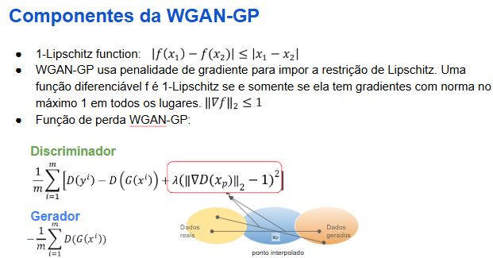
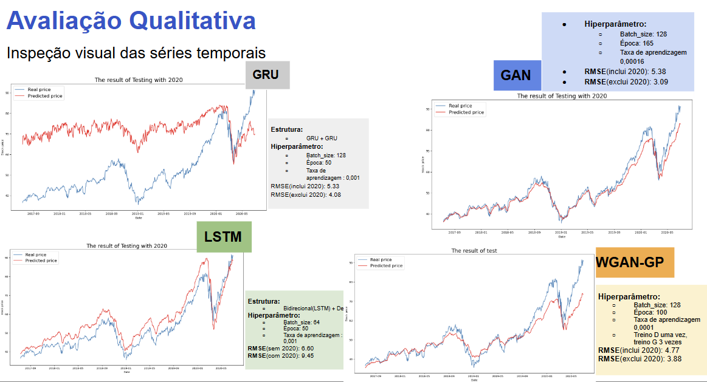

# `Síntese de Dados Financeiros`
==============================

# `Financial Data Synthesis`
==============================
## Link dos slides:
https://docs.google.com/presentation/d/1eOmgRpkQeXU1htM_7Gq66HRcn2CPZ7iB/edit?pli=1#slide=id.p1

Apresentação
==============================

O presente projeto foi originado no contexto das atividades da disciplina de pós-graduação IA376N - Deep Learning aplicado a Síntese de Sinais, oferecida no segundo semestre de 2024, na Unicamp, sob supervisão da Profa. Dra. Paula Dornhofer Paro Costa, do Departamento de Engenharia de Computação e Automação (DCA) da Faculdade de Engenharia Elétrica e de Computação (FEEC).

 |Nome  | RA | Curso|
 |--|--|--|
 |José Carlos Ferreira  | 170860  | Eng. Elétrica |
 |Byron Alejandro Acuña Acurio  | 209428  | Eng. Elétrica |

## Resumo (Abstract)

 
Neste trabalho, estudamos a eficácia de modelos baseados em **Redes Adversárias Generativas (GANs)** e **Transformers** na geração de dados financeiros sintéticos, especificamente na previsão do preço da ação da empresa Apple, considerando uma condição de evento extremo neste caso o Covid19 no ano 2020. As GANs são redes neurais que podem gerar novos dados realistas a partir de um conjunto de treinamento, enquanto os Transformers se destacam em tarefas que envolvem sequências temporais devido à sua capacidade de capturar dependências de longo alcance.

Utilizamos séries temporais de preços de ações e indicadores técnicos como **entrada** para os modelos, com o objetivo de realizar regressão para prever preços futuros. Para treinar os modelos, dividimos o dataset em sequências de 24 preços consecutivos, associando o 25º preço como target (preço a ser predito). Essa estratégia permite que os modelos aprendam padrões dentro de janelas temporais específicas, ao invés de analisar a série temporal inteira de uma só vez.

Observamos que, ao utilizar sequências de tamanho fixo, os modelos conseguiram extrair padrões de forma mais eficiente e gerar previsões mais precisas, em comparação com estratégias que consideram a série temporal completa como entrada.

Comparamos os resultados dos nossos modelos baseados em GANs e Transformers com modelos de aprendizado profundo tradicionais, como LSTM (Long Short-Term Memory) e GRU (Gated Recurrent Unit), utilizando a métrica RMSE (Root Mean Squared Error) para avaliar a precisão. Os resultados indicam que os modelos propostos oferecem vantagens significativas na previsão de preços de ações. 

Além disso, avaliamos a acurácia direcional dos modelos, que mede a porcentagem de previsões em que o modelo acertou a direção do movimento dos preços. Isso significa calcular a proporção de vezes em que o modelo previu corretamente que os preços iriam subir e eles de fato subiram, ou previu que iriam cair e eles realmente caíram. Os resultados indicam que nenhum dos modelos foi capaz de determinar com precisão a direção dos preços, apresentando uma acurácia direcional próxima ao nível de aleatoriedade. Isso sugere que, embora os modelos possam capturar certos padrões nos dados, eles não são eficazes em prever a direção futura dos preços das ações de forma confiável.

## Introdução

A previsão de preços de ações é uma tarefa importante na área de finanças, com aplicações que vão desde a negociação algorítmica (trading) até a gestão de riscos [1]. Modelos tradicionais de previsão, como LSTM (Long Short-Term Memory) e GRU (Gated Recurrent Unit), são  amplamente utilizados para essa finalidade. No entanto, a natureza complexa dos mercados financeiros pode requerer abordagens mais sofisticadas, que possam capturar padrões não lineares e dependências de longo alcance nas séries temporais.

Neste trabalho, exploramos o uso de modelos baseados em Redes Adversárias Generativas (GANs) e Transformers para melhorar a qualidade das previsões de preços de ações. Embora as GANs sejam tradicionalmente utilizadas para a geração de imagens sintéticas, elas podem ser adaptadas para tarefas de predição ao aprender representações profundas dos dados. Os Transformers, por sua vez, têm se mostrado eficazes em tarefas sequenciais devido à sua capacidade de modelar relações complexas em séries temporais.

Neste estudo, realizamos experimentos utilizando os preços das ações da empresa Apple no período de 2010 a 2020, período que inclui o evento extremo da pandemia de COVID-19. Isso nos permitiu avaliar a robustez dos modelos generativos em condições de alta volatilidade e incertezas.

Uma série temporal de preços de ações pode ser representada como:

$$ X_{1:N} = [x(1), x(2), ..., x(N)] $$

- $x(i)$: representa o preço da ação no dia $i$ (preço de fechamento).

Além dos preços históricos, incorporamos features relevantes, como indicadores técnicos, também organizados em séries temporais:

$$ F_{1:N} = [f(1), f(2), ..., f(N)] $$

Nosso objetivo é utilizar essas informações para gerar uma continuação realista da série temporal de preços, resultando em uma nova série sintética:

$$ X^{s}_{N+1:N+K} = [x^{s}(N+1), x^{s}(N+2), ..., x^{s}(N+K)] $$

Desejamos que essa série sintética seja uma aproximação da sequência real futura:

$$ X^{s}_{N+1:N+K} \approx X\_{N+1:N+K} $$

Por exemplo, se  $X_{1:N}$ representa os preço de uma ação de 2010 até 2018, então desejamos que $X_{N+1:N+K}$ forneça valores plausíveis de preço de 2018 em diante. 

## Descrição do Problema/Motivação

No setor financeiro, o acesso a dados do mundo real para análise e treinamento de modelos é limitado devido a questões de privacidade e segurança. Assim os dados sintéticos podem ajudar a fornecer uma alternativa segura para disponibilizar esses dados para diversas organizações. O desenvolvimento de modelos com capacidade de prever o preço da ação de forma precisa é desafiador devido à complexidade inerente desses dados. Em geral, os dados financeiros são não estacionários e seguem distribuições de probabilidade desconhecidas e difíceis de serem estimadas. Apesar dos avanços nos algoritmos de deep learning, que conseguem capturar melhor essas complexidades, a escassez de dados financeiros disponíveis tem sido um fator limitante na construção de métodos robustos. Especialmente em eventos extremos quando no histórico de dados nunca se teve um registro de um evento similar.

Diversas metodologias têm sido estudadas. As arquiteturas da família Generative Adversarial Networks (GANs) têm mostrado bons resultados em tarefas de geração de imagens e, mais recentemente, estão sendo aplicadas na geração de dados financeiros sintéticos. Além das GANs, as arquiteturas Transformers também surgem como estruturas promissoras para a tarefa. 

Neste trabalho, exploramos o uso de modelos baseados em Redes Adversárias Generativas (GANs) e Transformers para melhorar a qualidade das previsões de preços de ações. As GANS podem ser adaptadas para tarefas de predição ao aprender representações profundas dos dados, enquanto os Transformers são eficazes em modelar relações não lineares em séries temporais.

## Objetivos

O projeto teve como objetivos:

-  Estudar e desenvolver dois modelos generativos baseados nas arquiteturas GANs e Transformers para predizer preços de ações baseados em valores históricos e features relevantes.
- Comparar o desempenho desses modelos com modelos tradicionais de séries temporais, como as redes neurais recorrentes LSTM (Long Short-Term Memory) e GRU (Gated Recurrent Unit).

Para alcançar esses objetivos, utilizamos:
- O histórico dos preços diários (preço de fechamento) das ações da empresa Apple Inc. (ticker: AAPL), em dólares, no período de 1º de julho de 2010 até 1º de julho de 2020.

## Contribuições
- Criação de um modelo generativo baseado em GAN;  
- Criação de um modelo generativo baseado em Wasserstein GAN;  
- Criação de um modelo generativo baseado em Transformers;
- Comparação de desempenho com redes profundas baseadas em LSTM e GRU;

Utilizamos como métrica de avaliação:
- Root Mean Square Error (RMSE);
- Acurácia de Direção (mede a % de previsões que acertaram a direção do movimento dos preços);

### Bases de Dados

|Base de Dados | Endereço na Web | Resumo descritivo|
|----- | ----- | -----|
|API do Yahoo Finance| https://finance.yahoo.com | Permite o acesso a dados financeiros por meio de chamadas de API. Esses dados incluem preços de fechamento, preços máximos, mínimos, volume negociado. Além disso, é possível coletar os dados considerando diferentes períodos de amostragem: 2 minutos, 5 minutos, 15 minutos, 1 hora, 1 dia.|

## Metodologia e Workflow
**CASO 1: GANs**

A metodologia para a geração das séries temporais sintéticas utilizando modelos baseados na arquitetura das Redes Generativas Adversarias pode ser resumida no seguinte passo a passo:

1. **Coleta de Dados:**

Para os modelos baseados em GAN, além dos preços históricos, coletamos dados adicionais que servem como features, como índices de mercado, preços de commodities e ações de outras grandes empresas do setor de tecnologia, como Amazon, Google e Microsoft.

O período analisado inclui 2020, escolhido intencionalmente para testar os modelos em um cenário de alta volatilidade e incertezas causado pela pandemia de Covid-19.

    
    
<em>Figura 1: Banco de Dados Analisado para os modelos baseados em GAN.</em>

2. **Engenharia de Features:**

Depois de coletar as séries históricas de preço, calculamos alguns indicadores técnicos e extraímos features relevantes. Também foram criados features baseados nas transformadas de Fourier para extrair tendências de longo e curto prazo nos preços das ações.

<ul>
  <li>Indicadores técnicos: Média móvel de 7 e 20 dias, média móvel exponencial, momentum, bandas de Bollinger, MACD.</li>
  <li>Transformadas de Fourier: Foi obtida a magnitude e a fase das transformadas discretas de Fourier do preço das ações, usando 3, 6 e 9 componentes.</li>
</ul>

    
    
<em>Figura 2: Features Baseados em Indicadores Técnicos criadas como complemento para o banco de dados apresentado na Figura 1.</em>

    
    
<em>Figura 3: Features Baseados em Transformadas de Fouerier criadas como complemento para o banco de dados apresentado na Figura 1.</em>

3. **Normalização dos Dados:**

Após a coleta dos preços $X_{1:N}$ e features $F_{1:N}$, armazenamos as séries temporais em um mesmo dataframe: 

$$D = [X_{1:N}, F_{1:N}]$$

Para facilitar o treinamento do modelo, os valores, para cada série temporal, foram normalizados utilizando a técnica min-max. A fórmula adotada foi:

$$
x_{n}(i) = \frac{x(i) - \min(x)}{\max(x) - \min(x)}
$$

- $x_{n}(i)$: representa o valor normalizado (preço ou feature) no instante $i$.
- $x(i)$: representa o valor original (preço ou feature) no instante $i$.
- $\min(x)$: representa o menor valor na série temporal $x$.
- $\max(x)$: representa o maior valor na série temporal $x$.

Essa abordagem garante que os valores da série temporal sejam escalados para o intervalo $[0, 1]$, permitindo que o modelo processe os dados de forma eficiente e consistente.

4. **Construção da Rede Neural:**

O modelo GAN para predição de séries temporais, usa como função de perda a divergência de Kullback-Leibler (KL) e a divergência de Jensen-Shannon (JS), no processo de treinamento. Essas duas divergência são métricas matemáticas usadas para medir a semelhança entre duas distribuições de probabilidade. O modelo GAN usa, no discriminador ,a função de perda baseada na divergência de Jensen-Shannon (JS), dada por:

$$
-\frac{1}{m} \sum_{i=1}^m \log D\left(y^i\right)-\frac{1}{m} \sum_{i=1}^m\left(1-\log D\left(G\left(x^i\right)\right)\right)
$$

Neste projeto, o gerador foi treinado usando perda de entropia cruzada para minimizar a diferença entre duas distribuições, o que equivale a minimizar a divergência de Kullback-Leibler (KL), usando a função de perda, apresentada como:

$$
-\frac{1}{m} \sum_{i=1}^m\left(\log D\left(G\left(x^i\right)\right)\right)
$$
 
 
 A rede é composta por duas redes neurais: (i) Gerador e (ii) Discriminador. As funções de perda apresentadas anteriormente garantem um treinamento que combina um processo competitivo. Abaixo detalha-se a estrutura das redes neurais da GAN:

    
    
<em>Figura 4: Estrutura da arquitetura GAN.</em>

O gerador foi construído usando uma sequência de três camadas GRU (Gated Recurrent Unit) para processamento de dados sequenciais e três camadas densas para refinar os resultados e produzir o dado sintético final. A seleção das três camadas GRU foi porque o modelo utilizou os ultimos três dias de dados históricos para poder prever o preço do dia seguinte. Na entrada, temos as 36 features explicadas anteriormente nos passos 1 e 2. Por isso, observamos que temos uma dimensão de entrada de (Bs,3,36), em que Bs é o tamanho do batch de treinamento. No estudo,  consideramos Bs = 128. Note-se que a GAN usada tem uma arquitetura condicional, onde a geração dos dados é condicionada a alguns dados de entrada. Neste caso, o contexto usado foi os valores passados reais do valor da ação da Apple $yc$. 

Adicionalmente no caso das GANs, neste estudo foi explorada o tipo de GAN conhecidas na literatura como Wasserstein GAN com Gradient Penalty (WGAN-GP), que oferece vantagens significativas sobre as GANs padrão para geração de séries temporais devido à sua estabilidade de treinamento aprimorada e capacidade de mitigar desafios comuns, como colapso de modo. Por exemplo as GANs padrão, que dependem de perda de entropia cruzada binária, muitas vezes enfrentam gradientes instáveis, particularmente em cenários onde o discriminador domina o gerador, levando a uma dinâmica de aprendizagem abaixo do ideal. Este problema é agravado em dados de séries temporais, onde as dependências temporais e os padrões complexos aumentam a dificuldade de alcançar um processo de formação equilibrado. O WGAN-GP aborda essas limitações usando a perda de Wasserstein, que mede a divergência entre distribuições de dados reais e geradas por meio da Distância do Earth Mover, garantindo atualizações de gradiente suaves e significativas mesmo quando o discriminador funciona bem. Além disso, a penalidade de gradiente impõe uma restrição de Lipschitz ao discriminador sem recorrer ao corte de peso, melhorando a capacidade do discriminador de modelar as estruturas intrincadas inerentes aos dados de séries temporais. Essas melhorias não apenas promovem um treinamento estável, mas também reduzem o risco de colapso do modo, incentivando o gerador a produzir padrões de séries temporais diversos e realistas. Ao alinhar mais estreitamente a distribuição dos dados gerados com a distribuição real, o WGAN-GP surge como uma escolha robusta para tarefas de modelagem de séries temporais, permitindo a síntese de sequências de alta qualidade com características temporais complexas. A continuação se apresenta na Figura 5 as principais diferenças entre a abordagem GAN e WGAN-GP

    
    
<em>Figura 5: Diferenças da GAN com WGAN-GP.</em>

Assim temos que a função de perda do discriminante na WGAN-GP (Wasserstein GAN com Gradient Penalty) foi projetada para aproximar a distância de Wasserstein entre distribuições de dados reais e geradas. Consiste dos seguentes componentes principais:

    
    
<em>Figura 6: Componentes da WGAN-GP.</em>

**CASO 2: TRANSFORMERS**

A metodologia para a geração das séries temporais sintéticas utilizando arquitetura Transformers pode ser resumida no seguinte passo a passo:

1. **Coleta de Dados via API do Yahoo Finance:**
   
   Através desse API, coletamos a série histórica de preços diários (preços de fechamento), do período de 2010 até 2020, representada por $X_{1:N}$.

    
    
<em>Figura 7: Preços das ações da Apple coletados do API do Yahoo Finance.</em>

2. **Extração de Features:**

   Para auxiliar na geração de dados sintéticos realistas, também extraimos diversos features que ajudam a explicar o comportamento dos preços. Esses features também são séries temporais, cada um descrito por: $F\_{1:N}$. Eles possuem o mesmo número de amostras da série temporal de preços.

Os features que se mostraram úteis na geração dos dados sintéticos foram:

   - Volume de ações negociada;
   - Índicadores técnicos: Moving Average Convergence Divergence (MACD), Stochastic Oscillator (SO), Commodity Channel Index (CCI), Money Flow Index (MFI);
  
Os índicadores técnicos são algumas métricas que podem ser calculadas a partir do preço de fechamento, preço máximo e mínimo, e volume de ações negociadas. Esses índicadores buscam capturar as tendências de movimentação dos preços. A figura abaixo ilustra um exemplo de um feature utilizado:

    
    
<em>Figura 8: Volume de ações da Apple negociadas coletados do API do Yahoo Finance.</em>

3. **Normalização dos Dados:**

   Após a coleta dos dados e extração dos features, armazenamos as séries temporais (do preço e dos features) em um mesmo dataframe: $D=[X\_{1:N}, F\_{1:N} ]$.
   
   Após isso, normalizamos os valores de cada série temporal para facilitar o treinamento, utilizando as suas respectivas médias e desvios padrões. A normalização adotada foi:

$$ x_{n}(i) = \frac{x(i) - \text{média[x]}}{\text{desvio padrão[x]}}$$

- $x_{n}(i)$: representa o valor normalizado de uma série temporal (preço ou algum feature) no instante $i$.
-  $x(i)$: representa o valor antes da normalização (preço ou algum feature) no instante $i$.
- média[x], desvio padrão [x] : representam a média e o desvio padrão associado à série temporal dos elementos de x(i)  

   
4. **Construção da Rede Neural:**

   A rede neural é um modelo baseado na arquitetura Transformer sendo utilizado para predição de séries temporais. Ele processa sequências de dados para predizer o valor futuro com base nas observações passadas. A figura abaixo ilustra o modelo, de maneira simplificada, atráves de blocos:
   

    
    
<em>Figura 9: Estrutura simplificada do modelo baseado na arquitetura Transformer. </em>

- **Input:**
   
   A entrada é um dataframe D contendo a série temporal do preço $X_{1:N}$ e dos features $F\_{1:N}$.
   
- **Sequenciador das Séries Temporais:**
   
   As séries temporais são repartidas em sequências de tamanho fixo (tam_seq) para o processamento nos blocos Transformers. Além disso, associamos a cada sequência um target, que representa o valor que desejamos prever (rótulo). Para o treinamento, a rede recebe um conjunto de sequências e os rótulos correspondentes.
   
- **Layer de Input:**
   
   A entrada da rede é um vetor multidimensional que contém todas as sequências de tamanho tam_seq para todos os features.
   
- **Embedding Layer:**

   A embedding layer é uma camada densa que transforma os dados em um espaço dimensional maior. É útil para que o modelo aprenda relações mais complexas nos dados.

- **Positional Encoding:**

   Adiciona informações sobre a posição de cada elemento da sequência, visto que o Transformer não conhece a ordem temporal dos dados. Isso permite que o modelo saiba a ordem temporal dos dados.

- **Blocos Transformers:**

   Sequências de blocos da arquitetura Transformer, cada bloco possui os seguintes elementos:

   - Layer MultiHead Attention: permite que o modelo se concentre em diferentes partes da sequência para realizar a predição
   - Conexão Residual e Normalização: adiciona a entrada do bloco à saída do layer MultiHead Attention e normaliza os valores. Isso ajuda na estabilização de treinamento.
   - Rede Feed-Forward: duas camadas densas com função de ativação ReLU na primeira.
     
- **Global Average Pooling:**
    
   Reduz a saída dos blocos transformers para um vetor de tamanho fixo através do cálculo da média dos valores.

- **Output Layer**:

    Camada densa que gera o valor predito. No nosso modelo, predizemos apenas um único valor por vez.

Os detalhes específicos da constituição de cada bloco estão descritos neste link: [Detalhes_Arquitetura](docs/Arquitetura.md)

5. **Treinamento:**
   
Após a construção do modelo, partimos para a etapa de treinamento. Nesta etapa, o nossos dados de entrada $D = [X_{1:N}, F_{1:N}]$ são separados em conjunto de treinamento e teste:

- Conjunto de treinamento: Os 70% primeiros elementos do dataset de entrada.
- Conjunto de teste:       Os 30% elementos restantes do dataset de entrada.

Conforme explicado no bloco de sequenciamento das séries temporais, os dados são transformados em sequências de tamanho fixo. No nosso caso, observamos que sequências com 24 instantes de tempo consecutivos apresentaram os melhores resultados. Logo, o modelo recebe como entrada sequências com 24 elementos consecutivos e o rótulo associado, que no caso, seria o 25º elemento.

Ou seja, dado os últimos 24 preços (e features), o modelo tentará prever o 25º preço, e a verificação da qualidade da solução será dado pela comparação com o valor do rótulo que é o valor real do 25º preço.

Para o treinamento, foi utilizado os seguintes hiperparâmetros:
- Otimizador: Adaptative Moment Estimator (Adam);
- Função de perda: Mean Absolute Error;
-  Batch size: 128;
-  Número de épocas: 200 (com early stopping);

  A escolha dos melhores parâmetros foi baseado na perda observada para o conjunto de teste.

  6. **Inferência:**

Após o treinamento, utilizamos o modelo para prever os pontos do conjunto de teste e comparamos com os respectivos rótulos associados.

**WORKFLOW GERAL**

A figura abaixo ilustra o workflow geral para os modelos:

 

    
    
<em>Figura 10: Workflow contemplando o processo de treinamento e inferência. </em>

## Experimentos, Resultados e Discussão dos Resultados

### Avaliação Qualitativa das GANs
A figura permite fazer a inspeção visual das séries temporais geradas pelos modelos GANs

 

    
    
<em>Figura 11: Avaliação Qualitativa dos modelos Generativos. </em>

### Avaliação Quantitativa 1: Root Mean Square Error

| Modelo                                      | LSTM | GRU  | GAN  | WGAN-GP  | Transformer |
|--------------------------------------------|------|------|------|----------|--------------|
| RMSE do conjunto de treinamento            | 1.52 | 6.60 | 9.45 |   1.74   |   0.52       |
| RMSE do conjunto de teste (incluindo 2020) | 6.60 | 5.33 | 4.08 |   4.77   |   4.44       |
| RMSE do conjunto de teste (excluindo 2020) | 9.45 | 5.38 | 3.09 |   3.88   |   3.37       |

### Avaliação Quantitativa 2: Acurácia da Direção (%)

| Modelo                                                    | LSTM | GRU  | GAN  | WGAN-GP  | Transformer  |
|-----------------------------------------------------------|------|------|------|----------|--------------|
| Acurácia de direção do conjunto de treinamento            | 51.63 | 51.46 | 52.84 |   50.77   |   56.01  |
| Acurácia de direção do conjunto de teste (incluindo 2020) | 50.73 | 51.13 | 53.14 |   50.41   |   50.41  |
| Acurácia de direção do conjunto de teste (excluindo 2020) | 49.83 | 51.44 | 53.00 |   51.05   |   51.05  |

A acurácia de direção mede a porcentagem de previsões em que o modelo acertou a direção do movimento dos preços. Isso significa calcular a proporção de vezes em que o modelo previu corretamente que os preços iriam subir e eles de fato subiram, ou previu que iriam cair e eles realmente caíram.

## Conclusões
Neste trabalho, treinamos e avaliamos três modelos preditivos avançados: um GAN simples, um WGAN-GP e um modelo baseado em Transformers, com o objetivo de prever preços de ações utilizando séries temporais e indicadores técnicos. Com base nos resultados obtidos, chegamos às seguintes conclusões:

- Os modelos baseados em GANs e Transformers apresentaram desempenho superior em termos de RMSE (Root Mean Squared Error) quando comparados aos modelos tradicionais de redes neurais recorrentes, como LSTM e GRU. Especificamente, o modelo baseado em Transformers demonstrou o melhor desempenho geral, exceto na acurácia de direção.
  
- Durante períodos de alta instabilidade, como o ocorrido durante a pandemia de COVID-19, o WGAN-GP superou o GAN simples, mostrando maior robustez em condições de mercado voláteis. Em contrapartida, em períodos mais estáveis, o GAN simples apresentou desempenho ligeiramente superior ao WGAN-GP.
  
- O modelo GAN incluindo RNN é instável, ou seja é muito difícil ajustar os hiperparâmetros, e sem bons parâmetros os resultados são muito ruins.

- Nenhum dos modelos foi capaz de prever com precisão a direção dos movimentos dos preços, apresentando uma acurácia direcional próxima ao nível de aleatoriedade (cerca de 50%). Isso sugere que, embora os modelos sejam eficazes em prever valores numéricos aproximados, eles não são confiáveis para determinar se o preço de uma ação irá subir ou descer em um dado período.

 
## Referências Bibliográficas
[1] Li, Gaorong, Lei Huang, Jin Yang, and Wenyang Zhang.  
"A synthetic regression model for large portfolio allocation."  
*Journal of Business & Economic Statistics* 40, no. 4 (2022): 1665-1677.

[2] Peña, José-Manuel, Fernando Suárez, Omar Larré, Domingo Ramírez, and Arturo Cifuentes. 
"A modified CTGAN-plus-features-based method for optimal asset allocation".
" Quantitative Finance 24, no. 3-4 (2024): 465-479".

[3] https://mba.tuck.dartmouth.edu/pages/faculty/ken.french/data_library.html

[4] F.Eckerli, J.Osterrieder.
" Generative Adversarial Networks in finance: an overview."

[5]- Bernardo K. Pagnoncelli, Arturo Cifuentes, Domingo Ramírez and Hamed Rahimian.
 "A Synthetic Data-Plus-Features Driven Approach for Portfolio Optimization".
 Computational Economics, 2023, Volume 62, Number 1, Page 187.

Project Organization
------------

    ├── README.md          <- Relatorio do Projeto.
    ├── data
    │
    ├── docs               <- A default Sphinx project; see sphinx-doc.org for details
    │   └── Arquitetura.md <- Arquitetura detalhada do Transformer.
    │
    ├── notebooks          <- Jupyter notebooks. Para rodar os modelos apresentados neste relatorio.
    │
    ├── references         <- Data dictionaries, manuals, and all other explanatory materials.
    │
    ├── requirements.txt   <- The requirements file for reproducing the analysis environment, e.g.
    │                         generated with `pip freeze > requirements.txt`
    │
    ├── setup.py           <- makes project pip installable (pip install -e .) so src can be imported
    ├── src                <- Source code for use in this project.
    │   ├── __init__.py    <- Makes src a Python module
    │   │
    │   ├── data           <- Scripts to download or generate data
    │   │   └── make_dataset.py
    │   │
    │   ├── features       <- Scripts to turn raw data into features for modeling
    │   │   └── build_features.py
    │   │
    │   ├── models         <- Scripts to train models and then use trained models to make
    │   │   │                 predictions
    │   │   ├── predict_model.py
    │   │   └── train_model.py
    │   │
    │   └── visualization  <- Scripts to create exploratory and results oriented visualizations
    │       └── visualize.py
    │
    └── tox.ini            <- tox file with settings for running tox; see tox.readthedocs.io

--------

<small>Project based on the <a target="_blank" href="https://drivendata.github.io/cookiecutter-data-science/">cookiecutter data science project template</a>. #cookiecutterdatascience</small>

