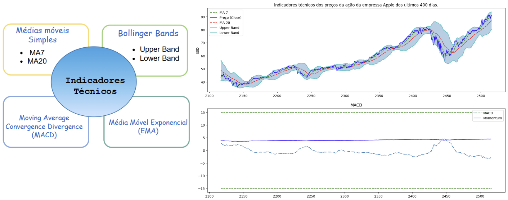
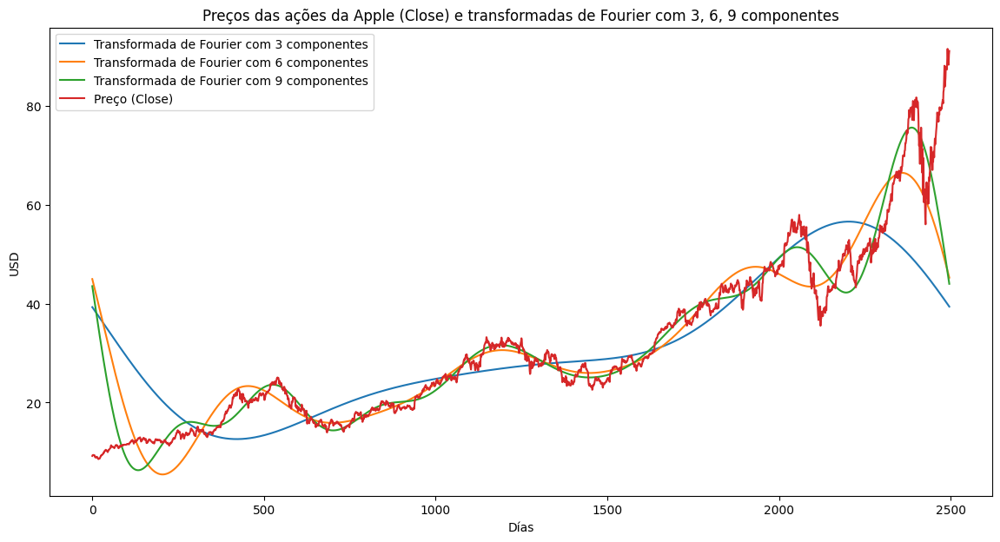
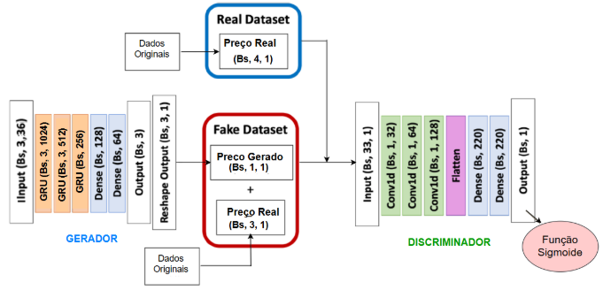
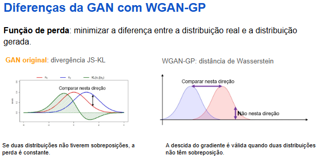
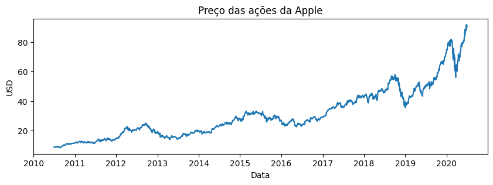
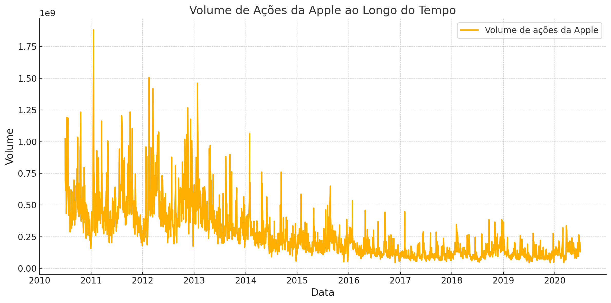
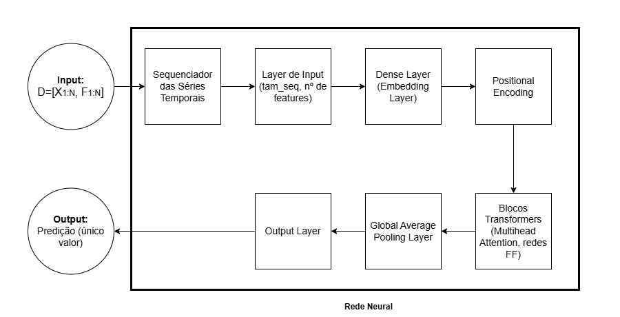
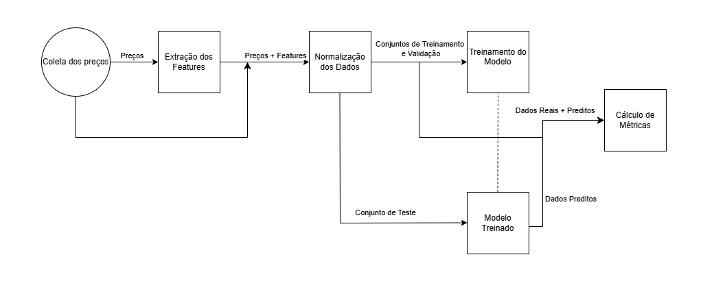

# `Síntese de Dados Financeiros`
==============================

# `Financial Data Synthesis`
==============================
## Link dos slides:
https://docs.google.com/presentation/d/1eOmgRpkQeXU1htM_7Gq66HRcn2CPZ7iB/edit?pli=1#slide=id.p1

Apresentação
==============================

O presente projeto foi originado no contexto das atividades da disciplina de pós-graduação IA376N - Deep Learning aplicado a Síntese de Sinais, oferecida no segundo semestre de 2024, na Unicamp, sob supervisão da Profa. Dra. Paula Dornhofer Paro Costa, do Departamento de Engenharia de Computação e Automação (DCA) da Faculdade de Engenharia Elétrica e de Computação (FEEC).

 |Nome  | RA | Curso|
 |--|--|--|
 |José Carlos Ferreira  | 170860  | Eng. Elétrica |
 |Byron Alejandro Acuña Acurio  | 209428  | Eng. Elétrica |

## Resumo (Abstract)

Neste trabalho foi testado a capacidade de dois modelos generativos baseados nas arquiteturas de Redes Adversárias Generativas (GANs) e Transformers na geração de preços de ações.
 
O modelo baseado na arquitetura GAN foi desenvolvido utilizando Unidades Recorrentes Fechadas (GRU) como um gerador que insere o preço histórico das ações e gera a previsão do preço futuro (no dia seguinte) das ações e uma Rede Neural Convolucional (CNN) como um discriminador para discriminar entre o preço real das ações e o preço das ações gerado. Para estimar o preço da ação foi usada 36 características como índice S&P 500, índice NASDAQ Composite, índice U.S. Índice do dólar, etc.

Comparamos os resultados do nosso modelo GAN e Transformer com modelos de aprendizado profundo baseados em LSTM e GRU. O modelo generativo apresenta um melhor desempenho em eventos extremos, em termos do erro quadrático médio RMSE.

## Introdução
Nosso projeto foca na geração de dados financeiros sintéticos realistas, especificamente geramos preços sintéticos da ação da empresa Apple através de duas abordagens: baseadas em GANS e Transformers.
Os dados sintéticos são úteis em modelos em que a confiança apenas em dados históricos não é suficiente para construir um método robusto. Neste trabalho os experimentos foram realizados utilizando os preços no período de 2010-2020, contemplando um evento extremo (Covid-19). Dessa forma, pudemos verificar a robustez de nossos modelos generativos frente a eventos extremos.

O projeto lida com séries temporais da forma:

$$ X_{1:N}  = [{ x(1), x(2), ..., x(N) }]  $$

Em que cada elemento $x(i)$ representa o preço da ação no instante $i$.

Atráves da incorporação de features relevantes, também representados por séries temporais ($F_{1:N}$), buscamos gerar dados sintéticos que representam uma continuação realista de $X_{1:N}$, isso é, uma série temporal do tipo:

$$ X^{s}_{N+1:N+K}  = [{ x^{s}(N+1), x^{s}(N+2), ..., x^{s}(N+K) }]  $$

Tal que:

$$ X^{s}_{N+1:N+K}  \approx X\_{N+1:N+K}   $$

Por exemplo, se $X_{1:N}$ representa os preços da ação da empresa Apple de 2010 até 2018, $X^{s}_{N+1:N+K}$ poderia representar valores plausíveis de 2018 até 2020.

<!-- Essas representações realistas são importantes, por exemplo, para modelos de otimização de portfólios, visto que podemos gerar diversos cenários possíveis e escolher a estratégia que se sai melhor, considerando todas as possibilidades geradas. Dessa forma, o modelo de otimização é robusto e consegue bom desempenho nas mais diversas situações. -->
## Descrição do Problema/Motivação

No setor financeiro, o acesso a dados do mundo real para análise e treinamento de modelos é limitado devido a questões de privacidade e segurança. Assim os dados sintéticos podem ajudar a fornecer uma alternativa segura para disponibilizar esses dados para diversas organizações. O desenvolvimento de modelos com capacidade de prever o preço da ação de forma precisa é desafiador devido à complexidade inerente desses dados. Em geral, os dados financeiros são não estacionários e seguem distribuições de probabilidade desconhecidas e difíceis de serem estimadas. Apesar dos avanços nos algoritmos de deep learning, que conseguem capturar melhor essas complexidades, a escassez de dados financeiros disponíveis tem sido um fator limitante na construção de métodos robustos. Especialmente em eventos extremos quando no histórico de dados nunca se teve um registro de um evento similar.

Há um movimento crescente entre pesquisadores para otimizar modelos de machine learning através da incorporação de dados financeiros sintéticos [4]. A geração de dados sintéticos permite melhorar o desempenho de métodos que, até então, apresentavam resultados insatisfatórios ou eram inviáveis na prática devido à falta de dados, além de possibilitar a simulação de eventos raros ou extremos. 

Diversas metodologias têm sido estudadas. As arquiteturas da família Generative Adversarial Networks (GANs) têm mostrado bons resultados em tarefas de geração de imagens e, mais recentemente, estão sendo aplicadas na geração de dados financeiros sintéticos. Além das GANs, as arquiteturas Transformers também surgem como estruturas promissoras para a tarefa. 

A criação de dados financeiros que reproduzam o comportamento de dados reais é essencial para várias aplicações, como o problema de otimização de portfólios. Considere um investidor com acesso a 𝑛 classes de ativos. O problema de otimização de portfólio consiste em alocar esses ativos de modo a maximizar o retorno, escolhendo a quantidade apropriada para cada classe, enquanto mantém o risco do portfólio dentro de um nível de tolerância predefinido. Pesquisas recentes em otimização de portfólios financeiros exploraram diversas abordagens para melhorar as estratégias de alocação de ativos. A geração de dados sintéticos tem se destacado como uma boa solução para ampliar conjuntos de dados financeiros limitados, com estudos propondo modelos de regressão sintética [1] e redes adversárias generativas condicionais modificadas [2].

Neste trabalho, nos focamos na geração de dados financeiros sintéticos realistas, especificamente sobre o preço da ação da empressa Apple através de duas abordagens: baseadas em GANS e Transformers. A geração de dados sintéticos é particularmente útil para capturar cenários de retorno que estão ausentes nos dados históricos, mas são estatisticamente plausíveis.

## Objetivos

O projeto tem como **objetivo principal** :

-  Estudar e desenvolver dois modelos generativos (uma baseadas em GANs e outra em Transformers.) para gerar séries temporais sintéticas realistas de ativos financeiros, retendo o máximo de informações estatísticas.

Para o projeto, escolhemos três ativos financeiros distintos:
- **Historico de dados dos preços da ação da empressa Apple**: preço em dolares da ação de Apple desde o 1º de julho de 2010 até 30 de junho de 2020 .

## Contribuições
- Criação de um modelo generativo baseado em GAN  
- Criação de um modelo generativo baseado em Wasserstein GAN  
- Criação de um modelo generativo baseado em Transformers  
- Comparação de desempenho com redes profundas baseadas em LSTM e GRU

Utilizamos como métrica de avaliação o RMSE.

### Bases de Dados

|Base de Dados | Endereço na Web | Resumo descritivo|
|----- | ----- | -----|
|API do Yahoo Finance| https://finance.yahoo.com | Permite o acesso a dados financeiros por meio de chamadas de API. Esses dados incluem preços de fechamento, preços máximos, mínimos, volume negociado. Além disso, é possível coletar os dados considerando diferentes períodos de amostragem: 2 minutos, 5 minutos, 15 minutos, 1 hora, 1 dia.|

## Metodologia e Workflow
**CASO 1: GANs**

A metodologia para a geração das séries temporais sintéticas utilizando Redes Generativas Adversarias pode ser resumida no seguinte passo a passo:

1. **Coleta de Dados via API:**

O movimento do preço das ações é influenciado por muitos fatores. Então se precisa da maior quantidade de informações possíveis. Por isso no caso das GANs o banco de dados criado alem da serie temporal dos preços de fechamento diários (Close) da empresa Apple, temos os índices de mercado, os preços de commodities e os preços de ações de grandes empresas como Amazon, Google e Microsoft. A continuação se apresenta banco de dados criado a partir dos historicos de dados das series tempoais financieras utilizadas neste trabalho, a faixa temporal foi seleccionada intencionalmente para poder testar nossos modelos com um evento extremo (Covid19).

    
    
<em>Figura 1: Historico de series temporais usadas para preveer o preço da ação da Apple, usando redes generativas GANs.</em>

2. **Engenharia de Características:**

Depois de baixar os históricos de dados das séries temporais financeiras, calculamos alguns indicadores técnicos e extraímos algumas características de tendência. Além disso, para avaliar as notícias relevantes, foi inserido um score, e finalmente foram criadas features baseadas em transformadas de Fourier para extrair tendências de longo e curto prazo nas ações da Apple.

<ul>
  <li>Indicadores técnicos: Média móvel de 7 e 20 dias, média móvel exponencial, momentum, bandas de Bollinger, MACD.</li>
  <li>Análise do sentimento das notícias: Usamos o FinBert para analisar as notícias em positivas, neutras ou negativas, usando o score fornecido que vai desde -1 até 1.</li>
  <li>Transformadas de Fourier: Foi obtida a magnitude e a fase das transformadas discretas de Fourier do preço das ações, usando 3, 6 e 9 componentes.</li>
</ul>

    
    
<em>Figura 2: Features Baseadas em Indicadores Técnicos criadas como complemento para o banco de dados apresentado na Figura 1.</em>

    
    
<em>Figura 3: Features Baseadas em Transformadas de Fouerier criadas como complemento para o banco de dados apresentado na Figura 1.</em>

3. **Normalização dos Dados:**

Após a coleta dos dados e engenharia de features, armazenamos as séries temporais (do preço e dos features) em um mesmo dataframe: 

$$D = [X_{1:N}, F_{1:N}]$$

Para facilitar o treinamento do modelo, os valores de cada série temporal foram normalizados utilizando a técnica de normalização min-max. A fórmula adotada foi:

$$
x_{n}(i) = \frac{x(i) - \min(x)}{\max(x) - \min(x)}
$$

- $x_{n}(i)$: representa o valor normalizado de uma série temporal (preço ou algum feature) no instante $i$.
- $x(i)$: representa o valor original da série temporal (preço ou algum feature) no instante $i$.
- $\min(x)$: representa o menor valor na série temporal $x$.
- $\max(x)$: representa o maior valor na série temporal $x$.

Essa abordagem garante que os valores da série temporal sejam escalados para o intervalo $[0, 1]$, permitindo que o modelo processe os dados de forma eficiente e consistente.

4. **Construção da Rede Neural:**

A rede generativas adversarias (GAN) para predição de séries temporais, usa como função de perda a divergência de Kullback-Leibler (KL) e a divergência de Jensen-Shannon (JS), no processo de treinamento. Essas duas divergência são métricas matemáticas usadas para medir a semelhança entre duas distribuições de probabilidade. O modelo GAN usa no Discriminador a função de perda baseada na divergência de Jensen-Shannon (JS), que se apresenta a continuação:

$$
-\frac{1}{m} \sum_{i=1}^m \log D\left(y^i\right)-\frac{1}{m} \sum_{i=1}^m\left(1-\log D\left(G\left(x^i\right)\right)\right)
$$

Neste projeto, o gerador foi treinado usando perda de entropia cruzada para minimizar a diferença entre duas distribuições, o que equivale a minimizar a divergência de Kullback-Leibler (KL), usando a função de perda apresentada a continuação

$$
-\frac{1}{m} \sum_{i=1}^m\left(\log D\left(G\left(x^i\right)\right)\right)
$$
 
 
 A rede generativa GAN é composta por duas redes neurais: (i) Gerador e (ii) Discriminador. As funções de perda apresentadas anteriormente garantem um treinamento que combina um processo competitivo. Abaixo detalha-se a estrutura das redes neurais da GAN:

    
    
<em>Figura 4: Estrutura da arquitetura GAN.</em>

O gerador foi construido usando uma sequência de três camadas GRU (Gated Recurrent Unit) para processamento de dados sequenciais e três camadas densas para refinar os resultados e produzir o dado sintético final. A seleção das três camadas GRU foi por causa que neste trabalho foi usado os ultimos três días de dados históricos para poder prever o día seguente. Na entrada se pode visualizar que temos as 36 features explicadas anteriormente nos passos 1 e 2. Por isso se pode visualzar que temos uma dimensão de entreda de Bs,3,36 onde Bs é o tamanho do batch de treinamento. Neste estudo foi Bs = 128. Note-se que a GAN usada tem uma arquitetura condicional, onde a geração dos dados é condicionada a alguns dados de entrada neste caso o contexto usado foi os valores passados reais do valor da ação da Apple $yc$. 

Adicionalmente no caso das GANs, neste estudo foi explorada o tipo de GAN conhecidas na literatura como Wasserstein GAN com Gradient Penalty (WGAN-GP), que oferece vantagens significativas sobre as GANs padrão para geração de séries temporais devido à sua estabilidade de treinamento aprimorada e capacidade de mitigar desafios comuns, como colapso de modo. Por exemplo as GANs padrão, que dependem de perda de entropia cruzada binária, muitas vezes enfrentam gradientes instáveis, particularmente em cenários onde o discriminador domina o gerador, levando a uma dinâmica de aprendizagem abaixo do ideal. Este problema é agravado em dados de séries temporais, onde as dependências temporais e os padrões complexos aumentam a dificuldade de alcançar um processo de formação equilibrado. O WGAN-GP aborda essas limitações usando a perda de Wasserstein, que mede a divergência entre distribuições de dados reais e geradas por meio da Distância do Earth Mover, garantindo atualizações de gradiente suaves e significativas mesmo quando o discriminador funciona bem. Além disso, a penalidade de gradiente impõe uma restrição de Lipschitz ao discriminador sem recorrer ao corte de peso, melhorando a capacidade do discriminador de modelar as estruturas intrincadas inerentes aos dados de séries temporais. Essas melhorias não apenas promovem um treinamento estável, mas também reduzem o risco de colapso do modo, incentivando o gerador a produzir padrões de séries temporais diversos e realistas. Ao alinhar mais estreitamente a distribuição dos dados gerados com a distribuição real, o WGAN-GP surge como uma escolha robusta para tarefas de modelagem de séries temporais, permitindo a síntese de sequências de alta qualidade com características temporais complexas.

    
    
<em>Figura 5: Diferenças da GAN com WGAN-GP.</em>

**CASO 2: TRANSFORMERS**

A metodologia para a geração das séries temporais sintéticas utilizando arquitetura Transformers pode ser resumida no seguinte passo a passo:

1. **Coleta de Dados via API do Yahoo Finance:**
   
   Através desse API, coletamos os preços com um período de amostragem de 2 minutos, e armazenamos em um vetor que representa a série temporal: $X\_{1:N}$.
   
   O período de amostragem de 2 minutos foi escolhido pois é o menor que o API disponibiliza. Optamos por realizar uma análise em alta frequência, pois as variações nos preços não são tão abruptas comparadas à de uma frequência menor (e.g. valores diários). Dessa forma, o modelo consegue gerar dados dentro de uma faixa razoável de valores. A figura abaixo ilustra um exemplo.
   

A continuação se apresenta a serie temporal dos preços da ação da empressa Apple, a usada data usada dos dados foi desde 2010-07-01 até 2020-06-30, para fazer experimentos antes e depois do Covid-19 (evento extremo)

    
    
<em>Figura 6: Preços das ações da Apple com um período de amostragem de 2 minutos coletados do API do Yahoo Finance.</em>

2. **Extração de Features:**

   Para auxiliar na geração de dados sintéticos realistas, também extraimos diversos features que ajudam a explicar o comportamento dos preços. Esses features também são séries temporais, dados (cada um) por: $F\_{1:N}$. Eles possuem o mesmo número de amostras da série temporal de preços.

Os features que se mostraram úteis na geração dos dados sintéticos foram:

   - Volume de ações negociada;
   - Índices técnicos: Moving Average Convergence Divergence (MACD), Stochastic Oscillator (SO), Commodity Channel Index (CCI), Money Flow Index (MFI);
  
Os índices técnicos são algumas métricas que podem ser calculadas a partir do preço de fechamento, preço máximo e mínimo, além do volume de ações negociadas. Esses índices técnicos buscam capturar as tendências de movimentação dos preços. A figura abaixo ilustra um exemplo de um feature utilizado:

    
    
<em>Figura 7: Volume de ações da Apple negociadas com um período de amostragem de 2 minutos coletados do API do Yahoo Finance.</em>

3. **Normalização dos Dados:**

   Após a coleta dos dados e extração dos features, armazenamos as séries temporais (do preço e dos features) em um mesmo dataframe: $D=[X\_{1:N}, F\_{1:N} ]$.
   
   Após isso, normalizamos os valores de cada série temporal para facilitar o treinamento, utilizando as suas respectivas médias e desvios padrões. A normalização adotada foi:

$$ x_{n}(i) = \frac{x(i) - \text{média[x]}}{\text{desvio padrão[x]}}$$

- $x_{n}(i)$: representa o valor normalizado de uma série temporal (preço ou algum feature) no instante $i$.
-  $x(i)$: representa o valor antes da normalização (preço ou algum feature) no instante $i$.
- média[x], desvio padrão [x] : representam a média e o desvio padrão associado à série temporal dos elementos de x(i)  

   
4. **Construção da Rede Neural:**

   A rede neural é um modelo baseado na arquitetura Transformer sendo utilizado para predição de séries temporais. Ele processa sequências de dados para predizer o valor futuro com base nas observações passadas. A figura abaixo ilustra o modelo, de maneira simplificada, atráves de blocos:
   

    
    
<em>Figura 8: Estrutura simplificada do modelo baseado na arquitetura Transformer. </em>

- **Input:**
   
   A entrada é um dataframe D contendo a série temporal do preço $X_{1:N}$ e dos features $F\_{1:N}$.
   
- **Sequenciador das Séries Temporais:**
   
   As séries temporais são repartidas em sequências de tamanho fixo (tam_seq) para o processamento nos blocos Transformers. Além disso, associamos a cada sequência um target, que representa o valor que desejamos prever (rótulo). Para o treinamento, a rede recebe um conjunto de sequências e os rótulos correspondentes.
   
- **Layer de Input:**
   
   A entrada da rede é um vetor multidimensional que contém todas as sequências de tamanho tam_seq para todos os features.
   
- **Embedding Layer:**

   A embedding layer é uma camada densa que transforma os dados em um espaço dimensional maior. É útil para que o modelo aprenda relações mais complexas nos dados.

- **Positional Encoding:**

   Adiciona informações sobre a posição de cada elemento da sequência, visto que o Transformer não conhece a ordem temporal dos dados. Isso permite que o modelo saiba a ordem temporal dos dados.

- **Blocos Transformers:**

   Sequências de blocos da arquitetura Transformer, cada bloco possui os seguintes elementos:

   - Layer MultiHead Attention: permite que o modelo se concentre em diferentes partes da sequência para realizar a predição
   - Conexão Residual e Normalização: adiciona a entrada do bloco à saída do layer MultiHead Attention e normaliza os valores. Isso ajuda na estabilização de treinamento.
   - Rede Feed-Forward: duas camadas densas com função de ativação ReLU na primeira.
     
- **Global Average Pooling:**
    
   Reduz a saída dos blocos transformers para um vetor de tamanho fixo através do cálculo da média dos valores.

- **Output Layer**:

    Camada densa que gera o valor predito. No nosso modelo, predizemos apenas um único valor por vez.

Os detalhes específicos da constituição de cada bloco estão descritos neste link: [Detalhes_Arquitetura](docs/Arquitetura.md)

5. **Treinamento:**

Após a construção do modelo, partimos para a etapa de treinamento. Nesta etapa, o nossos dados de entrada $D = [X_{1:N}, F_{1:N}]$ são separados em conjunto de treinamento, validação e teste:

- Conjunto de treinamento: Os 70% primeiros elementos do dataset de entrada
- Conjunto de validação:      20% dos elementos do dataset
- Conjunto de teste:       Os 10% últimos elementos do dataset de entrada

Por exemplo, se o dataset de entrada são séries temporais com 1000 elementos, então os 700 primeiros elementos são utilizados para treinamento, os 200 elementos seguintes para validação, e os últimos 100 para teste. Foi importante garantir que os dados estejam ordenados, pois apresentam dependências temporais.

Conforme explicado no bloco de sequenciamento das séries temporais, os dados são transformados em sequências de tamanho fixo. No nosso caso, observamos que sequências com 24 instantes de tempo consecutivos apresentaram os melhores resultados. Logo, o modelo recebe como entrada sequências com 24 elementos consecutivos e o rótulo associado, que no caso, seria o 25º elemento.

Ou seja, dado os últimos 24 preços (e features), o modelo tentará prever o 25º preço, e a verificação da qualidade da solução será dado pela comparação com o valor do rótulo que é o valor real do 25º preço.

Para o treinamento, foi utilizado os seguintes hiperparâmetros:
- Otimizador: Adaptative Moment Estimator (Adam);
- Função de perda: Mean Absolute Error;
-  Batch size: 128;
-  Número de épocas: 200 (com early stopping);

  A escolha dos melhores parâmetros foi baseado na perda observada para o conjunto de validação.

  6. **Inferência:**

Após o treinamento, utilizamos o modelo para prever os pontos do conjunto de teste e comparamos com os respectivos rótulos associados.

A figura abaixo ilustra o workflow:

 

    
    
<em>Figura 9: Workflow contemplando o processo de treinamento e inferência. </em>

## Experimentos, Resultados e Discussão dos Resultados

### Artigos de Referência
Os principais artigos que o grupo já identificou como base para estudo e planejamento do projeto são:

- **Pagnocelli. (2022)**: "A Synthetic Data-Plus-Features Driven Approach for Portfolio Optimization" [5].
  
- **Peña et al. (2024)**: "A modified CTGAN-plus-features-based method for optimal asset allocation" [2].

-  **F.Eckerli, J.Osterrieder.** "Generative Adversarial Networks in finance: an overview" [3]. 

### Ferramentas
Existem diversas bibliotecas Python disponíveis para geração de dados sintéticos, cada uma com suas capacidades e recursos distintos. Neste trabalho exploraremos as seguintes bibliotecas CTGAN  e Synthetic Data Vault (SDV).

- **CTGAN** é uma coleção de geradores de dados sintéticos baseados em Deep Learning para dados de tabela única, que são capazes de aprender com dados reais e gerar dados sintéticos com alta fidelidade. 

- **SDV (Synthetic Data Vault)** O pacote é focado na geração e avaliação de dados sintéticos tabulares, multitabelas e séries temporais. Aproveitando uma combinação de modelos de aprendizado de máquina, o SDV fornece recursos e síntese de dados, ao mesmo tempo em que garante que os conjuntos de dados gerados se assemelhem aos dados originais em estrutura e propriedades estatísticas. 

- **Python** com bibliotecas como `PyTorch` e `scikit-learn` para implementar os modelos generativos e realizar a síntese de dados.
   
- **Colab** para colaboração e execução de experimentos em ambientes com suporte a GPU.
  
- **Pandas** e **NumPy** para manipulação de dados tabulares.

### Proposta de Avaliação
Para a avaliação da qualidade dos nossos geradores de dados sintéticos, além dos fatos estilizados, vamos considerar várias outras métricas utilizando amostras reais e sintéticas. As métricas de avaliação que pretendemos utilizar são:

Comparação entre as distribuições sintéticos e históricos usando métricas que capturam os aspectos distribucionais dos dados sintéticos com relação às amostras reais. Neste caso vamos usar o teste Kolmogorov-Smirnov (KS), teste Qui-quadrado (CS) que medem a similaridade para variáveis ​​contínuas e categóricas (colunas) respectivamente. A medidas de divergência distribucional como distância de Jensen-Shannon, Discrepância Média Máxima (MMD) e distância de Wasserstein. Gráficos de similaridade T-SNE bidemnsional para verificar visualmente a similaridade distribucional entre dados reais e sintéticos. 

## Conclusão
Por fim, a principal dificuldade do projeto será gerar os dados financeiros sintéticos realistas. Abordaremos diversas estratégias que vão desde o pré-processamento dos dados, ajustes nos hiperparâmetros das GANs e o emprego de métricas eficientes.
 
## Referências Bibliográficas
[1] Li, Gaorong, Lei Huang, Jin Yang, and Wenyang Zhang.  
"A synthetic regression model for large portfolio allocation."  
*Journal of Business & Economic Statistics* 40, no. 4 (2022): 1665-1677.

[2] Peña, José-Manuel, Fernando Suárez, Omar Larré, Domingo Ramírez, and Arturo Cifuentes. 
"A modified CTGAN-plus-features-based method for optimal asset allocation".
" Quantitative Finance 24, no. 3-4 (2024): 465-479".

[3] https://mba.tuck.dartmouth.edu/pages/faculty/ken.french/data_library.html

[4] F.Eckerli, J.Osterrieder.
" Generative Adversarial Networks in finance: an overview."

[5]- Bernardo K. Pagnoncelli, Arturo Cifuentes, Domingo Ramírez and Hamed Rahimian.
 "A Synthetic Data-Plus-Features Driven Approach for Portfolio Optimization".
 Computational Economics, 2023, Volume 62, Number 1, Page 187.

Project Organization
------------

    ├── LICENSE
    ├── Makefile           <- Makefile with commands like `make data` or `make train`
    ├── README.md          <- The top-level README for developers using this project.
    ├── data
    │   ├── external       <- Data from third party sources.
    │   ├── interim        <- Intermediate data that has been transformed.
    │   ├── processed      <- The final, canonical data sets for modeling.
    │   └── raw            <- The original, immutable data dump.
    │
    ├── docs               <- A default Sphinx project; see sphinx-doc.org for details
    │
    ├── models             <- Trained and serialized models, model predictions, or model summaries
    │
    ├── notebooks          <- Jupyter notebooks. Naming convention is a number (for ordering),
    │                         the creator's initials, and a short `-` delimited description, e.g.
    │                         `1.0-jqp-initial-data-exploration`.
    │
    ├── references         <- Data dictionaries, manuals, and all other explanatory materials.
    │
    ├── reports            <- Generated analysis as HTML, PDF, LaTeX, etc.
    │   └── figures        <- Generated graphics and figures to be used in reporting
    │
    ├── requirements.txt   <- The requirements file for reproducing the analysis environment, e.g.
    │                         generated with `pip freeze > requirements.txt`
    │
    ├── setup.py           <- makes project pip installable (pip install -e .) so src can be imported
    ├── src                <- Source code for use in this project.
    │   ├── __init__.py    <- Makes src a Python module
    │   │
    │   ├── data           <- Scripts to download or generate data
    │   │   └── make_dataset.py
    │   │
    │   ├── features       <- Scripts to turn raw data into features for modeling
    │   │   └── build_features.py
    │   │
    │   ├── models         <- Scripts to train models and then use trained models to make
    │   │   │                 predictions
    │   │   ├── predict_model.py
    │   │   └── train_model.py
    │   │
    │   └── visualization  <- Scripts to create exploratory and results oriented visualizations
    │       └── visualize.py
    │
    └── tox.ini            <- tox file with settings for running tox; see tox.readthedocs.io

--------

<small>Project based on the <a target="_blank" href="https://drivendata.github.io/cookiecutter-data-science/">cookiecutter data science project template</a>. #cookiecutterdatascience</small>

