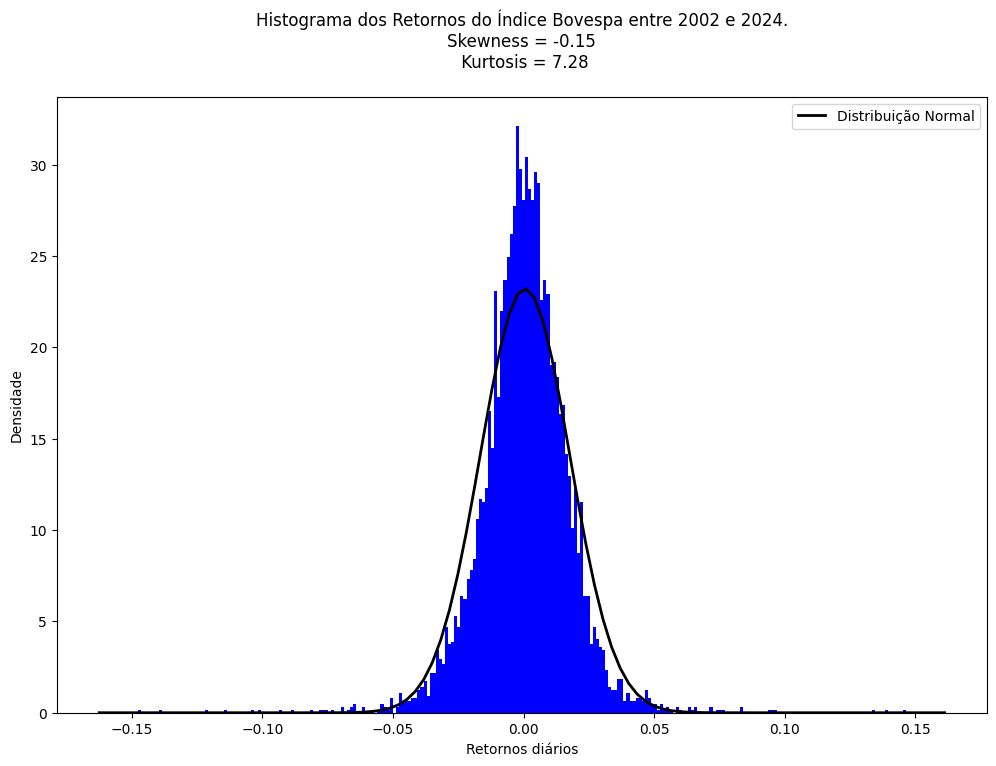
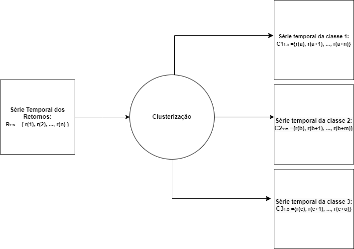
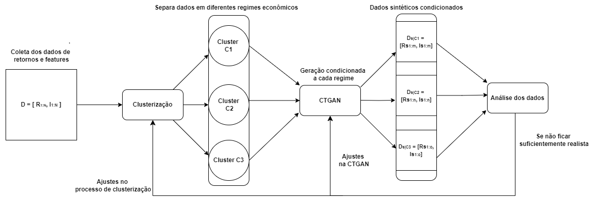
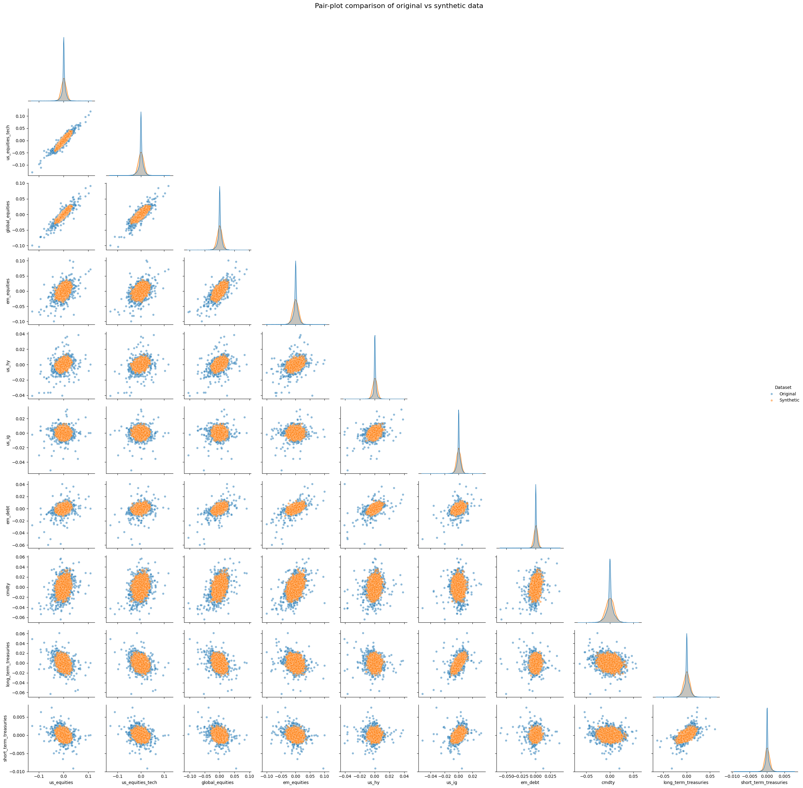

# `Síntese de Dados Financeiros`
==============================

# `Financial Data Synthesis`
==============================
## Link dos slides:
https://docs.google.com/presentation/d/1eOmgRpkQeXU1htM_7Gq66HRcn2CPZ7iB/edit?pli=1#slide=id.p1

Apresentação
==============================
O presente projeto foi originado no contexto das atividades da disciplina de pós-graduação IA376N - Deep Learning aplicado a Síntese de Sinais, oferecida no segundo semestre de 2024, na Unicamp, sob supervisão da Profa. Dra. Paula Dornhofer Paro Costa, do Departamento de Engenharia de Computação e Automação (DCA) da Faculdade de Engenharia Elétrica e de Computação (FEEC).

 |Nome  | RA | Curso|
 |--|--|--|
 |José Carlos Ferreira  | 170860  | Eng. Elétrica |
 |Byron Alejandro Acuña Acurio  | 209428  | Eng. Elétrica |

## Resumo (Abstract)

Nosso projeto foca na geração de dados financeiros sintéticos realistas, especificamente sobre índices que medem o desempenho de mercados (e.g. Ibovespa) ou sobre o preço de ações. Esses dados são úteis em modelos em que a confiança apenas em dados históricos não é suficiente para construir um método robusto, como na otimização de portfólios.

O projeto lida com séries temporais do tipo:

$$ X_{1:N}  = [{ x(1), x(2), ..., x(N) }]  $$

Em que cada elemento $$x(i)$$ representa o preço da ação (ou valor do índice) no instante $$i$$.

Atráves da incorporação de features relevantes, também representados por séries temporais alinhadas à $$X_{1:N}$$, buscamos gerar dados sintéticos realistas que representam a continuação de $$X_{1:N}$$, isso é, uma série temporal do tipo:

$$ X\overline_{N+1:N+K}  = [{ xp(N), xp(N+1), ..., xp(N+K) }]  $$

Tal que:

$$ Xp_{N+1:N+K} \approx X_{N+1:N+K} $$
## Descrição do Problema/Motivação
O desenvolvimento de modelos precisos que utilizam dados financeiros é consideravelmente desafiador devido à complexidade inerente desses dados. Em geral, os dados financeiros são não estacionários e seguem distribuições de probabilidade desconhecidas e difíceis de serem estimadas. Apesar dos avanços nos algoritmos de deep learning, que conseguem capturar melhor essas complexidades, a escassez de dados financeiros disponíveis tem sido um fator limitante na construção de métodos robustos [5].

Há um movimento crescente entre pesquisadores para otimizar modelos de machine learning através da incorporação de dados financeiros sintéticos [4]. A geração de dados sintéticos permite melhorar o desempenho de métodos que, até então, apresentavam resultados insatisfatórios ou eram inviáveis na prática devido à falta de dados, além de possibilitar a simulação de eventos raros ou extremos. 

Diversas metodologias têm sido estudadas. As arquiteturas da família Generative Adversarial Networks (GANs) têm mostrado bons resultados em tarefas de geração de imagens e, mais recentemente, estão sendo aplicadas na geração de dados financeiros sintéticos. A criação de dados financeiros que reproduzam o comportamento de dados reais é essencial para várias aplicações, como o problema de otimização de portfólios.

Considere um investidor com acesso a 𝑛 classes de ativos. O problema de otimização de portfólio consiste em alocar esses ativos de modo a maximizar o retorno, escolhendo a quantidade apropriada para cada classe, enquanto mantém o risco do portfólio dentro de um nível de tolerância predefinido. Pesquisas recentes em otimização de portfólios financeiros exploraram diversas abordagens para melhorar as estratégias de alocação de ativos. A geração de dados sintéticos tem se destacado como uma solução promissora para ampliar conjuntos de dados financeiros limitados, com estudos propondo modelos de regressão sintética [1] e redes adversárias generativas condicionais modificadas [2].

Neste trabalho, focamos na geração de dados sintéticos de ativos listados em bolsas de valores (nacionais e internacionais) utilizando uma abordagem baseada em GANs. A geração de dados sintéticos é particularmente útil para capturar cenários de retorno que estão ausentes nos dados históricos, mas são estatisticamente plausíveis.

## Objetivos

**Objetivo Geral:**

Gerar dados financeiros sintéticos realistas utilizando redes neurais adversárias (GANs). No caso, computaremos os retornos de índices financeiros nacionais e internacionais (e.g. índice Bovespa ou índice S&P 500). Esses índices representam o desempenho de um conjunto representativo de ativos (em geral, ações). O retorno r(t) para um período t é dado pela equação (1):

$$ r(t) =\frac{x(t) - x(t-1)}{x(t-1)}\quad\quad (1)  $$

Sendo x(t) o valor do índice no período t.

**Objetivos Específicos:**

Neste projeto, temos três objetivos específicos.

**1. Garantir que os dados financeiros sintéticos (retornos) reproduzam as propriedades estatísticas conhecidas como fatos estilizados.**

Os fatos estilizados são propriedades estatísticas comuns, observadas empiricamente, entre diversos ativos financeiros em diferentes mercados e períodos [4]. Os principais fatos estilizados são:

- **Heavy tails:** a probabilidade de retornos extremos (ganhos ou perdas extremas) é maior do que visto em distribuições normais. Logo, as extremidades da 
  distribuição de retornos tende a ser mais "grossas" do que as observadas em uma curva normal.

- **Assimetria entre ganhos e perdas:** perdas extremas tendem a serem mais prováveis do que ganhos extremos, logo a distribuição de retornos tende a ser 
  assimétrica.

- **Agrupamento de volatilidade:** a volatilidade mostra autocorrelação, ou seja, períodos de alta volatilidade tendem a ser seguidos por outros de alta    
  volatilidade, e o mesmo ocorre com períodos de baixa volatilidade.

- **Curva Gaussiana:** conforme aumentamos o horizonte do tempo, a distribuição de retornos tende a aproximar da curva Gaussiana. 

- **Ausência de autocorrelação nos retornos:** os retornos geralmente apresentam pouca ou nenhuma autocorrelação linear. Por exemplo, o fato do retorno r(t-1) ter sido positivo tem pouca influência no retorno r(t).

Podemos avaliar se a distribuição possui "heavy tails" através da métrica kurtosis (K) que mede a tendência da distribuição apresentar valores extremos. E podemos avaliar se a distribuição possui assimetria entre ganhos e perdas através da métrica skewness (S) que mede a assimetria da distribuição em relação à média.
Por exemplo, verificamos os retornos do Índice Bovespa no período entre 2002 e 2024, e temos o seguinte histograma:

Observamos que o Skewness (S) é negativo, indicando que há uma assimetria entre ganhos e perdas, no caso há uma probabilidade maior de perdas extremas do que ganhos extremos. Enquanto o Kurtosis (K) de 7.28 indica que a probabilidade de retornos extremos é maior do que uma distribuição normal sugere (K>3 já garante isso). Portanto, os fatos estilizados a) e b) são verificadas com este histograma. Os outros fatos também podem ser verificados através de métricas adequadas. Dessa forma, para averiguar se um dado sintético é realista, podemos analisar se ele possui tal propriedades.

**2. Condicionar a geração de dados sintéticos financeiros à diferentes períodos econômicos.**

Conforme mencionado por Peña et al. [3], o comportamento dos ativos pode variar de acordo com o período econômico, também conhecidos como regimes de mercado, em que se encontram. Por exemplo, os ativos em geral se tornam mais voláteis em períodos de crise comparado à tempos de estabilidade. 

Dessa forma, pretendemos separar os períodos econômicos em categorias, como: período de alta, de baixa, de normalidade, e condicionar a geração de dados de acordo com cada categoria, obtendo assim, dados sintéticos mais realistas para cada regime de mercado.

Para tal, podemos utilizar técnicas de clusterização nas séries temporais estudadas, agrupando dados que apresentam comportamentos semelhantes e atribuindo variáveis categóricas para cada cluster. Ao final, geramos os dados utilizando as CTGANs (Conditional Tabular Generative Adversarial Networks) que produzem os dados sintéticos de acordo com o regime de mercado, descrito através da variável categórica.

O diagrama abaixo ilustra um exemplo, em que temos a série temporal de retornos (retornos dos índices em cada instante t, conforme indicado na equação 1):

$$ R_{1:N}  = [{ r(1), r(2), ..., r(N) }]  $$

O processo de clusterização irá separar os retornos que apresentam comportamenho semelhante, categorizando os regimes de mercado. No exemplo, isso gera três séries temporais C1, C2 e C3 que são subséries da original:

$$ \left(C1_{1:n}\right) \\ U \\ \left(C2_{1:m}\right) \\ U \\ \left(C3_{1:o}\right) = R_{1:N} $$ 

**3. Incorporação de informações contextuais (features) na geração dos dados sintéticos.**

Ao invés de treinar o modelo apenas utilizado as informações dos retornos dos índices, podemos incorporar aos dados de treinamento, e consequentemente aos dados sintéticos gerados, informações contextuais que ajudam a melhorar o realismo dos dados gerados.

Conforme explicado por Pagnocelli et al.[5], a taxa de juros é um bom indicador do comportamento dos índices de ações. Visto que, de maneira simplificada, uma taxa mais elevada tende a atrair investidores a aplicar em títulos de renda fixa, refletindo numa queda do mercado de ações e o contrário também acontece.

Dessa forma, os dados de treinamento são séries temporais, em que a informação para cada instante t é representado por uma tupla:

$$ \left(r(t), i(t) \right) $$

Sendo:

r(t): retorno do índice no instante t.

i(t): taxa de juros no instante t.

## Metodologia Proposta

A metodologia proposta consiste nos seguintes passos:

**1.** Coletar os retornos de um determinado índice em um determinado período (e.g. retornos do Ibovespa de 2002 até 2024) descritos pela série temporal:

$$ R_{1:N} = [ r(1), r(2), ..., r(N) ] $$

**2.** Coletar os valores da taxa de juros (e/ou outros features relevantes) para o mesmo período:

$$ I_{1:N} = [i(1), i(2), ..., i(N)] $$

**3.** Aplicar técnicas de clusterização no conjunto:

$$ D = [ R_{1:N}, I_{1:N} ] $$

De forma a identificar as tuplas ( r(t), i(t) ) que exibem características e similares e agrupá-las em dois ou três conjuntos que representam regimes de mercado (períodos econômicos) distintos.

**4.** Associar uma variável categórica a cada conjunto, ou seja, a cada regime de mercado.

**5.** Gerar amostras sintéticas (Ds) condicionadas à cada conjunto através da CTGANs:

$$ D^s = [R^s_{1:m}, I^s_{1:m}] $$

**6.** Verificar se as amostras sintéticas são realistas através da observação dos fatos estilizados e outras métricas.

**7.** Caso os dados não fiquem suficientemente realistas, realizar ajustes na CTGAN e/ou no processo de clusterização.

### Bases de Dados e Evolução

|Base de Dados | Endereço na Web | Resumo descritivo|
|----- | ----- | -----|
|API do Yahoo Finance| https://finance.yahoo.com | Permite o acesso a dados financeiros por meio de chamadas de API. Esses dados incluem cotações de ações em tempo real e histórico de preços.|
| Bloomberg Dataset|https://github.com/chuma9615/ctgan-portfolio-research/blob/main/src/data/asset_prices.csv| Inclui dados financeiros detalhados e será útil para o estudo de alocação de ativos e geração de cenários sintéticos de retornos. Neste dataset, temos o retorno histórico dos principais índices do mundo, como S&P 500, Nasdaq 100, Total Stock Market, etc.| 

A escolha dessas bases de dados é justificada pelo seu uso comprovado em estudos anteriores sobre otimização de portfólio e síntese de dados financeiros.

### Abordagens de Modelagem Generativa
Entre as abordagens de modelagem generativa que o grupo pretende explorar estão:
- **Redes Adversárias Generativas (CTGAN)**: A abordagem usando GANs não assume uma forma funcional pré-definida para os dados. A rede aprende diretamente a distribuição dos dados reais (tanto marginais quanto condicionais) e gera amostras sintéticas que imitam os dados reais.

### Artigos de Referência
Os principais artigos que o grupo já identificou como base para estudo e planejamento do projeto são:

- **Pagnocelli. (2022)**: "A Synthetic Data-Plus-Features Driven Approach for Portfolio Optimization" [5].
  
- **Peña et al. (2024)**: "A modified CTGAN-plus-features-based method for optimal asset allocation" [2].

-  **F.Eckerli, J.Osterrieder.** "Generative Adversarial Networks in finance: an overview" [3]. 

### Ferramentas
Existem diversas bibliotecas Python disponíveis para geração de dados sintéticos, cada uma com suas capacidades e recursos distintos. Neste trabalho exploraremos as seguintes bibliotecas CTGAN  e Synthetic Data Vault (SDV).

- **CTGAN** é uma coleção de geradores de dados sintéticos baseados em Deep Learning para dados de tabela única, que são capazes de aprender com dados reais e gerar dados sintéticos com alta fidelidade. 

- **SDV (Synthetic Data Vault)** O pacote é focado na geração e avaliação de dados sintéticos tabulares, multitabelas e séries temporais. Aproveitando uma combinação de modelos de aprendizado de máquina, o SDV fornece recursos e síntese de dados, ao mesmo tempo em que garante que os conjuntos de dados gerados se assemelhem aos dados originais em estrutura e propriedades estatísticas. 

- **Python** com bibliotecas como `PyTorch` e `scikit-learn` para implementar os modelos generativos e realizar a síntese de dados.
   
- **Colab** para colaboração e execução de experimentos em ambientes com suporte a GPU.
  
- **Pandas** e **NumPy** para manipulação de dados tabulares.

### Workflow
O workflow se baseia nos passos descritos na metodologia.

## Experimentos, Resultados e Discussão dos Resultados

Como experimento inicial, resolvemos gerar dados financeiros sintéticos utilizando técnicas tradicionais de estatística, no caso, modelamos os dados através de uma Gaussiana Multivariável. A figura abaixo apresenta uma comparação entre os dados gerados e os reais.

Os ativos foram retirados do Bloomberg Dataset, e representam diferentes índices de ações e títulos de renda fixa. Podemos observar que uma Gaussiana Multivariavel não possui a capacidade para capturar todas as correlações necessárias, visto que os dados gerados ficam concentrados na média, sendo incapaz de gerar dados mais dispersos.

Ao final, temos que o principal resultado esperado é:

- Um conjunto de dados sintéticos gerado para complementação das bases financeiras históricas, capaz de capturar variações de retorno plausíveis que não foram observadas nos dados originais.

### Proposta de Avaliação
Para a avaliação da qualidade dos nossos geradores de dados sintéticos, além dos fatos estilizados, vamos considerar várias outras métricas utilizando amostras reais e sintéticas. As métricas de avaliação que pretendemos utilizar são:

Comparação entre as distribuições sintéticos e históricos usando métricas que capturam os aspectos distribucionais dos dados sintéticos com relação às amostras reais. Neste caso vamos usar o teste Kolmogorov-Smirnov (KS), teste Qui-quadrado (CS) que medem a similaridade para variáveis ​​contínuas e categóricas (colunas) respectivamente. A medidas de divergência distribucional como distância de Jensen-Shannon, Discrepância Média Máxima (MMD) e distância de Wasserstein. Gráficos de similaridade T-SNE bidemnsional para verificar visualmente a similaridade distribucional entre dados reais e sintéticos. 

## Conclusão
Por fim, a principal dificuldade do projeto será gerar os dados financeiros sintéticos realistas. Abordaremos diversas estratégias que vão desde o pré-processamento dos dados, ajustes nos hiperparâmetros das GANs e o emprego de métricas eficientes.
 
## Referências Bibliográficas
[1] Li, Gaorong, Lei Huang, Jin Yang, and Wenyang Zhang.  
"A synthetic regression model for large portfolio allocation."  
*Journal of Business & Economic Statistics* 40, no. 4 (2022): 1665-1677.

[2] Peña, José-Manuel, Fernando Suárez, Omar Larré, Domingo Ramírez, and Arturo Cifuentes. 
"A modified CTGAN-plus-features-based method for optimal asset allocation".
" Quantitative Finance 24, no. 3-4 (2024): 465-479".

[3] https://mba.tuck.dartmouth.edu/pages/faculty/ken.french/data_library.html

[4] F.Eckerli, J.Osterrieder.
" Generative Adversarial Networks in finance: an overview."

[5]- Bernardo K. Pagnoncelli, Arturo Cifuentes, Domingo Ramírez and Hamed Rahimian.
 "A Synthetic Data-Plus-Features Driven Approach for Portfolio Optimization".
 Computational Economics, 2023, Volume 62, Number 1, Page 187.

Project Organization
------------

    ├── LICENSE
    ├── Makefile           <- Makefile with commands like `make data` or `make train`
    ├── README.md          <- The top-level README for developers using this project.
    ├── data
    │   ├── external       <- Data from third party sources.
    │   ├── interim        <- Intermediate data that has been transformed.
    │   ├── processed      <- The final, canonical data sets for modeling.
    │   └── raw            <- The original, immutable data dump.
    │
    ├── docs               <- A default Sphinx project; see sphinx-doc.org for details
    │
    ├── models             <- Trained and serialized models, model predictions, or model summaries
    │
    ├── notebooks          <- Jupyter notebooks. Naming convention is a number (for ordering),
    │                         the creator's initials, and a short `-` delimited description, e.g.
    │                         `1.0-jqp-initial-data-exploration`.
    │
    ├── references         <- Data dictionaries, manuals, and all other explanatory materials.
    │
    ├── reports            <- Generated analysis as HTML, PDF, LaTeX, etc.
    │   └── figures        <- Generated graphics and figures to be used in reporting
    │
    ├── requirements.txt   <- The requirements file for reproducing the analysis environment, e.g.
    │                         generated with `pip freeze > requirements.txt`
    │
    ├── setup.py           <- makes project pip installable (pip install -e .) so src can be imported
    ├── src                <- Source code for use in this project.
    │   ├── __init__.py    <- Makes src a Python module
    │   │
    │   ├── data           <- Scripts to download or generate data
    │   │   └── make_dataset.py
    │   │
    │   ├── features       <- Scripts to turn raw data into features for modeling
    │   │   └── build_features.py
    │   │
    │   ├── models         <- Scripts to train models and then use trained models to make
    │   │   │                 predictions
    │   │   ├── predict_model.py
    │   │   └── train_model.py
    │   │
    │   └── visualization  <- Scripts to create exploratory and results oriented visualizations
    │       └── visualize.py
    │
    └── tox.ini            <- tox file with settings for running tox; see tox.readthedocs.io

--------

<small>Project based on the <a target="_blank" href="https://drivendata.github.io/cookiecutter-data-science/">cookiecutter data science project template</a>. #cookiecutterdatascience</small>

