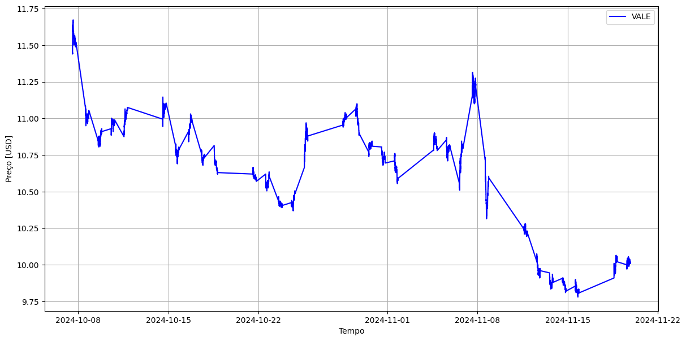

# `Síntese de Dados Financeiros`
==============================

# `Financial Data Synthesis`
==============================
## Link dos slides:
https://docs.google.com/presentation/d/1eOmgRpkQeXU1htM_7Gq66HRcn2CPZ7iB/edit?pli=1#slide=id.p1

Apresentação
==============================
O presente projeto foi originado no contexto das atividades da disciplina de pós-graduação IA376N - Deep Learning aplicado a Síntese de Sinais, oferecida no segundo semestre de 2024, na Unicamp, sob supervisão da Profa. Dra. Paula Dornhofer Paro Costa, do Departamento de Engenharia de Computação e Automação (DCA) da Faculdade de Engenharia Elétrica e de Computação (FEEC).

 |Nome  | RA | Curso|
 |--|--|--|
 |José Carlos Ferreira  | 170860  | Eng. Elétrica |
 |Byron Alejandro Acuña Acurio  | 209428  | Eng. Elétrica |

## Resumo (Abstract)

Nosso projeto foca na geração de dados financeiros sintéticos realistas, especificamente sobre índices que medem o desempenho de mercados (e.g. Ibovespa) ou sobre o preço de ações através de duas abordagens: baseadas em GANS e Transformers.
Os dados sintéticos são úteis em modelos em que a confiança apenas em dados históricos não é suficiente para construir um método robusto, como na otimização de portfólios.

O projeto lida com séries temporais da forma:

$$ X_{1:N}  = [{ x(1), x(2), ..., x(N) }]  $$

Em que cada elemento $x(i)$ representa o preço da ação (ou valor do índice) no instante $i$.

Atráves da incorporação de features relevantes, também representados por séries temporais (alinhadas à $X_{1:N}$), buscamos gerar dados sintéticos que representam uma continuação realista de $X_{1:N}$, isso é, uma série temporal do tipo:

$$ X^{s}_{N+1:N+K}  = [{ x^{s}(N+1), x^{s}(N+2), ..., x^{s}(N+K) }]  $$

Tal que:

$$ X^{s}_{N+1:N+K}  \approx X\_{N+1:N+K}   $$

Por exemplo, se $X_{1:N}$ representa o Ibovespa de janeiro até fevereiro, $X^{s}_{N+1:N+K}$ poderia representar valores plausíveis de fevereiro até março.

Essas representações realistas são importantes para modelos de otimização de portfólios, pois podemos gerar diversos cenários possíveis e escolher a estratégia que se sai melhor, considerando todas as possibilidades geradas. Dessa forma, o modelo de otimização é robusto e consegue bom desempenho nas mais diversas situações.

## Descrição do Problema/Motivação
O desenvolvimento de modelos precisos que utilizam dados financeiros é consideravelmente desafiador devido à complexidade inerente desses dados. Em geral, os dados financeiros são não estacionários e seguem distribuições de probabilidade desconhecidas e difíceis de serem estimadas. Apesar dos avanços nos algoritmos de deep learning, que conseguem capturar melhor essas complexidades, a escassez de dados financeiros disponíveis tem sido um fator limitante na construção de métodos robustos [5].

Há um movimento crescente entre pesquisadores para otimizar modelos de machine learning através da incorporação de dados financeiros sintéticos [4]. A geração de dados sintéticos permite melhorar o desempenho de métodos que, até então, apresentavam resultados insatisfatórios ou eram inviáveis na prática devido à falta de dados, além de possibilitar a simulação de eventos raros ou extremos. 

Diversas metodologias têm sido estudadas. As arquiteturas da família Generative Adversarial Networks (GANs) têm mostrado bons resultados em tarefas de geração de imagens e, mais recentemente, estão sendo aplicadas na geração de dados financeiros sintéticos. Além das GANs, as arquiteturas Transformers também surgem como estruturas promissoras para a tarefa. 

A criação de dados financeiros que reproduzam o comportamento de dados reais é essencial para várias aplicações, como o problema de otimização de portfólios. Considere um investidor com acesso a 𝑛 classes de ativos. O problema de otimização de portfólio consiste em alocar esses ativos de modo a maximizar o retorno, escolhendo a quantidade apropriada para cada classe, enquanto mantém o risco do portfólio dentro de um nível de tolerância predefinido. Pesquisas recentes em otimização de portfólios financeiros exploraram diversas abordagens para melhorar as estratégias de alocação de ativos. A geração de dados sintéticos tem se destacado como uma boa solução para ampliar conjuntos de dados financeiros limitados, com estudos propondo modelos de regressão sintética [1] e redes adversárias generativas condicionais modificadas [2].

Neste trabalho, focamos na geração de dados sintéticos de ativos listados em bolsas de valores (nacionais e internacionais) utilizando uma abordagem baseada em GANs e Transformers. A geração de dados sintéticos é particularmente útil para capturar cenários de retorno que estão ausentes nos dados históricos, mas são estatisticamente plausíveis.

## Objetivos

O projeto tem como **objetivo principal** :

- Gerar séries temporais sintéticas realistas de ativos financeiros.

Para o projeto, escolhemos três ativos financeiros distintos:
- **Índice Bovespa**: pontuação que mede o desempenho das ações das maiores empresas listadas na bolsa de ações brasileira (B3);
- **Índice S&P 500**: pontuação que mede o desempenho das 500 maiores ações listadas na bolsa de ações de Nova York (NYSE);
- **Ações da VALE S.A**: terceira maior empresa brasileira, com ações negociadas na NYSE e B3;

Além disso, adotamos duas abordagens distintas para geração dos dados:
1. Baseada na arquitetura **Transformers**;
2. Baseada na arquitetura de redes generativas adversarias **(GANs)**;

Temos como missão, dado a série temporal desses ativos em determinado período, gerar séries temporais sintéticas plausíveis que representam a continuação das séries originais.

Para medir o "realismo" das séries, utilizamos diversas métricas, como o teste Kolmogorov-Smirnov (KS), distância de Jensen-Shannon, distância de Wasserstein, além de gráficos de similaridade T-SNE bidemnsional para verificar visualmente a similaridade distribucional entre dados reais e sintéticos.

### Bases de Dados

|Base de Dados | Endereço na Web | Resumo descritivo|
|----- | ----- | -----|
|API do Yahoo Finance| https://finance.yahoo.com | Permite o acesso a dados financeiros por meio de chamadas de API. Esses dados incluem cotações de ações, volume negociado, preço de fechamento, preço máximo e mínimo.|

## Metodologia e Workflow
**CASO 1: TRANSFORMERS**

A metodologia para a geração das séries temporais sintéticas utilizando arquitetura Transformers pode ser resumida no seguinte passo a passo:

1. **Coleta de Dados via API do Yahoo Finance:**
   
   Através desse API, coletamos os preços com um período de amostragem de 2 minutos, e armazenamos em um vetor que representa a série temporal: $X\_{1:N}$.
   
   O período de amostragem de 2 minutos foi escolhido pois é o menor que o API disponibiliza. Optamos por realizar uma análise em alta frequência, pois as variações nos preços não são tão abruptas comparadas à de uma frequência menor (e.g. valores diários). Dessa forma, o modelo consegue gerar dados dentro de uma faixa razoável de valores. A figura abaixo ilustra um exemplo.
   

    
    
<em>Figura 1: Preços das ações da Vale com um período de amostragem de 2 minutos coletados do API do Yahoo Finance.</em>

3. **Extração de Features:**

   Para auxiliar na geração de dados sintéticos realistas, também extraimos diversos features que ajudam a explicar o comportamento dos preços. Esses features também são séries temporais, dados por: $F\_{1:N}$. Eles possuem o mesmo número de amostras da série temporal de preços.

Os features que se mostraram úteis na geração dos dados sintéticos foram:

   - Volume de ações negociada;
   - Índices técnicos: Moving Average Convergence Divergence (MACD), Stochastic Oscillator (SO), Commodity Channel Index (CCI), Money Flow Index (MFI);
  
Os índices técnicos são algumas métricas que podem ser calculadas a partir do preço de fechamento, preço máximo e mínimo, além do volume de ações negociadas. Esses índices técnicos buscam capturar as tendências de movimentação dos preços. A figura abaixo ilustra o exemplo de um feature utilizado:

    
    
<em>Figura 2: Volume de ações da Vale negociadas com um período de amostragem de 2 minutos coletados do API do Yahoo Finance.</em>

3. **Normalização dos Dados:**

   Após a coleta dos dados e extração dos features, armazenamos as séries temporais (do preço e dos features) em um mesmo dataframe: $D=[X\_{1:N}, F\_{1:N} ]$.
   
   Após isso, normalizamos os valores de cada série temporal para facilitar o treinamento, utilizando as suas respectivas médias e desvios padrões. A normalização adotada foi:

$$ x_{n}(i) = \frac{x(i) - \text{média}}{\text{desvio padrão}}$$

- $x_{n}(i)$: representa o valor normalizado de uma série temporal (preço ou algum feature) no instante $i$.
   
4. **Construção do Modelo Transformer:**
   

### Artigos de Referência
Os principais artigos que o grupo já identificou como base para estudo e planejamento do projeto são:

- **Pagnocelli. (2022)**: "A Synthetic Data-Plus-Features Driven Approach for Portfolio Optimization" [5].
  
- **Peña et al. (2024)**: "A modified CTGAN-plus-features-based method for optimal asset allocation" [2].

-  **F.Eckerli, J.Osterrieder.** "Generative Adversarial Networks in finance: an overview" [3]. 

### Ferramentas
Existem diversas bibliotecas Python disponíveis para geração de dados sintéticos, cada uma com suas capacidades e recursos distintos. Neste trabalho exploraremos as seguintes bibliotecas CTGAN  e Synthetic Data Vault (SDV).

- **CTGAN** é uma coleção de geradores de dados sintéticos baseados em Deep Learning para dados de tabela única, que são capazes de aprender com dados reais e gerar dados sintéticos com alta fidelidade. 

- **SDV (Synthetic Data Vault)** O pacote é focado na geração e avaliação de dados sintéticos tabulares, multitabelas e séries temporais. Aproveitando uma combinação de modelos de aprendizado de máquina, o SDV fornece recursos e síntese de dados, ao mesmo tempo em que garante que os conjuntos de dados gerados se assemelhem aos dados originais em estrutura e propriedades estatísticas. 

- **Python** com bibliotecas como `PyTorch` e `scikit-learn` para implementar os modelos generativos e realizar a síntese de dados.
   
- **Colab** para colaboração e execução de experimentos em ambientes com suporte a GPU.
  
- **Pandas** e **NumPy** para manipulação de dados tabulares.

### Workflow
O workflow se baseia nos passos descritos na metodologia.

## Experimentos, Resultados e Discussão dos Resultados

Como experimento inicial, resolvemos gerar dados financeiros sintéticos utilizando técnicas tradicionais de estatística, no caso, modelamos os dados através de uma Gaussiana Multivariável. A figura abaixo apresenta uma comparação entre os dados gerados e os reais.

Os ativos foram retirados do Bloomberg Dataset, e representam diferentes índices de ações e títulos de renda fixa. Podemos observar que uma Gaussiana Multivariavel não possui a capacidade para capturar todas as correlações necessárias, visto que os dados gerados ficam concentrados na média, sendo incapaz de gerar dados mais dispersos.

Ao final, temos que o principal resultado esperado é:

- Um conjunto de dados sintéticos gerado para complementação das bases financeiras históricas, capaz de capturar variações de retorno plausíveis que não foram observadas nos dados originais.

### Proposta de Avaliação
Para a avaliação da qualidade dos nossos geradores de dados sintéticos, além dos fatos estilizados, vamos considerar várias outras métricas utilizando amostras reais e sintéticas. As métricas de avaliação que pretendemos utilizar são:

Comparação entre as distribuições sintéticos e históricos usando métricas que capturam os aspectos distribucionais dos dados sintéticos com relação às amostras reais. Neste caso vamos usar o teste Kolmogorov-Smirnov (KS), teste Qui-quadrado (CS) que medem a similaridade para variáveis ​​contínuas e categóricas (colunas) respectivamente. A medidas de divergência distribucional como distância de Jensen-Shannon, Discrepância Média Máxima (MMD) e distância de Wasserstein. Gráficos de similaridade T-SNE bidemnsional para verificar visualmente a similaridade distribucional entre dados reais e sintéticos. 

## Conclusão
Por fim, a principal dificuldade do projeto será gerar os dados financeiros sintéticos realistas. Abordaremos diversas estratégias que vão desde o pré-processamento dos dados, ajustes nos hiperparâmetros das GANs e o emprego de métricas eficientes.
 
## Referências Bibliográficas
[1] Li, Gaorong, Lei Huang, Jin Yang, and Wenyang Zhang.  
"A synthetic regression model for large portfolio allocation."  
*Journal of Business & Economic Statistics* 40, no. 4 (2022): 1665-1677.

[2] Peña, José-Manuel, Fernando Suárez, Omar Larré, Domingo Ramírez, and Arturo Cifuentes. 
"A modified CTGAN-plus-features-based method for optimal asset allocation".
" Quantitative Finance 24, no. 3-4 (2024): 465-479".

[3] https://mba.tuck.dartmouth.edu/pages/faculty/ken.french/data_library.html

[4] F.Eckerli, J.Osterrieder.
" Generative Adversarial Networks in finance: an overview."

[5]- Bernardo K. Pagnoncelli, Arturo Cifuentes, Domingo Ramírez and Hamed Rahimian.
 "A Synthetic Data-Plus-Features Driven Approach for Portfolio Optimization".
 Computational Economics, 2023, Volume 62, Number 1, Page 187.

Project Organization
------------

    ├── LICENSE
    ├── Makefile           <- Makefile with commands like `make data` or `make train`
    ├── README.md          <- The top-level README for developers using this project.
    ├── data
    │   ├── external       <- Data from third party sources.
    │   ├── interim        <- Intermediate data that has been transformed.
    │   ├── processed      <- The final, canonical data sets for modeling.
    │   └── raw            <- The original, immutable data dump.
    │
    ├── docs               <- A default Sphinx project; see sphinx-doc.org for details
    │
    ├── models             <- Trained and serialized models, model predictions, or model summaries
    │
    ├── notebooks          <- Jupyter notebooks. Naming convention is a number (for ordering),
    │                         the creator's initials, and a short `-` delimited description, e.g.
    │                         `1.0-jqp-initial-data-exploration`.
    │
    ├── references         <- Data dictionaries, manuals, and all other explanatory materials.
    │
    ├── reports            <- Generated analysis as HTML, PDF, LaTeX, etc.
    │   └── figures        <- Generated graphics and figures to be used in reporting
    │
    ├── requirements.txt   <- The requirements file for reproducing the analysis environment, e.g.
    │                         generated with `pip freeze > requirements.txt`
    │
    ├── setup.py           <- makes project pip installable (pip install -e .) so src can be imported
    ├── src                <- Source code for use in this project.
    │   ├── __init__.py    <- Makes src a Python module
    │   │
    │   ├── data           <- Scripts to download or generate data
    │   │   └── make_dataset.py
    │   │
    │   ├── features       <- Scripts to turn raw data into features for modeling
    │   │   └── build_features.py
    │   │
    │   ├── models         <- Scripts to train models and then use trained models to make
    │   │   │                 predictions
    │   │   ├── predict_model.py
    │   │   └── train_model.py
    │   │
    │   └── visualization  <- Scripts to create exploratory and results oriented visualizations
    │       └── visualize.py
    │
    └── tox.ini            <- tox file with settings for running tox; see tox.readthedocs.io

--------

<small>Project based on the <a target="_blank" href="https://drivendata.github.io/cookiecutter-data-science/">cookiecutter data science project template</a>. #cookiecutterdatascience</small>

