# `Geração Sintética de Dados Aplicado a Reconhecimento de Atividades Humanas (HAR)`
# `Synthetic Data Generation for Human Activity Recognition (HAR)`

## Apresentação

O presente projeto foi originado no contexto das atividades da disciplina de pós-graduação *IA376N - IA generativa: de modelos a aplicações multimodais*,
oferecida no segundo semestre de 2024, na Unicamp, sob supervisão da Profa. Dra. Paula Dornhofer Paro Costa, do Departamento de Engenharia de Computação e Automação (DCA) da Faculdade de Engenharia Elétrica e de Computação (FEEC).

|Nome  | RA | Especialização|
|--|--|--|
| Bruno Guedes da Silva  | 203657  | Eng. de Computação|
| Amparo Díaz  | 152301  | Aluna especial|

## Resumo (Abstract)

Na tarefa de reconhecimento de atividades humanas (HAR) utiliza-se dados de acelerômetro e giroscópio para identificar uma ação realizada. A coleta de dados rotulados para HAR apresenta diversas dificuldades, gerando datasets pouco representativos e desbalanceados.

Diante disso, neste trabalho realizamos a adaptação e avaliação de modelos de geração de séries temporais para dados HAR. Comparamos as arquiteturas DoppelGAN, TimeGAN e BioDiffusion em cinco diferentes datasets. Os resultados preliminares demonstram um baixo desempenho dos modelos quando aplicados diretamente aos dados de sensores. Desenvolvimentos futuros serão voltados para melhorias nos modelos utilizados e exploração de hiperparâmetros, e implementação métricas de avaliação quantitativa.

[Slides apresentação 2](https://docs.google.com/presentation/d/1QAhgWlQrLo-e2o8U4tsdcd8HaoaUAeDdyGbtks7ilhw/edit?usp=sharing)

## Descrição do Problema/Motivação

O projeto tem como tema a geração de dados sintéticos de sensores para utilização em tarefas de reconhecimento de atividades humanas (HAR). Esse trabalho surge no contexto do Hub de Inteligência Artificial e Arquiteturas Cognitivas ([HIAAC](https://hiaac.unicamp.br/)) do qual os integrantes do grupo fazem parte. Um dos objetos de estudos do HIAAC tem sido a tarefa de reconhecimento de atividades a partir de sensores de smartphones e foi observado a discordância entre diferentes datasets e metodologias da área. Assim, foi identificado uma oportunidade de avanço da área na criação de novos datasets e métodos de geração de dados sintéticos para aprimorar o desempenho de modelos para HAR.

Atualmente, há dois principais problemas relacionados aos dados existentes para o treinamento de modelos na tarefa HAR:

- **Falta de Dados:** A escassez de dados relevantes e diversos é um desafio significativo para o treinamento e avaliação de modelos de HAR. A coleta desse tipo de dados requer a participação de diversas pessoas em diferentes cenários e atividades. Embora a janela de tempo de cada captura de dados seja relativamente pequena (cerca de 1 a 15 minutos) o tempo de preparo do participante e deslocamento entre os locais em que as atividades são realizadas pode ser grande. Além disso, deve-se garantir que todos os sensores funcionam corretamente durante o experimento e que os dados sejam corretamente sincronizados e anonimizados. Diferentemente de dados como imagens, áudios e textos que são abundantemente presentes na internet, dados de sensores são mais escassos.
- **Heterogeneidade:** A variabilidade nas classes de atividade, na posição dos sensores e nas características das pessoas cria dificuldades para criar um dataset representativo e generalizável. A quantidade de atividades que uma pessoa pode realizar é imensa (subir escadas, pular, nadar, andar, correr) e pode ser modulada por diferentes fatores externos (clima, elevação, angulação do chão). Além disso, as características físicas do participante (altura, idade, peso, etc.) influenciam o comportamento dos dados. Esses fatores tornam difícil a construção de um dataset com classes bem definidas e variedade de participantes de forma a ser representativo o suficiente para generalização de modelos de aprendizado.

## Objetivo 

Diante do contexto e motivação apresentados, temos como objetivo geral a implementação e avaliação de modelos generativos para dados de sensores de acelerômetro e giroscópio correspondentes a diferentes atividades humanas, buscando obter dados sintéticos que sejam representativos da distribuição de dados reais e possam ser utilizados para a melhoria de modelos de classificação HAR.

## Metodologia

Neste trabalho, utilizamos os dados de 5 datasets (MotionSense[[1]](#ref_1), KuHAR[[2]](#ref_2), RealWorld[[3]](#ref_3), UCI[[4]](#ref_4) e WISDM[[5]](#ref_5)) para reconhecimento de atividades humanas a partir de dados de acelerômetro e giroscópio. Ao invés dos dados brutos de cada dataset, são utilizados os dados processados do repositório DAGHAR[[6]](#ref_6). 

Três arquiteturas de geração de séries temporais são comparadas: DoppelGAN, TimeGAN e BioDiffusion. Esses modelos foram escolhidos por serem projetados para geração de séries temporais e implementam diferentes técnicas para alcançar isso.

### DoppelGAN [[7]](#ref_7)

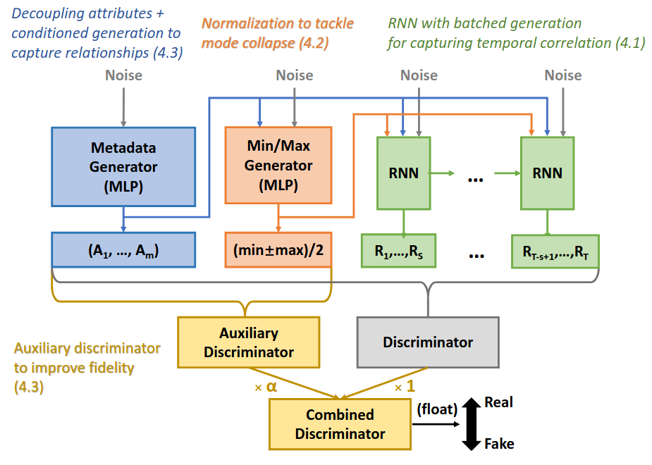
*Figura 1: Arquitetura da DoppelGANger com as principais técnicas aplicadas destacadas.*

A DoppelGANger é um modelo generativo adversarial para séries temporais, o qual compila diversas técnicas da literatura para adereçar diferentes problemas que GANs sofrem durante o treinamento, especificamente de séries temporais. As principais técnicas aplicadas são:
Separação de informações categóricas (denominados metadados e que não se alteram durante o tempo para uma mesma amostra) de informações temporais;
Geração de metadados como condicionamento da geração de dados temporais;
Uso de uma heurística de auto-normalização, onde cada amostra é normalizada individualmente pelo seu máximo e mínimo e esses parâmetros são aprendidos como metadados da amostra. Para isso, um gerador de máximo e mínimo é utilizado especificamente para a geração desses metadados sintéticos;
Geração da série temporal em batches condicionada pelos metadados. A rede recorrente utilizada para geração da série temporal fornece, a cada iteração, $s$ instantes de tempo, ao invés de somente 1, como tradicionalmente se utiliza as redes recorrentes;

A implementação do modelo está disponível na biblioteca Gretel Synthetics [[8]](#ref_8)

A configuração utilizada nos experimentos é a padrão, com os seguintes hiperparâmetros:
| Parâmetro| Valor|
|---|---|
|Dimensão do vetor de ruído | 10|
|Número de camadas gerados de metadados | 3|
|Tamanho das camadas do gerador de metadados | 100|
|Número de camadas LSTM para o gerador de série temporal | 1|
|Tamanho das camadas LSTM | 100|
|Range da normalização das amostras |[0, 1]|
|Coeficiente de penalidade do gradiente | 10.0|
|Coeficiente de ponderação do erro do discriminador auxiliar | 1.0|
Learning rate (gerador, discriminador auxiliar e discriminador) | 0.001|
|Beta 1 para Adam (gerador, discriminador auxiliar e discriminador) | 0.5|
|Batch size | 32|

### BioDiffusion [[9]](#ref_9)

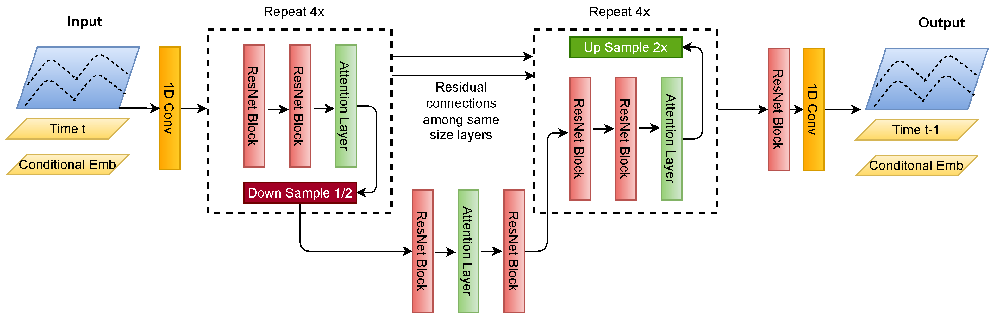
*Figura 2: Arquitetura U-Net modificada utilizada para o processo de difusão da arquitetura BioDiffusion*

O BioDiffusion é um modelo generativo de difusão para séries temporais multidimensionais de dados médicos. A arquitetura consiste em um modelo U-Net adaptado para séries temporais, onde camadas de convolução 1D são adicionadas no início e final do pipeline da rede. O modelo BioDiffusion pode ser utilizado com dados condicionados (presença de uma classe ou outro sinal ‘guia’) ou não-condicionados. 

A implementação utilizada é uma reprodução do código disponível no [repositório do artigo](https://github.com/imics-lab/biodiffusion).

A configuração utilizada nos experimentos é a padrão, com os seguintes hiperparâmetros:
| Parâmetro| Valor|
|---|---|
|Erro | L2|
|Scheduler de ruído | cosine|
|Total de passo de difussão | 1000|
|Otimizador | AdamW|
|Learning Rate | 0.0003|
|Número de canais Conv1D | 32 |
|Multiplicadores de número de canais por bloco | [1, 2, 4, 8, 8]|
|Camadas ResNet por bloco | 3|

### TimeGAN [[10]](#ref_10)

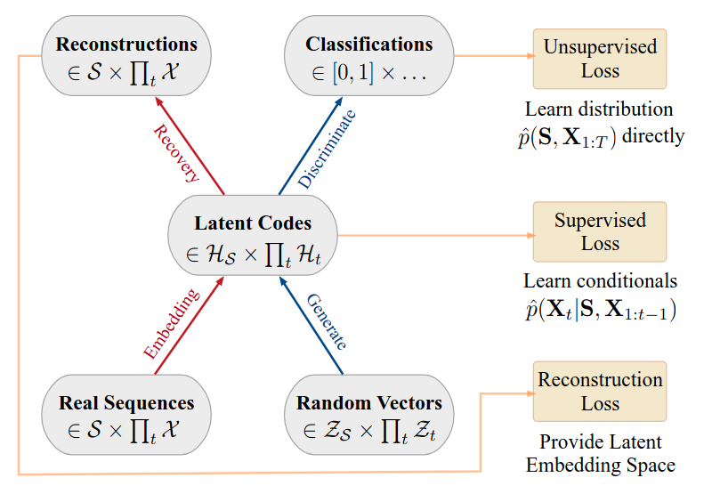
*Figura 3: Diagrama em blocos dos principais componentes e funções objetivos utilizados na arquitetura da TimeGAN*

A proposta apresentada pelo modelo TimeGAN é a união dos métodos de treinamento de GANs e modelos autorregressivos para o aprendizado de um espaço latente representativo. Amostras reais são representadas em espaço latente por um embeder e dados sintéticos também são gerados diretamente na dimensão do espaço latente. O discriminador é treinado com base nas representações dos dados projetados no espaço latente e um reconstrutor é treinado para recuperar os dados na representação original a partir de sua projeção no espaço latente. Por fim, uma tarefa de supervisão é treinada conjuntamente, cujo objetivo é prever o próximo instante de tempo de um dado, real ou sintético, que foi projetado para o espaço latente.

A implementação utilizada é uma reprodução do código disponível no [repositório do artigo](https://github.com/benearnthof/TimeGAN/).

### Bases de Dados

|Base de Dados | Endereço na Web | Resumo descritivo|
|----- | ----- | -----|
|KuHAR | https://data.mendeley.com/datasets/45f952y38r/5 | Dados de 90 participantes capturados de smartphones em 18 atividades diferentes. |
| RealWorld |https://www.uni-mannheim.de/dws/research/projects/activity-recognition/dataset/dataset-realworld/ | Dados de 15 participantes capturados de sensores IMU em 8 atividades diferentes.  Subdividido em dois datasets: RealWorld - Thigh e RealWorld - Arm, referentes as posições dos sensores nos participantes. |
| UCI | https://archive.ics.uci.edu/dataset/341/smartphone+based+recognition+of+human+activities+and+postural+transitions | Dados de 30 participantes capturados de smartphones em 6 atividades diferentes. |
| WISDM | https://archive.ics.uci.edu/dataset/507/wisdm+smartphone+and+smartwatch+activity+and+biometrics+dataset | Dados de 51 participantes capturados de smartphones e smartwatches em 18 atividades diferentes. |
| MotionSense | https://www.kaggle.com/datasets/malekzadeh/motionsense-dataset | Dados de 90 participantes capturados de smartphones em 18 atividades diferentes. |

Para este trabalho, utilizamos os conjuntos de dados fornecidos pela equipe da Meta 4 do grupo HIAAC, disponíveis em https://zenodo.org/records/11992126 . A versão balanceada destes conjuntos de dados foi denominada View Balanceada. Os dados foram balanceados de forma que todas as classes apresentassem o mesmo número de amostras, evitando que as diferentes proporções entre os rótulos afetassem a avaliação do desempenho. Essa abordagem visa garantir uma distribuição equitativa das classes, permitindo uma análise mais precisa das metodologias de avaliação implementadas para a geração de dados.
Adicionalmente, os subconjuntos de treino, teste e validação foram organizados de maneira que as amostras de um determinado participante não estivessem presentes em dois subconjuntos distintos. Essa estratégia é fundamental para evitar o vazamento de informações entre os conjuntos, assegurando que a validação do modelo seja realizada de forma justa e confiável.

#### Análise das Bases de Dados

Os conjuntos de dados padronizados das cincos bases foram explorados e comparados entre si.
O notebook presente no arquivo [`notebooks/Exploring datasets.ipynb`](https://github.com/brgsil/GenHAR/blob/main/projetos/GenHAR/notebooks/Exploring%20datasets.ipynb) apresenta o código utilizado para a comparação, e os resultados compilados podem ser acessados no arquivo [`reports/exploring all datasets.pdf`](https://github.com/brgsil/GenHAR/blob/main/projetos/GenHAR/reports/exploring%20all%20datasets.pdf).
As principais informações levantadas por essa exploração são:
- **Atividades Comuns**: Sentado, em pé e caminhando são atividades presentes em todos os datasets. Entretanto, o dataset UCI-HAR não possui a atividade ‘correndo’, enquanto o dataset WISDM não possui as atividades ‘subindo escada’ e ‘descendo escada’.
- **Separação de Clusters**: Nenhum dataset apresenta uma divisão clara de clusters na visualização da projeção t-SNE em duas dimensões. Porém, apesar da mistura entre os clusters, as diferentes classes de atividade estão em regiões específicas da projeção e não distribuídas uniformemente, indicando que existem características que distinguem os dados em suas respectivas classes.
- **Visualização Temporal**: As visualizações das amostras temporais dos sensores (acelerômetro e giroscópio) para cada classe revelam maior variação entre datasets para as classes ‘sentando’ e ‘em pé’, onde o comportamento das séries temporais não são semelhantes entre diferentes datasets.Porém, as classes ‘subindo escada’, ‘descendo escada’ e ‘correndo’ apresentam maior consistência ao comparar amostras de diferentes datasets.

### Avaliação dos Dados Sintéticos

#### Análise Qualitativa

- **Análise Visual por Amostragem Local e Global**: São realizadas análises visuais para comparar amostras locais e globais dos dados reais e sintéticos, ajudando a entender se o comporta aparente dos dados sintéticos se aproxima dos dados reais e não ocorre o colapso do modelo gerador, por exemplo, geração de sinais constantes ou ondas periódicas simples;
- **Redução de Dimensionalidade (t-SNE)**: A técnica de redução de dimensionalidade t-SNE é utilizada para visualizar a disposição relativa dos dados em um gráfico 2D, facilitando a comparação visual entre as distribuições de dados reais e sintéticos. Isso permite verificar de forma rápida e superficial se os dados sintéticos seguem a distribuição dos dados reais e formam clusters semelhantes.

#### Análise Quantitativa

- **Similaridade entre distribuições**: NNessa abordagem é escolhida uma métrica de distância entre amostras e compara-se a distância média entre amostras de três pares de conjuntos diferentes: dois sub-conjuntos de dados reais sem intersecção (R2R); dados reais e dados sintéticos (R2S); dois conjuntos de dados sintéticos sem intersecção(S2S). Com isso, espera-se que o valor R2R seja próximo ao de R2S, indicando uma distribuição semelhante de dados, o valor de S2S serve para verificar que o gerador não colapsou, o que causaria valores de distância baixos. Por fim, também é obtido o menor valor de distância entre amostras dos conjuntos real e sintético (Min-R2S), o qual espera-se ser baixo, porém não nulo, pois isso indicaria que dados reais estão sendo copiados para o conjunto de dados sintéticos. Diferentes métricas de distância são exploradas:
  - Distância Euclidiana
  - Dynamic Time Warping
  - Distância de Cosseno
  - Distância de Minkowski (norma 3)

#### Análise de Usabilidade

- **Usabilidade para classificação**: Nessa avaliação, para um dado conjunto de dados sintéticos gerados por um modelo, três classificadores são treinados: somente com os dados reais, somente com dados sintéticos e com dados reais e sintéticos juntos. As três instâncias de classificadores são testadas em um mesmo conjunto de dados reais e espera-se que o modelo sintético tenha desempenho comparável ao de dados reais e ainda que o classificador treinado com dados conjuntos se desempenhe melhor do que o classificador com dados reais. Para essa comparação são utilizadas as métricas de acurácia, precisão, recall e f1-score.
  
### Workflow

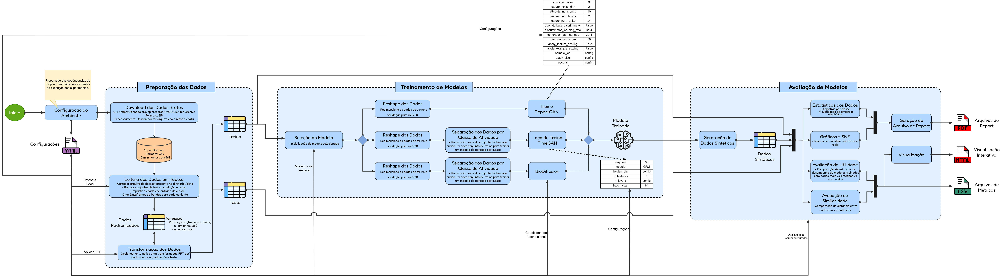
*Figura 4: Diagrama de atividades para o Workflow dos experimentos do projeto*

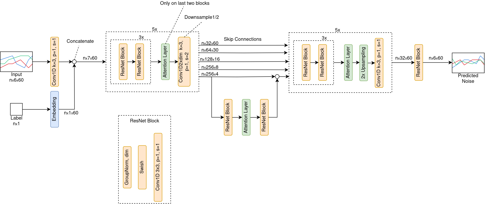

*Figura 5: Diagrama da arquitetura BioDIffusion implementada*

#### Configuração do Ambiente

- Instalação de requisitos:
  - Python versão `3.9`,`3.10`
  - É recomendado o uso de um ambiente virtual do python (`venv` ou `conda`)
  - Instalação de dependências `pip install -r requirements.txt`
- Definir as configurações principais para realização do experimento em um arquivo YAML. Os arquivos de configuração são armazenados no diretório `/tests`. Um arquivo de configuração define:
  - Datasets a serem utilizados;
  - Transformações aplicadas sobre todos dados carregados;++
  - Modelos a serem treinados e seus parâmetros (a depender do modelo);++
  - Avaliações a serem realizadas;
  - Diretórios onde serão salvos os dados sintéticos e Arquivos de Report;
- Definição manual das seeds de geração aleatória dos diferentes frameworks utilizados (PyTorch, NumPy e Random).

#### Preparação dos Dados

- Download do repositório de dados padronizados do DAGHAR [6], caso não exista no diretório `/data`;
- Leitura dos dados referente aos datasets selecionados no arquivo de configuração YAML;
  - Cada amostra consiste de 60 instantes de tempo dos sensores de acelerômetro (eixos x, y e z) e giroscópio (eixos x, y e z) e uma classe de atividade;
  - O conjunto de dados é organizado em uma tabela com uma amostra por linha e 361 dados por amostra (6 eixos x 60 instantes de tempo + 1 classe)
- Se definido no arquivo de configuração, é aplicada uma transformação nos dados (no momento, nenhum experimento é realizado com transformações de dados)

#### Treinamento de Modelos

- O modelo definido pelo arquivo de configuração é inicializado e treinado. A sequência de operações dessa etapa depende do modelo selecionado:
- DoppelGAN [[7]](#ref_7)
  - Os dados possuem dimensões (n_amostras, 361) e são organizados para um `np.array` de tamanho (n_amostras, 6, 60) contendo os dados das séries temporais e um `np.array` tamanho (n_amostras, ) com as classes das amostras;
  - A implementação da DGAN da biblioteca Gretel Synthetics [10] é utilizada para treinamento do modelo. As opções de configuração são apresentadas no workflow detalhado (Figura 5);
- TimeGAN [[10]](#ref_10)
  - Os dados possuem dimensões (n_amostras, 361) e são organizados para um `np.array` de tamanho (n_amostras, 6, 60) contendo os dados das séries temporais e um `np.array` tamanho (n_amostras, ) com as classes das amostras;
  - Os dados são separados por classe e é treinado um modelo TimeGAN incondicional por classe, ou seja, obtêm-se 6 diferentes modelos TimeGAN, cada um treinado para gerar dados de uma classe de atividade diferente;
  - A implementação da TimeGAN da biblioteca TSGM [[11]](#ref_11) é utilizada para treinamento do modelo. As opções de configuração são apresentadas no workflow detalhado (Figura 5);
- BioDiffusion [[9]](#ref_9):
  - Os dados possuem dimensões (n_amostras, 361) e são organizados para um `np.array` de tamanho (n_amostras, 6, 60) contendo os dados das séries temporais e um `np.array` tamanho (n_amostras, ) com as classes das amostras;
   - O modelo treinado pode ser incondicional ou condicional em relação as classes da amostra:
     - Incondicional: Os dados são separados por classe e é treinado um modelo BioDiffusion incondicional por classe, ou seja, obtêm-se 6 diferentes modelos BioDiffusion, cada um treinado para gerar dados de uma classe de atividade diferente;
     - Condicional: As classes dos dados são fornecidas ao modelo durante o treinamento junto das amostras. Então, as classes são codificadas em vetores de embedding para condicionar o modelo durante o processo de difusão, dessa forma, somente um modelo é treinado para representar todas as classes de dados;
  - A implementação do (repositório de referência do artigo)[https://github.com/imics-lab/biodiffusion/tree/main] foi reproduzido para o treinamento do modelo BioDiffusion e uma normalização por média e desvio padrão é aplicada nos dados de treino antes de serem passados para o modelo. Os parâmetros de normalização para cada classe são salvos para aplicação nos dados sintéticos gerados pelo modelo;

#### Avaliação de Modelos

- O modelo treinado é utilizado para gerar um conjunto de dados sintéticos;
- Os conjuntos de dados de treino, teste e sintéticos são passados para diferentes técnicas de avaliação selecionadas no arquivo de configuração;
- Estatísticas dos Dados:
  - Avaliação do conjunto de treino e/ou sintético;
  - Gera gráficos para:
    - Número de amostras por classe;
    - Projeção dos dados em 2 dimensões utilizando t-SNE;
    - Amostras aleatórias para cada classe separados por acelerômetro e giroscópio;
- Gráficos t-SNE:
  - Comparação das projeções dos conjuntos de treino e sintético:
    - Projeção conjunta de todos dados de treino e teste, identificando cada categoria. Previamente a projeção todos os dados são normalizados para média 0 e desvio padrão 1;
    - Projeção conjunta dos dados de treino e sintéticos separados por classe. Previamente a projeção todos os dados são normalizados para média 0 e desvio padrão 1;
- Avaliação de Utilidade:
  - Modelos de aprendizado de máquina para classificação são utilizados para comparar a utilidade dos dados sintéticos em auxiliar na melhoria da performance da classificação.
  - Para cada tipo de modelo (no momento são testados SVM e Random Forest), três classificadores são treinados e então avaliados no conjunto de teste:
    - Um classificador treinado com o conjunto de treino;
    - Um classificador treinado com o conjunto sintético;
    - Um classificador treinado com os conjuntos de treino e sintético;
  - Para cada classificador é reportados a acurácia, precisão, recall e pontuação f1;
- Avaliação de Similaridade:
  - São computadas os valores de distância entre dados reais com reais (R2R), sintéticos com reais (R2S) e sintéticos com sintéticos (S2S), utilizando as métricas:
    - Distância Euclidiana
    - Dynamic Time Warping
    - Distância de Cosseno	
    - Distância de Minkowski (norma 3)


### Descrição dos Diretórios

```
GenHar/
│
├── docs/           	# Documentação do projeto
│   ├── instalação.md   # Instruções de instalação
│   └── tutorial.md 	# Tutoriais e guias de uso
│
├── src/            	# Código-fonte principal do projeto
│   ├── __init__.py 	# Indica que este é um pacote Python
│   ├── main.py     	# Script principal do projeto
│   ├── utils.py    	# Módulos de utilidades
│   ├── data_processor/    	# Pacotes para leitura e processamento dos datasets
│   │   ├── __init__.py
│   │   ├── data_read.py
│   │   ├── data_transform.py
│   │   ├── download_dataset.py
│   │   └── standartized_balanced.py
│   ├── eval/    	# Pacotes para avaliação dos datasets
│   │   ├── __init__.py
│   │ 	├── evaluator.py ### módulo principal para avaliação
│   │ 	├── dataset_eval.py ## avalia só um dataset
│   │ 	├── real_synthetic_eval.py ##  compara o dataset real e o gerado
│   │ 	└── machine_learning.py ##  avalia com modelos de classificação 
│   ├── models/   # contém os modelos e os arquivos necessários para a geração
│   │ 	├── __init__.py
│   │   ├── data_generate.py  ## módulo principal para a geração
│   │   ├── gans ## contém os modelos das gans
│   │   └── diffusion ## contém os modelos do diffusion
│   └── utils/    	# Pacotes para leitura e processamento dos datasets
│   	  ├── __init__.py
│   	  ├── dataset_utils.py
│   	  ├── model_utils.py
│   	  └── report_utils.py
│
├── tests/          	# Testes automatizados
│   ├── diffusion	# Testes para o modelo diffusion
│   └── gans
├── data/           	# Dados utilizados no projeto
│   ├── baseline_view/        	# Dados brutos (não processados)
│   ├── standarized_view/        	# Dados brutos (não processados)
│   ├── synthetic/  	# Dados gerados
│   └── README.md   	# Descrição sobre os dados
│
├── .gitignore      	# Arquivos e diretórios a serem ignorados pelo Git
├── README.md       	# Documentação principal do projeto
└── requirements.txt	# Lista de dependências do projeto
```


### Ferramentas Utilizadas

|Ferramenta| Uso|
|---|---|
|Python| Linguagem de programação utilizada para implementação de todos os códigos|
|NumPy| Manipulação dos dados|
|PyTorch| Definição e treinamento do modelo BioDiffusion|
|Scikit Learn| Projeção de dados com t-SNE, treinamento de classificadores para métricas de utilidade e normalização de dados|
|Matplotlib| Geração de gráficos para comparação de amostras e histogramas|
|Gretel Synthetics| Implementação e treinamento do modelo DoppelGAN|
|Pandas| Manipulação, leitura e escrita de conjuntos de dados|
|Seaborn| Geração de gráficos para dados projetados por t-SNE|
|TSGM| Implementação e treinamento do modelo TimeGAN|


## Experimentos, Resultados e Discussão dos Resultados

Esta seção descreve os experimentos realizados para comparar dados reais e sintéticos gerados a partir de múltiplos datasets de sensores. Os dados foram coletados de dispositivos que capturam leituras de acelerômetro e giroscópio, e os modelos generativos aplicados foram projetados para criar séries temporais sintéticas com características semelhantes às dos dados reais. O objetivo principal é avaliar a qualidade, fidelidade e utilidade dos dados gerados.

Os quatro modelos descritos anteriormente (TimeGAN, DoppelGAN e BioDiffusion Não-condicionado e Condicionado) são treinados separadamente em cada base de dados seguindo o workflow de experimento descrito anteriormente, totalizando 15 diferentes modelos treinados.
O arquivo de configuração que define todos os experimentos de forma conjunta pode ser encontrado em:
  - [`tests/all/all_config.yaml`](https://github.com/brgsil/GenHAR/blob/main/projetos/GenHAR/tests/all/all_config.yaml)

### Execução dos experimentos

Os passos a seguir descrevem como executar os experimentos. Para reproduzir os experimentos, é necessário ter Python versão 3.9 instalado.

 1. Clonar o repositório em um diretório local e acessar a pasta do projeto
```shel
git clone https://github.com/brgsil/GenHAR
cd GenHAR/projetos/GenHAR
```
2. Criar um ambiente virtual python e ativá-lo
```shel
python -m venv .venv
source .venv/bin/activate
```
3. Instalar dependências
```shel
pip install -r requirements.txt
```
4. Executar experimentos
```shel
python src/main.py --config tests/all/all_config.yaml --generate --eval
```

Os experimentos executados treinam um modelo de cada tipo para cada dataset. Os tipos de modelos são o BioDiffusion condicionado (um modelo para gerar dados de todas as categorias de atividades), BioDiffussion não-condicionado (um modelo de geração por categoria de atividade), DoppelGAN (um modelo para todas as categorias) e TimeGAN (um modelo por categoria). O gŕafico da Figura abaixo apresenta o tempo de treinamento total de cada tipo de modelo para todos os datasets. 

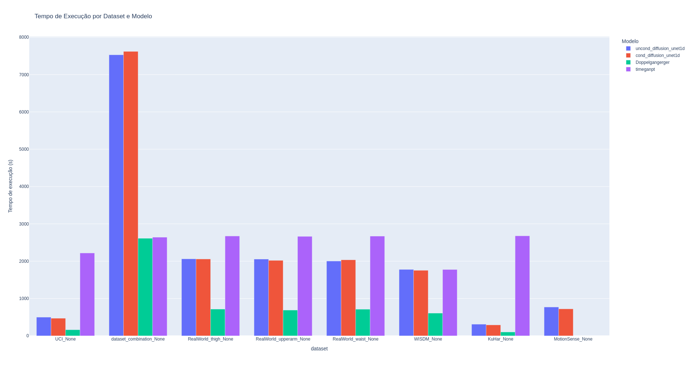

*Figura 6: Tempo de treinamento combinado dos modelos para todos datasets*

A seguir são apresentados os resultados obtidos nos experimentos. Todos os dados podem ser visualizados a partir de um dashboard para navegadores web. Após clonar o repósitório e intalar as depêndencias necessárias, conforme os passos 1. a 3. indicados anteriormente, pode-se inicializar o dashboard com o seguinte comando:
```shel
python src/main.py --config tests/all/all_config.yaml --visualize
```

### Resultados e Discussões

**Projeção t-SNE dos dados**
Abaixo são apresentadas as projeções em t-SNE dos dados reais e sintéticos dos quatro modelos implementados após serem treinados em cada conjunto de dados. Cada coluna da tabela corresponde a um dataset de treino e cada linha representa a arquitetura do modelo treinado neste dataset.


*Figura 7: Projeção t-SNE de dados reais e sintéticos para cada modelo treinado por dataset.*

Semelhantemente, foi realizada a projeção t-SNE dos dados sintéticos e reais para cada uma das classes dos datasets de forma independente. A tabela abaixo apresenta os gráficos obtidos para a classe ‘sentado’ em cada dataset e modelo.

| Dataset | BioDiffusion Não-condicionado | BioDiffusion Condicionado | DoppelGAN | TimeGAN|
|---|---|---|---|---|
|KuHAR| 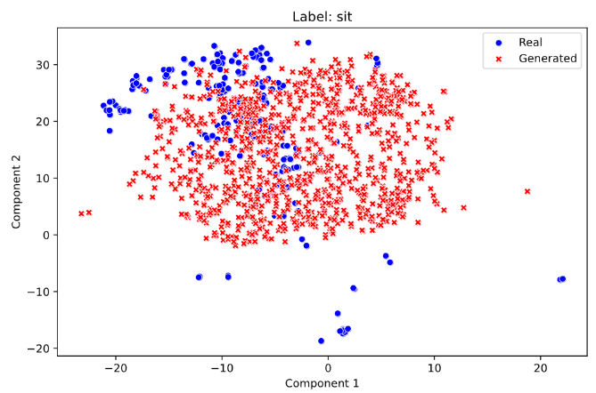| 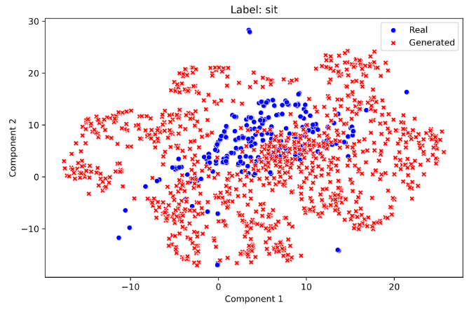 | 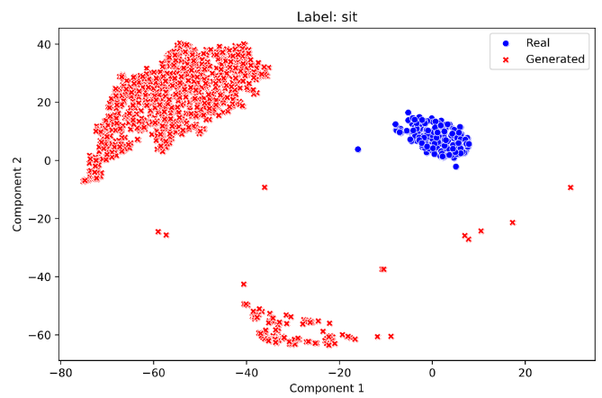 | 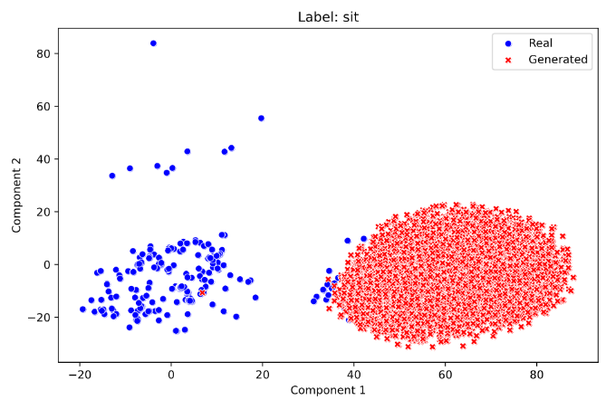 | 
|MotionSense|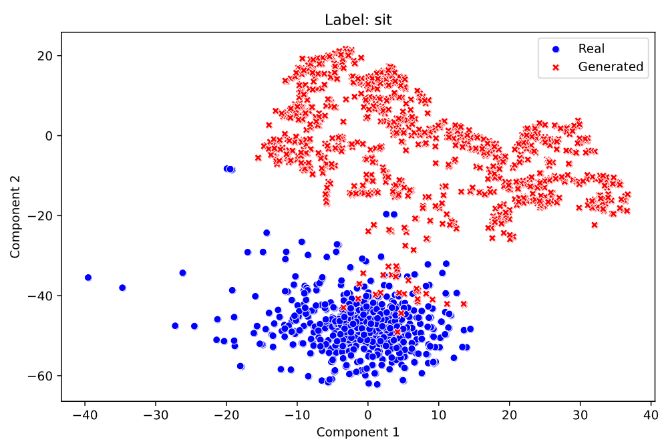 | 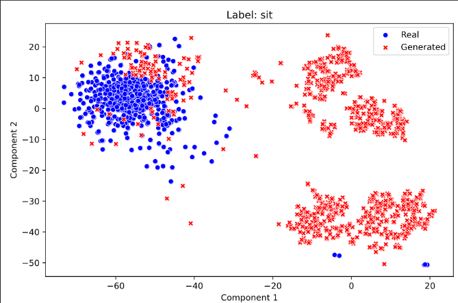 | 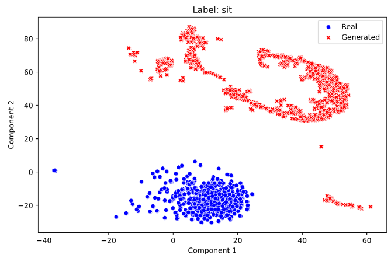 | 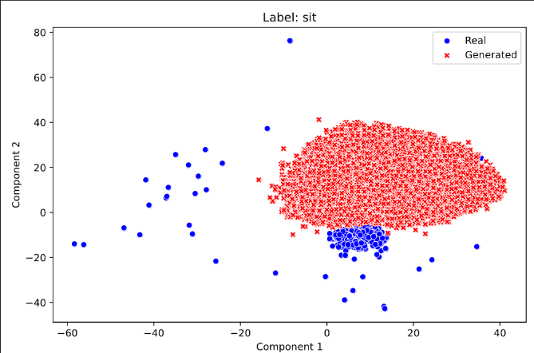 | 
|RealWorld - Thigh|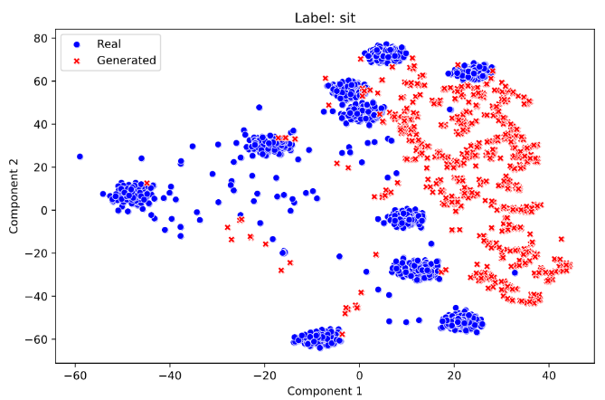 | 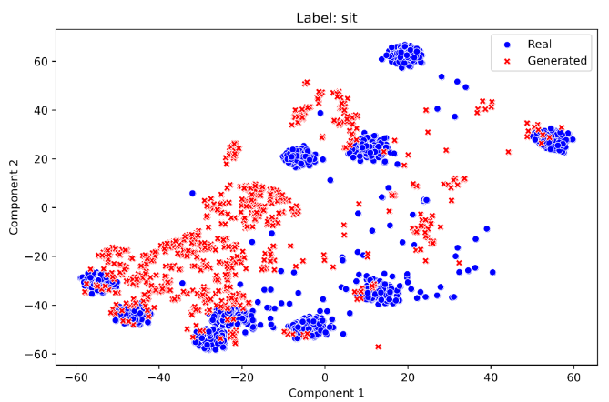 |  |  | 
|RealWorld - Arm|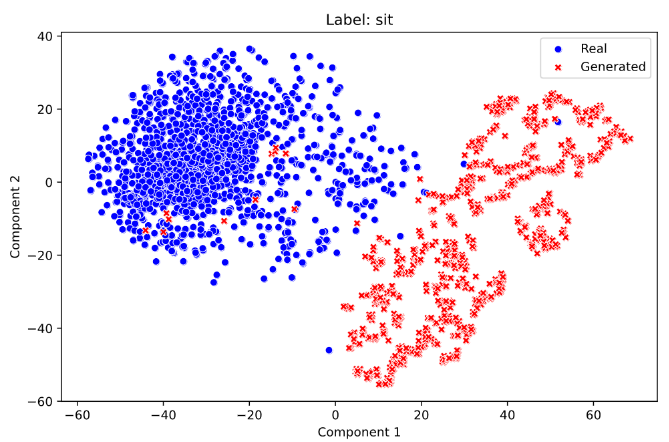 |  | 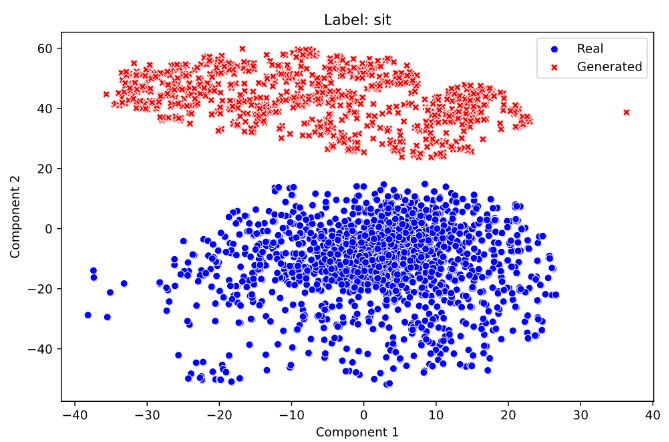 | 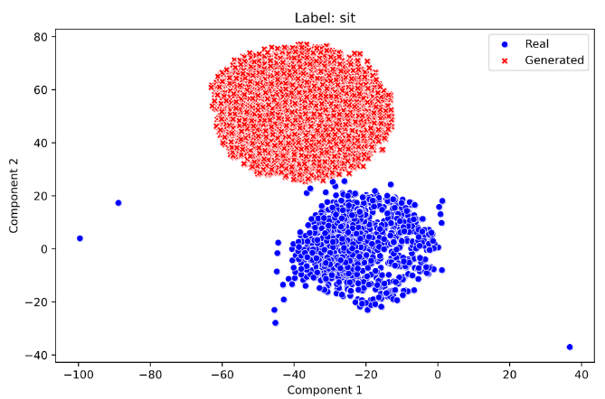 | 
|UCI| | 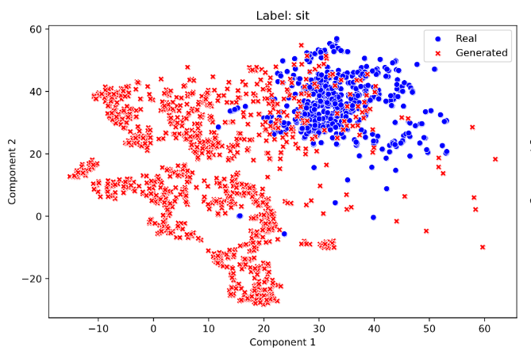 | 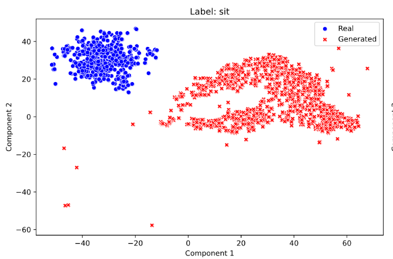 | 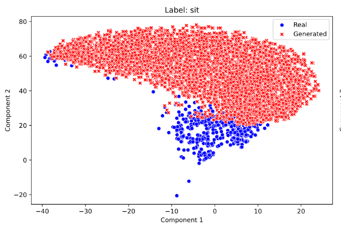 | 
|WISDM|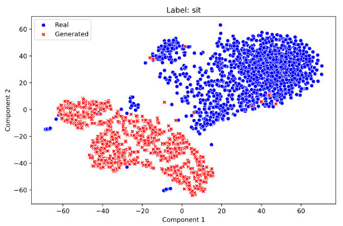 | 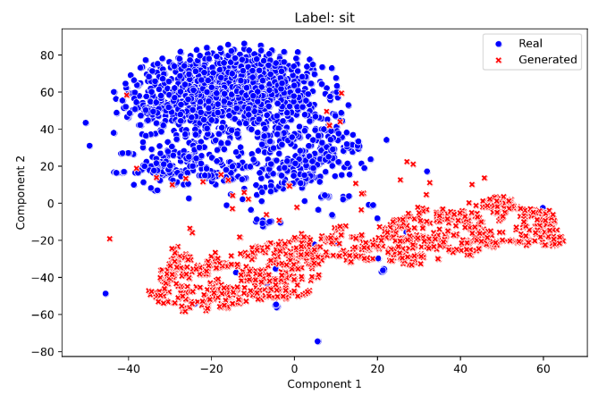 | 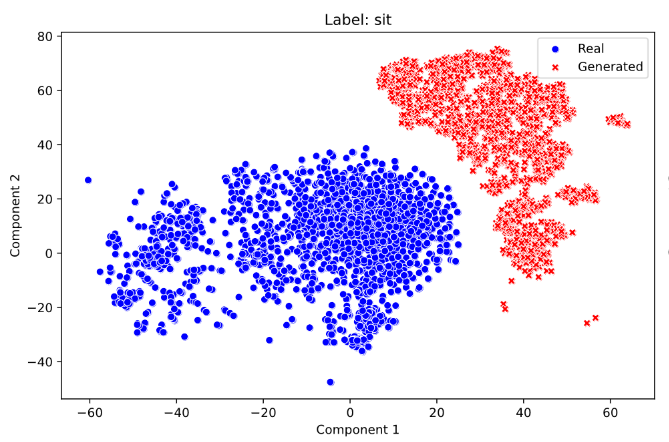 | 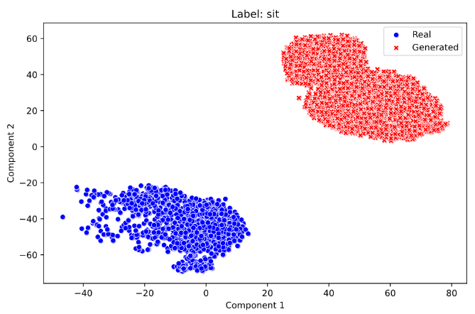 | 
|Combined| |  | 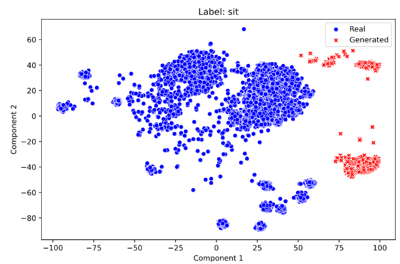 |  | 

As projeções t-SNE apresentadas revelam que os dados gerados pelos modelos TimeGAN e DoppelGAN são muito dissimilares aos dados reais para todos os datasets, formando clusters sem intersecção com os dados reais. Isso mostra que os modelos não foram adequados para gerar os dados de sensores desejados somente com a aplicação direta dos mesmos no domínio desejado. Por outro, lado os modelos BioDiffusion conseguiram se aproximar mais da distribuição dos dados reais e em alguns datasets até mesmo ter interseção dos clusters, mostrando uma opção mais adequada para o domínio de dados estudados. 

**Amostragem Global**

Para cada conjunto de dados sintéticos gerados pelos modelos treinados, foram selecionadas aleatoriamente algumas amostras e visualizadas como séries temporais em um gráfico. As Figuras abaixo apresentam uma amostra da categoria 'caminhando' do dataset KuHAR comparadas com amostras sintéticas dos modelos treinados no mesmo dataset. Pode-se claramente ver que os modelos DoppelGAN e TimeGAN conseguem reproduzir alguns aspectos gerais das formas de onda ao variar a amplitude do sinal, porém expriem padrões de ondas repetidos sem a complexidade presente nos dados reais. Por outro lado, os modelos BioDiffusion Condicionado e Não-condicionado geram amostras com características mais realistas, com picos no sinal em períodos semelhantes ao dos dados reais.

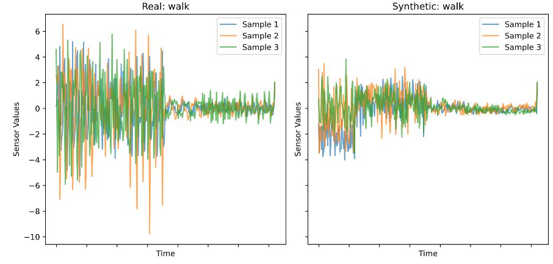

*Figura 8: Exemplos de amostras reais e sintéticas para o modelo BioDiffusion Condicionado no dataset KuHAR*

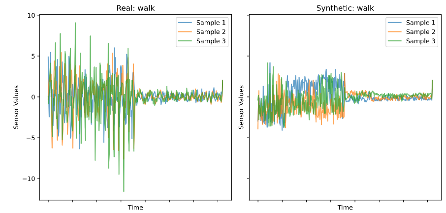

*Figura 9: Exemplos de amostras reais e sintéticas para o modelo BioDiffusion Não-condicionado no dataset KuHAR*

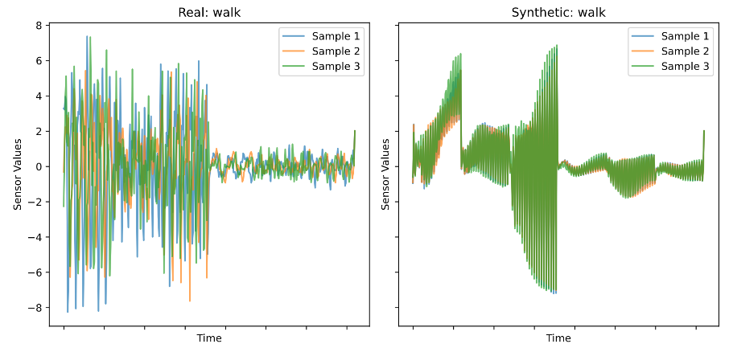

*Figura 10: Exemplos de amostras reais e sintéticas para o modelo DoppelGAN no dataset KuHAR*

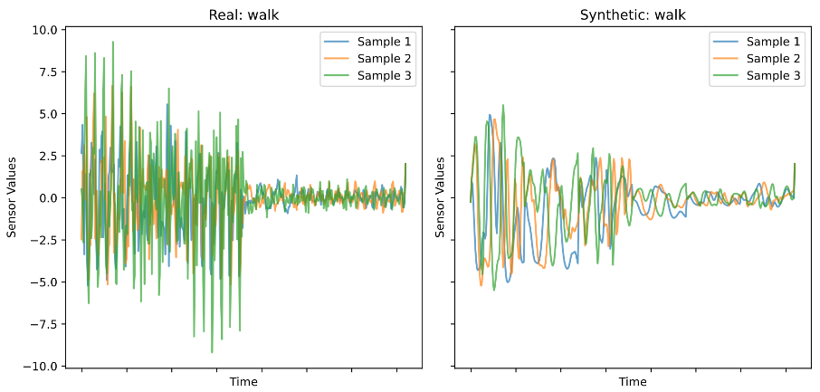

*Figura 11: Exemplos de amostras reais e sintéticas para o modelo TimeGAN no dataset KuHAR*

**Similaridade entre Distribuições**

As Tabelas 1, 2, 3 e 4 apresentam os valores de similaridade R2R, R2S, S2S e Max-R2S para cada métrica e cada dataset obtidos entre os dados reais e os conjuntos de dados sintéticos obtidos pelos modelos BioDiffusion Não-condicionado, BioDiffusion Condicionado, DoppelGAN e TimeGAN respectivamente.

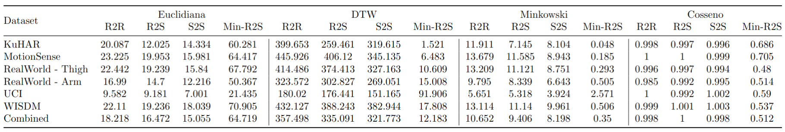

*Tabela 1: Resultados de métricas de similaridade para cada dataset em relação ao conjunto de dados sintéticos obtidos pelo modelo BioDiffusion Não-condicionado.*

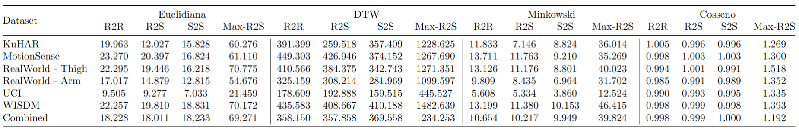

*Tabela 2: Resultados de métricas de similaridade para cada dataset em relação ao conjunto de dados sintéticos obtidos pelo modelo BioDiffusion Condicionado.*

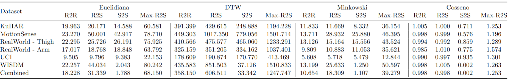

*Tabela 3: Resultados de métricas de similaridade para cada dataset em relação ao conjunto de dados sintéticos obtidos pelo modelo DoppelGAN.*

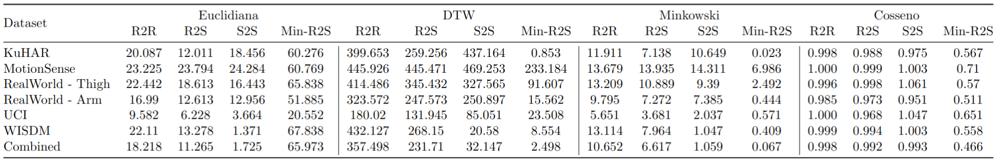

*Tabela 4: Resultados de métricas de similaridade para cada dataset em relação ao conjunto de dados sintéticos obtidos pelo modelo TimeGAN.*

A análise dos resultados nas tabelas acima mostram algumas características interessantes quanto às métricas e o desempenho dos modelos. Primeiramente, pode-se notar que a métrica de distância do cosseno não revela muita informação sobre a qualidade dos dados sintéticos, pois a diferença entre os valores de distância média real para real (R2R) e real para sintético (R2S) não variam muito, mesmo quando outras métricas de distância apresentam variações consideráveis. Por exemplo, na primeira linha da Tabela 4 para o modelo TimeGAN no dataset KuHAR, as variações dos valores R2R e R2S para as métricas de distância euclidiana, DTW e distância de Minkowski são de 40%, 34% e 39% respectivamente, enquanto a variação para a métrica de distância de cosseno é de somente 1.8%.

De maneira geral, os modelos apresentam valores de distância R2R e R2S similares, indicando que o comportamento da variação dos dados são próximos e valores S2S levemente menores do que o R2R, mostrando que os dados sintéticos possuem variabilidade semelhantes aos dados reais e os modelos não colapsaram para a geração de dados repetidos. Contrário a esses resultados, destaca-se o modelo DoppelGAN, o qual apresenta valores de distância R2S maiores que as R2R em quase todos os datasetes e métricas de distância, indicando um afastamento dos dados sintéticos em relação aos dados reais, o que é reforçado pela visualização da projeção t-SNE dos dados mostrado na Figura 7.

Por fim, nenhum modelo apresentou uma distância mínima R2S nula, indicando que não há a cópia de dados reais no conjunto sintético, porém alguns modelos apresentam distâncias muito baixas para métrica DTW indicando que pode haver um pouco de vazamento de dados do conjunto real para o sintético o que pode acarretar em problemas de privacidade dos dados coletados.

**Análise de Usabilidade**

Nas Tabelas 5 e 6 são apresentados os valores de f1-score para modelos Random Forest e SVM, respectivamente, treinados com dados reais (R), dados sintéticos (S) ou dados sintéticos e reais juntos (M) de cada dataset e conjunto de dados sintéticos. 

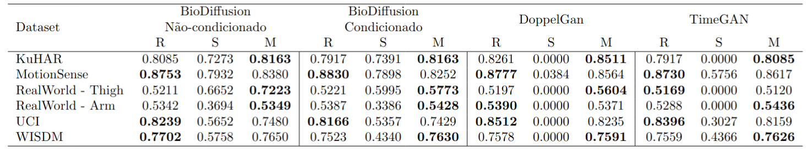

*Tabela 5: Valores de f1 para modelos Random Forest treinados em dados reais (R), sintéticos (S) ou combinados (M) e avaliados no conjunto de teste real.*

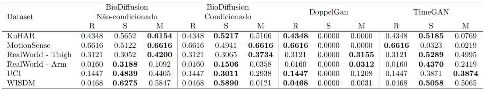

*Tabela 6: Valores de f1 para modelos SVM treinados em dados reais (R), sintéticos (S) ou combinados (M) e avaliados no conjunto de teste real.*

De forma geral, observa-se que os modelos BioDiffusion capturam melhor a diferença entre as categorias de dados presentes nos datasets, sendo que classificadores treinados em seus dados sintéticos possuem um desempenho próximo ou superior aos classificadores treinados com dados reais. O modelo DoppelGAN apresenta desempenho baixíssimo em todos os testes, porém os classificadores Random Forest com dados combinados apresentam pouca diferença de performance em comparação aos treinados somente com dados reais, mostrando que por devido aos dados sintéticos serem muito diferentes dos reais, o classificador consegue separar as regiões dos dados sintéticos ruidosos das regiões dos dados reais e manter o desempenho, porém o mesmo não ocorre de forma consistente com classificadores SVM.

## Conclusão

Este projeto realiza a adaptação e comparação de modelos de geração de séries temporais para dados de sensores de acelerômetro e giroscópio voltados para tarefa de reconhecimento de atividades humanas. São utilizados dados de 5 datasets diferentes, os quais são padronizados e balanceados segundo a metodologia do benchmark DAGHAR [[6]](#ref_6).

Quatro modelos generativos foram implementados e avaliados: TimeGAN, DoppelGANger e BioDiffusion Condicionado e BioDiffusion Não-condicionado. Esses modelos utilizam diferentes técnicas de geração de dados e melhorias do processo de treinamento específicas para séries temporais. Os resultados mostram que a adaptação direta dos modelos TiemGAN e DoppelGANger para dados de sensores HAR não é capaz de capturar adequadamente a distribuição dos dados reais, gerando amostras sintéticas não representativas do comportamento real. Em contrapartida, a aplicação direta do modelo BioDiffusion foi capaz de gerar dados razoáveis, gerando dados sintéticos com distribuição qualitativamente semelhante aos dados reais e úteis para a melhoria de classificadores em alguns datasets.

Trabalhos futuros incluem explorar o espaço de hiperparâmetros dos modelos implementados de forma a melhorar a qualidade dos dados sintéticos gerados, implementar e avaliar outras formas de condicionamento dos modelos a partir de características estatísticas dos dados (média, variância, curtose, etc.) e/ou informações extras dos datasets como identificação do usuário.

## Referências Bibliográficas

<a name='ref_1'>[1]</a> Malekzadeh, M., Clegg, R.G., Cavallaro, A. and Haddadi, H., 2019, April. Mobile sensor data anonymization. In Proceedings of the international conference on internet of things design and implementation (pp. 49-58)

<a name='ref_2'>[2]</a> Sikder, N. and Nahid, A.A., 2021. KU-HAR: An open dataset for heterogeneous human activity recognition. Pattern Recognition Letters, 146, pp.46-54

<a name='ref_3'>[3]</a> Sztyler, T. and Stuckenschmidt, H., 2016, March. On-body localization of wearable devices: An investigation of position-aware activity recognition. In 2016 IEEE international conference on pervasive computing and communications (PerCom) (pp. 1-9). IEEE

<a name='ref_4'>[4]</a> Reyes-Ortiz, J.L., Oneto, L., Samà, A., Parra, X. and Anguita, D., 2016. Transition-aware human activity recognition using smartphones. Neurocomputing, 171, pp.754-767

<a name='ref_5'>[5]</a> Weiss, G.M., Yoneda, K. and Hayajneh, T., 2019. Smartphone and smartwatch-based biometrics using activities of daily living. Ieee Access, 7, pp.133190-133202

<a name='ref_6'>[6]</a> Oliveira Napoli, O., Duarte, D., Alves, P., Hubert Palo Soto, D., Evangelista de Oliveira, H., Rocha, A., Boccato, L., & Borin, E. (2024). DAGHAR: A Benchmark for Domain Adaptation and Generalization in Smartphone-Based Human Activity Recognition [Data set]. Zenodo. https://doi.org/10.5281/zenodo.11992126

<a name='ref_7'>[7]</a> Zinan Lin, Alankar Jain, Chen Wang, Giulia Fanti, and Vyas Sekar. 2020. Using GANs for Sharing Networked Time Series Data: Challenges, Initial Promise, and Open Questions. In Proceedings of the ACM Internet Measurement Conference (IMC '20). Association for Computing Machinery, New York, NY, USA, 464–483. https://doi.org/10.1145/3419394.3423643

<a name='ref_8'>[8]</a> Gretel Synthetics. Disponível em: https://synthetics.docs.gretel.ai/en/stable/ 

<a name='ref_9'>[9]</a> Li X, Sakevych M, Atkinson G, Metsis V. BioDiffusion: A Versatile Diffusion Model for Biomedical Signal Synthesis. Bioengineering. 2024; 11(4):299. https://doi.org/10.3390/bioengineering11040299 

<a name='ref_10'>[10]</a> Yoon, Jinsung and Jarrett, Daniel and van der Schaar, Mihaela. Time-series Generative Adversarial Networks. Advances in Neural Information Processing Systems, 2019. https://papers.nips.cc/paper_files/paper/2019/hash/c9efe5f26cd17ba6216bbe2a7d26d490-Abstract.html

<a name='ref_11'>[11]</a> Time Series Generative Modeling. Disponível em: https://tsgm.readthedocs.io/en/latest/index.html
