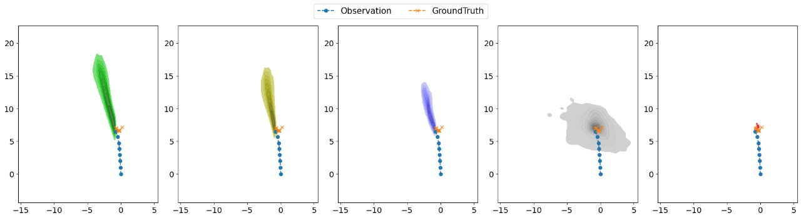
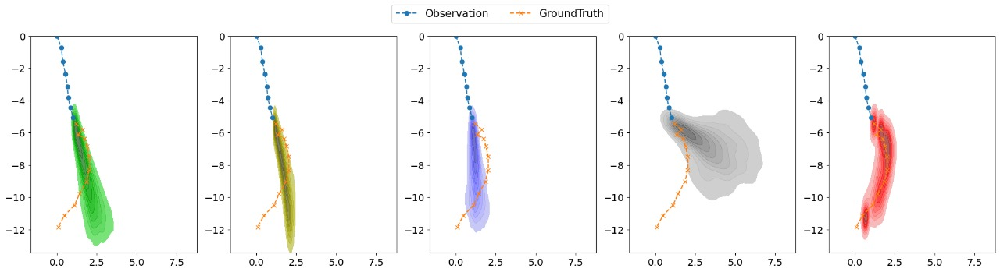
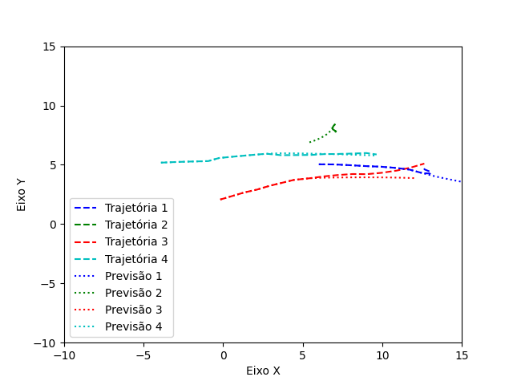
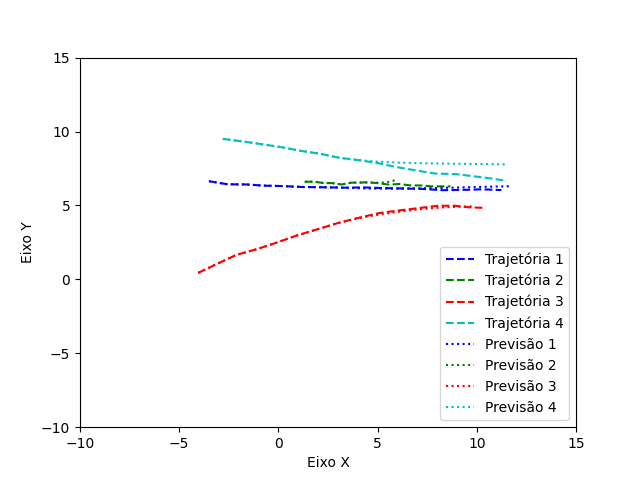
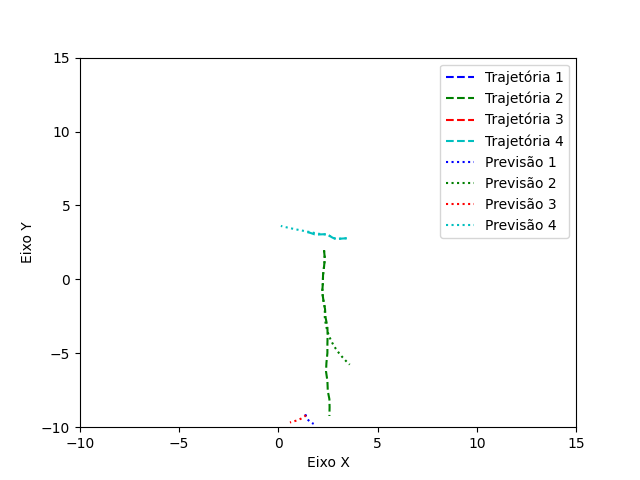
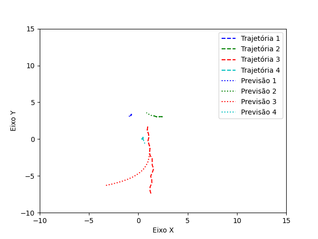
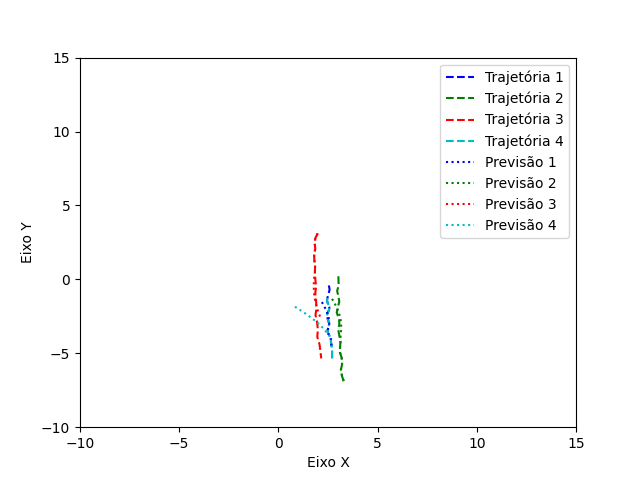

# `<Redes Adversárias Generativas Sociais: Geração de Amostras Futuras para Predição da Trajetória Humana em Espaços Populados>`

## Apresentação

O presente projeto foi originado no contexto das atividades da disciplina de pós-graduação *IA376N - IA generativa: de modelos a aplicações multimodais*, 
oferecida no segundo semestre de 2024, na Unicamp, sob supervisão da Profa. Dra. Paula Dornhofer Paro Costa, do Departamento de Engenharia de Computação e Automação (DCA) da Faculdade de Engenharia Elétrica e de Computação (FEEC).

> |Nome  | RA | Especialização|
> |--|--|--|
> | Hiuri Santana de Noronha  | 229961  | Eng. Eletricista|
> | Thiago Belina Silva Ramos  | 203975  | Eng. Eletricista|
> 

## Descrição do Problema e Motivação

A predição de trajetórias humanas em ambientes densamente populados é uma aplicação em potencial para soluções futurísticas,como sistemas autônomos em veículos e robôs sociais, possibilitando a interação com pessoas e com o meio externo social de forma segura, eficiente e socialmente aceita. A princípio, os modelos devem ter a capacidade de avaliar o ambiente e prever, com um alto grau de confiabilidade e precisão, as trajetórias futuras de pedestres e veículos de todo tipo a fim de evitar colisões ou acidentes envolvendo pessoas. Entretanto, modelar um comportamento socialmente compatível é uma tarefa complexa pois leva em conta uma série de desafios que devem ser sintetizados a fim de que modelos profundos possam compreender o processo implícito das interações sociais que existem entre os seres humanos e que são completamente desconhecidas, análogo à uma distribuição desconhecida ***p'(x)*** que modela o comportamento humano em interações sociais.

Nesse contexto, a literatura técnica tem mostrado que as Redes Adversariais Generativas Sociais (S-GANs) surgem como uma solução de modelagem do comportamento humano em predição de trajetória de pedestres com a capacidade de capturar as incertezas do movimento, gerar múltiplos cenários a partir de amostras multimodais, e gerar amostras sintéticas socialmente aceitáveis que predizem como se dará a interação entre diversas pessoas em um espaço populado. Portanto, a fim de extrair as nuançes da distribuição desconhecida das interações humanas em espaços populados, nas S-GANs, introduziram-se diversos mecanismos de redes neurais profundas que possibilitam modelar as dinâmicas do comportamento social, com a introdução de embeddings e subestruturas de *variational autoencoders* (VAEs), que resultam na estrutura conhecida por S-GAN.

Portanto, a motivação para realização deste trabalho surge do desejo de compreender tal área de pesquisa para possiveis aplicações futuras considerando a segurança das pessoas, a modelagem de comportamentos socialmente aceitáveis, a modelagem de distribuições implícitas e de modelos profundos multimodais, cujas aplicações são diversas desde robótica social (robôs humanoides), *smart cities*, e sistemas inteligentes de transporte (ITS).

 A figura 1 mostra de forma simplificada e ilustrativa como se dá o processo de predição da trajetória humana em espaços populados, cujas linhas sólidas (azul, vermelha e verde) são a representação do caminho real percorrido pelo pedestre e as linhas tracejadas são a representação de amostras sintéticas multimodais (espaço-tempo) geradas a partir do modelo profundo livres de colisão.

>Figura 1: Exemplo de predição de trajetória humana em ambientes populados. Fonte: *Safety-Compliant Generative Adversarial Networks for Human Trajectory Forecasting (Parth Kothari and Alexandre Alahi, 2023)* [1].

> A seguir consta o link para a apresentação em slides do entregável 2.
> [Link da Apresentação](https://docs.google.com/presentation/d/1tbUlirsQ-t3RHzTGaomvGAdto6cgHa2D/edit?usp=sharing&ouid=101073047652792710630&rtpof=true&sd=true)

## Objetivo Geral

O projeto de pesquisa proposto é estudar e desenvolver um modelo profundo de S-GAN a fim de gerar amostras futuras de possiveis trajetórias humanas em espaços populados. Ao combinar a arquitetura tradicional da GAN com VAEs, células recorrentes Long-Short-Term Memory (LSTM) e módulos de pooling,  espera-se modelar interações multimodais de espaço e tempo de trajetórias de pedestres, conforme os acordos sociais implícitos existentes em uma distribuição real desconhecida, e ponderando-se (conforme em [1]) as interações sociais na trejatória de diversas pessoas em uma cena. O processo adversarial é capaz de gerar o que se denomina de amostragem colaborativa (CS) cujo discriminador (D) possui a tarefa primordial de disciplinar o gerador (G) e garantir que a distribuição de G seja próxima à distribuição real desconhecida. Tal processo é capaz de gerar amostras confiáveis de trajetória humana em espaços populados e cujos modelos profundos devem ser avaliados apropriadamente de acordo com métricas bem estabelecidas na literatura. O módulo de interação espacial, descrito em [1], que visa criar embeddings das informações de cada pedestre e da interação com outras pessoas, a partir dos dados de entrada e um discriminador baseado em arquitetura transformer, será considerado como um objetivo secundário e de otimização que será desenvolvido após a estruturação da S-GAN.

## Metodologia

O desenvolvimento do projeto, considerando o modelo da S-GAN e seu treinamento, terá com ponto de partida e benchmark um repositório aberto de referência disponibilizado em [2]. O primeiro passo será sua avaliação e reestruturação, a fim de compreender os blocos que o compõe. Serão avaliadas redes previamente concebidas e treinadas, assim como serão realizados novos treinamentos utilizando os datasets de referência, que tem a seguinte estrutura: número do frame, número de identificação de cada pedestre presente na cena, e suas respectivas coordenadas de posição x e y. Tais datasets proporcionam ao modelo um conjunto de dados estruturados na forma de séries temporais que contém o posicionamento dos pedestres ao longo de uma via em um passo de tempo pré-determinado. A partir destas informações, os modelos podem ser treinados para encontrar o conjunto de regras sociais implícitas existentes nas trajetórias humanas.

As avaliações qualitativas serão realizadas por observações gráficas que comparam os movimentos reais observados aos preditos e as avaliações quantitativas utilizarão as métricas do benchmark ([1]), que são amplamente utilizadas na literatura, como o Erro de Deslocamento Médio (ADE - *Average Displacement Error*), que mede a distância média entre todas as posições previstas e as trajetórias reais ao longo do tempo, fornecendo uma visão geral de quão próximas as trajetórias previstas estão das trajetórias reais dos pedestres. No entanto, o ADE não capta diretamente as interações entre pedestres, algo que modelos como o Social GAN buscam melhorar por meio de técnicas como "Social Pooling". Portanto, será empregada a métrica do Erro de Deslocamento Final (FDE - *Final Displacement Error*), que de forma semelhante ao ADE, mede a distância entre a posição final das trajetórias previstas e a posição final real dos pedestres. Essa métrica é particularmente utilizada para avaliar a precisão do modelo ao prever a posição final no horizonte de previsão. Entretanto, como ADE e o FDE isoladamente, não avaliam as interações sociais entre pedestres, é importante complementar a avaliação quantitativa a partir da métrica conhecida por taxa de colisão, que avalia a porcentagem de trajetórias previstas que resultam em colisões entre pedestres. Tal métrica é fundamental para verificar se o modelo é capaz de gerar trajetórias socialmente aceitáveis. Modelos com alta taxa de colisão indicam que as interações sociais naturais não estão corretamente modeladas. No caso da S-GAN, a modelagem das interações espaciais e temporais é essencial para minimizar a taxa de colisão e gerar melhores indicadores ADE e FDE, que a partir da aplicação do método Top-K, selecionam apenas as trajetórias potenciais cuja saída consiste nas K trajetórias mais prováveis, com base nos padrões e interações aprendidas.

## Datasets

No projeto serão consideradas duas bases de dados principais conforme tabelas abaixo, constituidas por vídeos de trajetórias humanas em espaços populados, cujos cenários são repletos em interações. O primeiro dataset é o BIWI Walking Pedestrians e oa segundo a UCY Crowd, cuja combinação é amplamente conhecida por ETH-UCY dataset. Ambos foram convertidos para dados tabulares com coordenadas do mundo real em metros que foram interpolados para obter valores a cada 0,4 segundos, tempo este correspondente ao de um frame.

|Base de Dados | Endereço na Web | Resumo descritivo|
|----- | ----- | -----|
|BIWI Walking Pedestrians Dataset | https://data.vision.ee.ethz.ch/cvl/aem/ewap_dataset_full.tgz | Vista superior de pedestres caminhando em cenários povoados.|
|UCY Crowd Data | https://graphics.cs.ucy.ac.cy/research/downloads/crowd-data | Conjunto de dados contendo pessoas em movimento em meio a multidões.|
>Tabela 1:Datasets utilizados.

A base de dados BIWI Walking Pedestrian é composta por duas cenas denominadas ETH e a Hotel, cujas imagens exemplos podem ser observadas nas figuras 2 e 3 respectiviamente. Já a UCY Crowd é composta por seis cenas denominadas Zara01, Zara02, Zara03, Students001, Students003 e Univ. Exemplos de imagens do Zara01 e Students003 podem ser observadas nas figuras 4 e 5 respectiviamente.

    
     
    <em>Figura 2: Imagem do dataset Biwi ETH.</em>

    
     
    <em>Figura 3: Imagem do dataset Biwi Hotel.</em>

    
     <em>Figura 4: Imagem do dataset UCY Zara 01.</em>

    
     <em>Figura 5: Imagem do dataset UCY Students 03.</em>

Após tratados, o formato tabular dos datasets será conforme disposto na Figura 6, em que a primeira coluna indica o frame do vídeo, a segunda a identificação do pedestre e a terceira e quarta suas coordenadas x e y respectivamente. Cada vídeo terá o seu arquivo de dado tabular correspondente, os quais ainda necessitam de tratamento para servirem de entrada do modelo. O processo de treinamento de cada modelo utiliza todas as tabelas de dados disponíveis, com exceção da qual deseja-se prever a trajetória, ou seja, supondo que se deseja prever a trajetórias da cena ETH, esta amostra será reservada para realização de testes. As demais amostras, que são Hotel, Zara01, Zara02, Zara03, Students001, Students003 e Univ, serão dívidas em amostras de treinamento e validação. Tal estrutura pode ser observada na figura 7. 

    
     <em>Figura 6: Estrutura dos dados tabulares brutos.</em>

    
     <em>Figura 7: Estrutura dos dados para treinamento, teste e validação.</em>

Para realização desse processo, as informações do dataset são dívidas em cenas, conforme parâmetros que são o tamanho do vetor de observação e do vetor de predição, que é equivalente ao tamanho do vetor real, que corresponde a trajetória realizada pelo pedestre a qual é utilizada pelo discriminador da rede S-GAN para verificar se a gerada está de acordo com os acordos sociais implícitos durante o treinamento. As informações relevantes são num primeiro momento organizadas em tensores, conforme apresentado na figura 8 e em seguida dividas em sequencias que observação e de predição, conforme exemplo da figura 9, em que se considera quatro amostras de cada uma.

    
     <em>Figura 8: Tensor estruturado de dados.</em>

    
     <em>Figura 9: Dataset dividido em cenas.</em>

## Workflow

O workflow definido para o projeto e entregável 2, como uma visão de desenvolvimento, se dará conforme estabelecido graficamente na figura 7.

    
     <em>Figura 7: Workflow do projeto.</em>

## Experimentos, Resultados e Discussão de Resultados

Como resultados parciais de entregável 2 (E2), os principais avanços estão vinculados à compreensão e estruturação do dataset, ao sucesso em estruturar e executar o repositório de referência, e a compreensão mais aprofundada sobre o modelo profundo com estrutura S-GAN. Devido à complexidade do modelo profundo e a grande quantidade de parâmetros a serem ajustados, é necessário um estudo aprofundado da estrutura para que o desenvolvimento possa ocorrer de forma mais efetiva, tal objetivo foi cumprido parcialmente durante o E2 e será aprofundado no E3 com a proposta de modelo profundo com base na S-GAN. Isso permitirá verificar a contribuição dos parâmetros e de modificações na estrutura dos dados de entrada no desempenho do modelo, a fim de testar os impactos em cada métrica quantitativa de referência.

    
     <em>Figura 8: Primeiro exemplo de representação gráfica de trajetória observada, predita e de ground truth.</em>

    
     <em>Figura 9: Segundo exemplo de representação gráfica de trajetória observada, predita e de ground truth.</em>

> Fonte: Social-Implicit: Rethinking Trajectory Prediction Evaluation and The Effectiveness of Implicit Maximum Likelihood Estimation (Abduallah Mohamed, Deyao Zhu, Warren Vu, Mohamed Elhoseiny, Christian Claudel, 2022)*

Levando em conta os modelos pré-treinados disponibilizados no repositório, foram realizadas implementações cujos resultados podem ser observados na Figura 10 em que cada cor representa um pedestre, sendo que as linhas tracejadas representam os dados verdadeiros e as pontilhadas as previsões realizadas.

    <!-- Primeira linha de 3 imagens -->
    
    
    
     
    <!-- Segunda linha de 3 imagens -->
    
    
    
    
<em>Figura 10: Exemplos de predições comparadas aos dados reais </em>

## Conclusão

Para os próximos passos, conforme E3, espera-se compreender os detalhes da rede S-GAN e a modelagem multimodal, bem como criar estruturar modelos profundos de S-GAN para que a partir de novos treinamentos com os datasets de referência, ajuste de parâmetros e melhorias na rede profunda, espera-se obter resultados similares aos encontrados na literatura e que estejam de acordo com resultados socialmente aceitáveis conforme descrito nas diversas fontes sobre o tema.

## Referências Bibliográficas

> [1] P. Kothari e A. Alahi, "Safety-Compliant Generative Adversarial Networks for Human Trajectory Forecasting," IEEE Transactions on Intelligent Transportation Systems, vol. PP, pp. 1-11, abr. 2023.
>  
> [2] A. Gupta, J. Johnson, L. Fei-Fei, S. Savarese, e A. Alahi, "Social GAN: Socially Acceptable Trajectories with Generative Adversarial Networks," IEEE Conference on Computer Vision and Pattern Recognition (CVPR), 2018.
> 
> [3] Z. Lv, X. Huang, e W. Cao, "An improved GAN with transformers for pedestrian trajectory prediction models," International Journal of Intelligent Systems, vol. 37, nº 8, pp. 4417-4436, 2022.
> 
> [4] S. Eiffert, K. Li, M. Shan, S. Worrall, S. Sukkarieh and E. Nebot, "Probabilistic Crowd GAN: Multimodal Pedestrian Trajectory Prediction Using a Graph Vehicle-Pedestrian Attention Network," in IEEE Robotics and Automation Letters, vol. 5, no. 4, pp. 5026-5033, Oct. 2020.
>
> [5] A. Alahi, K. Goel, V. Ramanathan, A. Robicquet, L. Fei-Fei, and S. Savarese, "Social LSTM: Human trajectory prediction in crowded spaces," in Proceedings of the IEEE Conference on Computer Vision and Pattern Recognition (CVPR), 2016, pp. 961-971.
>
> [6] A. Mohamed, D. Zhu, W. Vu, M. Elhoseiny, and C. Claudel, "Social-Implicit: Rethinking Trajectory Prediction Evaluation and The Effectiveness of Implicit Maximum Likelihood Estimation," *2022*, pp. 1-12.
