# `Geração e Avaliação de Dados Sintéticos para PRPD`
# `Generation and Evaluation of Synthetic Data for PRPD`

## Apresentação

O presente projeto foi originado no contexto das atividades da disciplina de pós-graduação *IA376N - IA generativa: de modelos a aplicações multimodais*, 
oferecida no segundo semestre de 2024, na Unicamp, sob supervisão da Profa. Dra. Paula Dornhofer Paro Costa, do Departamento de Engenharia de Computação e Automação (DCA) da Faculdade de Engenharia Elétrica e de Computação (FEEC).

> |Nome  | RA | Especialização|
> |--|--|--|
> | José Alfredo Zapana García | 272291 | Aluno de mestrado em Eng. Elétrica |
> | Sílvia Claudino Martins Gomes | 271629  | Aluna Especial |

## Resumo (Abstract)

A fase-resolvida de descargas parciais (PRPD) é uma representação gráfica da atividade de descargas parciais (PD) ao longo dos 360º de um ciclo de corrente alternada (CA). Essa técnica é amplamente utilizada no diagnóstico de falhas em equipamentos de alta potência (HV), como motores elétricos, transformadores e sistemas de distribuição de energia. A análise de PRPD não só permite a detecção precoce de falhas potenciais, mas também fornece informações valiosas sobre a natureza e a gravidade das descargas parciais. Apesar de haver fontes que relacionam tipos de falhas a suas representações gráficas, encontrar bases de dados com alto volume de dados e de qualidade torna-se difícil, devido à questões de privacidade, accesibilidade a equipamentos e por ser um tema de pesquisa altamente especifico. No entanto, grandes quantidades de dados são necessárias para treinar eficazmente modelos de deep learning. Dada a escassez de bases de dados apropriadas, a geração sintética de imagens surge como uma solução promissora. Este projeto busca desenvolver e avaliar modelos generativos de imagens de PRPD, com o intuito de aumentar a quantidade e diversidade de dados disponíveis.

## Descrição do Problema/Motivação

Phase-Resolved Partial Discharge (PRPD) é uma representação gráfica da atividade de descargas parciais (PD) ao longo dos 360º de um ciclo de corrente alternada (CA), amplamente utilizada no diagnóstico de falhas em equipamentos de alta potência (HV), por ex. motores elétricos. Normalmente, essas descargas parciais têm um efeito negativo, reduzindo o ciclo de vida útil e o desempenho dos equipamentos. Elas afetam os isolamentos, comprometendo sua integridade e, em alguns casos, podem resultar em curtos-circuitos nos distribuidores de energia elétrica, levando a interrupções no serviço e custos elevados de manutenção. A análise de PRPD não só permite a detecção precoce de falhas potenciais, mas também fornece informações valiosas sobre a natureza e a gravidade das descargas parciais. Embora existam fontes que apresentam tipos de falhas e suas representações gráficas, é difícil encontrar bases de dados de qualidade, devido à natureza especializada dos dados, conflitos por segurança e privacidade, acesso aos equipamentos, etc. Além disso, grandes conjuntos de dados são necessários para treinar modelos de deep learning de forma eficaz. Dada a escassez de bases de dados adequadas, a geração sintética de imagens se apresenta como uma solução viável para esse problema. 
[Link para o slide](https://docs.google.com/presentation/d/10h3jkcC1OpaIp1o4AaWeLi4mIFBhb0lt0KU67_mCWE8/edit?usp=sharing)

## Objetivo

### Objetivo Principal
O objetivo principal deste projeto é o desenvolvimento e avaliação de modelos generativos de imagens de PRPD. Dessa forma, será possível aumentar a variabilidade e o número de dados disponíveis. 

#### Objetivos Secundários
- Implementar e adaptar modelos generativos artificiais para sintetizar padrões de PRPD.
- Realizar uma busca para otimizar os hiperparâmetros dos modelos.
- Avaliar os modelos por meio de métricas quantitativas e qualitativas.
- Determinar qual modelo está melhor condicionado para a tarefa de gerar PRPDs sintéticos.

## Metodologia

### Informações Computacionais  

Para o desenvolvimento desde projeto, foram utilizados três computadores distintos:

1. Computador 1
- Processador: AMD Ryzen 9 4900HS 3GHz
- RAM: 16 GB
- GPU: Nvidia RTX 2060 Max-Q 6GB
2. Computador 2
- n1-standard-1 (1 vCPUs)
- RAM: 3,75 GB de RAM
- GPU NVIDIA T4 x 1
3. Computador 3
- Processador: Intel(R) Core(TM) i7-8565U CPU @ 1.80GHz (8 CPUs), ~2.0GHz
- RAM: 16, 384 MB 

### Bases de Dados e Evolução

Para o desenvolvimento deste projeto, serão geradas imagens sintéticas com base em um conjunto de dados existente. O conjunto selecionado é proveniente do artigo "Dataset of phase-resolved images of internal, corona, and surface partial discharges in electrical generators", que contém imagens relacionadas a três tipos principais de falhas em motores elétricos: Corona, Internal e Surface, além de algumas imagens que representam ruídos. A seguir será apresentada a tabela com as principais informações da base de dados.

| Base de Dados | Endereço na Web | Resumo                                                             |
|------------|-----------------------|---------------------------------------------------------------------|
| Images of Resolved Phase Patterns of Partial Discharges in Electric Generators | https://data.mendeley.com/datasets/xz4xhrc4yr/8 | Este conjunto de dados contém imagens de padrões de fase resolvidos de descargas parciais tipo corona, superficiais e internos obtidos de geradores elétricos localizados na Colombia e um simulador de descargas parciais de Omycron Energy.|

A escolha desse dataset se justifica por sua qualidade e relevância no contexto de estudo de descargas parciais, oferecendo uma base sólida para a criação de dados sintéticos. A tabela a seguir resume a quantidade de imagens por tipo de falha:
| Tipo de DP | Quantidade de Imagens | Exemplo                                                             |
|------------|-----------------------|---------------------------------------------------------------------|
| Corona     | 308                   | 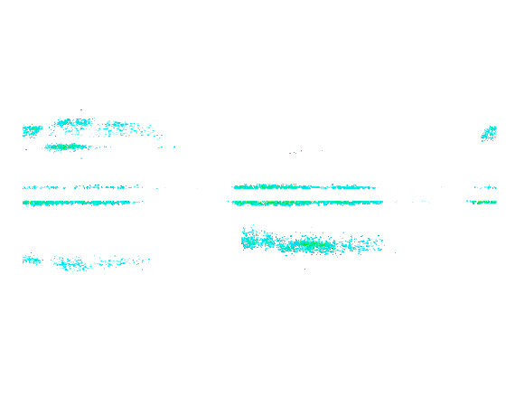                              |
| Internal   | 321                   | 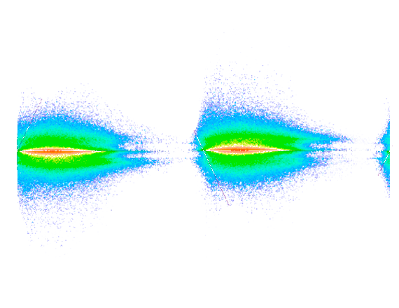                          |
| Surface    | 316                   | 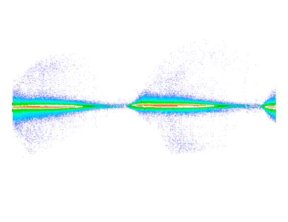                            |
| Noise      | 5                     |                                 |
| **Total**  | 950                   |                                                                     |

A imagem dos dataset possui tamanho de 640 x480 pixels. As anotações são pelo defeito do motor. A seguir é apresentada a quantidade percentual de cada tipo de defeito nos dados. 

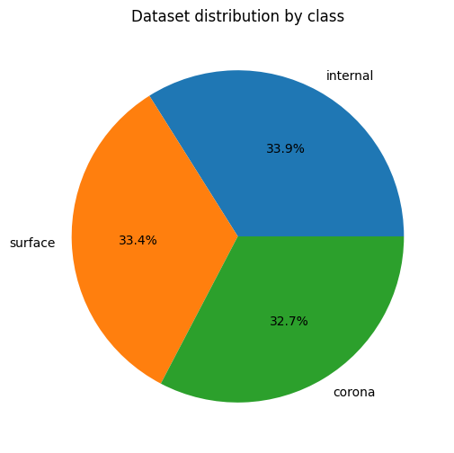

Foi realizada a divisão por tipo de motor anotado. Dessa forma, a representação do mesmo motor não estará no conjunto de teste e treino, evitando *data leakage*. Posteriormente há o gráfico da quantidade de cada motor por defeito analisado. 

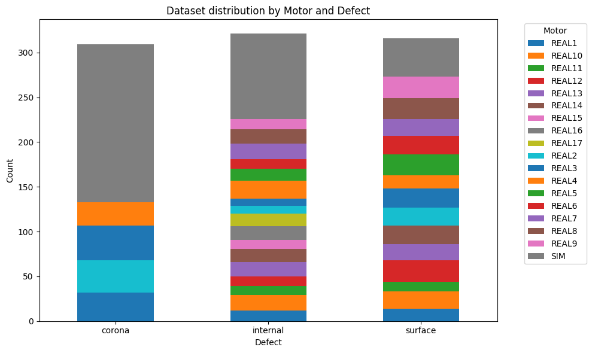

Adicionalmente, se realizou uma análise de variabilidade intra-classe e inter-classe por meio da métrica MS-SSIM para entender a complexidade do dataset

|            | Corona                | Internal         | Surface       |
|------------|-----------------------|------------------|----------------
| Corona     | 0.584                 | 0.495            | 0.393               |
| Internal   | 0.495                 | 0.444            | 0.404|
| Surface    | 0.393                 | 0.404            | 0.390|

### Separação de dados
O dataset será separado em três grupos: treino, validação e teste. O primeiro conjunto será utilizado para treinar as arquiteturas escolhidas, o segundo para otimizar os hiperparâmetros, e o terceiro para avaliar o desempenho dos modelos treinados.

### Modelos generativos
Para a geração dessas imagens, acredita-se que os modelos mais adequados sejam o Generative Adversarial Network (GAN) e o Variational Autoencoder (VAE), uma vez que essas arquiteturas têm se mostrado eficazes na geração de dados sintéticos em cenários semelhantes. O GAN é conhecido por sua capacidade de criar imagens realistas, enquanto o VAE oferece uma abordagem mais interpretável e robusta para a geração de variações plausíveis dos dados.

### Workflow

O *workflow* a seguir apresenta as etapas necessárias para desenvolvimento de modelos de geração de sinais sintéticos no contexto de análise de falhas.

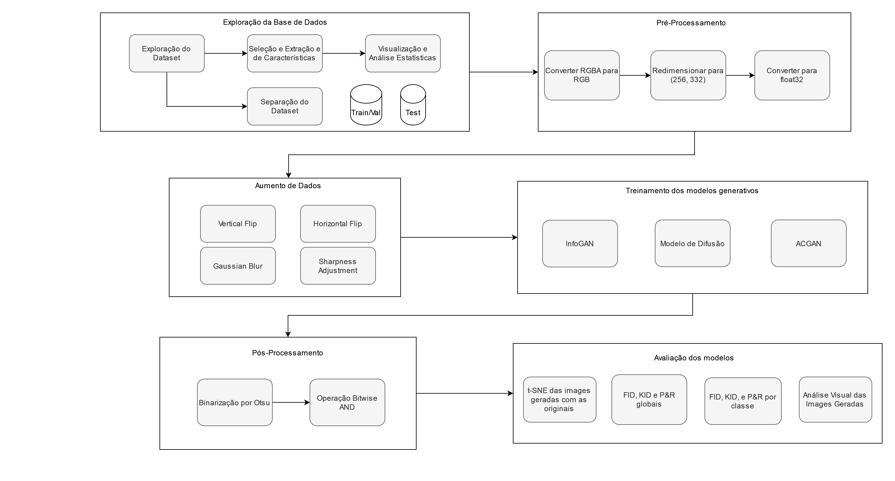

## Experimentos, Resultados e Discussão dos Resultados

### InfoGAN

O InfoGAN (*Information Maximizing Generative Adversarial Network*) é uma variação do modelo GAN (*Generative Adversarial Network*) projetada para descobrir e manipular de forma não supervisionada os fatores latentes interpretáveis de um conjunto de dados. A arquitetura do InfoGAN inclui dois componentes principais: o gerador, responsável por criar imagens sintéticas a partir de um vetor de ruído combinado com 
𝑐 ; e o discriminador, que, além de diferenciar entre imagens reais e geradas, possui um cabeçalho adicional para estimar o vetor 
𝑐 das imagens geradas. O objetivo é treinar o sistema para que as imagens geradas não apenas sejam indistinguíveis das reais, mas também sejam condicionadas pelos valores do vetor 
𝑐. A figura a seguir ilustra a arquitetura do InfoGAN.

<figure>
  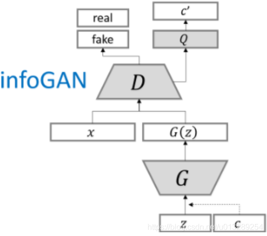
  <figcaption>Fonte: Sik-Ho Tsang  </figcaption>
</figure>

Infelizmente, para o problema proposto, não foi possível gerar imagens com boas resoluções utilizando o InfoGAN. Além disso, o modelo apresentou colapso nas épocas iniciais, comprometendo a convergência do treinamento e a qualidade das imagens produzidas. Como é possível observar nas imagens seguintes.

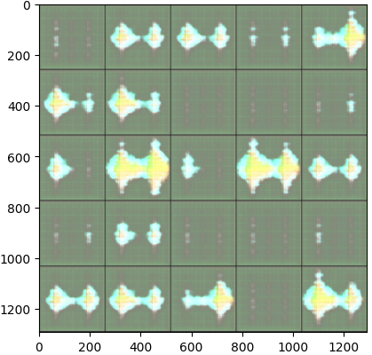
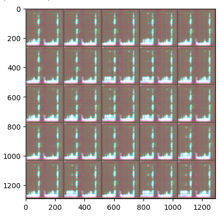

Além disso, o modelo apresentou colapso nas épocas iniciais, como observado na Figura abaixo, que mostra a evolução das perdas do gerador e do discriminador durante o treinamento. O aumento instável da perda do gerador por volta da época 40, acompanhado de uma perda quase constante do discriminador, evidencia dificuldades de convergência e a incapacidade do modelo de equilibrar o aprendizado entre os componentes, comprometendo a qualidade das imagens geradas.

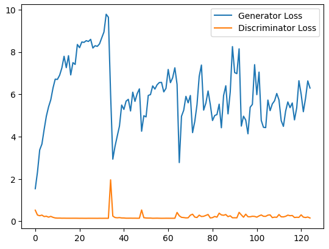

### Difussion Model

Os Diffusion Models são modelos generativos que aprendem a criar dados a partir de ruído puro. A ideia principal é inverter um processo de difusão: enquanto o processo direto (ou forward process) adiciona ruído progressivamente aos dados, o modelo aprende a reconstruir os dados removendo o ruído passo a passo, no processo inverso.

No caso de Conditioned Diffusion Models, o modelo é treinado com condicionamento adicional. No nosso caso, seriam os rótulos das imagens PRPD. Infelizmente, como é possível visualizar na imagem a seguir, os resultados apresentados não foram conforme era esperado.

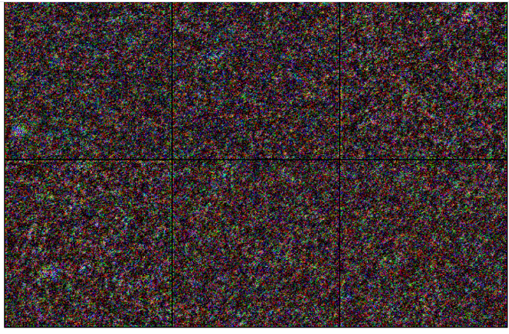

O gráfico abaixo mostra a curva de perda (loss) durante o treinamento. Ele ilustra como o modelo reduz gradualmente o erro em cada iteração, demonstrando aprendizado ao longo do tempo.

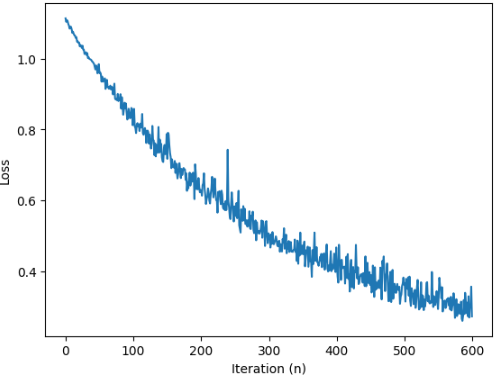

Como podemos ver, a perda diminui consistentemente, indicando que o modelo está aprendendo a reconstruir os dados a partir do ruído. No entanto, talvez fosse necessário maior poder computacional para conseguir resultados satisfatórios. 

### ACWGAN-SN

O modelo que consiguiu obter resultados satisfatórios foi uma versão da ACGAN com penalidade de gradiente de Wasserstein no Discriminador e normalização espectral no Gerador.

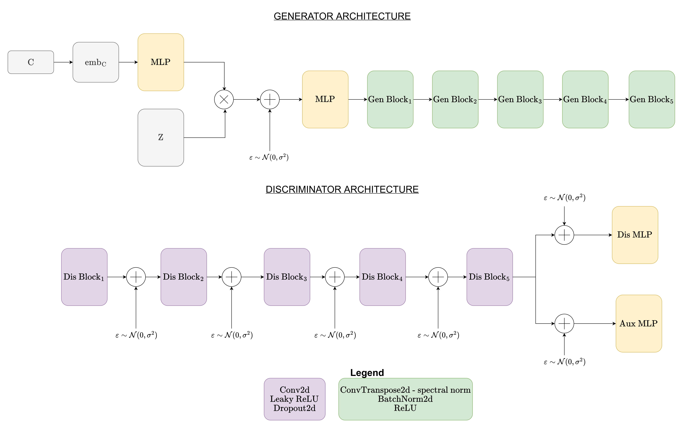

As funções de perda para o gerador e o discriminador foram os seguintes:

$L_{\text{CE}} = - \sum_{i=1}^{C} y_i \log(\hat{y}_i)$

$L_{D}^{ACWGAN} = -\mathbb{E}_{x \sim p_{d}}[D(x)] + \mathbb{E}_{\hat{z} \sim p_{g}}[D(\hat{x})] + \lambda\mathbb{E}_{\hat{x} \sim p_{g}} \left[(\| \nabla D(\alpha{x} + (1-\alpha\hat{x}) \|_2 - 1)^2 \right] + \lambda_{cls}{L_{\text{CE}}{(D_{aux}(x),C))}} + {L_{\text{CE}}{(D_{aux}(\hat{x}),\hat{C}))}}$

$L_{G}^{ACWGAN} = -\mathbb{E}_{\hat{z} \sim p_{g}}[D(\hat{x})] + {L_{\text{CE}}{(D_{aux}(\hat{x}),\hat{C}))}}$

#### Modelo Original

##### Gerador
| Component       | Details                                                                                                 |
|------------------|--------------------------------------------------------------------------------------------------------|
| Embedding       | Sequential: Embedding(3, 10), GaussianNoise()                                                          |
| FC Embedding    | Linear(in_features=10, out_features=256, bias=False)                                                   |
| FC Latent       | Sequential: GaussianNoise(), Linear(in_features=256, out_features=400, bias=False)                     |
| Block C1        | spectral_norm ConvTranspose2d(400, 256, kernel_size=(4, 4), stride=(4, 4), bias=False) BatchNorm2d(256) ReLU()  |
| Block C2        | spectral_norm ConvTranspose2d(256, 128, kernel_size=(8, 8), stride=(4, 4), padding=(2, 2), bias=False) BatchNorm2d(128) ReLU() |
| Block C3        | spectral_norm ConvTranspose2d(128, 64, kernel_size=(8, 8), stride=(4, 4), padding=(2, 2), bias=False) BatchNorm2d(64) ReLU()  |
| Block C4        | spectral_norm ConvTranspose2d(64, 32, kernel_size=(4, 4), stride=(2, 2), padding=(1, 1), bias=False) BatchNorm2d(32) ReLU()  |
| Block C5        | spectral_norm ConvTranspose2d(32, 3, kernel_size=(4, 3), stride=(2, 3), padding=(1, 26)) Tanh()                   |
| Parameters      | **4399713**                       

##### Discriminador

| Component       | Details                                                                                                 |
|------------------|--------------------------------------------------------------------------------------------------------|
| Block C1        | GaussianNoise() Conv2d(3, 32, kernel_size=(8, 8), stride=(4, 4), padding=(2, 2), bias=False) LeakyReLU() Dropout2d() |
| Block C2        | GaussianNoise() Conv2d(32, 64, kernel_size=(8, 8), stride=(4, 4), padding=(2, 2), bias=False) LeakyReLU() Dropout2d() |
| Block C3        | GaussianNoise() Conv2d(64, 128, kernel_size=(4, 4), stride=(2, 2), padding=(1, 1), bias=False) LeakyReLU() Dropout2d() |
| Block C4        | GaussianNoise() Conv2d(128, 256, kernel_size=(4, 4), stride=(2, 2), padding=(1, 1), bias=False) LeakyReLU() Dropout2d() |
| Block C5        | GaussianNoise() Conv2d(256, 512, kernel_size=(4, 4), stride=(2, 2), padding=(1, 1), bias=False) LeakyReLU() Dropout2d() |
| Block Dis       | GaussianNoise() Linear(in_features=2048, out_features=1, bias=True)                                 |
| Block Aux       | GaussianNoise() Linear(in_features=2048, out_features=3, bias=True)                                 |
| Parameters      | **2897924**                                                                                            |

#### Hiperparâmetros

Os hiperparâmetros que foram usados durante o treinamento são os seguintes:

- (&beta;1, &beta;2) = (0, 0.999)
- batch size = 64
- epochs = 3000
- &lambda; = 10
- $\lambda_{cls}$ = 20 
- lr = 0.0002
- n embedding = 10
- z dimm = 256
- Gaussian Noise std = 0.1
- noise decay = 0.995
- Dropout rate = 0.5
- Leaky ReLU slope = 0.2
- Batch size = 64
- Tamanho das imagens = (256, 332, 3)

#### Ablation Study

Como foi analisado que o modelo ACWGAN-SN com diversos ruídos apresentou resultados satisfatórios, foi visto que poderíamos melhorá-lo retirando cada um dos componentes em um experimento e avaliando, ao final, qual foi a melhor situação. Esse processo é conhecido como ablation study. Foram estudadas 4 situações:

- Normalização espectral
- Penalização por Wasserstein
- Ruído gaussiano no discriminador
- Ruído gaussiano no gerador

Esses experimentos visaram entender a contribuição de cada componente para o desempenho geral do modelo e verificar se a remoção de algum deles poderia resultar em uma melhoria ou degradação do desempenho.

#### Modelo Original

A seguir, apresentamos a visualização dos dados usando t-SNE, que mostra a distribuição global das amostras geradas. Essa visualização ajuda a entender a separação entre as diferentes classes e a qualidade da geração de dados.

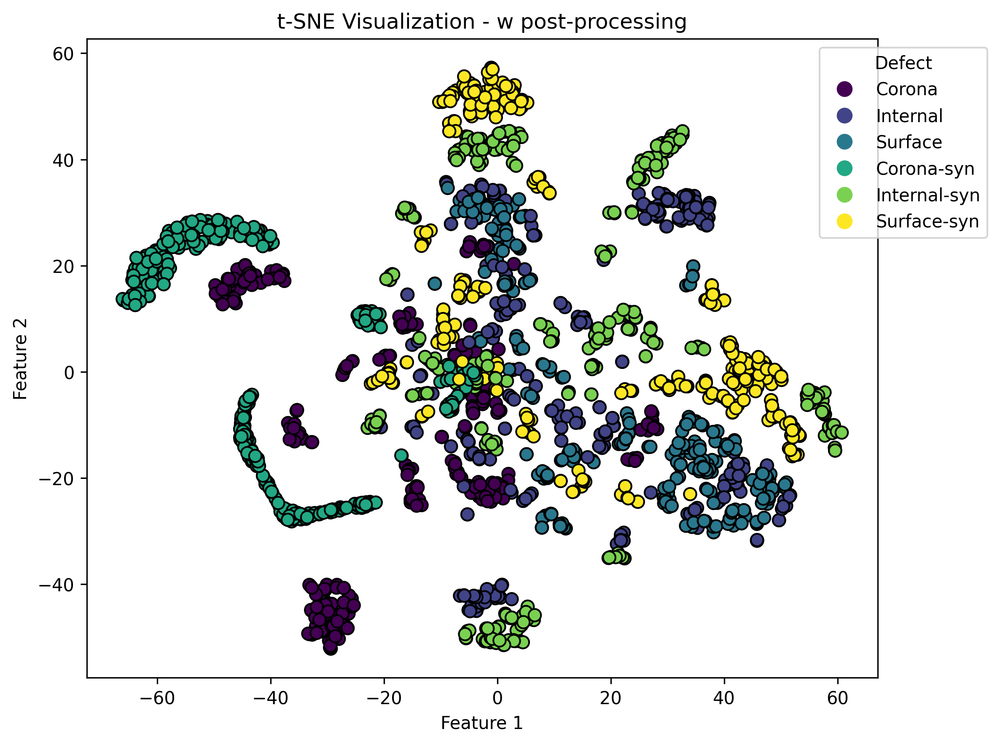

Além da visualização global, realizamos o t-SNE individualizado por classe, permitindo uma análise mais detalhada de como o modelo se comporta em relação a cada tipo de dado. Isso é importante para avaliar se o modelo está conseguindo gerar amostras de alta qualidade para cada classe individualmente.

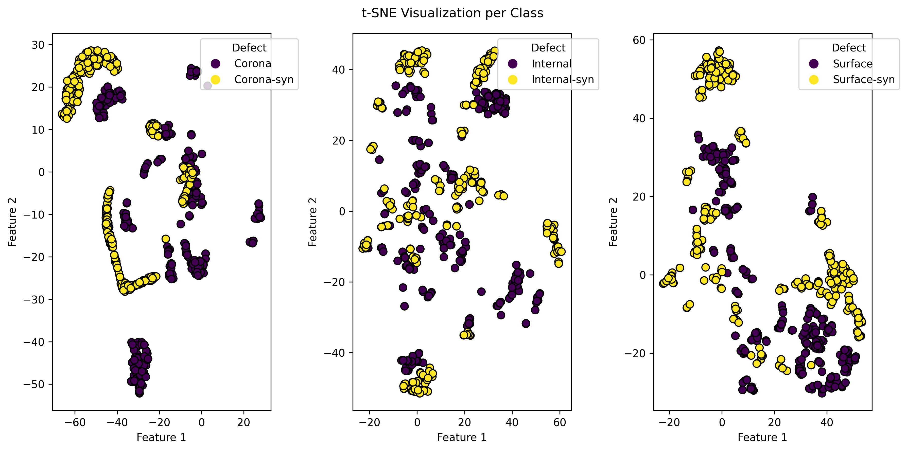

A tabela a seguir apresenta as métricas geradas durante os experimentos, com dados de treino, validação e teste. As métricas incluem FID, KID, precisão e recall para cada conjunto de dados e para cada classe. As classes são indicadas por números: 1 para coroa, 2 para interno e 3 para superfície.

|    | FID        | KID      | P&R           | FID1       | FID2       | FID3       | KID1      | KID2      | KID3      | P&R1         | P&R2         | P&R3         | MOD3 |
|---------|------------|----------|---------------|------------|------------|------------|-----------|-----------|-----------|---------------|---------------|---------------|------|
| Train   | 159.71 | 0.105 | (0.0049,0.0000) | 172.674213 | 184.229298 | 207.838089 | 0.135167  | 0.127615  | 0.176035  | (0.0000,0.0000) | (0.0059,0.0000) | (0.0215,0.0000) |      |
| Val     | 174.95 | 0.094 | (0.5967,0.0000) | 176.923227 | 202.807142 | 240.696508 | 0.128564  | 0.099677  | 0.183579  | (0.7175,0.0000) | (0.8754,0.0000) | (0.7147,0.0000) |      |
| Test    | 221.68 | 0.179 | (0.0010,0.0000) | 265.188173 | 283.617005 | 266.801814 | 0.344515  | 0.302050  | 0.299347  | (0.0000,0.0000) | (0.0000,0.0000) | (0.0031,0.0000)|      |

Por fim, apresentamos imagens geradas sinteticamente pelo modelo, uma para cada classe (coroa, interno e superfície). Essas imagens ilustram a capacidade do modelo de gerar dados realistas que correspondem a cada classe específica.

    

        <h5>Defeito de Coroa</h5>
        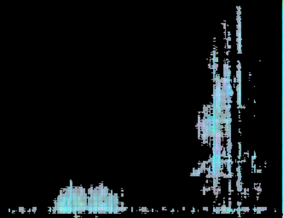
    

    

        <h5>Defeito Interno</h5>
        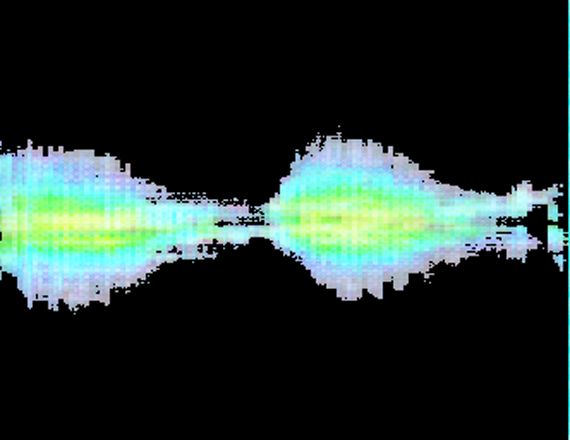
    

    

        <h5>Defeito de Superfície</h5>
        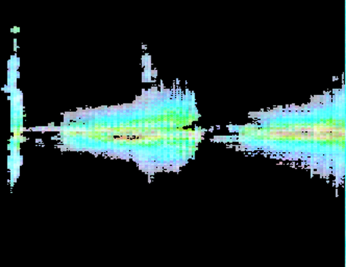
    

#### Penalizaçao por Wasserstein
A seguir, mostramos a visualização global das amostras geradas usando t-SNE.
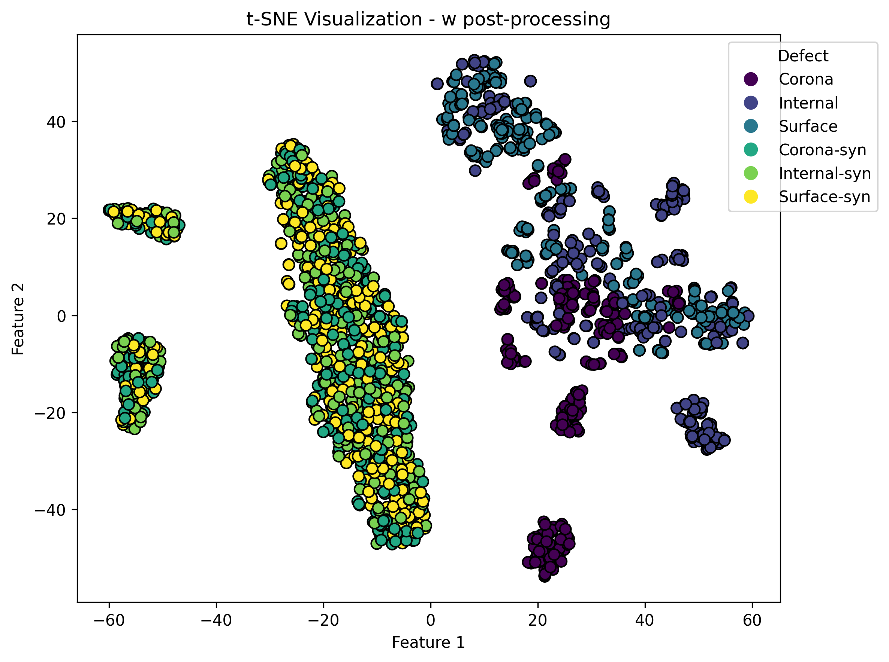

Após, apresentamos a distribuição das classes individualmente usando t-SNE.

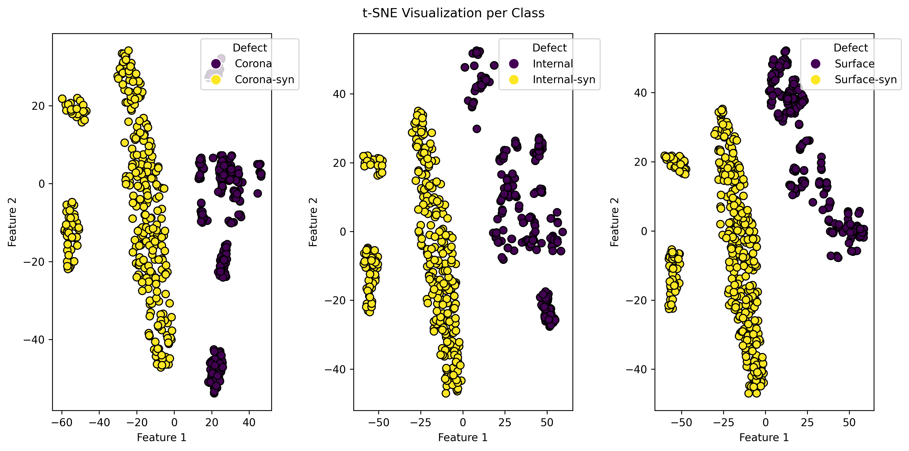

Aqui estão as métricas geradas para as diferentes fases do treinamento, validação e teste.
|         | FID        | KID      | P&R           | FID1       | FID2       | FID3       | KID1      | KID2      | KID3      | P&R1         | P&R2         | P&R3         | MOD3 |
|---------|------------|----------|---------------|------------|------------|------------|-----------|-----------|-----------|---------------|---------------|---------------|------|
| Train   | 290.60     | 0.268    | (0.0000,0.0000) | 280.444725 | 288.940699 | 309.726250 | 0.313640  | 0.282250  | 0.325883  | (0.0000,0.0000) | (0.0000,0.0000) | (0.0000,0.0000) |      |
| Val     | 293.99     | 0.265    | (0.0000,0.0000) | 287.282253 | 299.069478 | 313.793774 | 0.333442  | 0.264077  | 0.328807  | (0.6406,0.0000) | (0.9781,0.0345) | (0.7117,0.0714) |      |
| Test    | 288.49     | 0.302    | (0.0000,0.0000) | 241.880872 | 321.797007 | 316.801898 | 0.365371  | 0.445290  | 0.440961  | (0.0000,0.0000) | (0.0000,0.0000) | (0.0000,0.0000) |      |

    

        <h5>Defeito de Coroa</h5>
        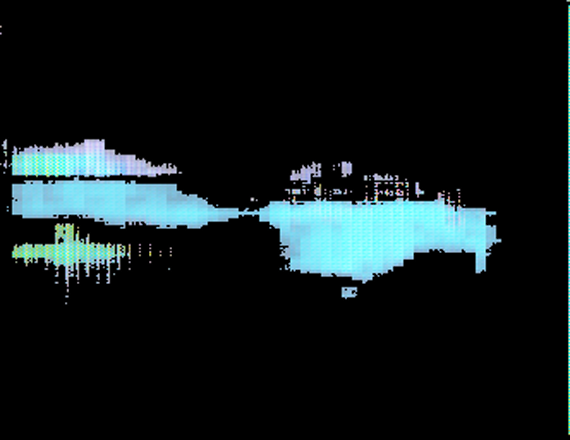
    

    

        <h5>Defeito Interno</h5>
        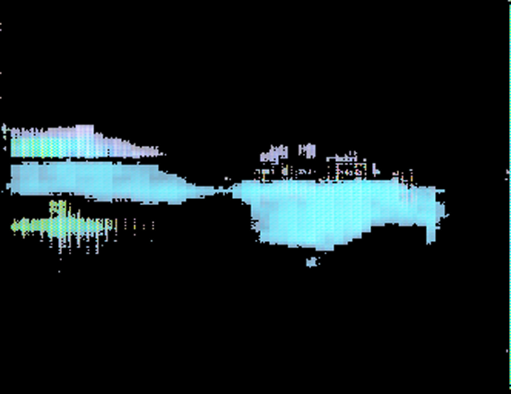
    

    

        <h5>Defeito de Superfície</h5>
        
    

#### Ruído Gaussiano no Discriminador
A seguir, mostramos a visualização global das amostras geradas usando t-SNE.

Após, apresentamos a distribuição das classes individualmente usando t-SNE.

Aqui estão as métricas geradas para as diferentes fases do treinamento, validação e teste.

|    | FID        | KID      | P&R           | FID1       | FID2       | FID3       | KID1      | KID2      | KID3      | P&R1         | P&R2         | P&R3         | MOD3 |
|---------|------------|----------|---------------|------------|------------|------------|-----------|-----------|-----------|---------------|---------------|---------------|------|
| Train   | 143.241.037 | 0.086224 | (0.2832,0.0013) | 183.954.051 | 180.917.254 | 163.615.821 | 0.144840 | 0.113382 | 0.124975 | (0.3607,0.0000) | (0.2751,0.0000) | (0.1617,0.0000) |      |
| Val     | 168.473.768 | 0.084379 | (0.6250,0.0118) | 216.852.641 | 217.768.535 | 194.649.687 | 0.165530 | 0.099961 | 0.118446 | (0.9648,0.0000) | (0.7679,0.0000) | (0.6377,0.0000) |      |
| Test    | 192.640.402 | 0.134054 | (0.0127,0.0000) | 284.380.472 | 248.441.158 | 212.888.935 | 0.369825 | 0.205304 | 0.214673 | (0.0000,0.0000) | (0.0000,0.0000) | (0.0000,0.0000) |      |

Abaixo estão as imagens geradas para cada classe.

    

        <h5>Defeito de Coroa</h5>
        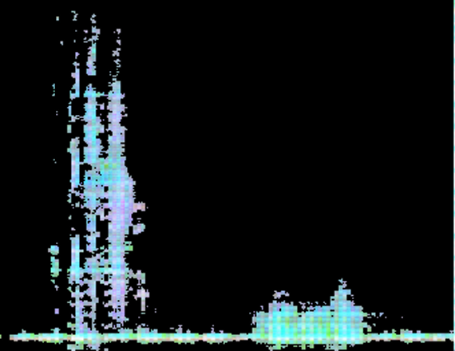
    

    

        <h5>Defeito Interno</h5>
        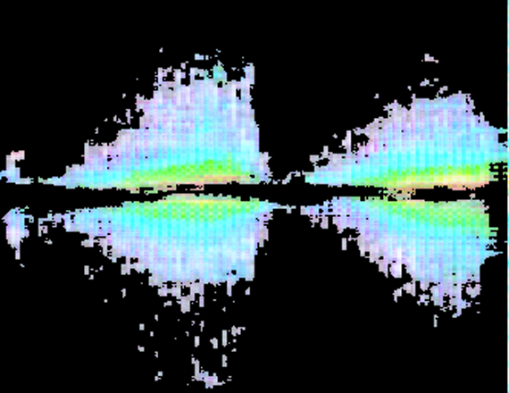
    

    

        <h5>Defeito de Superfície</h5>
        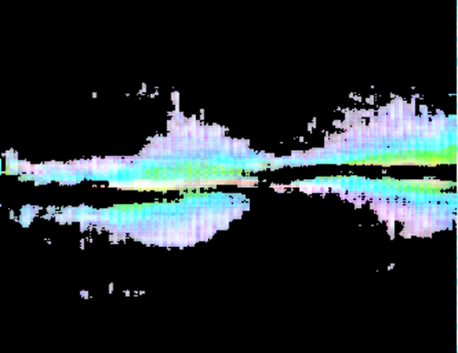
    

#### Ruído Gaussiano no Gerador
A seguir, mostramos a visualização global das amostras geradas usando t-SNE.
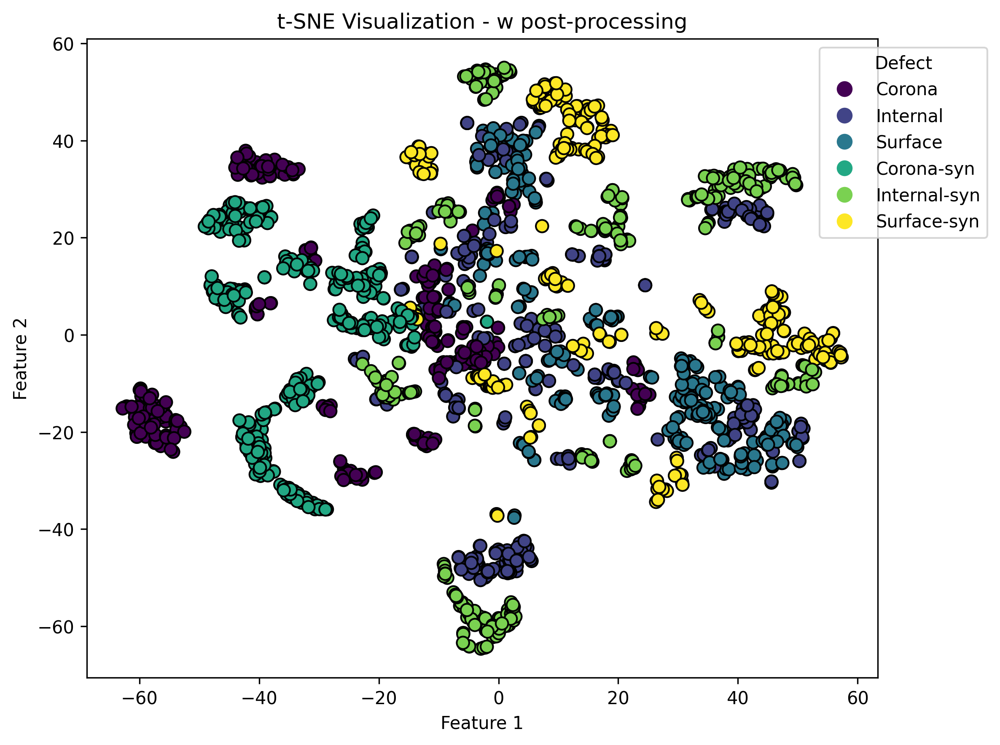

Após, apresentamos a distribuição das classes individualmente usando t-SNE.
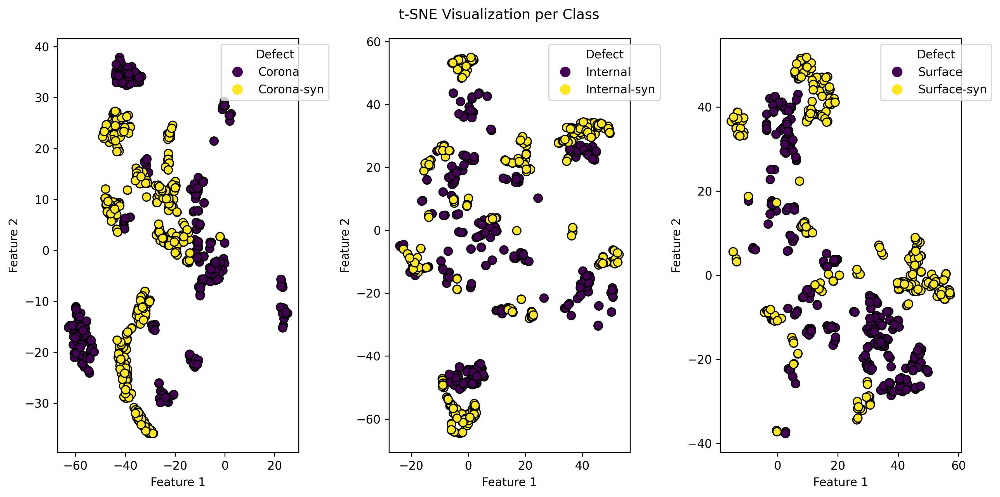

Aqui estão as métricas geradas para as diferentes fases do treinamento, validação e teste.

|    | FID        | KID      | P&R           | FID1       | FID2       | FID3       | KID1      | KID2      | KID3      | P&R1         | P&R2         | P&R3         | MOD3 |
|---------|------------|----------|---------------|------------|------------|------------|-----------|-----------|-----------|---------------|---------------|---------------|------|
| Train   | 164.65 | 0.108 | (0.0020,0.0000) | 159.649909 | 194.616374 | 219.718140 | 0.132975  | 0.139477  | 0.194397  | (0.0000,0.0000) | (0.0000,0.0000) | (0.0199,0.0000) |      |
| Val     | 183.46 | 0.102 | (0.5410,0.0118) | 178.491791 | 212.824949 | 247.799486 | 0.140242  | 0.112723  | 0.199009  | (0.7049,0.0000) | (0.9045,0.0000) | (0.8046,0.0000) |      |
| Test    | 224.94 | 0.180 | (0.0000,0.0104) | 258.469314 | 275.457409 | 273.606913 | 0.324978  | 0.305368  | 0.317812  | (0.0000,0.0000) | (0.0000,0.0312) | (0.0000,0.0000) |      |

    

        <h5>Defeito de Coroa</h5>
        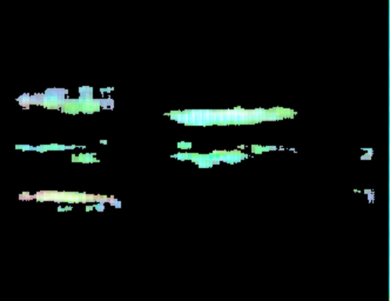
    

    

        <h5>Defeito Interno</h5>
        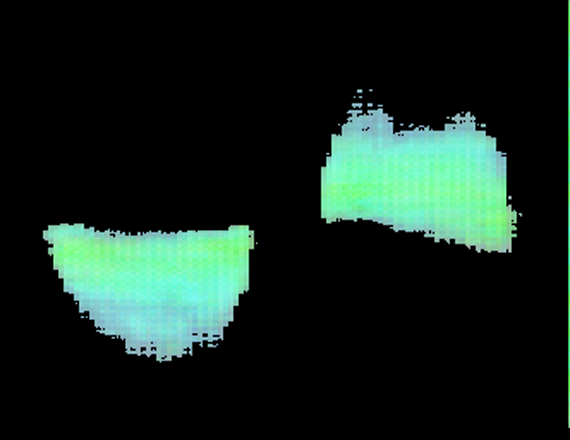
    

    

        <h5>Defeito de Superfície</h5>
        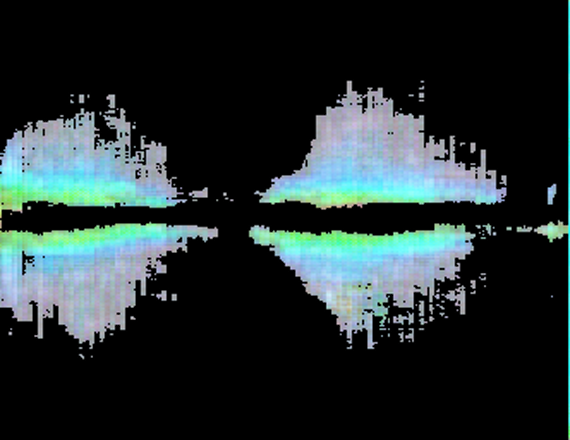
    

#### Normalizaçao Espectral
A seguir, mostramos a visualização global das amostras geradas usando t-SNE.
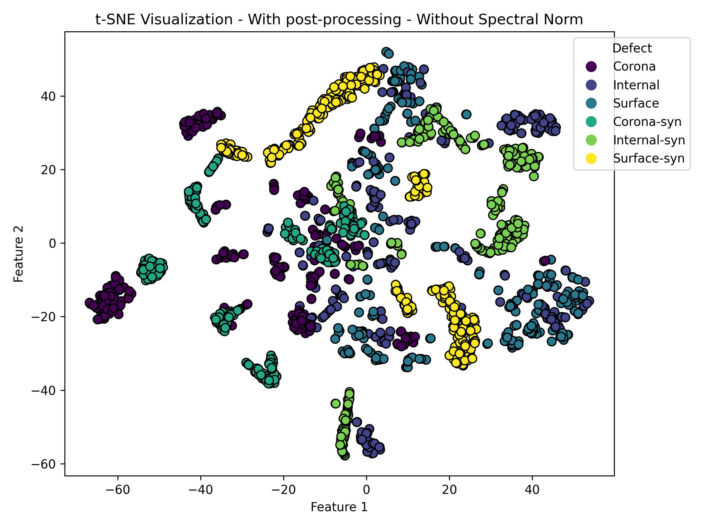

Após, apresentamos a distribuição das classes individualmente usando t-SNE.

Aqui estão as métricas geradas para as diferentes fases do treinamento, validação e teste.
|  | FID        | KID      | P&R           | FID1       | FID2       | FID3       | KID1      | KID2      | KID3      | P&R1         | P&R2         | P&R3         | 
|---------|------------|----------|---------------|------------|------------|------------|-----------|-----------|-----------|---------------|---------------|---------------|
| Train   | 170.996.605 | 0,102736 | (0.2812,0.0000) | 293.775.102 | 232.025.363 | 245.501.314 | 0,362067 | 0,203655 | 0,273549 | (0.0000,0.0000) | (0.0031,0.0000) | (0.0000,0.0000) |      
| Val     | 191.818.868 | 0,100242 | (0.4736,0.0000) | 212.507.233 | 228.128.554 | 238.886.100 | 0,168298 | 0,119335 | 0,175691 | (0.7160,0.0000) | (0.8696,0.0000) | (0.4636,0.0000) |      
| Test    | 208.008.298 | 0,150208 | (0.0020,0.0000) | 185.499.858 | 201.195.731 | 216.606.640 | 0,153220 | 0,139393 | 0,178365 | (0.5136,0.0000) | (0.2453,0.0000) | (0.0054,0.0000) |      

##### Resultados do Defeito de Coroa

    

        <h5>Defeito de Coroa</h5>
        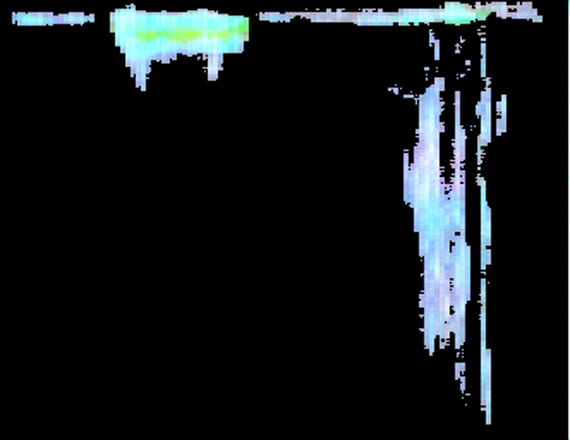
    

    

        <h5>Defeito Interno</h5>
        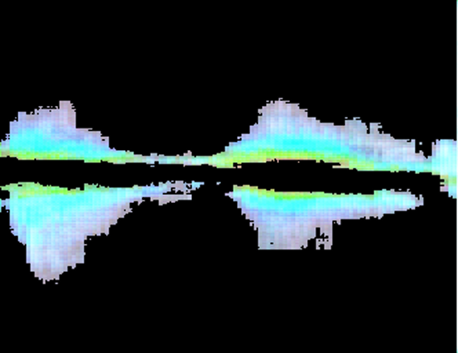
    

    

        <h5>Defeito de Superfície</h5>
        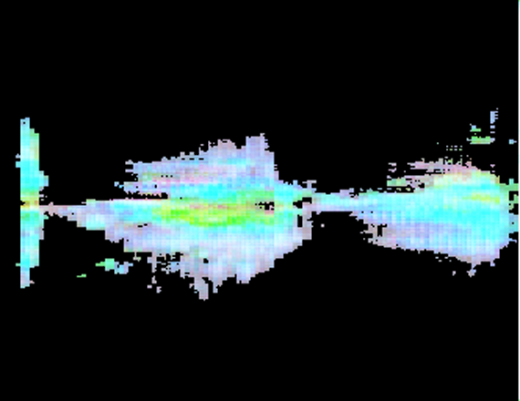
    

#### Comparação dos modelos

Métricas no conjunto de Validação

| Modelo   | FID        | KID      | P&R           | FID1       | FID2       | FID3       | KID1      | KID2      | KID3      | P&R1         | P&R2         | P&R3         |
|---------|------------|----------|---------------|------------|------------|------------|-----------|-----------|-----------|---------------|---------------|---------------|
| Original     | 174.95 | 0.094 | (0.5967,0.0000) | **176.923227** | **202.807142** | 240.696508 | **0.128564**  | **0.099677**  | 0.183579  | (0.7175,0.0000) | (0.8754,0.0000) | (0.7147,0.0000) |      |
| Sem PG     | 293.99     | 0.265    | (0.0000,0.0000) | 287.282253 | 299.069478 | 313.793774 | 0.333442  | 0.264077  | 0.328807  | (0.6406,0.0000) | (**0.9781**,**0.0345**) | (0.7117,**0.0714**) |      |
| Sem Ruído no Discriminador     | **168.473768** | **0.084379** | (**0.6250**,**0.0118**) | 216.852.641 | 217.768.535 | **194.649.687** | 0.165530 | **0.099961** | **0.118446** | (**0.9648**,0.0000) | (0.7679,0.0000) | (0.6377,0.0000) |      |
| Sem Ruído no Gerador    | 183.46 | 0.102 | (0.5410,**0.0118**) | 178.491791 | 212.824949 | 247.799486 | 0.140242  | 0.112723  | 0.199009  | (0.7049,0.0000) | (0.9045,0.0000) | (**0.8046**,0.0000) |      |
| Sem Normalizaçao Espectral     | 191.818.868 | 0,100242 | (0.4736,0.0000) | 212.507.233 | 228.128.554 | 238.886.100 | 0,168298 | 0,119335 | 0,175691 | (0.7160,0.0000) | (0.8696,0.0000) | (0.4636,0.0000) |      

Métricas no conjunto de Teste
| Modelo   | FID        | KID      | P&R           | FID1       | FID2       | FID3       | KID1      | KID2      | KID3      | P&R1         | P&R2         | P&R3         |
|---------|------------|----------|---------------|------------|------------|------------|-----------|-----------|-----------|---------------|---------------|---------------|
| Original    | 221.68 | 0.179 | (0.0010,0.0000) | 265.188173 | 283.617005 | 266.801814 | 0.344515  | 0.302050  | 0.299347  | (0.0000,0.0000) | (0.0000,0.0000) | (**0.0031**,0.0000)|      |
| Sem PG   | 288.49     | 0.302    | (0.0000,0.0000) | 241.880872 | 321.797007 | 316.801898 | 0.365371  | 0.445290  | 0.440961  | (0.0000,0.0000) | (0.0000,0.0000) | (0.0000,0.0000) |      |
| Sem Ruído no Discriminador    | **192.640** | **0.134054** | (**0.0127**,0.0000) | 284.380.472 | 248.441.158 | **212.888.935** | 0.369825 | 0.205304 | 0.214673 | (0.0000,0.0000) | (0.0000,0.0000) | (0.0000,0.0000) |      |
| Sem Ruído no Gerador    | 224.94 | 0.180 | (0.0000,**0.0104**) | 258.469314 | 275.457409 | 273.606913 | 0.324978  | 0.305368  | 0.317812  | (0.0000,0.0000) | (0.0000,**0.0312**) | (0.0000,0.0000) |      |
| Sem Normalização Espectral    | 208.01 | 0,150 | (0.0020,0.0000) | **185.50** | **201.195731** | 216.606.640 | **0,153220** | **0,139393** | **0,178365** | (**0.5136**,0.0000) | (**0.2453**,0.0000) | (**0.0054**,0.0000) |      

### Pegadas de Carbono

O Wandb foi usado como uma ferramenta de monitoramento para ter um controle sobre as métricas de treinamento e os recursos de computador usados. Para obter uma aproximação do uso total de energia da GPU, a média do uso de energia da GPU por execução de treinamento foi obtida e, em seguida, multiplicada pelo número total de horas de treinamento.

- Uso total de energia da GPU: 5,7 kW
- Tempo total de treinamento: 241,34 horas

É importante levar em conta que algumas execuções de experimentos não mediram os recursos do computador, de modo que os recursos computacionais necessários mostrados estão na extremidade abaixo da medida real. Em iterações futuras, será dada mais atenção neste detalhe.  

## Conclusão

O projeto proposto aborda a geração sintética de imagens de PRPD como uma solução para a escassez de bases de dados de alta qualidade e volume, necessárias para o treinamento de modelos de deep learning no diagnóstico de falhas em motores elétricos. A metodologia se apoia em modelos generativos, como GANs e VAEs, com o objetivo de aumentar a diversidade e a quantidade de dados disponíveis. Para isso, utilizou-se um conjunto de dados real sobre descargas parciais.

Após uma exploração detalhada da base de dados, identificaram-se características relevantes, como textura e contornos, que evidenciam a complexidade das imagens de PRPD. Durante o desenvolvimento, a implementação de uma variante da GAN (ACWGAN-SN) foi bem-sucedida, gerando imagens sintéticas de boa qualidade. Contudo, os modelos InfoGAN e Diffusion não apresentaram desempenhos satisfatórios. Entre os principais desafios enfrentados por esses modelos, destacam-se a quantidade elevada de dados sintéticos, limitações nas arquiteturas e restrições de poder computacional, que impactaram negativamente os resultados.

Um dos destaques do projeto foi o estudo de ablação, que trouxe contribuições importantes para a compreensão do desempenho dos modelos. Esse estudo revelou que a configuração Sem Ruído no Discriminador e Sem Normalização Espectral foi determinante para o sucesso do ACWGAN, que se mostrou a abordagem mais robusta e eficaz até o momento.

Embora ainda haja espaço para melhorias e otimizações, os resultados obtidos com o ACWGAN indicam o potencial de modelos generativos na geração de dados sintéticos de PRPD. Assim, espera-se que a continuidade do trabalho permita avanços significativos na variabilidade dos dados, contribuindo para diagnósticos mais precisos e eficientes no futuro.

## Referências Bibliográficas
1. Lv, F., Liu, G., Wang, Q., Lu, X., Lei, S., Wang, S., & Ma, K. (2023). Pattern Recognition of Partial Discharge in Power Transformer Based on InfoGAN and CNN. Journal of Electrical Engineering & Technology, 18(2), 829–841. https://doi.org/10.1007/s42835-022-01260-7
2. Guo, B., Li, S., Li, N., & Li, P. (2021). A GAN-based Method for the Enhancement of Phase-Resolved Partial Discharge Map Data. Forest Chemicals Review, 1484, 1484–1497.
3. Zhu, G., Zhou, K., Lu, L., Fu, Y., Liu, Z., & Yang, X. (2023). Partial Discharge Data Augmentation Based on Improved Wasserstein Generative Adversarial Network With Gradient Penalty. IEEE Transactions on Industrial Informatics, 19(5), 6565–6575. https://doi.org/10.1109/TII.2022.3197839
