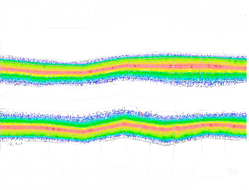

# `Geração e Avaliação de Dados Sintéticos para PRPD`
# `Generation and Evaluation of Synthetic Data for PRPD`

## Apresentação

O presente projeto foi originado no contexto das atividades da disciplina de pós-graduação *IA376N - IA generativa: de modelos a aplicações multimodais*, 
oferecida no segundo semestre de 2024, na Unicamp, sob supervisão da Profa. Dra. Paula Dornhofer Paro Costa, do Departamento de Engenharia de Computação e Automação (DCA) da Faculdade de Engenharia Elétrica e de Computação (FEEC).

> |Nome  | RA | Especialização|
> |--|--|--|
> | José Alfredo Zapana García | 272291 | Aluno de mestrado em Eng. Elétrica |
> | Sílvia Claudino Martins Gomes | 271629  | Aluna Especial |

## Descrição Resumida do Projeto
Phase-Resolved Partial Discharge (PRPD) é uma representação gráfica da atividade de descargas parciais (PD) ao longo dos 360º de um ciclo de corrente alternada (CA), amplamente utilizada no diagnóstico de falhas em motores elétricos. Embora existam fontes que apresentam tipos de falhas e suas representações gráficas, é difícil encontrar bases de dados de qualidade, devido à natureza especializada dos dados, conflitos por segurança e privacidade, acceso aos equipamentos, etc. Além disso, grandes conjuntos de dados são necessários para treinar modelos de deep learning de forma eficaz. Dada a escassez de bases de dados adequadas, a geração sintética de imagens se apresenta como uma solução viável para esse problema. O objetivo deste projeto é desenvolver uma base de dados sintética por meio de arquiteturas generativas e avaliá-las, permitindo que essa abordagem seja utilizada por outros pesquisadores no contexto de estudos sobre descargas parciais.
> 
> Incluir nessa seção link para vídeo de apresentação da proposta do projeto (máximo 5 minutos).

## Metodologia Proposta

### Dataset
Para o desenvolvimento deste projeto, serão geradas imagens sintéticas com base em um conjunto de dados existente. O conjunto selecionado é proveniente do artigo "Dataset of phase-resolved images of internal, corona, and surface partial discharges in electrical generators", que contém imagens relacionadas a três tipos principais de falhas em motores elétricos: Corona, Internal e Surface, além de algumas imagens que representam ruídos. A escolha desse dataset se justifica por sua qualidade e relevância no contexto de estudo de descargas parciais, oferecendo uma base sólida para a criação de dados sintéticos. A tabela a seguir resume a quantidade de imagens por tipo de falha:
| Tipo de DP | Quantidade de Imagens | Exemplo                                                             |
|------------|-----------------------|---------------------------------------------------------------------|
| Corona     | 308                   |                               |
| Internal   | 321                   |                           |
| Surface    | 316                   |                             |
| Noise      | 5                     |                                 |
| **Total**  | 950                   |                                                                     |

### Separação de dados
O dataset vai ser separado em três grupos: treino, validação e teste. O primeiro conjunto vai ser usado para treinar as arquiteturas escolhidas, o segundo conjunto vai ser para otimizar os hiperparâmetros e terceiro para comparar o desempenho dos modelos treinados.

### Modelos generativos
Para a geração dessas imagens, acredita-se que os modelos mais adequados sejam o Generative Adversarial Network (GAN) e o Variational Autoencoder (VAE), uma vez que essas arquiteturas têm se mostrado eficazes na geração de dados sintéticos em cenários semelhantes. O GAN é conhecido por sua capacidade de criar imagens realistas, enquanto o VAE oferece uma abordagem mais interpretável e robusta para a geração de variações plausíveis dos dados.

Ao longo do projeto, a equipe utilizará como base os seguintes artigos que já foram identificados: 
- "A GAN-based Method for the Enhancement of Phase-Resolved Partial Discharge Map Data"
- "Partial Discharge Data Augmentation Based on Improved Wasserstein Generative Adversarial Network With Gradient Penalty" 
- "Pattern Recognition of Partial Discharge in Power Transformer Based on InfoGAN and CNN"

### Ferramentas computacionais
Esses estudos fornecerão suporte teórico e prático para o desenvolvimento das soluções propostas.

As ferramentas previstas para o desenvolvimento incluem 
- Linguagem de programação: Python
- Deep Learning: PyTorch 
- Visão Computacional: TorchVision, OpenCV, Numpy
- Visualização de dados: Matplotlib, Seaborn
- Avaliação por métricas: Scikit-learn, Scikit-image
- Manipulação de dados: Pandas
- Monitoramento: Weights and Biases
- Otimização de hiperparâmetros: Optuna

### Avaliação dos modelos
Ao final do projeto, espera-se avaliar a qualidade das imagens geradas tanto com métricas quantitativas quanto qualitativas. Vamos usar uma avaliação baseada em três aspectos: comparação da distribuição dos datasets, morfologia das imagens e inspecção visual. Essas métricas permitirão avaliar de maneira robusta o desempenho dos modelos generativos e a qualidade das imagens sintéticas produzidas.

Avaliação da distribuição dos datasets
- Frétchet Inception Distance (FID)
- Kernel Inception Distance (KID)

Avaliação de morfologia das imagens dos datasets
- Structural similarity index measure (SSIM)

Avaliação visual dos dados
- t-SNE
- UMAP

### Resultados esperados
Se espera ter como resultados uma base de dados sintética de PRPDs baseada em uma avaliaçaõ quantitativa e qualitativa, ter código público e propor uma abordagem para comparar imagens sintéticas no contexto de detecção de falhas em motores.

## Cronograma do Projeto

| Data        | Etapa do Projeto                                            |
|-------------|-------------------------------------------------------------|
| 10/09/2024  | Escrita e ideação do projeto                                |
| 17/09/2024  | Exploração da base de dados (Entrega E1)                    |
| 24/09/2024  | Escolha dos modelos de geração que serão comparados         |
| 01/10/2024  | Implementação dos modelos escolhidos                        |
| 08/10/2024  | Revisão e escrita parcial do projeto (Entrega E2)           |
| 15/10/2024  | Implementação de possíveis feedbacks recebidos pela turma   |
| 22/10/2024  | Otimização dos hiperparâmetros                              |
| 29/10/2024  | Otimização dos hiperparâmetros                              |
| 05/11/2024  | Avaliação dos modelos implementados                         |
| 12/11/2024  | Revisão e escrita do projeto                                |
| 19/11/2024  | Revisão e escrita do projeto                                |
| 25/11/2024  | Entrega E3                                                  |

## Referências Bibliográficas
1. Lv, F., Liu, G., Wang, Q., Lu, X., Lei, S., Wang, S., & Ma, K. (2023). Pattern Recognition of Partial Discharge in Power Transformer Based on InfoGAN and CNN. Journal of Electrical Engineering & Technology, 18(2), 829–841. https://doi.org/10.1007/s42835-022-01260-7
2. Guo, B., Li, S., Li, N., & Li, P. (2021). A GAN-based Method for the Enhancement of Phase-Resolved Partial Discharge Map Data. Forest Chemicals Review, 1484, 1484–1497.
3. Zhu, G., Zhou, K., Lu, L., Fu, Y., Liu, Z., & Yang, X. (2023). Partial Discharge Data Augmentation Based on Improved Wasserstein Generative Adversarial Network With Gradient Penalty. IEEE Transactions on Industrial Informatics, 19(5), 6565–6575. https://doi.org/10.1109/TII.2022.3197839
