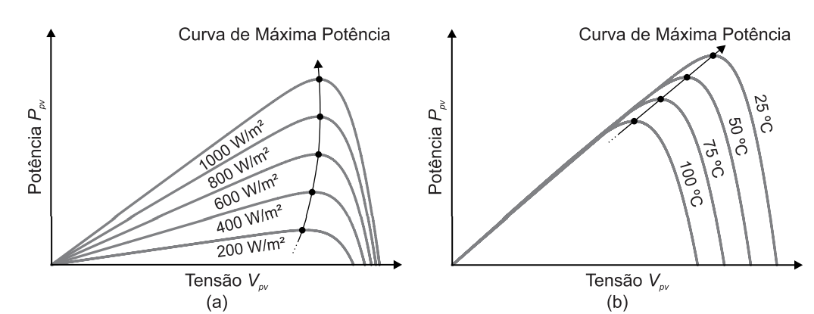
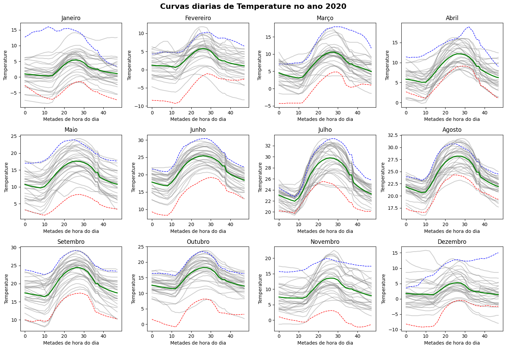
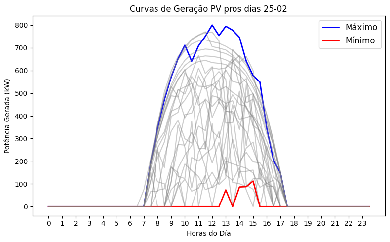

# `<PVFlowNet: Modelo IA Generativo Baseado em Fluxo Normalizador Condicional para Criação de Cenários de Geração Fotovoltaica>`
# `<PVFlowNet: Generative AI Model Based on Conditional Normalizing Flow for Solar Power Generation Scenario Creation>`

## Apresentação

O presente projeto foi originado no contexto das atividades da disciplina de pós-graduação *IA376N - IA generativa: de modelos a aplicações multimodais*, 
oferecida no segundo semestre de 2024, na Unicamp, sob supervisão da Profa. Dra. Paula Dornhofer Paro Costa, do Departamento de Engenharia de Computação e Automação (DCA) da Faculdade de Engenharia Elétrica e de Computação (FEEC).

|Nome  | RA | Especialização|
|--|--|--|
| Luis Alexsander Oroya Alvarado  | 217045  | Eng. Elétrica|
| Washington Stalyn Alvarez Orbe  | 224189  | Eng. Elétrica|

## Resumo 

O projeto tem como objetivo desenvolver uma metodologia para a geração de cenários aplicável à geração fotovoltaica (FV), com o propósito de fornecer suporte a aplicações relacionadas ao dimensionamento e operação de unidades de geração, especialmente distribuídas, presentes em microrredes.

Este trabalho está alinhado com as linhas de atuação e pesquisa dos membros do grupo, particularmente nas áreas de otimização estocástica e planejamento da operação de sistemas elétricos, que requerem cenários capazes de modelar a variabilidade das fontes de energia renováveis. Assim, identificou-se uma oportunidade de pesquisa ao combinar técnicas tradicionais de otimização com modelos de geração de cenários baseados em inteligência artificial, visando garantir de forma ininterrupta o fornecimento de energia elétrica, considerando a confiabilidade na operação dos sistemas elétricos.

### Problemática 

Na operação dos sistemas elétricos, é fundamental um aproveitamento adequado dos diferentes recursos energéticos distribuídos, permitindo sua integração de forma a tornar os sistemas elétricos tradicionais menos centralizados, mais robustos e confiáveis. No entanto, muitas fontes de energia renováveis não são firmes, devido à sua natureza intermitente e variável.

- **Incerteza na Geração Fotovoltaica:** A geração PV apresenta uma variabilidade significativa devido a fatores como localização, clima, horário e sazonalidade. Essa incerteza afeta diretamente a capacidade de prever a quantidade de energia que será gerada e estará disponível em um determinado momento. Como consequência, tanto o planejamento quanto a operação de sistemas elétricos que tenham geração PV tornam-se desafiadores. A ausência de cenários realistas que capturem essa variabilidade pode resultar em falhas no atendimento da demanda energética, comprometendo a confiabilidade da microrrede.

- **Impacto Econômico da Falta de Cenários Precisos:** A falta de cenários confiáveis também impacta financeiramente. No dimensionamento, sistemas subdimensionados geram uma maior dependência de outras fontes, enquanto o superdimensionamento resulta em investimentos elevados sem necessidade. Operacionalmente, decisões baseadas em previsões imprecisas podem resultar no acionamento de geradores de backup ou na compra de energia a preços elevados em momentos de alta demanda. Isso aumenta os custos operacionais e compromete a viabilidade econômica das microrredes, especialmente em sistemas que integram várias fontes renováveis.

### Objetivo Principal:

O objetivo do projeto é desenvolver um modelo generativo normalizado baseado em fluxos, que permita criar cenários prováveis mais desfavoráveis de geração PV, condicionados aos níveis de irradiância e temperatura previstos para uma determinada data.

[Link para a apresentação de slides 1](https://docs.google.com/presentation/d/1wNXzfYHMkaAU3vaD-WrMQe-kaxg19UTsprnQ_qU0eXA/edit?usp=sharing)

[Link para a apresentação de slides 2](https://docs.google.com/presentation/d/1a__ppcP4DdslarqXUyfrLHD8oQKRX4gB-ga-aI3HbXY/edit?usp=sharing)

### Motivação:

- Ajudar no processo de tomada de decisão para um gerenciamento ótimo de sistemas elétricos.
- Desenvolver ferramentas que permitam um planejamento robusto da operação de microrredes.
- Abordar o desafio das incertezas e variabilidade na geração PV.
- Complementar problemas estocásticos e de piores scenarios.

### Dataset Utilizado:

|Base de Dados | Endereço na Web | Resumo descritivo|
|----- | ----- | -----|
|NSRDB |https://nsrdb.nrel.gov/about/what-is-the-nsrdb | O banco de dados nacional de radiação solar é uma coleção valores horários e semi-horários de dados meteorológicos, incluindo as três medições mais comuns de radiação solar. O dataset abrange os Estados Unidos e um conjunto crescente de locais internacionais, sendo a cidade de Nova York a localidade selecionada para este estudo.|

O banco de dados considerado para determinar o nível de produção de energia PV inclui registros meteorológicos das últimas décadas de diversas cidades. Neste estudo, será considerada a cidade de Nova York para a aplicação da metodologia proposta. Os dados são fornecidos em formato .csv, permitindo sua utilização em uma ampla variedade de ferramentas.As principais características do conjunto de dados são as seguintes:

- **Duração:** De 1998 a 2022
- **Taxa de amostragem:** 30 minutos
- **Dados utilizados:** Irradiação horizontal global, temperatura e calendário.

O principal destaque deste dataset é que, embora não forneça diretamente os valores de geração PV, ela contém informações essenciais para seu cálculo. A ideia é utilizá-la para determinar os níveis de produção, relacionando-a com as diferentes variáveis, capacidades e tecnologias que uma planta de geração PV pode ter, as quais serão abordadas neste estudo com o propósito de desenvolver uma metodologia aplicável a diferentes projetos. A seguir, destacam-se as dependências mais importantes.

**Fatores externos:** A temperatura e a irradiância impactam diretamente a geração PV. A irradiância determina a quantidade de energia solar disponível para ser convertida em eletricidade, sendo que maiores níveis de irradiância resultam em maior produção de energia. No entanto, a temperatura elevada pode reduzir a eficiência dos módulos, pois afeta a tensão de operação das células solares. Assim, enquanto a alta irradiância tende a aumentar a geração, o aumento da temperatura pode limitar esse ganho, como mostrado na Figura 1.

Figura 1: Relação entre irradiância e temperatura na geração de energia fotovoltaica.

**Eficiencia dos componentes:** Os painéis solares operam com baixa eficiência quando a irradiância é muito baixa, devido às perdas de ativação e aos limiares mínimos de operação. Da mesma forma, os inversores, ao operar com valores inferiores à sua capacidade nominal, reduzem sua eficiência de conversão de energia devido às perdas e ao consumo energético em relação à energia transformada.

O conjunto de dados foi carregado, verificado, interpolado e dividido para diferentes análises, como detecção de dados atípicos, tendência e sazonalidade, por se tratar de séries temporais. Como resultado dessa etapa de pré-processamento, o primeiro ano do conjunto de dados é apresentado na Figura 2.

Figura 2: Visualização dos dados históricos de geração fotovoltaica para o primeiro ano do conjunto de dados.

Da mesma forma nas Figuras 3 e 4, são apresentados os dados de GHI e temperatura em curvas diárias para um determinado ano, onde são exibidos os valores médios máximos (linha azul pontilhada) e mínimos (linha vermelha pontilhada) das variáveis analisadas, assim como uma curva média representativa de cada um dos meses (linha verde contínua).

Figura 3: Curvas diárias de irradiância global horizontal (GHI) para um ano específico.

Figura 4: Curvas diárias de temperatura para um ano específico.

Por fim, considerando as informações coletadas, utilizam-se modelos matemáticos simples que permitem relacionar as diferentes dependências que afetam a geração PV. Para isso, são propostos valores típicos de variáveis como: a temperatura nominal de operação dos painéis, o fator de temperatura, a eficiência e a potência nominal da planta e de seus conversores. Assim, serão treinados os modelos com resultados como os da Figura 5, onde são apresentadas diferentes curvas para um mesmo dia ao longo dos anos, evidenciando que a geração depende mais diretamente das condições climáticas do que do calendário.

Figura 5: Comparação de curvas de geração de energia fotovoltaica em diferentes anos para um mesmo dia.

## Metodologia Proposta

### 1. Coleta de Dados
- **Dados de Geração Fotovoltaica**: Inicialmente, foi encontrada uma base de dados da Open Power System Data [[1]](#1), que contém dados simulados de geração fotovoltaica (PV) e eólica (vento). No entanto, essa base de dados é limitada por conter apenas dados simulados. Posteriormente, foi obtida uma base de dados meteorológicos fornecida pela NREL (National Renewable Energy Laboratory) [[2]](#2), referente a uma zona específica, que é mais completa e permite selecionar a localização dos dados. Embora essa base não forneça diretamente os valores de geração fotovoltaica, ela contém informações essenciais para calcular a geração a partir da irradiância solar. Os dados foram coletados em intervalos horários e incluem as seguintes características:

  - **Intervalo Temporal**: Coleta em intervalos horários, capturando variações sazonais e diárias que influenciam a geração de energia.
  - **Atributos Selecionados**:
    - **Temperature**: Temperatura ambiente, que afeta a eficiência dos painéis solares.
    - **GHI (Global Horizontal Irradiance)**: Irradiância solar global incidente em uma superfície horizontal, utilizada para estimar a geração fotovoltaica.
    - **Cloud Type**: Tipo de nuvem, que influencia a quantidade de radiação solar recebida.

- **Variáveis Condicionantes**: Além dos dados de geração, variáveis relevantes serão incluídas como condições para os modelos de Normalizing Flows, como **mês** e, em uma segunda etapa, **temperatura**.

### 2. Pré-processamento dos Dados
- **Limpeza dos Dados**: Tratamento de dados ausentes, remoção de outliers e ajustes necessários para garantir a qualidade dos dados.
- **Normalização**: Os dados de geração serão normalizados para garantir que estejam no intervalo adequado para o treinamento do modelo.
- **Divisão do Dataset**: O dataset será dividido em conjuntos de **treinamento**, **validação** e **teste**, com uma proporção de 70%-15%-15%.

### 3. Definição do Modelo
- **Arquitetura do Modelo**: Será utilizado um modelo de **Mask Autoregressive Flow (MAF)**, uma variação dos **Normalizing Flows** que implementa uma estrutura autoregressiva para modelar distribuições complexas. Diferentemente de abordagens como as redes adversariais generativas (GANs) e autoencoders variacionais (VAEs), os Normalizing Flows permitem calcular diretamente a verossimilhança exata dos dados. Isso é possível porque eles aprendem explicitamente a distribuição de probabilidade dos dados, o que também facilita a geração de novos cenários por meio da inversão do flow [[3]](#3). O **MAF** consegue capturar eficientemente as dependências temporais e sazonais presentes nos dados de geração fotovoltaica, ao mesmo tempo em que garante a preservação da estrutura probabilística do modelo. Essa abordagem possibilita capturar de forma precisa as complexidades da geração, mantendo uma estrutura probabilística estável, sem as dificuldades de convergência comuns em outros métodos gerativos [[4]](#4).
- **Variáveis Condicionantes**: Inicialmente, será utilizado o **mês** como a única variável de condição, permitindo que o modelo capture as variações sazonais na geração de energia. Em uma segunda etapa, será incluída a variável **temperatura** para capturar também o impacto climático sobre a geração fotovoltaica.

### 4. Fluxo de Trabalho do Modelo

Figura 6: WorkFlow.

O processo de treinamento e avaliação do modelo pode ser descrito pelo seguinte fluxo de trabalho:

- **Dados Meteorológicos**: São utilizados dados meteorológicos coletados, como temperatura e irradiância solar, que influenciam diretamente a geração fotovoltaica.
   
- **Pré-processamento**: Os dados são pré-processados, o que envolve limpeza, normalização e preparação dos dados para serem utilizados no modelo.

- **Engenharia de Características**: As variáveis meteorológicas são transformados em dados de geração fotovoltaica histórica.

- **Normalizing Flow (MAF)**: Um modelo de **Mask Autoregressive Flow (MAF)** é utilizado para aprender a distribuição probabilística dos dados e gerar cenários sintéticos de geração fotovoltaica. Esse modelo é ajustado tanto com os dados meteorológicos quanto com os dados de geração histórica.

- **Otimização de Hiperparâmetros**: O processo de otimização de hiperparâmetros é realizado utilizando *Grid Search*, buscando os parâmetros ideais para maximizar o desempenho do modelo.

- **Avaliação Inicial (Métricas Loss, RMSE)**: Durante o treinamento do modelo, são utilizadas métricas como *Loss* e *RMSE* para avaliar o desempenho e ajustar os hiperparâmetros.

- **Seleção do Melhor Modelo**: Após o processo de otimização, o melhor modelo é selecionado com base nas métricas de avaliação.

- **Geração de Cenários Sintéticos**: O modelo final é utilizado para gerar dados sintéticos de geração fotovoltaica, que são comparados com os dados históricos.

- **Avaliação dos Cenários Gerados (Métricas RMSE, DTW, Correlação)**: Os cenários gerados são avaliados utilizando métricas adicionais como *RMSE*, *DTW* (Dynamic Time Warping) e correlação, a fim de garantir que os cenários capturam adequadamente as variações observadas nos dados históricos.

- **Classificação de Cenários**: Finalmente, os cenários são classificados com base nessas métricas, permitindo uma análise mais detalhada dos resultados gerados.

### 5. Treinamento
- **Função de Perda**: O treinamento será realizado utilizando uma função de perda baseada na maximização da **log-verossimilhança** dos dados condicionados.
- **Otimizador**: Será utilizado um otimizador como **Adam**.
- **Hiperparâmetros**: Os hiperparâmetros, como o número de camadas intermediárias, o tamanho do batch e a taza de aprendizagem, serão ajustados utilizando a técnica *Grid Search* para encontrar a configuração ótima.

### 6. Avaliação
- **Métricas de Avaliação**:
  - **Log-Verossimilhança (Log-Likelihood)**: Será utilizada para avaliar a adequação da distribuição gerada pelo modelo em relação aos dados reais, medindo a capacidade do modelo de ajustar-se às probabilidades dos dados observados.
  - **Erro Quadrático Médio (RMSE)**: Avaliará a magnitude dos erros ao longo do tempo, penalizando grandes desvios.
  - **Dynamic Time Warping (DTW)**: Comparará a similaridade entre as séries temporais reais e geradas, levando em conta possíveis desalinhamentos temporais.
  - **Correlação Temporal**: Será utilizada para verificar se o modelo captura corretamente as correlações temporais e os padrões de geração fotovoltaica ao longo do tempo [[5]](#5).

- **Análise de Cenários Gerados**: Os cenários gerados serão comparados com os dados reais para verificar se as distribuições de probabilidade aprendidas pelo modelo capturam a variabilidade e as correlações presentes nos dados de geração fotovoltaica.

### 7. Ajustes Adicionais
- **Incorporação da Temperatura**: Após o treinamento inicial, o modelo será ajustado para incluir a temperatura como condição. A análise será repetida para avaliar o impacto dessa variável adicional na geração de cenários.

### 8. Aplicação Final
- **Aplicação Externa**: Neste caso, os cenários gerados pelo modelo serão utilizados como entrada para um problema de dimensionamento e operação de uma microrrede. O objetivo será avaliar o desempenho do modelo ao fornecer dados realistas de geração fotovoltaica para otimizar a capacidade e a operação dos recursos energéticos distribuídos. 

## Cronograma

| Nº da Tarefa | Descrição                                                                 | Data Prevista de Finalização | Semanas Entre Etapas |
|--------------|---------------------------------------------------------------------------|------------------------------|----------------------|
| 1            | Leitura de artigos e familiarização com Normalizing Flows                 | 24/09                        | 2 semanas            |
| 2            | Obtenção da base de dados e definição de métricas de avaliação            | 01/10                        | 1 semana             |
| 3            | Desenvolvimento da estrutura inicial do modelo                            | 08/10                        | 1 semana             |
| 4            | Primeiros resultados com cenários de geração fotovoltaica                 | 22/10                        | 2 semanas            |
| 5            | Validação e ajuste preliminar dos resultados                              | 05/11                        | 2 semanas            |
| 6            | Avaliação final do modelo e ajustes necessários                           | 25/11                        | 3 semanas            |

## Referências Bibliográficas
> Apontar nesta seção as referências bibliográficas adotadas no projeto.

<a id="1">[1]</a> : Open Power System Data. *Renewables.ninja PV and Wind Profiles*. Disponível em: https://data.open-power-system-data.org/ninja_pv_wind_profiles/. Acesso em: setembro de 2024.
<a id="1">[2]</a> : National Renewable Energy Laboratory (NREL). National Solar Radiation Database (NSRDB). Disponível em: https://nsrdb.nrel.gov/. Acesso em: setembro de 2024.
<a id="2">[3]</a> : Dumas J, Wehenkel A, Lanaspeze D, Cornélusse B, Sutera A. A deep generative model for probabilistic energy forecasting in power systems: Normalizing flows. Appl Energy 2022;305:117871.
<a id="3">[4]</a> : Winkler, C., Worrall, D., Hoogeboom, E., & Welling, M. (2023). Learning Likelihoods with Conditional Normalizing Flows. arXiv. https://arxiv.org/abs/1912.00042
<a id="4">[5]</a> : E. Cramer, L. R. Gorjão, A. Mitsos, B. Schäfer, D. Witthaut and M. Dahmen, "Validation Methods for Energy Time Series Scenarios From Deep Generative Models," in IEEE Access, vol. 10, pp. 8194-8207, 2022, doi: 10.1109/ACCESS.2022.3141875