# `<PVFlowNet: Modelo IA Generativo Baseado em Fluxo Normalizador Condicional para Criação de Cenários de Geração Fotovoltaica>`
# `<PVFlowNet: Generative AI Model Based on Conditional Normalizing Flow for Solar Power Generation Scenario Creation>`

## Apresentação

O presente projeto foi originado no contexto das atividades da disciplina de pós-graduação *IA376N - IA generativa: de modelos a aplicações multimodais*, 
oferecida no segundo semestre de 2024, na Unicamp, sob supervisão da Profa. Dra. Paula Dornhofer Paro Costa, do Departamento de Engenharia de Computação e Automação (DCA) da Faculdade de Engenharia Elétrica e de Computação (FEEC).

|Nome  | RA | Especialização|
|--|--|--|
| Luis Alexsander Oroya Alvarado  | 217045  | Eng. Elétrica|
| Washington Stalyn Alvarez Orbe  | 224189  | Eng. Elétrica|

## Resumo 

O projeto tem como objetivo desenvolver uma metodologia para a geração de cenários sintéticos aplicável às curvas diárias de produção de energia fotovoltaica (FV), com o propósito de fornecer suporte a aplicações relacionadas ao dimensionamento de equipamentos e à operação de unidades de geração, especialmente ao considerar as fontes de energia distribuídas presentes em microrredes.

Este trabalho está alinhado às linhas de atuação e pesquisa dos membros do grupo, envolvendo as áreas de otimização estocástica e planejamento da operação de sistemas elétricos, que demandam cenários capazes de modelar a variabilidade das fontes de energia renovável. Nesse contexto, identificou-se uma oportunidade de pesquisa ao combinar técnicas tradicionais de otimização com modelos de geração de cenários baseados em inteligência artificial, com o objetivo de garantir, de forma contínua e ininterrupta, o fornecimento de energia elétrica, considerando a confiabilidade na operação dos sistemas elétricos.

### Problemática 

Na operação dos sistemas elétricos, é fundamental compreender as características dos diferentes recursos energéticos para que sejam aproveitados de forma eficiente, facilitando sua integração aos sistemas elétricos tradicionais. Essa integração contribui para tornar os sistemas menos centralizados, além de mais robustos e confiáveis. No entanto, muitas fontes de energia renovável apresentam limitações no fornecimento contínuo devido à sua natureza intermitente e variável. Por isso, é crucial considerar alguns pontos relevantes:

- **Incerteza na Geração Fotovoltaica:** Os sistemas de geração FV apresentam uma variabilidade significativa, influenciada por fatores como localização, condições climáticas, horário e sazonalidade. Essa incerteza impacta diretamente a capacidade de prever a quantidade de energia disponível em um determinado momento. Como consequência, o planejamento e a operação de sistemas elétricos com geração FV tornam-se mais desafiadores. Nesse sentido, a ausência de cenários realistas que capturem essa variabilidade pode resultar em problemas, como o não atendimento à demanda energética, comprometendo a confiabilidade dos sistemas elétricos, especialmente microrredes.

- **Implicação Econômica por falta de Precisão:** A falta de cenários confiáveis também gera impactos financeiros significativos. No dimensionamento de equipamentos, sistemas subdimensionados aumentam a dependência de outras fontes, enquanto superdimensionamentos levam a investimentos desnecessariamente elevados. Do ponto de vista operacional, decisões baseadas em previsões imprecisas podem resultar no acionamento de geradores de backup ou na compra de energia a preços elevados durante períodos de alta demanda. Esses fatores elevam os custos operacionais e comprometem a viabilidade econômica das microrredes, especialmente em sistemas que integram múltiplas fontes renováveis ou que operam de forma ilhada.

### Objetivo Principal:

O objetivo do projeto é desenvolver um modelo generativo normalizado baseado em fluxos, capaz de criar cenários realistas e diversificados de geração FV, com o propósito de poder categorizar e classificar as amostras sintéticas para diferentes aplicações pretendidas. Os cenários gerados serão condicionados aos diferentes meses e estações do ano, utilizando dados históricos de irradiância e temperatura coletados ao longo das últimas décadas.

[Link para a apresentação de slides 1](https://docs.google.com/presentation/d/1wNXzfYHMkaAU3vaD-WrMQe-kaxg19UTsprnQ_qU0eXA/edit?usp=sharing)

[Link para a apresentação de slides 2](https://docs.google.com/presentation/d/1a__ppcP4DdslarqXUyfrLHD8oQKRX4gB-ga-aI3HbXY/edit?usp=sharing)

[Link para a apresentação de slides 3](https://docs.google.com/presentation/d/1sqljF7Vo35KCv6Z2VMewMtRTCY6XZRJPLQbWZotWMKk/edit?usp=sharing)

### Motivação:

- Ajudar no processo de tomada de decisão para um gerenciamento ótimo de sistemas elétricos.
- Desenvolver ferramentas que permitam um planejamento robusto da operação de microrredes.
- Abordar o desafio das incertezas e variabilidade na geração FV.
- Complementar problemas estocásticos e de classificação de cenários.

### Modelos Condicionais Generativos Baseados em Fluxos Normalizados:

Os normalizing flows são uma classe de modelos generativos profundos (geralmente formadas por redes neurais) que utilizam transformações invertíveis para descrever a distribuição de probabilidade de um conjunto de dados e gerar novas amostras a partir dessa distribuição. Sua principal vantagem é fornecer uma representação explícita da função densidade de probabilidade (PDF), o que permite um treinamento matematicamente consistente e eficiente por meio da maximização da verossimilhança. A Figura 1 ilustra a estrutura básica dos modelos em suas versões condicionadas e não condicionadas.

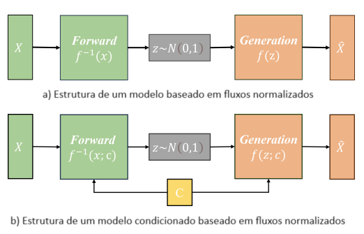

Figura 1: Estrutura de modelos baseados em fluxos normalizados.

Os modelos generativos baseados em fluxos podem ser estendidos para modelos generativos condicionais ao fornecer uma informação auxiliar *c* como entrada de condicionamento durante o processo de treinamento. A Figura 2 demonstra como essa função empilhada transforma uma distribuição Gaussiana simples em uma distribuição de dados *P(x|c)* e vice-versa. Ao empilhar transformações invertíveis *fi*, a capacidade de modelagem de *f* é aumentada, permitindo que a função *f* simule distribuições de dados mais complexas.

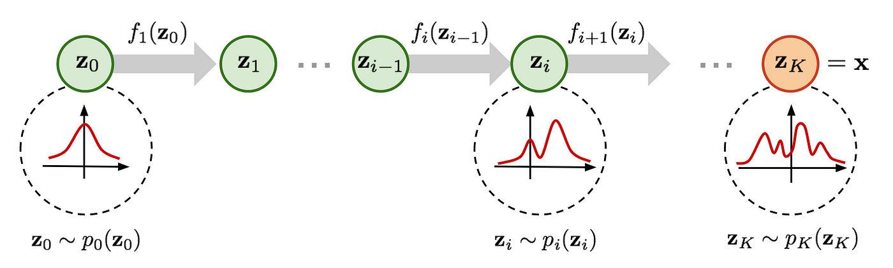

Figura 2: Transformação de uma distribuição Gaussiana em uma distribuição alvo complexa e vice-versa.

### Dataset Utilizado e Características:

|Base de Dados | Endereço na Web | Resumo descritivo|
|----- | ----- | -----|
|NSRDB |https://nsrdb.nrel.gov/about/what-is-the-nsrdb | O banco de dados nacional de radiação solar é uma coleção de valores horários e semi-horários de dados meteorológicos, incluindo as três medições mais comuns de radiação solar. O dataset abrange os Estados Unidos e um número crescente de locais internacionais.|

O banco de dados considerado para determinar o nível de produção de energia FV inclui registros meteorológicos das últimas décadas de diversas cidades. Neste estudo, será considerada a cidade de Nova York para a aplicação da metodologia proposta. Os dados são fornecidos em formato .csv, permitindo sua utilização em uma ampla variedade de ferramentas. As principais características do conjunto de dados são as seguintes:

- **Duração:** De 1998 a 2022
- **Taxa de amostragem:** 30 minutos
- **Dados utilizados:** Irradiância solar, temperatura e calendário.

O conjunto de dados foi carregado, verificado, interpolado e dividido para diferentes análises, como detecção de dados atípicos, identificação de tendências e sazonalidade, por se tratar de séries temporais. Como resultado dessa etapa, a Figura 3 apresenta o primeiro ano do conjunto de dados, oferecendo uma visão da relação entre as variáveis consideradas nesse período e do comportamento esperado para os anos subsequentes.

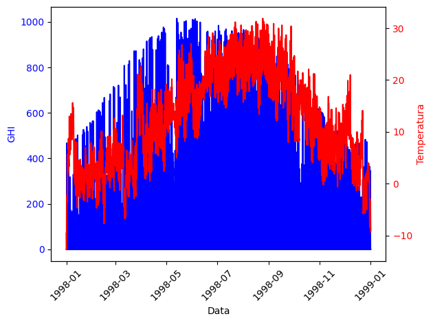

Figura 3: Visualização dos dados históricos de geração fotovoltaica para o primeiro ano do conjunto de dados.

O principal destaque deste dataset é que, embora não forneça diretamente os valores de geração FV, ela contém informações essenciais para seu cálculo. A ideia é utilizá-la para determinar os níveis de produção, relacionando-a com as diferentes variáveis, capacidades e tecnologias que uma planta de geração FV pode ter, as quais serão abordadas neste estudo com o propósito de desenvolver uma metodologia aplicável a diferentes projetos. A seguir, destacam-se as dependências mais importantes que são consideradas:

**Fatores externos:** A temperatura e a irradiância impactam diretamente a geração FV. A irradiância determina a quantidade de energia solar disponível para ser convertida em eletricidade, sendo que maiores níveis de irradiância resultam em maior produção de energia. No entanto, a temperatura elevada pode reduzir a eficiência dos módulos, pois afeta a tensão de operação das células solares. Assim, enquanto a alta irradiância tende a aumentar a geração, o aumento da temperatura pode limitar esse ganho, como mostrado na Figura 4.

Figura 4: Relação entre irradiância e temperatura na geração de energia fotovoltaica.

**Eficiencia dos componentes:** Os painéis solares operam com baixa eficiência quando a irradiância é muito baixa, devido às perdas de ativação e aos limiares mínimos de operação. Da mesma forma, os inversores, ao operar com valores inferiores à sua capacidade nominal, reduzem sua eficiência de conversão de energia devido às perdas e ao consumo energético em relação à energia transformada.

## Metodologia Proposta

### 1. Coleta e Análise dos Dados

- **Dados de Geração Fotovoltaica**: Como mencionado na seção de *Dataset*, foi utilizada uma base de dados meteorológicos fornecida pelo NREL (National Renewable Energy Laboratory) [[1]](#1),  referente à região de Nova York. Essa base de dados é completa e extensa em termos das informações disponíveis. Das características coletadas, foram selecionadas as seguintes para serem utilizadas neste projeto:

  - **Intervalo Temporal e Condicionante**: As informações coletadas são utilizadas para representar as curvas horárias de cada dia dentro do *Dataset*, com o objetivo de capturar os padrões, bem como as variações entre **estações** e **meses** dos dados, que são incluídas como condições para os modelos baseados em fluxos normalizados.

  - **Atributos Selecionados**:
    - **Temperature**: A temperatura ambiente afeta diretamente a eficiência dos painéis solares. A Figura 5 ilustra, para o ano de 2020, como as estações do ano alteram consideravelmente esse parâmetro em cada mês, podendo até mesmo atingir valores negativos. Além disso, evidencia-se que, nos meses mais frios, as variações ao longo do dia são menores. Na figura, são apresentados os valores médios máximos (linha azul pontilhada) e mínimos (linha vermelha pontilhada) para cada mês, além de uma curva média representativa (linha verde contínua).

    

    Figura 5: Curvas diárias de temperatura para os meses do ano 2020.

    - **GHI (Global Horizontal Irradiance)**: A irradiância solar global é aquela que incide na superfície horizontal e é utilizada para estimar a geração fotovoltaica. A Figura 6 apresenta, assim como na figura anterior, as curvas máximas, mínimas e representativas de cada mês. Nota-se que a variabilidade dos níveis de irradiância é independente do mês, o que torna desafiador determinar uma faixa ou curva única que represente cada período. Além disso, observa-se a influença das estações com o mês de junho apresentando os valores mais altos, devido ao verão, enquanto o mês de dezembro apresenta os valores mais baixos, característicos do inverno.

    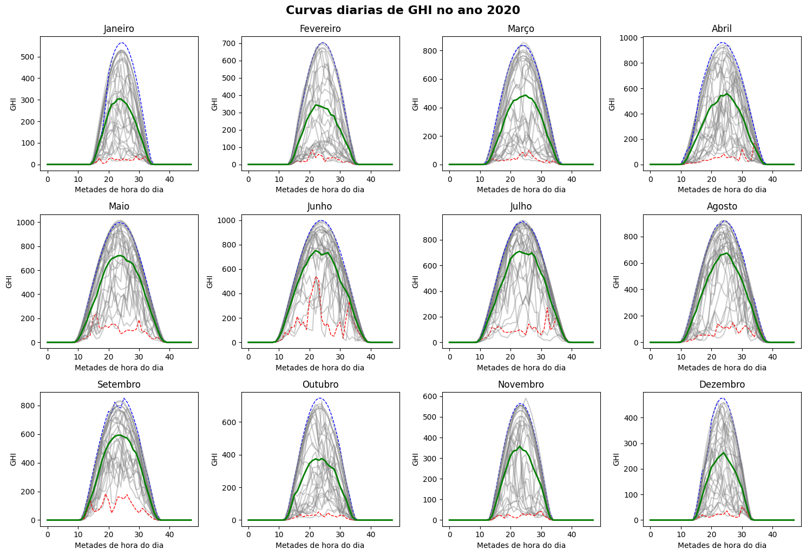

    Figura 6: Curvas diárias de irradiância global horizontal (GHI) para os meses do ano 2020.

### 2. Pré-processamento dos Dados
- **Cálculos para o Projeto Solar Definido**: Como mencionado nos objetivos e no *Dataset* deste trabalho, a ideia é utilizar as informações disponíveis para uma variedade de projetos, desde que se considerem as características básicas de uma usina na geração de energia FV, levando em conta sua eficiência e capacidade de produção relacionadas à tecnologia empregada e aos fatores externos que a influenciam.

Dessa forma, juntamente com as informações coletadas, são utilizados modelos matemáticos simples que permitem relacionar as diferentes dependências que afetam a geração FV. Para isso, são propostos valores típicos de parâmetros, como: a temperatura nominal de operação dos painéis (NOCT), o fator de temperatura dos painéis (Ft), a eficiência (Ef) e a potência nominal (Pnom) da planta e de seus conversores (Pfv), e, por fim, as funções de operação mínima dos painéis e dos conversores (Pmin), conforme resumido nas formulações a seguir:

$$ P_{GHI} = P_{Nom} \cdot \frac{GHI}{1000} $$

$$ T_{cel} = \frac{NOCT - 20}{800} \cdot GHI $$

$$ E_{f-Temp} = (25 - T_{amb} + T_{cel}) \cdot F_t $$

$$ E_{FV} = \frac{E_{f-cel} + E_{f-Temp}}{E_{f-cel}} $$

$$ P_{Gen} = P_{GHI} \cdot E_{FV} $$

$$ P_{min-FV} = f(GHI) $$

$$ P_{min-Conv} = f(P_{Gen}) $$

Com a informação de GHI, temperatura e as relações matemáticas definidas, é possível estabelecer as características de um projeto de estudo que permita calcular as potências geradas. Neste estudo, será considerada uma usina FV com capacidade de 1000 kWp, módulos com Ef=16%, Ft=0,4%/°C e NOCT = 45°C, além de potências mínimas de operação variando entre 5% e 10%. Tudo isso, juntamente com limitações e funções não lineares, permitiu calcular as potências geradas em função das condições climáticas para cada hora, ao longo de 24 anos. Essas informações serão usadas como entrada do modelo, juntamente com as condições de sazonalidade e variações mensais.

Para ilustrar os resultados dessa etapa, a Figura 7 apresenta diferentes curvas de geração para um mesmo dia ao longo dos anos, evidenciando que a geração FV depende mais diretamente das condições climáticas do que do calendário.

Figura 7: Comparação de curvas de geração de energia fotovoltaica em diferentes anos para um mesmo dia.

- **Limpeza dos Dados**: O processo de pré-processamento começa com a leitura do arquivo CSV contendo os dados de geração de energia fotovoltaica (FV). A coluna de data é convertida para o formato `datetime`, e os dados são classificados pela data para garantir que as observações estejam organizadas temporalmente. Durante esse processo, qualquer dado ausente ou inválido pode ser identificado e tratado. Além disso, os valores de potência gerada (`P_Gen`) são ajustados, sendo divididos por 1000 para reduzir a dimensionalidade.
- **Normalização**: Após a limpeza e organização dos dados, a normalização é aplicada para garantir que os valores da geração de energia fotovoltaica (`P_Gen`) estejam em um intervalo adequado para o treinamento do modelo. A normalização é feita utilizando o **MinMaxScaler**, que ajusta os valores para o intervalo [0, 1], melhorando a convergência e o desempenho do modelo de aprendizado de máquina. Essa etapa é importante, pois as variáveis podem ter escalas muito diferentes, o que pode prejudicar o desempenho de modelos baseados em gradiente ou outras técnicas sensíveis à escala dos dados.
- **Preparação para o Modelo**: Uma vez que os dados foram limpos e normalizados, eles são preparados para serem utilizados no treinamento do modelo. A função `process_pv_data` organiza as informações em perfis diários de geração de energia, selecionando os dados das 24 horas de cada dia. Os dados são divididos em pontos de índice par (0, 2, 4, ..., 46), que representam a geração de energia cada hora. Além disso, a coluna `month` é adicionada para identificar o mês do ano em que os dados foram coletados.
- **Transformação em Tensores**: A função `prepare_data` prepara os dados para serem alimentados no modelo. Os valores normalizados são então transformados em tensores. A coluna `month`, que contém informações sobre o mês de cada dado, também é transformada em um tensor para ser utilizada como variável adicional no modelo.

### 3. Definição do Modelo
- **Testes e Experimentos**: Diversos testes foram realizados para aprimorar os modelos considerados em diferentes cenários, avançando de modelos simples para estruturas mais complexas. Os principais destaques incluem:
  - **Condicionalidade:** Modelos inicialmente sem condicionamento foram testados para avaliar sua capacidade de capturar padrões, ontendo resultados satisfatorios. Posteriormente, foram adicionadas condições de sazonalidade e mês, com planos de explorar novas possibilidades.
  - **Estrutura autorregressiva:** Testes variaram desde camadas simples a redes MLP personalizadas com profundidade e número de neurônios ajustáveis, experimentando combinações de compressão, expansão e uma mistura dessas arquiteturas em diferentes níveis de complexidade e identificando as melhores configurações para o problema.
  - **Permutação dos dados:** Foi utilizada a permutação nos dados de entrada, observando que, devido à relação sequencial fixa dos dados horários, essa abordagem pode não ser ideal, considerando a estrutura temporal inerente dos mesmos.
  - **Inclusão de redes recorrentes (RNN):** Uma ideia promissora, que até o momento não apresentou bons resultados (sím na função perda e não nos resultados gráficos), foi a incorporação de RNNs dentro dos fluxos normalizados, com a intenção de capturar padrões temporais mais complexos. Essa abordagem continua em análise, enfrentando o desafio de como integrar funções reversíveis nesse tipo de rede dentro do processo de fluxos.

- **Arquitetura do Modelo**: Será utilizado um modelo de **Mask Autoregressive Flow (MAF)**, uma variação dos **Normalizing Flows** que implementa uma estrutura autoregressiva para modelar distribuições complexas. Diferentemente de abordagens como as redes adversariais generativas (GANs) e autoencoders variacionais (VAEs), os Normalizing Flows permitem calcular diretamente a verossimilhança exata dos dados. Isso é possível porque eles aprendem explicitamente a distribuição de probabilidade dos dados, o que também facilita a geração de novos cenários por meio da inversão do flow [[3]](#3). O **MAF** consegue capturar eficientemente as dependências temporais e sazonais presentes nos dados de geração fotovoltaica, ao mesmo tempo em que garante a preservação da estrutura probabilística do modelo. Essa abordagem possibilita capturar de forma precisa as complexidades da geração, mantendo uma estrutura probabilística estável, sem as dificuldades de convergência comuns em outros métodos gerativos [[4]](#4).

- **Variáveis Condicionantes**: Será utilizado o **mês** como a única variável de condição, permitindo que o modelo capture as variações sazonais na geração de energia.
  
### 4. Fluxo de Trabalho do Modelo

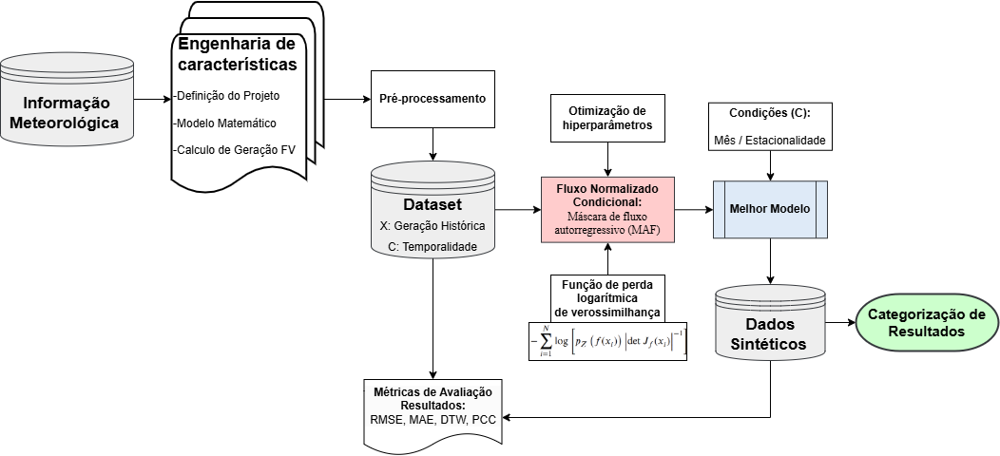

Figura 8: Proceso de geração de dados sintéticos.

O processo de treinamento e avaliação do modelo pode ser descrito pelo seguinte fluxo de trabalho:

- **Dados Meteorológicos**: São utilizados dados meteorológicos coletados, como temperatura e irradiância solar, que influenciam diretamente a geração fotovoltaica.
   
- **Pré-processamento**: Os dados são pré-processados, o que envolve limpeza, normalização e preparação dos dados para serem utilizados no modelo.

- **Engenharia de Características**: As variáveis meteorológicas são transformados em dados de geração fotovoltaica histórica.

- **Normalizing Flow (MAF)**: Um modelo de **Mask Autoregressive Flow (MAF)** é utilizado para aprender a distribuição probabilística dos dados e gerar cenários sintéticos de geração fotovoltaica. Esse modelo é ajustado tanto com os dados meteorológicos quanto com os dados de geração histórica.

- **Otimização de Hiperparâmetros**: O processo de otimização de hiperparâmetros é realizado utilizando *Grid Search*, buscando os parâmetros ideais para maximizar o desempenho do modelo.

- **Avaliação Inicial (Métricas Loss, RMSE)**: Durante o treinamento do modelo, são utilizadas métricas como *Loss* e *RMSE* para avaliar o desempenho e ajustar os hiperparâmetros.

- **Seleção do Melhor Modelo**: Após o processo de otimização, o melhor modelo é selecionado com base nas métricas de avaliação.

- **Geração de Cenários Sintéticos**: O modelo final é utilizado para gerar dados sintéticos de geração fotovoltaica, que são comparados com os dados históricos.

- **Avaliação dos Cenários Gerados (Métricas RMSE, DTW, Correlação)**: Os cenários gerados são avaliados utilizando métricas adicionais como *RMSE*, *DTW* (Dynamic Time Warping) e correlação, a fim de garantir que os cenários capturam adequadamente as variações observadas nos dados históricos.

- **Classificação de Cenários**: Finalmente, os cenários são classificados com base nessas métricas, permitindo uma análise mais detalhada dos resultados gerados e pudendo ser categorizados seguno o tipo de dado para seu uso o finalidade. como por ejemplo cenários típicos, meios, favoráveis ou extremos.

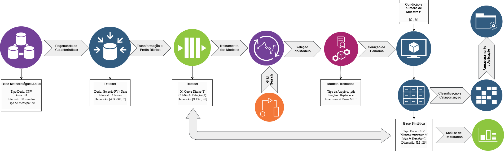

Figura 9: WorkFlow detalhado da informação.

### 5. Treinamento

- `model`: O modelo MAF será treinado.
- `data`: Os dados de entrada (geração de energia fotovoltaica).
- `conditions`: As condições adicionais que são usadas para treinar o modelo (neste caso, o mês).
- `num_epochs`: O número de épocas de treinamento (default é 300).
- `batch_size`: O tamanho do lote de dados a ser processado por vez (default é 64).
- `learning_rate`: Taxa de aprendizado para o otimizador (default é 1e-4).
- `otimizador`: O otimizador Adam será utilizado.

O otimizador é configurado com uma taxa de aprendizado e um pequeno valor de **weight decay** para evitar overfitting durante o treinamento. A função inicia o treinamento por meio de um loop de épocas, onde, para cada época, o modelo é treinado com os dados. O total de perdas é acumulado para calcular a média ao final de cada época. Para garantir que o modelo não aprenda padrões específicos da ordem dos dados, os índices dos dados são embaralhados a cada época. Isso permite uma melhor generalização do modelo. Os dados são divididos em lotes, e o modelo é treinado por um lote de dados por vez. Cada lote é alimentado com os dados de entrada e as condições associadas a ele. Para cada lote, a função de perda (maximizar a log-verossimilhança) é calculada. Ela é dada pela **negativa da média** das saídas do modelo. O otimizador executa a **backpropagation** para ajustar os pesos do modelo, utilizando o cálculo do gradiente. O valor da perda é somado para cada lote, e no final de cada época, a **média da perda** é calculada e armazenada. A perda média é então exibida, permitindo o acompanhamento do progresso do treinamento. Após o término de todas as épocas, a função retorna o modelo treinado e a lista de perdas ao longo do treinamento.

### 6. Avaliação
- **Métricas de Avaliação**:
  - **Log-Verossimilhança (Log-Likelihood)**: Será utilizada para avaliar a adequação da distribuição gerada pelo modelo em relação aos dados reais, medindo a capacidade do modelo de ajustar-se às probabilidades dos dados observados.
  - **Erro Quadrático Médio (RMSE)**: Avaliará a magnitude dos erros ao longo do tempo, penalizando grandes desvios.
  - **Erro Absoluto Médio (MAE)**: Medirá a média dos erros absolutos entre as séries temporais reais e geradas. Quanto menor o MAE, melhor o modelo.
  - **Dynamic Time Warping (DTW)**: Comparará a similaridade entre as séries temporais reais e geradas, levando em conta possíveis desalinhamentos temporais.
  - **Coeficiente de Pearson**: Será utilizado para medir a força e a direção da relação linear entre as séries temporais reais e geradas. O coeficiente varia de -1 a +1, onde +1 indica correlação positiva perfeita, -1 indica correlação negativa perfeita e 0 indica nenhuma correlação linear. Quanto mais próximo de +1 ou -1, mais forte é a correlação. [[5]](#5).

- **Análise de Cenários Gerados**: Os cenários gerados serão comparados com os dados reais para verificar se as distribuições de probabilidade aprendidas pelo modelo capturam a variabilidade e as correlações presentes nos dados de geração fotovoltaica.

### 7. Resultados
#### 1. **Função de Perda (Negative Log Likelihood)**
A função de perda, representando a **Negative Log Likelihood (NLL)**, é usada para avaliar o quão bem o modelo se ajusta aos dados durante o treinamento. O gráfico abaixo mostra a evolução da perda ao longo de 500 épocas:

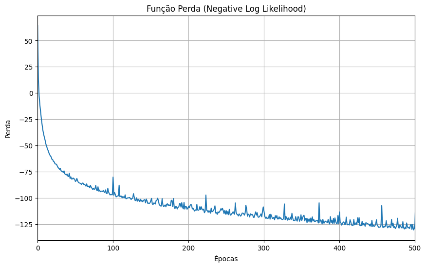
Figura 10: Função de perda do modelo MAF.

Como observado no gráfico, a perda diminui drasticamente nas primeiras épocas, indicando que o modelo está rapidamente aprendendo os padrões gerais dos dados. No entanto, após a queda inicial, a curva de perda se estabiliza, com algumas flutuações que sugerem que o modelo enfrenta dificuldades em ajustar os aspectos mais complexos dos dados. 

#### 2. **Métricas de Desempenho**
O desempenho do modelo foi avaliado usando as seguintes métricas apresentadas na seção anterior para cada mês. Os resultados estão resumidos na tabela abaixo:

| Mês   | MAE      | RMSE     | PCC      | DTW      |
|-------|----------|----------|----------|----------|
|	1     |	0.003549 | 0.005528 | 0.999409 | 0.085168 |
|	2     |	0.012055 | 0.019096 | 0.998592 | 0.271560 |
|	3     |	0.004317 | 0.008037 | 0.999489 | 0.103602 |
|	4     |	0.008647 | 0.013266 | 0.999150 | 0.184066 |
|	5     |	0.011600 | 0.017169 | 0.999238 | 0.237809 |
|	6     |	0.017644 | 0.028902 | 0.992001 | 0.356164 |
|	7     |	0.014495 | 0.021316 | 0.999030 | 0.348725 |
|	8     |	0.008064 | 0.013400 | 0.997007 | 0.134434 |
|	9     |	0.007994 | 0.013683 | 0.997246 | 0.153324 |
|	10    |	0.009340 | 0.015100 | 0.997793 | 0.209032 |
|	11    |	0.008421 | 0.014142 | 0.997301 | 0.193957 |
|	12    |	0.016930 | 0.027093 | 0.998354 | 0.366954 |

Como visto na tabela, o modelo apresenta um bom desempenho para a maioria dos meses, com **MAE**, **RMSE** baixos e **PCC** alto. Para os meses **1**, **3** e **5**, o modelo apresenta uma correlação muito alta com os dados reais (PCC perto de 1), indicando que os dados sintéticos imitam de forma eficaz os perfis de geração real. No entanto, nos meses **6** e **12**, os valores de **DTW** e **MAE** aumentam, sugerindo que o modelo tem dificuldades em capturar a variação de geração nesses meses.

#### 3. **Comparação Gráfica entre Perfis Sintéticos e Reais**

A seguir, são apresentadas as visualizações que comparam os perfis sintéticos gerados pelo modelo com os perfis reais para meses selecionados. Em cada gráfico, a **linha verde** representa o perfil médio, a **linha azul pontilhada** indica o perfil máximo e a **linha vermelha pontilhada** representa o perfil mínimo para aquele mês.

| Mês   | Descrição                                                                                     | Comparação                                                                                          |
|-------|------------------------------------------------------------------------------------------------|--------------------------------------------------------------------------------------------------|
| Mês 3 | Os perfis sintéticos correspondem muito bem aos perfis reais, com ambos os perfis máximo e mínimo sendo capturados de forma eficaz. O perfil médio segue de perto os dados reais, com pequenas variações. | 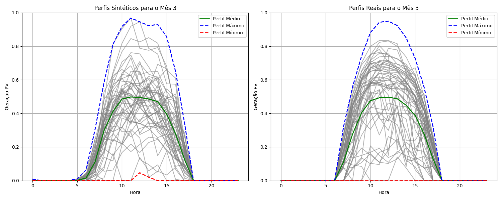   Figura 11: Perfis sintéticos e reais para o mês 3. |
| Mês 5 | O modelo apresenta bom desempenho, com uma clara correspondência entre os perfis sintéticos e reais, especialmente para os perfis médios e máximos. |    Figura 12: Perfis sintéticos e reais para o mês 5. |
| Mês 6 | O modelo apresenta bom desempenho, mas há alguns outliers nos dados sintéticos. O perfil geral é bem capturado, embora existam instâncias com desvios notáveis. | 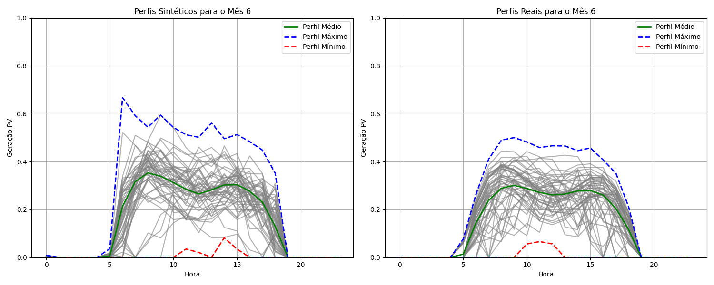   Figura 13: Perfis sintéticos e reais para o mês 6. |
| Mês 7 | Semelhante ao mês 6, os perfis sintéticos estão em grande parte alinhados com os perfis reais, mas há algumas instâncias de desvios notáveis, especialmente no perfil máximo de geração. |    Figura 14: Perfis sintéticos e reais para o mês 7. |

Para o mês 11, o modelo tem mais dificuldades em comparação com os meses anteriores. Embora o **perfil médio sintético** esteja próximo aos dados reais, há grandes desvios nos **perfís máximo**, o que indica uma limitação na capacidade do modelo de capturar toda a gama de variação na geração para esse mês.
O mês 12 apresenta as maiores discrepâncias entre os dados sintéticos e reais. O perfís máximos não são tão bem capturados, e os dados sintéticos apresentam grandes variações, o que se alinha aos valores mais elevados de **DTW** e **MAE** observados nas métricas. 

A partir das avaliações realizadas para os meses 11 e 12, com o modelo treinado utilizando 300 e 500 épocas, foi possível observar que o aumento no número de epochs contribui para uma melhor captura dos padrões nos dados reais, especialmente em relação aos perfis máximos. Embora o modelo ainda apresente limitações em ambos os meses, o treinamento com mais epochs resulta em uma melhoria significativa nas métricas, como DTW e MAE, além de reduzir os desvios observados nos perfis. Essas melhorias são evidentes nas figuras abaixo, que ilustram o desempenho do modelo em diferentes configurações de epochs.

| Mês   | Épocas | Desempenho                                                                                     | Comparação                                         |
|-------|--------|-----------------------------------------------------------------------------------------------|-----------------------------------------------|
| **11** | **300**  | Baixo desempenho com discrepâncias notáveis nos perfis máximos.                     | 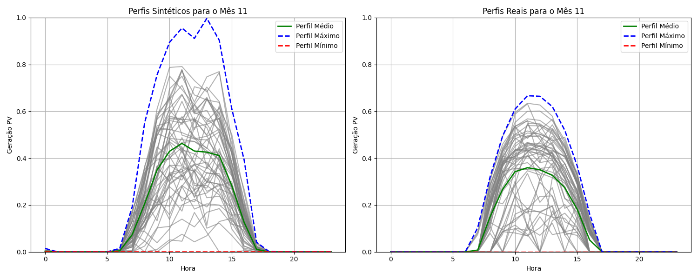   Figura 15: Perfis sintéticos e reais para o mês 11 com 300 épocas.|
|       | **500**  | Melhoria na captura dos perfis máximos, com menores desvios em relação aos dados reais.       | 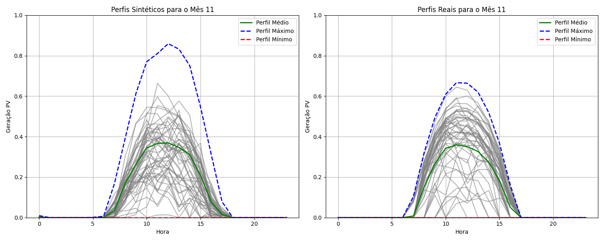  Figura 16: Perfis sintéticos e reais para o mês 11 com 500 épocas.|
| **12** | **300**  | Desempenho limitado, com discrepâncias maiores, especialmente nos perfis máximos.            | 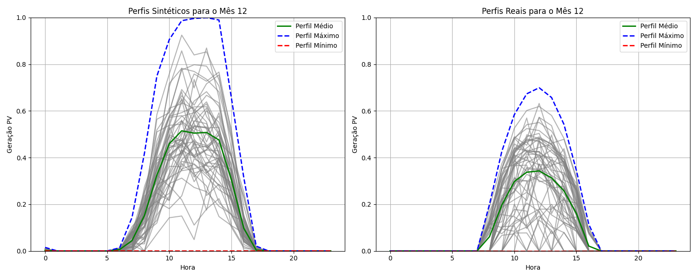   Figura 17: Perfis sintéticos e reais para o mês 12 com 300 épocas.|
|       | **500**  | Melhorias significativas, com perfis máximos melhor capturados.                              | 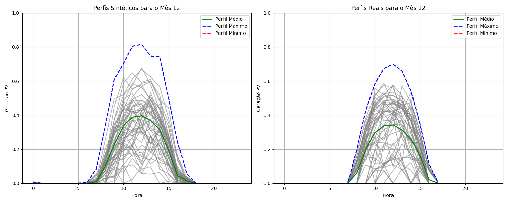   Figura 18: Perfis sintéticos e reais para o mês 12 com 500 épocas.|

Adicionalmente, dois gráficos de dispersão baseados na análise de componentes principais (PCA) são apresentados. Eles ilustram a comparação entre perfis reais e sintéticos para os meses 1 e 3. Nesses gráficos, cada ponto representa um perfil projetado no espaço reduzido pelo PCA, onde os marcadores azuis correspondem aos perfis reais e os marcadores vermelhos aos perfis sintéticos. Os centróides de cada conjunto estão destacados, com o centróide azul representando o agrupamento dos dados reais e o centróide vermelho representando o agrupamento dos dados sintéticos.

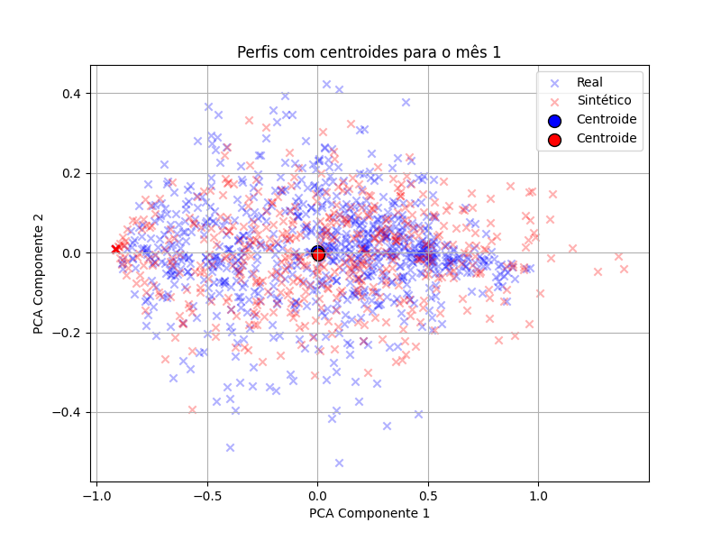

Figura 19: Perfis reais e sintéticos no espaço PCA para o mês 1.

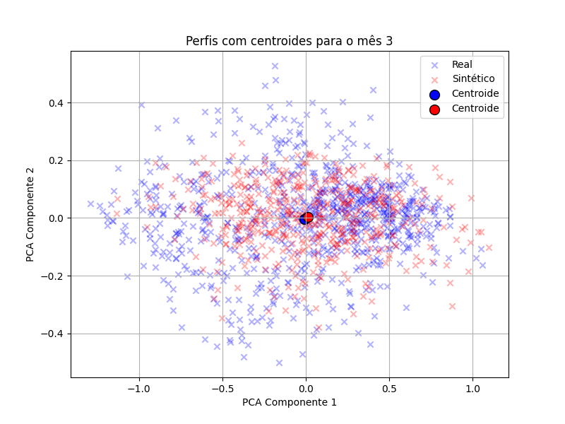

Figura 20: Perfis reais e sintéticos no espaço PCA para o mês 3.

Observa-se que os perfis sintéticos estão bem alinhados com os perfis reais, dado que os agrupamentos de ambos os conjuntos apresentam uma sobreposição significativa em sua distribuição. Essa sobreposição evidencia a capacidade do modelo de capturar os padrões gerais dos dados reais. Para o mês 1, nota-se que os dados sintéticos se estendem levemente além do agrupamento principal dos perfis reais em algumas direções, indicando pequenas variações nos dados gerados. De forma similar, no mês 3, os agrupamentos exibem uma boa correspondência, embora alguns pontos dispersos sugiram desvios mínimos no processo de geração sintética.

### 8. Aplicação Final
- **Aplicação Externa**: Neste caso, os cenários gerados pelo modelo serão utilizados como entrada para um problema de dimensionamento e operação de uma microrrede. O objetivo será avaliar o desempenho do modelo ao fornecer dados realistas de geração fotovoltaica para otimizar a capacidade e a operação dos recursos energéticos distribuídos. 

## Cronograma

| Nº da Tarefa | Descrição                                                                 | Data Prevista de Finalização | Semanas Entre Etapas |
|--------------|---------------------------------------------------------------------------|------------------------------|----------------------|
| 1            | Leitura de artigos e familiarização com Normalizing Flows                 | 24/09                        | 2 semanas            |
| 2            | Obtenção da base de dados e definição de métricas de avaliação            | 01/10                        | 1 semana             |
| 3            | Desenvolvimento da estrutura inicial do modelo                            | 08/10                        | 1 semana             |
| 4            | Primeiros resultados com cenários de geração fotovoltaica                 | 22/10                        | 2 semanas            |
| 5            | Validação e ajuste preliminar dos resultados                              | 05/11                        | 2 semanas            |
| 6            | Avaliação final do modelo e ajustes necessários                           | 25/11                        | 3 semanas            |

## Proceso de Execução 
O processo de execução está dividido em dois scripts principais: main.py e evaluation.py.

### main.py
O script main.py realiza as seguintes etapas:
- Processamento dos dados fotovoltaicos com a função `process_pv_data`.
- Preparação dos dados para o modelo com a função `prepare_data`.
- Treinamento do modelo MAF com as funções adequadas.
- Geração de dados sintéticos e salvamento em `synthetic_data_profiles.csv`.

### evaluation.py
Após a execução do **main.py**, pode rodar o script **evaluation.py** para calcular as métricas de comparação entre os dados reais e sintéticos. O script **evaluation.py** realiza as seguintes etapas:
- Carrega os dados reais e sintéticos.
- Calcula as curvas representativas de cada mês.
- Calcula as métricas de comparação (MAE, RMSE, PCC, DTW).
- Exibe as métricas e gera gráficos para visualização dos resultados.

## Conclusiones
- O modelo apresenta um bom desempenho na maioria dos meses, como nos meses **1**, **3** e **5**, onde o **PCC** é muito alto e os perfis sintéticos correspondem de perto aos dados reais.
- Nos meses **11** e **12**, o modelo enfrenta dificuldades em capturar a variação da geração de energia. O **DTW** e **MAE** aumentam nesses meses, indicando que o modelo tem problemas em reproduzir toda a gama de perfis de geração para esses períodos.
- Concluiu-se que o modelo e a metodologia propostos são capazes de capturar os padrões de comportamento da geração FV, inclusive quando os dados são condicionados à informação temporal. Há potencial para explorar outras possibilidades de condicionamento, visando aprimorar ainda mais a precisão dos resultados.
- Essa metodologia é aplicável a diferentes projetos em diversas localidades, desde que haja dados meteorológicos históricos disponíveis. Ela pode ser utilizada para uma ampla gama de aplicações, como planejamento, previsão e geração de cenários de interesse.

Em trabalhos futuros, pode ser necessário realizar ajustes adicionais no treinamento ou explorar arquiteturas de modelo diferentes para melhorar o desempenho nesses meses específicos, possivelmente ajustando o modelo para lidar com a variabilidade mais ampla observada.

## Referências Bibliográficas

<a id="1">[1]</a> : Open Power System Data. *Renewables.ninja PV and Wind Profiles*. Disponível em: https://data.open-power-system-data.org/ninja_pv_wind_profiles/. Acesso em: setembro de 2024.

<a id="1">[2]</a> : National Renewable Energy Laboratory (NREL). National Solar Radiation Database (NSRDB). Disponível em: https://nsrdb.nrel.gov/. Acesso em: setembro de 2024.

<a id="2">[3]</a> : Dumas J, Wehenkel A, Lanaspeze D, Cornélusse B, Sutera A. A deep generative model for probabilistic energy forecasting in power systems: Normalizing flows. Appl Energy 2022;305:117871.

<a id="3">[4]</a> : Winkler, C., Worrall, D., Hoogeboom, E., & Welling, M. (2023). Learning Likelihoods with Conditional Normalizing Flows. arXiv. https://arxiv.org/abs/1912.00042

<a id="4">[5]</a> : E. Cramer, L. R. Gorjão, A. Mitsos, B. Schäfer, D. Witthaut and M. Dahmen, "Validation Methods for Energy Time Series Scenarios From Deep Generative Models," in IEEE Access, vol. 10, pp. 8194-8207, 2022, doi: 10.1109/ACCESS.2022.3141875