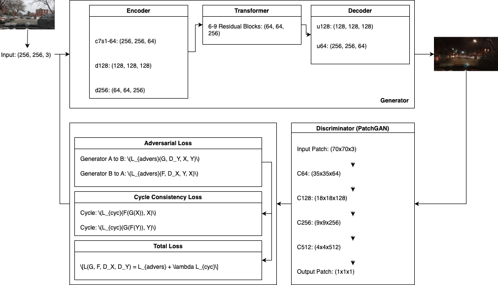
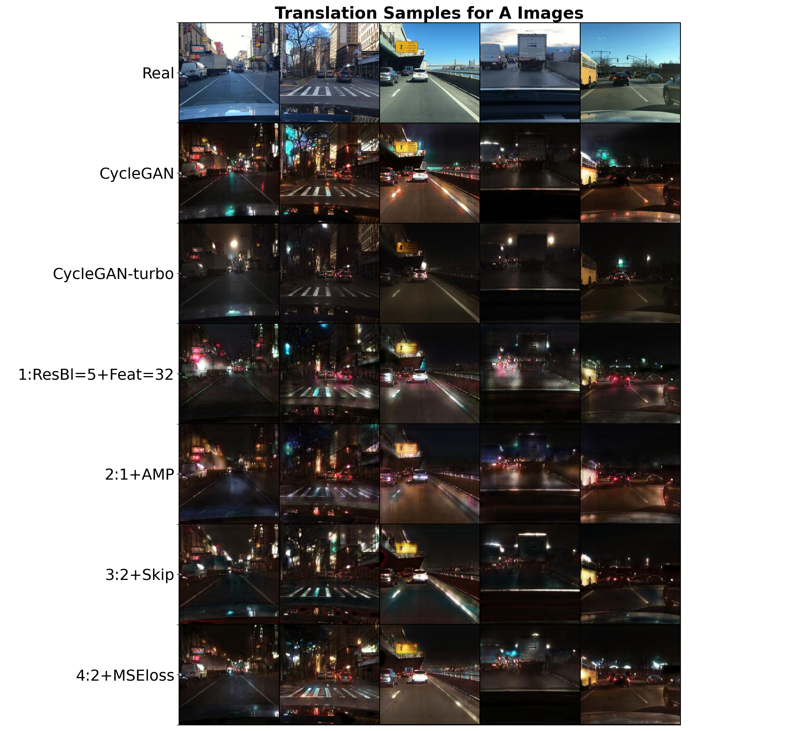
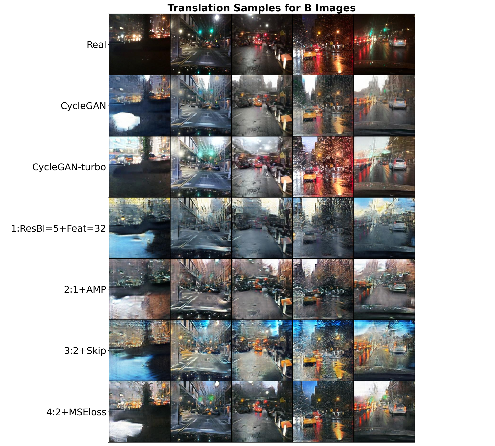

# `ReCycleGAN: CycleGAN Revisitado`

# `ReCycleGAN: Revisiting CycleGAN`

## Apresentação

O presente projeto foi originado no contexto das atividades da disciplina de pós-graduação *IA376N - IA generativa: de modelos a aplicações multimodais*, oferecida no segundo semestre de 2024, na Unicamp, sob supervisão da Profa. Dra. Paula Dornhofer Paro Costa, do Departamento de Engenharia de Computação e Automação (DCA) da Faculdade de Engenharia Elétrica e de Computação (FEEC).

|Nome  | RA | Especialização|
|--|--|--|
| Gabriel Freitas  | 289.996  | Eng. Elétrica |
| Tiago Amorim  | 100.675  | Eng. Civil / Petróleo |

**Apresentação da proposta**:
[[Slides]](https://docs.google.com/presentation/d/11GfqeSx0cfEgmkaK85Abg1vAqVeyjwtpq9zFc_-PA94/edit?usp=sharing)
[[PDF]](./docs/assets/IntroProjeto.pdf)
[[Video]](https://youtu.be/LJuTz5Pec7E)

**Entrega 2 - Resultados parciais**:
[[Slides]](https://docs.google.com/presentation/d/1Zrgix-RCc3Nq7yz7x72-TK-EyCpEOA_QkDlRHAJ2kGk/edit?usp=sharing)
[[PDF]](./docs/assets/E2.pdf)

**Entrega 3 - Resultados finais**:
[[Slides]](https://docs.google.com/presentation/d/1VNVsDmmZ8PWp1092z7aj-8GFIcjMuiPVxn6u_0tlezc/edit?usp=sharing)
[[PDF]](./docs/assets/E3.pdf)

## Resumo (Abstract)
<!--
Resumo do objetivo, metodologia **e resultados** obtidos (na entrega E2 é possível relatar resultados parciais). Sugere-se máximo de 100 palavras.
-->
A tradução imagem-imagem busca um mapeamento entre domínios que compartilham relação.
A `CycleGAN` teve significativo impacto ao propor uma arquitetura que trabalha com dados não pareados. Novos elementos foram propostos posteriormente, aumentando a qualidade das imagens geradas. As redes mais atuais se apoiam em modelos de larga escala.

Este projeto revisitará a proposta original da CycleGAN, avaliando o impacto de diferentes propostas feitas posteriormente. Busca-se uma arquitetura com melhor desempenho que a CycleGAN original, e treinável com uma estrutura de *hardware* mais acessível.

A tarefa abordada neste projeto foi a traduzir imagens feitas a partir de câmeras instaladas em painéis de carros (*dashboard cameras*) de dia para noite e de noite para dia. Foram utilizadas as imagens da base de dados **Nexet** para a cidade de Nova York.

Diferentes modificações foram testadas na estrutura original da CycleGAN, e a que teve maior impacto foi a introdução de *skip connections* entre o codificador e o decodificador das redes generativas.
Foi feita a comparação desta nova rede com modelos propostos de código aberto. As métricas de FID e LPIPS mostram que foi possível alcançar resultados comparáveis aos de redes maiores.

## Descrição do Problema/Motivação
<!--
Descrição do contexto gerador do tema do projeto. Motivação para abordar este tema de projeto.
-->
Um dos problemas mais tradicionais na área de visão computacional é o de **tradução imagem-imagem** (*`image-to-image translation`*). Nesta classe de problemas, o objetivo principal é mapear uma imagem de entrada pertencente a um domínio, para um domínio de saída diferente, mas onde ambos os domínios compartilham uma certa relação ou correspondência.

Em 2017 foi apresentada a arquitetura `CycleGAN` [[1]](https://arxiv.org/abs/1703.10593), com o objetivo de realizar tradução de imagens em base de dados não pareadas. A CycleGAN faz uso de duas redes adversariais (GAN), que fazem os mapeamentos de um domínio em outro ($G:X \rightarrow Y$) e o mapeamento inverso ($F:Y \rightarrow X$). Às funções de perda de cada GAN é adicionada uma perda associada à consistência dos mapeamentos: $\mathcal{L}(F(G(x)),x)$ e $\mathcal{L}(G(F(y)),y)$.

<div>
  <p align="center">
    
  </p>
</div>

<p align="center">
    <strong>Estrutura Geral da CycleGAN <a href="https://arxiv.org/abs/1703.10593">[1]</a>.</strong>
</p>

A partir deste momento foram propostas outras soluções para este problema e outros problemas relacionados tais como transferência de estilo (*`style transfer`*), remoção de ruído [[2]](https://arxiv.org/pdf/1805.05308v1) e melhoria de qualidade de imagem (*`image enhancement`*) [[3]](https://arxiv.org/pdf/2312.11748v1), alcançando resultados cada vez melhores.

Muitas das arquiteturas mais recentes se baseiam no uso e/ou ajuste fino de modelos de larga escala pré-treinados. O treinamento destas redes requer grande poder computacional e significativo número de amostras.

## Objetivo

O objetivo deste projeto foi, a partir da arquitetura original da CycleGAN, investigar e avaliar o impacto da incorporação de algumas das ideias que foram propostas posteriormente, aplicado na tradução dia-noite de imagens de trânsito. Especificamente, os objetivos são:

* Investigar e reproduzir a `CycleGAN original` (*vanilla*) e obter uma referência com a qual comparar a nova arquitetura na resolução do problema proposto.
* Investigar e `reproduzir propostas mais recentes` de modificações na CycleGAN e compará-las com a CycleGAN tradicional em relação aos dois dos problemas propostos.
* Investigar e incorporar `novas métricas` de avaliação quantitativa e qualitativa das saídas da rede.
* Fazer `comparativo` entre as arquiteturas propostas e redes pré-treinadas propostas na literatura, buscando entender criticamente qual variação melhor performa para o problema proposto.

## Metodologia

Foram avaliadas diferentes variações da CyleGAN a partir da sua versão na *vanilla*. Diferentes elementos foram alterados e/ou adicionados:

* Novos elementos na arquitetura da rede:
  * [x] Skip connections [[9]](https://arxiv.org/abs/2403.12036)
  * [x] Camadas de atenção [[14]](https://doi.org/10.1109/ICDACAI59742.2023.00142)
  * [x] Adaptadores LoRA
* Funções de perda adicionais:
  * [ ] Perdas baseadas em redes pré-treinadas [[7]](https://arxiv.org/abs/2105.14576)
  * [x] Suavização do Gerador [[10]](https://arxiv.org/abs/1912.04958)
* Novas métricas de avaliação:
  * [x] FID [[11]](https://arxiv.org/abs/1706.08500)
  * [ ] PSNR
  * [ ] SSIM
  * [x] LPIPS [[12]](https://arxiv.org/abs/1801.03924)
* Comparativo com outras redes:
  * [x] Redes de difusão:
    * CycleGAN *original* [[1]](https://arxiv.org/abs/1703.10593)
    * CycleGAN-turbo [[9]](https://arxiv.org/abs/2403.12036)
  * [ ] Percepção de usuários

As caixas de seleção indicam os os elementos, entre os inicialmente propostos, que foram efetivamente aplicados no projeto. Os adaptadores LoRA foram implementados, mas não foram avaliados porque posteriormente descobriu-se serem indicados para uso em redes pré-treinadas. Devido à limitação de *hardware* disponível (o treinamento foi feito no Colab), a proposta de incluir perdas associadas a redes pré-treinadas foi descartada.

A avaliação foi realizada apenas para uma tarefa. Foi utilizada a base de dados **Nexet** para realizar transferência de estilo (*style transfer*) entre imagens tiradas de câmeras de carro durante o dia e durante a noite. A segunda tarefa proposta era de fazer remoção de ruído (*image restoration*) das imagens das bases de dados **O-Haze**, **I-Haze** e **D-Hazy**. A segunda tarefa foi abandonada por limitação de *hardware*.

Foram avaliadas duas das métricas de qualidade de imagem inicialmente propostas: [FID](https://github.com/mseitzer/pytorch-fid) e [LPIPS](https://github.com/richzhang/PerceptualSimilarity/). Optou-se por focar nestas duas por aparentemente serem mais presentes na literatura e terem implementações em PyTorch disponibilizadas pelos seus autores: [pytorch-fid](https://pypi.org/project/pytorch-fid/) e [lpips](https://pypi.org/project/lpips/).

### Bases de Dados e Evolução

| |Base de Dados | Endereço na Web | Resumo descritivo|
|-|----- | ----- | -----|
|✓|[Nexet 2017](https://data.getnexar.com/blog/nexet-the-largest-and-most-diverse-road-dataset-in-the-world/) | [Cópia no Kaggle](https://www.kaggle.com/datasets/solesensei/nexet-original)<br> | Base de dados com 50.000 imagens de câmeras automotivas (*dashboard cameras*).<br> Tem dados anotados de condição de luz (dia, noite, ocaso) e local (Nova York, São Francisco, Tel Aviv, Resto do mundo)|
|✗|[O-HAZE](https://arxiv.org/pdf/1804.05101v1) | [Base oficial](https://data.vision.ee.ethz.ch/cvl/ntire18//o-haze/) | 35 imagens embaçadas (tamanho 2833×4657 pixels) para treinamento.<br> Inclui 5 imagens embaçadas para validação, juntamente com suas respectivas imagens de referência.|
|✗|[I-HAZE](https://arxiv.org/pdf/1804.05091v1) | [Base oficial](https://data.vision.ee.ethz.ch/cvl/ntire18//i-haze/) | 25 imagens de interiores embaçadas (tamanho 2833×4657 pixels) para treinamento.<br> Inclui 5 imagens embaçadas para validação, acompanhadas de suas respectivas imagens de referência. |
|✗|[D-HAZY](https://ieeexplore.ieee.org/document/7532754) | [Cópia no SemanticScholar](https://www.semanticscholar.org/paper/D-HAZY%3A-A-dataset-to-evaluate-quantitatively-Ancuti-Ancuti/9451d0b1bfbba5f3e19c083866f1394aabf7d06c) | Coleção de mais de 1400 imagens de interiores do NYU Depth Dataset, com mapas de profundidade para cada imagem.<br> Os mapas são utilizados para sintetizar cenas embaçadas.|

A ReCycleGAN foi construída para acessar as bases de dados com um mesmo tipo de estrutura. As imagens são ajustadas para um aspecto 1:1 (corte centralizado) e é feita mudança de escala para 256x256. As imagens são separadas em duas pastas: **input\_A** e **input\_B**, correspondendo às duas classes utilizadas no treinamento (dia e noite, por exemplo). Para teste foram separadas 20% das imagens de cada grupo. Para cada pasta existem dois arquivos CSV com a lista do nomes dos arquivos para treinamento e para teste, de forma que não existe necessidade de ajustar os nomes dos arquivos das imagens.

```text
    data
    ├── dataset_name
    │   ├── input_A
    │   │   ├── img-xdgby.jpg
    │   │   ├── img2hjk.jpg
    │   │   └── ...
    │   ├── input_B
    │   │   ├── figx_799.jpg
    │   │   ├── gbniftt.jpg
    │   │   └── ...
    │   └── input_A_test.csv
    │   └── input_A_train.csv
    │   └── input_B_test.csv
    │   └── input_B_train.csv
```

#### Nexet 2017

A base de dados **Nexet 2017** contém 50.000 imagens, e 99,8% tem resolução 1280x720. Todas as imagens tem dados de condição de luz (dia, noite, ocaso) e local (Nova York, São Francisco, Tel Aviv, Resto do mundo). Também existem dados anotados da posição (*box*) dos veículos que aparecem em cada imagem. Para o treinamento e teste das redes propostas foram utilizadas apenas as imagens 1280x720 de Nova York, nas condições de luz **dia** (4885 imagens) e **noite** (4406 imagens).

<div>
  <p align="center">
    
  </p>
</div>

<p align="center">
  < strong>Exemplos de imagens da base Nexet 2017 (dia acima e noite abaixo).</strong>
</p>

Foram feitas diferentes análises nas imagens. Uma explicação mais completa é feita [**aqui**](./docs/Nexet.md). Os filtros aplicados retiraram 146 (3%) das imagens da classe **Dia** e 216  (5%) das imagens da classe **Noite**. Os totais de imagens para cada classe são apresentados abaixo.

| Classe       | Treino | Teste | Total |
|--------------|--------|-------|-------|
|**Dia** (A)   | 3788   | 949   | 4737  |
|**Noite** (B) | 3316   | 842   | 4158  |

Todo o procedimento de filtro das imagens está codificado em um único [**Notebook**](src/notebooks/Filter_DayNight.ipynb).

A base de dados utilizada pode ser encontrada neste [**link**](https://github.com/TiagoCAAmorim/dgm-2024.2/releases/download/v0.1.0-nexet/Nexet.zip). Foram utilizadas as imagens listadas nos arquivos com *\_filtered.csv* no final do nome.

#### O-Haze, I-Haze e D-Hazy

As imagens das bases de dados **O-Haze**, **I-Haze** e **D-Hazy** não foram trabalhadas neste projeto. **O-Haze** e **I-Haze** tem poucas imagens, e todas de alta resolução (2833×4657). Pode ser feito um processo de aumento de dados (*data augmentation*) nestas imagens, gerando diversas imagens 256x256 a partir das imagens originais. **D-Hazy** tem um número maior de imagens, e mapas de profundidade para cada imagem. Podem ser geradas imagens embaçadas com diferentes níveis de efeitos de embaçamento a partir das imagens originais e respectivos mapas de profundidade.

<div>
  <p align="center">
    
  </p>
</div>

<p align="center">
  <strong>Exemplos de imagens da base O-Haze (hazy acima e sharp abaixo).</strong>
</p>

### Workflow

O *workflow* deste projeto se divide em duas etapas: treino e avaliação.

1. **Treino da ReCycleGAN**
    * Feito para cada variante dos hyperparâmetros.
    * Dados de entrada são as imagens de treino das classes **A** e **B**.
        * Para aumentar a quantidade de amostras (*data augmentation*), foram aplicadas transformações adicionais às imagens de entrada:
            1. Redimensionamento para 112% da imagem original, com interpolação bicúbica.
            1. Corte aleatório (*random crop*) para as dimensões originais.
            1. Inversão horizontal aleatória (*random horizontal flip*).
    * Todo o treinamento foi feito com um *Notebook* formatado para usar o Colab: [Link](src/notebooks/ReCycleGAN_colab.ipynb).
    * Para monitorar e registrar os logs e resultados dos treinamentos foi utilizada a plataforma [Weights & Biases](https://wandb.ai/site).
        * Para não onerar o treinamento, as métricas de FID e LPIPS são calculadas apenas para as imagens de teste.

2. **Avaliação dos Resultados**
    * Os autores da métrica FID sugerem usar ao menos 2048 imagens para seu cálculo. O número total de imagens para cada classe não é muito alto. Optou-se por utilizar as imagens de treino e teste para avaliação das métricas.
    * Para incrementar a análise, foram geradas imagens traduzidas com a versão original da **CycleGAN** [[1]](https://github.com/junyanz/pytorch-CycleGAN-and-pix2pix) e com uma versão atualizada, **CycleGAN-turbo** [[9]](https://github.com/GaParmar/img2img-turbo).
        * A CycleGAN precisou ser treinada com a base de dados Nexet. O treinamento foi feito com as opções padrão, por 40 épocas.
        * A CycleGAN-turbo tem uma versão já treinada com a base Nexet, de modo que não foi necessário treinar esta rede.
    * São feitas avaliações comparando as imagens reais com as imagens da outra classe traduzidas (e.g.: imagens da classe **A** e imagens traduzidas da classe **B** para a classe **A**).

<div>
  <p align="center">
    
  </p>
  <p align="center">
    <strong>Workflow de trabalho.</strong>
  </p>
</div>

### Arquitetura da Rede - CyclaGAN Vanilla


A CycleGAN é composta por duas redes geradoras (`gen_AtoB` e `gen_BtoA`) e duas redes discriminadoras (`dis_A` e `dis_B`). As redes geradoras possuem a mesma estrutura, assim como as discriminadoras.

<div>
  <p align="center">
    
  </p>
</div>

<p align="center">
  <strong>Ilustração da estrutura básica da CycleGAN.</strong>
</p>

### Estrutura do Gerador

Cada gerador da CycleGAN é dividido em três seções principais:

1. **Encoder**: Extrai características da imagem de entrada através de convoluções, comprimindo sua representação, mas aumentando o número de canais.
   - O primeiro conjunto de filtros transforma uma imagem de tamanho (256, 256, 3) em uma representação intermediária com *k* canais (ex: 64), conforme definido pelo usuário.
   - Os próximos dois conjuntos de filtros continuam comprimindo a representação, enquanto dobram o número de canais a cada etapa.
   
2. **Transformer**: Aplica 6 ou 9 blocos residuais, dependendo do tamanho da entrada, sem alterar as dimensões da representação.

3. **Decoder**: Restaura a imagem ao seu tamanho original utilizando dois blocos de deconvolução (convoluções fracionárias).

A arquitetura completa do gerador pode ser descrita como:

`c7s1-64, d128, d256, R256, R256, R256, R256, R256, R256, u128, u64, c7s1-3`

- `c7s1-k`: Camada de Convolução-InstanceNorm-ReLU com kernel 7×7, *k* filtros e stride 1.
- `dk`: Convolução 3×3 com InstanceNorm e ReLU, *k* filtros e stride 2.
- `Rk`: Bloco residual com duas camadas de convolução 3×3 com *k* filtros.
- `uk`: Deconvolução fracionária (stride 1/2) com *k* filtros e ReLU.

### Estrutura do Discriminador

Os discriminadores da CycleGAN utilizam a abordagem **PatchGAN**. Diferentemente de um discriminador regular de GAN, que produz um único valor escalar como saída, o PatchGAN gera uma matriz de NxN saídas (ex: 70×70), onde cada valor indica se o respectivo "patch" da imagem é real ou falso.

A arquitetura do discriminador é descrita como:

`C64-C128-C256-C512`

- `Ck`: Convolução 4×4 com InstanceNorm e LeakyReLU, *k* filtros e stride 2. 
- A primeira camada (`C64`) não aplica InstanceNorm. Após a última camada, é realizada uma convolução para produzir uma saída 1×1.

#### Funções de custo

- **Adversarial Loss:**  é aplicada tanto às redes geradoras quanto às discriminadoras. Esta perda é definida como:

$$ Loss_{advers} \left ( G, D_y, X, Y \right ) =\frac{1}{m}\sum \left ( 1 - D_y\left ( G\left ( x \right ) \right ) \right )^{2} $$  

$$ Loss_{advers}\left ( F, D_x, Y, X \right ) =\frac{1}{m}\sum \left ( 1 - D_x\left ( F\left ( y \right ) \right ) \right )^{2} $$   

- **Cycle Consistency Loss:** Devido à possibilidade das redes adversárias mapearem imagens de entrada para distribuições de saída aleatórias, a perda de consistência cíclica garante que, ao aplicar mapeamentos compostos, a imagem original seja preservada. Em termos técnicos, essa função de perda é usada para medir a taxa de erro no mapeamento de G(x) -> F(G(x)).

$$ Loss_{cyc}\left ( G, F, X, Y \right ) =\frac{1}{m}\left [ \left ( F\left ( G\left ( x_i \right ) \right )-x_i \right ) +\left ( G\left ( F\left ( y_i \right ) \right )-y_i \right ) \right ] $$   


- **Função de Custo Total**: A função de custo total da CycleGAN combina as perdas adversárias e cíclica:

$$ 
L \left ( G, F, D_x, D_y \right ) = L_{advers} \left ( G, D_y, X, Y \right ) + L_{advers} \left ( F, D_x, Y, X \right ) + \lambda L_{cyc} \left ( G, F, X, Y \right ) 
$$

O objetivo é minimizar a função de custo para os geradores \(G\) e \(F\), enquanto maximiza para os discriminadores \(D_x\) e \(D_y\):

$$ 
\min_{G, F} \max_{D_x, D_y} L \left ( G, F, D_x, D_y \right ) 
$$

## Experimentos, Resultados e Discussão dos Resultados

### Experimentos

Foram realizados testes com diferentes modificações à estrutura original da CycleGAN para avaliar o conjunto de hiperparâmetros *ótimo*. Devido às limitações de *hardware* disponível, optou-se por fazer uma busca manual. Foram avaliadas um total de 8 variações individuais nos hiperparâmetros da rede. O primeiro teste já mostra que a ideia foi a de buscar reduzir o tamanho da rede em comparação com a CycleGAN original.

| Modelo | Carac. | B. Res. | AMP | Skip | Loss | Atenção | Reg. | P.Ger. (MM) | P.Disc. (MM) |
|-|:-:|:-:|:-:|:-:|:-:|:-:|:-:|:-:|:-:|
|CycleGAN       | 64     | 9     |     |      | log-BCE |      |     | 11,378 | 2,765 |
|CycleGAN-turbo | na   | na      |  na | na   |     MAE | na   | na  | 43,236  | 3,672  |
|ReCycleGAN 1   | 32   | 5       |     |      | log-BCE |      |     | 1,670 | 0,694 |
|ReCycleGAN 2   | 32   | 5       |  ✓  |      | log-BCE |      |     | 1,670 | 0,694 |
|ReCycleGAN 3   | 32   | 5       |  ✓  |  ✓   | log-BCE |      |     | 1,670 | 0,694 |
|ReCycleGAN 4   | 32   | 5       |  ✓  |      |     MSE |      |     | 1,670 | 0,694 |
|ReCycleGAN 5   | 32   | 5       |  ✓  |  ✓   |     MSE |      |     | 1,670 | 0,694 |
|ReCycleGAN 6   | 32   | 5       |  ✓  |      | log-BCE | Gen  |     | 1,676 | 0,694 |
|ReCycleGAN 7   | 32   | 5       |  ✓  |      | log-BCE | Disc |     | 1,670 | 0,776 |
|ReCycleGAN 8   | 32   | 5       |  ✓  |      | log-BCE |      |  ✓  | 1,670 | 0,694 |
|ReCycleGAN 9   | 32   | 5       |  ✓  |  ✓   |     MSE | Gen+Disc |     | 1,676 | 0,776 |

Colunas da tabela de hiperpâmetros:

* **Carac.**: Número de *features* da saída da primeira camada convolucional das redes geradoras.
* **B. Res.**: Número de blocos residuais das redes geradoras.
* **AMP**: Uso da opção [*Automatic Mixed Precision*](https://pytorch.org/tutorials/recipes/recipes/amp_recipe.html) para redução da demanda de memória para treinamento da ReCycleGAN.
* **Skip**: Uso de *skip connections* entre as camadas de *downsampling* e *upsampling* das redes geradoras.
* **Loss**: Função agregadora no cálculo das funções de perda: log da entropia cruzada binária (usada na CycleGAN original) ou erro quadrático médio (usado em revisões posteriores).
* **Atenção**: Adição de camadas de atenção ao *upsampling* das redes geradoras e/ou às redes discriminadoras.
* **Reg.**: Uso de termo de regularização na função de perda associado à métrica *perceptual path length*. Este termo tende a suavizar o jacobiano da rede geradora.
* **P.Ger.**: Total de parâmetros treináveis de cada rede geradora do modelo, em milhões.
* **P.Disc.**: Total de parâmetros treináveis de cada rede discriminadora do modelo, em milhões.

Como a CycleGAN-turbo tem uma outra estrutura, a maioria dos hiperparâmetros listados não se aplicam (**na**). Uma explicação sobre o número de parâmatros da CycleGAN-turbo é feita neste [**link**](./docs/CycleGAN-turbo.md).


### Resultados

Uma maior variedade de apresentações das métricas é feita neste [**link**](./docs/Results.md).

A tabela abaixo apresenta um resumo dos principais resultados obtidos na comparação das imagens geradas por cada modelo testado com as imagens reais (e.g.: imagens da classe B, noite, traduzidas em imagens da classe A, dia, comparadas com as imagens reais da classe A). Todas as métricas foram calculadas usando as imagens de treino e de teste. Para a métrica LPIPS são apresentados o valor médio e o desvio padrão.

|Modelo | Épocas | FID B→A | LPIPS B→A | FID A→B | LPIPS A→B |
|-|:-:|:-:|:-:|:-:|:-:|
|CycleGAN       | 41  |    53,44   |    0,5853   ± 0,04370 |    28,81   |   0,5395   ± 0,04669 |
|CycleGAN-turbo |     |  **50,39** |    0,6146   ± 0,04229 |    35,00   |   0,5282   ± 0,05043 |
|ReCycleGAN 1   | 40  |   129,0    |    0,5852   ± 0,04327 |    40,78   |   0,5275   ± 0,04426 |
|ReCycleGAN 2   | 38  |   154,2    |    0,5893   ± 0,04163 |    38,79   | **0,5253** ± 0,04411 |
|ReCycleGAN 3   | 42  |   158,2    |    0,6088   ± 0,03889 |    75,83   |   0,5332   ± 0,04321 |
|ReCycleGAN 4   | 49  |    88,00   |    0,5894   ± 0,04110 |  **27,69** |   0,5289   ± 0,04685 |
|ReCycleGAN 5   | 49  |    97,48   |    0,5964   ± 0,04294 |    47,80   |   0,5287   ± 0,04546 |
|ReCycleGAN 6   | 49  |   141,5    |  **0,5789** ± 0,04261 |    70,01   |   0,5472   ± 0,04025 |
|ReCycleGAN 7   | 49  |   120,8    |    0,5799   ± 0,04065 |    45,72   |   0,5394   ± 0,04551 |
|ReCycleGAN 8   | 32  |   341,6    |    1,0140   ± 0,03567 |   418,3    |   0,6833   ± 0,03227 |
|ReCycleGAN 9   | 49  |    93,91   |    0,5878   ± 0,04309 |    36,02   |   0,5400   ± 0,04468 |

Os melhores resultados estão destacados em negrito.

Exemplos de imagens traduzidas são apresentados abaixo.

<div>
  <p align="center">
    
  </p>
  <p align="center">
    <strong>Exemplos de imagens traduzidas de dia para noite.</strong>
  </p>
</div>
<div>
  <p align="center">
    
  </p>
  <p align="center">
    <strong>Exemplos de imagens traduzidas de noite para dia.</strong>
  </p>
</div>

### Discussão

Antes da avaliação dos modelos, a expectativa era de que a tradução de noite para dia fosse mais difícil que o inverso. Tanto a avaliação qualitativa como as métricas se alinham com esta expectativa.

Qualitativamente, as imagens geradas pela CycleGAN *aparentam* ser mais próximas de imagens reais que os demais modelos. Em algumas traduções o modelo CycleGAN-turbo teve desempenho *aparentemente* melhor que o CycleGAN. Entre as ReCycleGAN, os testes que usaram a função de perda MSE (4, 5 e 9) *aparentam* melhores resultados.

A avaliação quantitativa da qualidade das imagens geradas se mostrou desafiadora. O exemplo do [caso de teste 8](./docs/Results.md) mostra que a métrica de FID não tem uma boa resposta na avaliação do problema proposto. Quando o treinamento do modelo começou a apresentar um comportamento divergente, apenas o LPIPS mudou de comportamento.
O LPIPS se mostrou melhor que o FID, mas ainda inadequado para a avaliação da qualidade das imagens geradas.

A tentativa de criar um mapa dos modelos não gerou resultados consistentes, sequer em [3D](https://raw.githack.com/TiagoCAAmorim/dgm-2024.2/documentation/projetos/ReCycleGAN/docs/assets/evaluation/w-lpips_map3D_images_A.html).

## Conclusão
<!--
A seção de Conclusão deve ser uma seção que recupera as principais informações já apresentadas no relatório e que aponta para trabalhos futuros.
Na entrega parcial do projeto (E2) pode conter informações sobre quais etapas ou como o projeto será conduzido até a sua finalização.
Na entrega final do projeto (E3) espera-se que a conclusão elenque, dentre outros aspectos, possibilidades de continuidade do projeto.
-->

<!-- A primeira etapa do projeto, de levantamento de alternativas, se mostrou bastante desafiadora por conta da necessidade de adaptação dos códigos encontrados para uma única estrutura. A base de dados **Nexet** já foi reorganizada para ser utilizada neste projeto.

Com os principais elementos já organizados (CycleGAN *Vanilla*, métricas FID e LPIPS, e uma das bases de dados), o próximo passo será o de treinar a rede para a tarefa de transferência de estilo. Diferentes opções de estrutura para o treinamento estão em avaliação (Colab, Modal, AWS).

Os resultados da rede CycleGAN-turbo apontam para uma maior dificuldade na transformação de imagens de noite para dia do que o contrário. -->

Deste projeto podem ser retiradas diferentes conclusões e lições aprendidas. Sobre a proposta do projeto temos três **conclusões principais**:

* Para os objetivos propostos, **o tamanho da rede importa**. A CycleGAN original, com quase dez vezes mais pesos, teve, em geral, desempenho melhor que todas as opções de ReCycleGAN testadas.
* A rede precisa ser **treinada para um problema específico**. A qualidade das traduções da CycleGAN-turbo depende da resolução da imagem real. Os exemplos de tradução no repositório desta rede (imagens 1280x720) são perceptivelmente melhores que os exemplos com as imagens utilizadas neste projeto (256x256).
* **FID e LPIPS não são bons preditores** da qualidade das imagens geradas.

Diversas lições foram aprendidas na realização deste projeto:

* Acesso a *hardware* adequado é vital para um projeto de redes generativas.
* Os repositórios de redes como a CycleGAN podem ser complexos, mas estão cheios de *dicas* de como facilitar o treinamento da rede. Muitas destes *pulos do gato* não estarão no artigo ou em implementações simplificadas que se encontra pela internet. Foi possível treinar a CycleGAN em uma GPU de laptop, ocupando menos de 3 GB de memória.
* O código desenvolvido a quatro mão necessitou de muitos ajustes até ser funcional. Existe uma tendência do código ficar demasiado complexo ao longo do projeto. Foi essencial iniciar o projeto com boa organização e compartimentalização do código.

## Referências Bibliográficas
<!--
Apontar nesta seção as referências bibliográficas adotadas no projeto.
-->

[1] Unpaired Image-to-Image Translation using Cycle-Consistent Adversarial Networks.<br>
Jun-Yan Zhu, Taesung Park, Phillip Isola, Alexei A. Efros. In ICCV 2017.<br>
[[Paper]](https://arxiv.org/abs/1703.10593) [[Github]](https://github.com/junyanz/pytorch-CycleGAN-and-pix2pix)

[2] Cycle-Dehaze: Enhanced CycleGAN for Single Image Dehazing. <br>
Deniz Engin, Anıl Genç, Hazim Kemal Ekenel. Proceedings of the IEEE conference on computer vision and pattern recognition workshops. 2018 <br>
[[Paper]](https://arxiv.org/pdf/1805.05308v1) [[Github]](https://github.com/engindeniz/Cycle-Dehaze)

[3] Ultrasound Image Enhancement Using CycleGAN and Perceptual Loss <br>
Shreeram Athreya, Haobo Wu, Xiaoyang Wang, Baoyuan Wang. arXiv, 2023.<br>
[[Paper]](https://arxiv.org/pdf/2312.11748v1) [[Github]](https://github.com/ShreeramAthreya/CDX-USChallenge)

[4] O-HAZE: A Dehazing Benchmark with Real Hazy and Haze-Free Outdoor Images <br>
Codruta O. Ancuti, Cosmin Ancuti, Radu Timofte, Christophe De Vleeschouwer. In CVPR 2018 Workshops.<br>
[[Paper]](https://arxiv.org/pdf/1804.05101v1) [[Site]](https://data.vision.ee.ethz.ch/cvl/ntire18//o-haze/)

[5] I-HAZE: A Dehazing Benchmark with Real Hazy and Haze-Free Indoor Images <br>
Codruta O. Ancuti, Cosmin Ancuti, Radu Timofte, Christophe De Vleeschouwer. In CVPR 2018 Workshops.<br>
[[Paper]](https://arxiv.org/pdf/1804.05091v1) [[Site]](https://data.vision.ee.ethz.ch/cvl/ntire18//i-haze/)

[6] D-HAZY: A Dataset to Evaluate Quantitatively Dehazing Algorithms <br>
Codruta O. Ancuti, Cosmin Ancuti, Christophe De Vleeschouwer. IEEE Transactions on Image Processing, 2016.<br>
[[Paper]](https://ieeexplore.ieee.org/document/7532754) [[Site]](https://www.semanticscholar.org/paper/D-HAZY%3A-A-dataset-to-evaluate-quantitatively-Ancuti-Ancuti/9451d0b1bfbba5f3e19c083866f1394aabf7d06c)

[7] StyTr²: Image Style Transfer with Transformers.<br>
Yingying Deng, Fan Tang, Weiming Dong, Chongyang Ma, Xingjia Pan, Lei Wang, Changsheng Xu. IEEE Conference on Computer Vision and Pattern Recognition (CVPR) 2022.<br>
[[Paper]](https://arxiv.org/abs/2105.14576) [[Github]](https://github.com/diyiiyiii/StyTR-2)

[8] Splicing ViT Features for Semantic Appearance Transfer.<br>
Narek Tumanyan, Omer Bar-Tal, Shai Bagon, Tali Dekel. IEEE Conference on Computer Vision and Pattern Recognition (CVPR) 2022.<br>
[[Paper]](https://arxiv.org/abs/2201.00424) [[Github]](https://github.com/omerbt/Splice) [[Site]](https://splice-vit.github.io/)

[9] One-Step Image Translation with Text-to-Image Models.<br>
Gaurav Parmar, Taesung Park, Srinivasa Narasimhan, Jun-Yan Zhu. In arXiv 2024.<br>
[[Paper]](https://arxiv.org/abs/2403.12036) [[Github]](https://github.com/GaParmar/img2img-turbo)

[10] Analyzing and Improving the Image Quality of StyleGAN.<br>
Tero Karras, Samuli Laine, Miika Aittala, Janne Hellsten, Jaakko Lehtinen, Timo Aila. IEEE Conference on Computer Vision and Pattern Recognition (CVPR) 2022.<br>
[[Paper]](https://arxiv.org/abs/1912.04958) [[Github]](https://github.com/NVlabs/stylegan2)

[11] Gans trained by a two time-scale update rule converge to a local nash equilibrium.<br>
Heusel, Martin, et al. Advances in neural information processing systems 30 (2017).<br>
[[Paper]](https://arxiv.org/abs/1706.08500) [[Github]](https://github.com/mseitzer/pytorch-fid)

[12] The unreasonable effectiveness of deep features as a perceptual metric.<br>
Zhang, Richard, et al. Proceedings of the IEEE conference on computer vision and pattern recognition. 2018.<br>
[[Paper]](https://arxiv.org/abs/1801.03924) [[Github]](https://github.com/richzhang/PerceptualSimilarity) [[Site]](https://richzhang.github.io/PerceptualSimilarity/)

[13] Deep Residual Learning for Image Recognition.<br>
Kaiming He, Xiangyu Zhang, Shaoqing Ren, Jian Sun. IEEE Conference on Computer Vision and Pattern Recognition (CVPR) 2016.<br>
[[Paper]](https://doi.org/10.1109/CVPR.2016.90)

[14] A New CycleGAN-Based Style Transfer Method.<br>
H. Yan. 2nd International Conference on Data Analytics, Computing and Artificial Intelligence (ICDACAI), Zakopane, Poland, 2023, pp. 712-719<br>
[[Paper]](https://doi.org/10.1109/ICDACAI59742.2023.00142)
