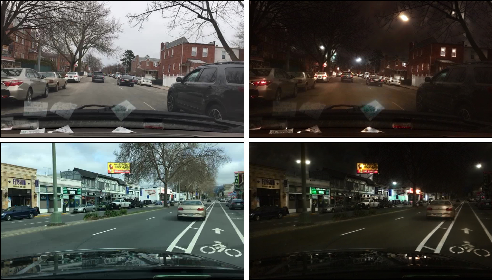

# `ReCycleGAN: CycleGAN Revisitado`
# `ReCycleGAN: Revisiting CycleGAN`

## Apresentação

O presente projeto foi originado no contexto das atividades da disciplina de pós-graduação *IA376N - IA generativa: de modelos a aplicações multimodais*, oferecida no segundo semestre de 2024, na Unicamp, sob supervisão da Profa. Dra. Paula Dornhofer Paro Costa, do Departamento de Engenharia de Computação e Automação (DCA) da Faculdade de Engenharia Elétrica e de Computação (FEEC).

|Nome  | RA | Especialização|
|--|--|--|
| Gabriel Freitas  | 289.996  | Eng. Elétrica |
| Tiago Amorim  | 100.675  | Eng. Civil / Petróleo |

## Descrição Resumida do Projeto

Um dos problemas mais tradicionais na área de visão computacional é o de **tradução imagem-imagem** (_`image-to-image translation`_). Nesta classe de problemas, o objetivo principal é mapear uma imagem de entrada pertencente a um domínio, para um domínio de saída diferente, mas onde ambos os domínios compartilham uma certa relação ou correspondência.

Algumas das abordagens práticas deste problemas é o estudo da transformação de cavalos em zebras ou imagens noturnas em diurnas, tal como podemos ver nas ilustrações abaixo.

  <strong>Exemplos de transferência de estilo.</strong>

E no ínterim deste problema de tradução imagem-imagem, em 2017 foi apresentada a arquitetura `CycleGAN` [[1]](https://arxiv.org/abs/1703.10593), com o objetivo de realizar tradução de imagens em base de dados não pareadas. A CycleGAN faz uso de duas redes adversariais (GAN), que fazem os mapeamentos de um domínio em outro ($G:X \rightarrow Y$) e o mapeamento inverso ($F:Y \rightarrow X$). Às funções de perda de cada GAN é adicionada uma perda associada à consistência dos mapeamentos: $\mathcal{L}(F(G(x)),x)$ e $\mathcal{L}(G(F(y)),y)$.

  <strong>Estrutura Geral da CycleGAN <a href="https://arxiv.org/abs/1703.10593">[1]</a>.</strong>

A partir deste momento foram propostas outras soluções para este problema e outros problemas relacionados tais como transferência de estilo (_`style transfer`_), remoção de ruído [[2]](https://arxiv.org/pdf/1805.05308v1) e melhoria de qualidade de imagem (_`image enhancement`_) [[3]](https://arxiv.org/pdf/2312.11748v1), alcançando resultados cada vez melhores.

Muitas das arquiteturas mais recentes se baseiam no uso e/ou ajuste fino de modelos de larga escala pré-treinados. O treinamento destas redes requer grande poder computacional e significativo número de amostras.

**Objetivos do projeto**:

O objetivo deste projeto é, a partir da arquitetura original da CycleGAN, investigar e avaliar o impacto da incorporação de algumas das ideias que foram propostas posteriormente, aplicados a dois problemas específicos: a tradução dia-noite de imagens de trânsito e a remoção de ruídos para melhoria na qualidade. Especificamente, os objetivos são:

* Investigar e reproduzir a CycleGAN _vanilla_ e avaliar o obter uma _baseline_ de resultados na resolução dos dois problemas previamente mencionados.
* Investigar e reproduzir propostas mais recentes de modificações na CycleGAN e compará-las com a CycleGAN tradicional em relação a dois dos problemas mencionados.
* Investigar e incorporar `novas métricas` de avaliação quantitativa e qualitativa das saídas da rede.
* Fazer `comparativo` entre as arquiteturas propostas e redes pré-treinadas propostas na literatura, buscando entender criticamente qual variação melhor performa para cada classe de problema.

**Apresentação da proposta**:

[[slides]](https://docs.google.com/presentation/d/11GfqeSx0cfEgmkaK85Abg1vAqVeyjwtpq9zFc_-PA94/edit?usp=sharing)
[[video]](https://link.fake)

## Metodologia Proposta

### Base de Dados

Variações da rede CycleGAN serão treinadas e avaliadas no problema de tradução imagem-imagem.

#### Transformação dia-noite

Um aplicação será traduzir imagens de trânsito de `dia para noite` e de `noite para dia`. Este tipo de transformação pode ser utilizada para, por exemplo, aumentar uma base de imagens para treinamento sistemas de direção autônoma.

A base de dados a ser utilizada é a [Nexet 2017](https://www.kaggle.com/datasets/solesensei/nexet-original), disponibilizada pela [Nexar](https://data.getnexar.com/blog/nexet-the-largest-and-most-diverse-road-dataset-in-the-world/). Esta base de dados contém 50.000 imagens de câmeras automotivas (_dashboard cameras_), com dados anotados de condição de luz (dia, noite, ocaso) e local (Nova York, São Francisco, Tel Aviv, Resto do mundo). Serão utilizadas as imagens da cidade de Nova York para as condições de dia e noite (4.931 imagens de dia e 4.449 imagens de noite).

#### Remoção de ruído

Um segunda aplicação é a tarefa de remoção de ruídos em imagens. Para isso, serão utilizadas as seguintes bases de dados:

* [**O-HAZE**](https://data.vision.ee.ethz.ch/cvl/ntire18//o-haze/): Introduzido por Ancuti et al. no artigo [O-HAZE: A Dehazing Benchmark with Real Hazy and Haze-Free Outdoor Images [4]](https://arxiv.org/pdf/1804.05101v1). O dataset O-Haze contém 35 imagens embaçadas (tamanho 2833×4657 pixels) para treinamento. Além disso, o conjunto inclui 5 imagens embaçadas para validação, juntamente com suas respectivas imagens de referência.

* [**I-HAZE**](https://data.vision.ee.ethz.ch/cvl/ntire18//i-haze/): Apresentado por Ancuti et al. no trabalho [I-HAZE: A Dehazing Benchmark with Real Hazy and Haze-Free Indoor Images [5]](https://arxiv.org/pdf/1804.05091v1). O dataset I-Haze é composto por 25 imagens de interiores embaçadas (tamanho 2833×4657 pixels) para treinamento. Ele também inclui 5 imagens embaçadas para validação, acompanhadas de suas respectivas imagens de referência.

* [**D-HAZY**](https://www.semanticscholar.org/paper/D-HAZY%3A-A-dataset-to-evaluate-quantitatively-Ancuti-Ancuti/9451d0b1bfbba5f3e19c083866f1394aabf7d06c): Introduzido por Ancuti et al. em [D-HAZY: A Dataset to Evaluate Quantitatively Dehazing Algorithms [6]](https://ieeexplore.ieee.org/document/7532754), o dataset D-Hazy é gerado a partir da coleção de imagens de interiores do NYU Depth Dataset. O D-Hazy contém mapas de profundidade para cada imagem embaçada, totalizando mais de 1400 imagens reais e seus respectivos mapas de profundidade, utilizados para sintetizar cenas embaçadas com base no modelo de propagação de luz de Koschmieder.

### Ferramentas

O código será inicialmente baseado na implementação em Pytorch da [CycleGAN](https://github.com/junyanz/pytorch-CycleGAN-and-pix2pix), com foco na produção de uma rede treinada em base de dados não pareados. A partir deste código inicial serão feitas modificações incrementais, avaliando o seu impacto nos resultados da síntese.

Para monitorar e registrar os logs e resultados dos treinamentos e avaliações será utilizada a plataforma [Weights & Biases](https://wandb.ai/site).

### Referências

Foram levantados artigos que propõem redes de geração de imagens com transferência de estilo com estruturas que podem ser testadas com a CycleGAN:

* Em [[7]](https://arxiv.org/abs/2105.14576) é proposta uma rede transformers com uma nova forma de codificação espacial e funções de perda baseadas nos resultados da extração de atributos de uma rede VGG19 pré-treinada.
* Em [[8]](https://arxiv.org/abs/2201.00424) é proposta uma função de perda que compara atributos extraídos de uma rede _Vision Transformers_ pré-treinada.
* Em [[9]](https://arxiv.org/abs/2403.12036) é apresentada uma rede que modifica uma rede _stable diffusion_ para receber uma imagem de referência, e faz uso de _skip connections_ para minimizar a perda de informação da imagem de entrada.
* Em [[10]](https://arxiv.org/abs/1912.04958) é proposto que _perceptual path length_ (PPL) é um bom indicador de qualidade da imagem gerada. A redução do PPL é conseguida com um termo de regularização que suaviza o gerador.

### Avaliação

A qualidade das imagens geradas pela rede será avaliada utilizando diversas métricas quantitativas e qualitativas clássicas na literatura. São elas:

1) _Fréchet Inception Distance_ (**FID**): mede a similaridade entre a distribuição das imagens geradas e das imagens reais, proporcionando uma avaliação da qualidade geral e do realismo das imagens.

2) _Peak Signal-to-Noise Ratio_ (**PSNR**): quantifica a qualidade de reconstrução das imagens, comparando pixel a pixel com a imagem de referência, sendo amplamente utilizado em tarefas de denoising e super-resolução.

3) _Structural Similarity Index_ (**SSIM**): avalia a similaridade estrutural entre as imagens, considerando aspectos de luminância, contraste e estrutura, o que reflete melhor a percepção humana de qualidade visual.

4) _Learned Perceptual Image Patch Similarity_ (**LPIPS**): mede a similaridade perceptual entre as imagens geradas e as de referência com base em características extraídas de redes neurais profundas, fornecendo uma avaliação mais alinhada com a percepção visual humana.

Para complementar a avaliação quantitativa, será realizada uma comparação qualitativa das diferentes variantes da rede através de estudos de preferência de usuários. Esse método permitirá verificar não apenas a qualidade técnica das imagens geradas, mas também a aceitação visual das mesmas pelos usuários finais.

## Cronograma

| Etapa\|Semana         | 1  | 2  | 3  | 4  | 5  | 6  | 7  | 8  | 9  | 10 |
|-----------------------|----|----|----|----|----|----|----|----|----|----|
| Investigação          | ⬤  | ⬤  | ⬤  |   |    |    |    |    |    |    |
| Testes e experimentos |    |    | ⬤  | ⬤  | ⬤  | ⬤  |    |    |    |    |
| Avaliação             |    |    |    |    | ⬤  | ⬤  | ⬤  |  ⬤  |    |    |
| Conclusão             |    |    |    |    |    |    |   |   | ⬤  | ⬤  |

**Semanas 1-3: Investigação**

* Estudo e revisão bibliográfica do tema.
* Estudo e reprodução do código original, identificando pontos de possíveis melhorias e alterações.
* Definir os possíveis experimentos e modificações

**Semanas 3-6: Experimentos**

* Condução de testes iniciais com as primeiras modificações na arquitetura. Sugere-se:
  - Implementação e ajuste de adaptadores LoRA (Low-Rank Adaptation).
  - Integração de skip connections para melhorar a propagação de gradientes e preservar informações relevantes.
  - Experimentação com novas funções de perda para potencializar a qualidade das imagens geradas.
  - Inclusão de camadas de diferentes arquiteturas, como Transformers.

**Semanas 5-8: Avaliação**

* Comparação das imagens geradas pela rede proposta com saídas de redes estabelecidas na literatura.
* Avaliação quantitativa usando métricas como FID, PSNR, SSIM, e LPIPS para medir a qualidade e o realismo das imagens.

**Semanas 9-10: Conclusão**

* Organização final e empacotamento do código
* Elaboração do relatório final, documentando todos os experimentos realizados, os resultados obtidos, e as conclusões finais.
* Preparação de materiais de suporte, como gráficos e tabelas, para a apresentação dos resultados.

## Referências Bibliográficas
<!--
Apontar nesta seção as referências bibliográficas adotadas no projeto.
-->

[1] Unpaired Image-to-Image Translation using Cycle-Consistent Adversarial Networks. 
Jun-Yan Zhu, Taesung Park, Phillip Isola, Alexei A. Efros. In ICCV 2017. 
[[Paper]](https://arxiv.org/abs/1703.10593) [[Github]](https://github.com/junyanz/pytorch-CycleGAN-and-pix2pix)

[2] Cycle-Dehaze: Enhanced CycleGAN for Single Image Dehazing.  
Deniz Engin, Anıl Genç, Hazim Kemal Ekenel. Proceedings of the IEEE conference on computer vision and pattern recognition workshops. 2018  
[[Paper]](https://arxiv.org/pdf/1805.05308v1) [[Github]](https://github.com/engindeniz/Cycle-Dehaze)

[3] Ultrasound Image Enhancement Using CycleGAN and Perceptual Loss  
Shreeram Athreya, Haobo Wu, Xiaoyang Wang, Baoyuan Wang. arXiv, 2023. 
[[Paper]](https://arxiv.org/pdf/2312.11748v1) [[Github]](https://github.com/ShreeramAthreya/CDX-USChallenge)

[4] O-HAZE: A Dehazing Benchmark with Real Hazy and Haze-Free Outdoor Images  
Codruta O. Ancuti, Cosmin Ancuti, Radu Timofte, Christophe De Vleeschouwer. In CVPR 2018 Workshops. 
[[Paper]](https://arxiv.org/pdf/1804.05101v1) [[Site]](https://data.vision.ee.ethz.ch/cvl/ntire18//o-haze/)

[5] I-HAZE: A Dehazing Benchmark with Real Hazy and Haze-Free Indoor Images  
Codruta O. Ancuti, Cosmin Ancuti, Radu Timofte, Christophe De Vleeschouwer. In CVPR 2018 Workshops. 
[[Paper]](https://arxiv.org/pdf/1804.05091v1) [[Site]](https://data.vision.ee.ethz.ch/cvl/ntire18//i-haze/)

[6] D-HAZY: A Dataset to Evaluate Quantitatively Dehazing Algorithms  
Codruta O. Ancuti, Cosmin Ancuti, Christophe De Vleeschouwer. IEEE Transactions on Image Processing, 2016. 
[[Paper]](https://ieeexplore.ieee.org/document/7532754) [[Site]](https://www.semanticscholar.org/paper/D-HAZY%3A-A-dataset-to-evaluate-quantitatively-Ancuti-Ancuti/9451d0b1bfbba5f3e19c083866f1394aabf7d06c)

[7] StyTr²: Image Style Transfer with Transformers. 
Yingying Deng, Fan Tang, Weiming Dong, Chongyang Ma, Xingjia Pan, Lei Wang, Changsheng Xu. IEEE Conference on Computer Vision and Pattern Recognition (CVPR) 2022. 
[[Paper]](https://arxiv.org/abs/2105.14576) [[Github]](https://github.com/diyiiyiii/StyTR-2)

[8] Splicing ViT Features for Semantic Appearance Transfer. 
Narek Tumanyan, Omer Bar-Tal, Shai Bagon, Tali Dekel. IEEE Conference on Computer Vision and Pattern Recognition (CVPR) 2022. 
[[Paper]](https://arxiv.org/abs/2201.00424) [[Github]](https://github.com/omerbt/Splice) [[Site]](https://splice-vit.github.io/)

[9] One-Step Image Translation with Text-to-Image Models. 
Gaurav Parmar, Taesung Park, Srinivasa Narasimhan, Jun-Yan Zhu. In arXiv 2024. 
[[Paper]](https://arxiv.org/abs/2403.12036) [[Github]](https://github.com/GaParmar/img2img-turbo)

[10] Analyzing and Improving the Image Quality of StyleGAN. 
Tero Karras, Samuli Laine, Miika Aittala, Janne Hellsten, Jaakko Lehtinen, Timo Aila. IEEE Conference on Computer Vision and Pattern Recognition (CVPR) 2022. 
[[Paper]](https://arxiv.org/abs/1912.04958) [[Github]](https://github.com/NVlabs/stylegan2)
