# `ReCycleGAN: CycleGAN Revisitado`
# `ReCycleGAN: Revisiting CycleGAN`

## Apresentação

O presente projeto foi originado no contexto das atividades da disciplina de pós-graduação *IA376N - IA generativa: de modelos a aplicações multimodais*, oferecida no segundo semestre de 2024, na Unicamp, sob supervisão da Profa. Dra. Paula Dornhofer Paro Costa, do Departamento de Engenharia de Computação e Automação (DCA) da Faculdade de Engenharia Elétrica e de Computação (FEEC).

|Nome  | RA | Especialização|
|--|--|--|
| Gabriel Freitas  | 289.996  | Eng. Elétrica |
| Tiago Amorim  | 100.675  | Eng. Civil / Petróleo |

**Apresentação da proposta**:
[[Slides]](https://docs.google.com/presentation/d/11GfqeSx0cfEgmkaK85Abg1vAqVeyjwtpq9zFc_-PA94/edit?usp=sharing)
[[PDF]](./docs/assets/IntroProjeto.pdf)
[[Video]](https://youtu.be/LJuTz5Pec7E)

**Entrega 2 - Resultados parciais**:
[[Slides]](https://docs.google.com/presentation/d/1Zrgix-RCc3Nq7yz7x72-TK-EyCpEOA_QkDlRHAJ2kGk/edit?usp=sharing)
[[PDF]](./docs/assets/E2.pdf)

**Entrega 3 - Resultados finais**:
[[Slides]](fake.link)
[[PDF]](./docs/assets/E3.pdf)


## Resumo (Abstract)
<!--
Resumo do objetivo, metodologia **e resultados** obtidos (na entrega E2 é possível relatar resultados parciais). Sugere-se máximo de 100 palavras.
-->
A tradução imagem-imagem busca um mapeamento entre domínios que compartilham relação.
A `CycleGAN` teve significativo impacto ao propor uma arquitetura que trabalha com dados não pareados. Novos elementos foram propostos posteriormente, aumentando a qualidade das imagens geradas. As redes mais atuais se apoiam em modelos de larga escala.

Este projeto revisitará a proposta original da CycleGAN, avaliando o impacto de diferentes propostas feitas posteriormente. Busca-se uma arquitetura com melhor desempenho que a CycleGAN original, e treinável com uma estrutura de _hardware_ mais acessível.

A tarefa abordada neste projeto foi a traduzir imagens feitas a partir de câmeras instaladas em painéis de carros (_dashboard cameras_) de dia para noite e de noite para dia. Foram utilizadas as imagens do _dataset_ **Nexet** para a cidade de Nova York.

Diferentes modificações foram testadas na estrutura original da CycleGAN, e a que teve maior impacto foi a introdução de _skip connections_ entre o codificador e o decodificador das redes generativas.
Foi feita a comparação desta nova rede com modelos propostos de código aberto. As métricas de FID e LPIPS mostram que foi possível alcançar resultados comparáveis aos de redes maiores.

## Descrição do Problema/Motivação
<!--
Descrição do contexto gerador do tema do projeto. Motivação para abordar este tema de projeto.
-->
Um dos problemas mais tradicionais na área de visão computacional é o de **tradução imagem-imagem** (_`image-to-image translation`_). Nesta classe de problemas, o objetivo principal é mapear uma imagem de entrada pertencente a um domínio, para um domínio de saída diferente, mas onde ambos os domínios compartilham uma certa relação ou correspondência.

Em 2017 foi apresentada a arquitetura `CycleGAN` [[1]](https://arxiv.org/abs/1703.10593), com o objetivo de realizar tradução de imagens em base de dados não pareadas. A CycleGAN faz uso de duas redes adversariais (GAN), que fazem os mapeamentos de um domínio em outro ($G:X \rightarrow Y$) e o mapeamento inverso ($F:Y \rightarrow X$). Às funções de perda de cada GAN é adicionada uma perda associada à consistência dos mapeamentos: $\mathcal{L}(F(G(x)),x)$ e $\mathcal{L}(G(F(y)),y)$.

<div>
<p align="center">
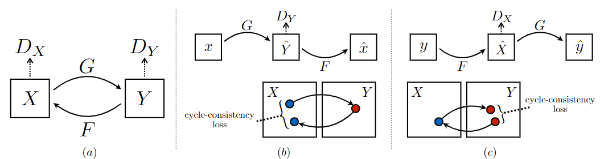
</p>
</div>

<p align="center">
  <strong>Estrutura Geral da CycleGAN <a href="https://arxiv.org/abs/1703.10593">[1]</a>.</strong>
</p>

A partir deste momento foram propostas outras soluções para este problema e outros problemas relacionados tais como transferência de estilo (_`style transfer`_), remoção de ruído [[2]](https://arxiv.org/pdf/1805.05308v1) e melhoria de qualidade de imagem (_`image enhancement`_) [[3]](https://arxiv.org/pdf/2312.11748v1), alcançando resultados cada vez melhores.

Muitas das arquiteturas mais recentes se baseiam no uso e/ou ajuste fino de modelos de larga escala pré-treinados. O treinamento destas redes requer grande poder computacional e significativo número de amostras.


## Objetivo
<!--
Descrição do que o projeto se propõe a fazer.
É possível explicitar um objetivo geral e objetivos específicos do projeto.
-->
O objetivo deste projeto foi, a partir da arquitetura original da CycleGAN, investigar e avaliar o impacto da incorporação de algumas das ideias que foram propostas posteriormente, aplicados a dois problemas específicos: a tradução dia-noite de imagens de trânsito e a remoção de ruídos para melhoria na qualidade. Especificamente, os objetivos são:

* Investigar e reproduzir a `CycleGAN _vanilla_` e avaliar o obter uma _baseline_ de resultados na resolução dos dois problemas previamente mencionados.
* Investigar e `reproduzir propostas mais recentes` de modificações na CycleGAN e compará-las com a CycleGAN tradicional em relação aos dois dos problemas propostos.
* Investigar e incorporar `novas métricas` de avaliação quantitativa e qualitativa das saídas da rede.
* Fazer `comparativo` entre as arquiteturas propostas e redes pré-treinadas propostas na literatura, buscando entender criticamente qual variação melhor performa para cada classe de problema.


## Metodologia
<!--
Descrever de maneira clara e objetiva, citando referências, a metodologia proposta para se alcançar os objetivos do projeto.
Descrever bases de dados utilizadas.
Citar algoritmos de referência.
Justificar os porquês dos métodos escolhidos.
Apontar ferramentas relevantes.
Descrever metodologia de avaliação (como se avalia se os objetivos foram cumpridos ou não?).
-->

Foram avaliadas diferentes variações da CyleGAN a partir da sua versão na _vanilla_. Diferentes elementos foram alterados e/ou adicionados:

* Novos elementos na arquitetura da rede:
  * [x] Skip connections [[9]](https://arxiv.org/abs/2403.12036)
  * [x] Camadas de atenção
  * [ ] Adaptadores LoRA
* Funções de perda adicionais:
  * [ ] Perdas baseadas em redes pré-treinadas [[7]](https://arxiv.org/abs/2105.14576)
  * [x] Suavização do Gerador [[10]](https://arxiv.org/abs/1912.04958)
* Novas métricas de avaliação:
  * [x] FID [[11]](https://arxiv.org/abs/1706.08500)
  * [ ] PSNR
  * [ ] SSIM
  * [x] LPIPS [[12]](https://arxiv.org/abs/1801.03924)
* Comparativo com outras redes:
  * [x] Redes de difusão:
    * CycleGAN _original_ [[1]](https://arxiv.org/abs/1703.10593)
    * CycleGAN-turbo [[9]](https://arxiv.org/abs/2403.12036)
  * [ ] Percepção de usuários

As caixas de seleção indicam os os elementos, entre os inicialmente propostos, que foram efetivamente aplicados no projeto. Os adaptadores LoRA não foram estudados porque posteriormente descobriu-se serem mais indicados para uso em redes pré-treinadas. Devido à limitação de _hardware_ disponível (o treinamento foi feito no Colab), a proposta de incluir perdas associadas a redes pré-treinadas foi descartada.

A avaliação foi realizada apenas para uma tarefa. Foi utilizada a base de dados **Nexet** para realizar transferência de estilo (_style transfer_) entre imagens tiradas de câmeras de carro durante o dia e durante a noite. A segunda tarefa proposta era de fazer remoção de ruído (_image restoration_) das imagens das bases de dados **O-Haze**, **I-Haze** e **D_Hazy**. A segunda tarefa foi abandonada por limitação de _hardware_.

Foram avaliadas duas das métricas de qualidade de imagem inicialmente propostas: [FID](https://github.com/mseitzer/pytorch-fid) e [LPIPS](https://github.com/richzhang/PerceptualSimilarity/). Optou-se por focar nestas duas por aparentemente serem mais presentes na literatura e terem implementações em PyTorch disponibilizadas pelos seus autores: [pytorch-fid](https://pypi.org/project/pytorch-fid/) e [lpips](https://pypi.org/project/lpips/).


### Bases de Dados e Evolução
<!--
Elencar bases de dados utilizadas no projeto.
Para cada base, coloque uma mini-tabela no modelo a seguir e depois detalhamento sobre como ela foi analisada/usada, conforme exemplo a seguir.
-->

| |Base de Dados | Endereço na Web | Resumo descritivo|
|-|----- | ----- | -----|
|✓|[Nexet 2017](https://data.getnexar.com/blog/nexet-the-largest-and-most-diverse-road-dataset-in-the-world/) | [Cópia no Kaggle](https://www.kaggle.com/datasets/solesensei/nexet-original)<br> | Base de dados com 50.000 imagens de câmeras automotivas (_dashboard cameras_).<br> Tem dados anotados de condição de luz (dia, noite, ocaso) e local (Nova York, São Francisco, Tel Aviv, Resto do mundo)|
|✗|[O-HAZE](https://arxiv.org/pdf/1804.05101v1) | [Base oficial](https://data.vision.ee.ethz.ch/cvl/ntire18//o-haze/) | 35 imagens embaçadas (tamanho 2833×4657 pixels) para treinamento.<br> Inclui 5 imagens embaçadas para validação, juntamente com suas respectivas imagens de referência.|
|✗|[I-HAZE](https://arxiv.org/pdf/1804.05091v1) | [Base oficial](https://data.vision.ee.ethz.ch/cvl/ntire18//i-haze/) | 25 imagens de interiores embaçadas (tamanho 2833×4657 pixels) para treinamento.<br> Inclui 5 imagens embaçadas para validação, acompanhadas de suas respectivas imagens de referência. |
|✗|[D-HAZY](https://ieeexplore.ieee.org/document/7532754) | [Cópia no SemanticScholar](https://www.semanticscholar.org/paper/D-HAZY%3A-A-dataset-to-evaluate-quantitatively-Ancuti-Ancuti/9451d0b1bfbba5f3e19c083866f1394aabf7d06c) | Coleção de mais de 1400 imagens de interiores do NYU Depth Dataset, com mapas de profundidade para cada imagem.<br> Os mapas são utilizados para sintetizar cenas embaçadas.|

<!--
Faça uma descrição sobre o que concluiu sobre esta base. Sugere-se que respondam perguntas ou forneçam informações indicadas a seguir:
* Qual o formato dessa base, tamanho, tipo de anotação?
* Quais as transformações e tratamentos feitos? Limpeza, reanotação, etc.
* Inclua um sumário com estatísticas descritivas da(s) base(s) de estudo.
* Utilize tabelas e/ou gráficos que descrevam os aspectos principais da base que são relevantes para o projeto.
-->

A ReCycleGAN foi construída para acessar as bases de dados com um mesmo tipo de estrutura. As imagens são ajustadas para um aspecto 1:1 (corte centralizado) e é feita mudança de escala para 256x256. As imagens são separadas em duas pastas: **input_A** e **input_B**, correspondendo às duas classes utilizadas no treinamento (dia e noite, por exemplo). Para teste foram separadas 20% das imagens de cada grupo. Para cada pasta existem dois arquivos CSV com a lista do nomes dos arquivos para treinamento e para teste.

```
    data
    ├── dataset_name
    │   ├── input_A
    │   │   ├── 000000.jpg
    │   │   ├── 000001.jpg
    │   │   └── ...
    │   ├── input_B
    │   │   ├── 000000.jpg
    │   │   ├── 000001.jpg
    │   │   └── ...
    │   └── input_A_test.csv
    │   └── input_A_train.csv
    │   └── input_B_test.csv
    │   └── input_B_train.csv
```

#### Nexet 2017

A base de dados **Nexet 2017** contém 50.000 imagens, e 99,8% tem resolução 1280x720. Todas as imagens tem dados de condição de luz (dia, noite, ocaso) e local (Nova York, São Francisco, Tel Aviv, Resto do mundo). Também existem dados anotados da posição (_box_) dos veículos que aparecem em cada imagem. Para o treinamento e teste das redes propostas foram utilizadas apenas as imagens 1280x720 de Nova York, nas condições de luz **dia** (4885 imagens) e **noite** (4406 imagens).

<div>
<p align="center">

</p>
</div>

<p align="center">
  <strong>Exemplos de imagens da base Nexet 2017 (dia acima e noite abaixo).</strong>
</p>

Algumas das imagens da base de dados parecem ter tido problemas na sua captura. Em diversas imagens o conteúdo da mesma se encontrava em um dos cantos da imagem. Para tratar estas imagens é feita uma busca pela linhas e colunas da imagem buscando _informação_. Uma linha ou coluna é considerada _sem informação_ quando a imagem equivalente em escala de cinza não tinha nenhum pixel com valor maior que 10 (em uma escala até 255). A imagem original é então cortada na região _com informação_ antes de escalar e cortar as imagens para 256x256.

<div>
<p align="center">
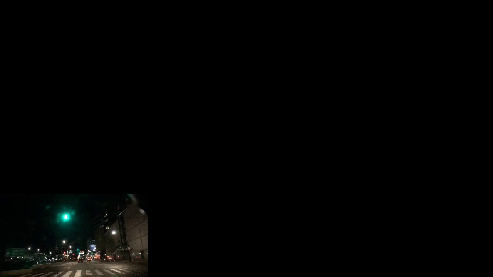
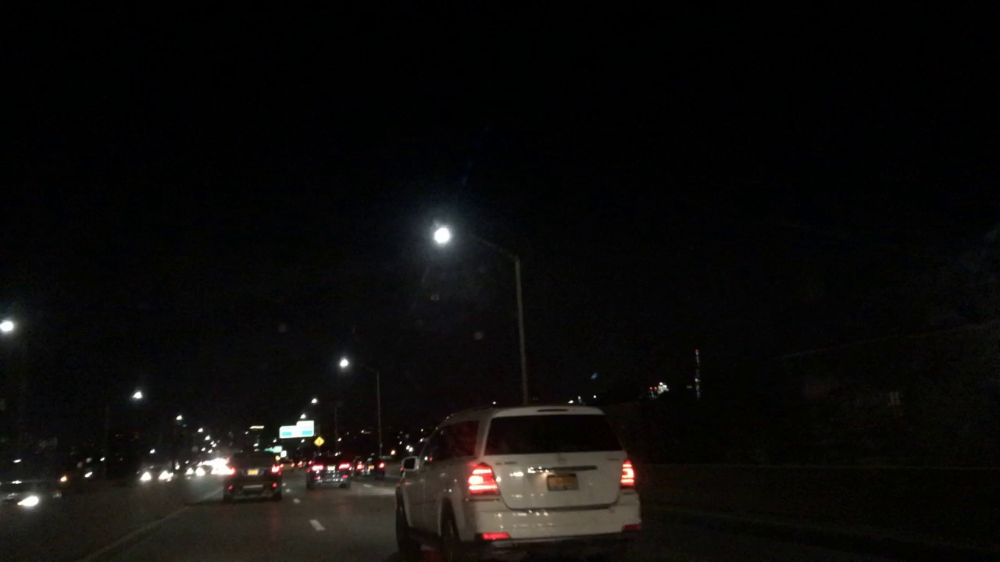
</p>
</div>

<p align="center">
  <strong>Exemplos de imagens com problemas.</strong>
</p>

Observou-se que algumas imagens da base de dados Nexet apresentavam características que poderiam comprometer a qualidade do treinamento. Foi feito um trabalho _semi_-manual de filtragem destas imagens. Muitas das análises foram feitas com base nas _distâncias_ entre as imagens de cada grupo. Estas distâncias foram calculadas a partir da saída da penúltima camada de uma rede classificadora de imagens pré-treinada ResNet18 [[13]](https://doi.org/10.1109/CVPR.2016.90), disponibilizada diretamente no [PyTorch](https://pytorch.org/vision/main/models/generated/torchvision.models.resnet18.html). Esta extração de características foi realizada com as imagens já escaladas e recortadas para o formato de treinamento.

**Imagens muito parecidas**
  * Foram listados os pares de imagens que apresentavam menores distâncias entre si.
  * Foi definido por inspeção visual, para a classe **dia**, que os 93 pares mais próximos eram de imagens muito semelhantes. Para cada par uma das imagens é excluída da base de dados.
  * Para a classe **noite** esta abordagem não se mostrou muito eficiente. Imagens com pequena distância entre si não eram consideradas parecidas em uma inspeção visual. Para esta classe nenhuma imagem foi retirada.

<div>
<p align="center">
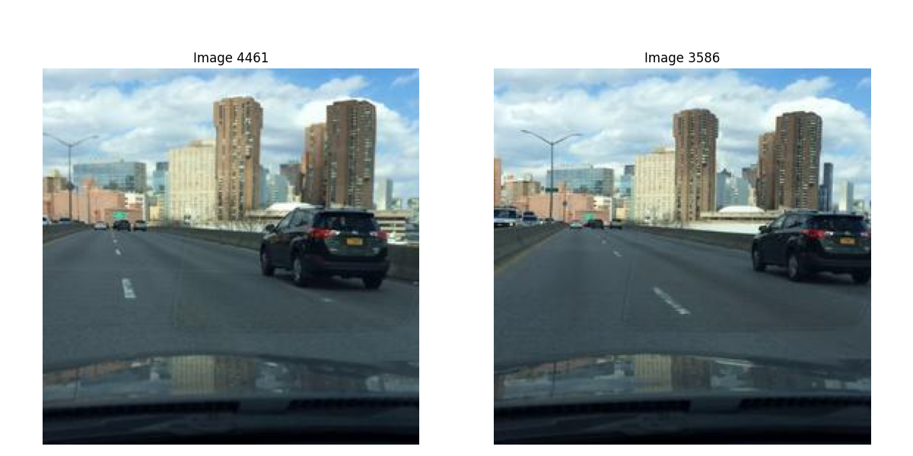
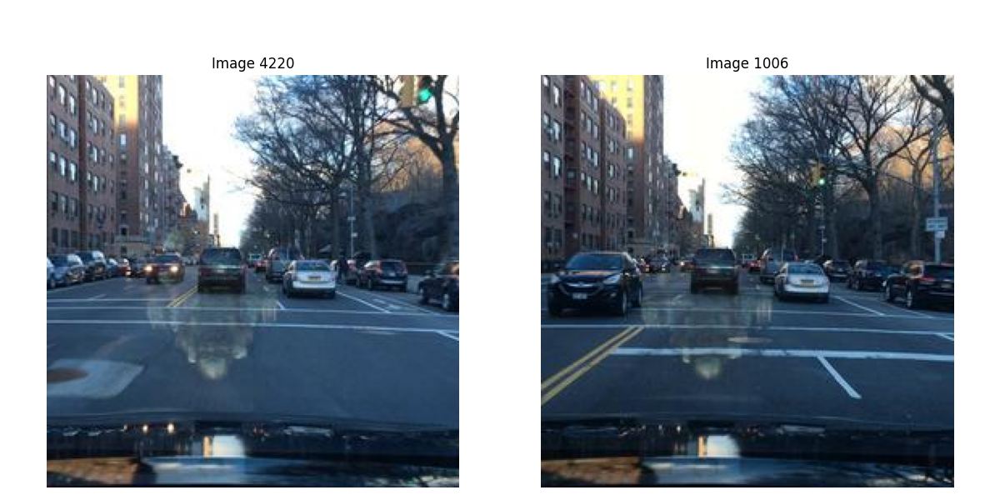
</p>
</div>

<p align="center">
  <strong>Exemplos de imagens muito parecidas na classe dia.</strong>
</p>

<div>
<p align="center">
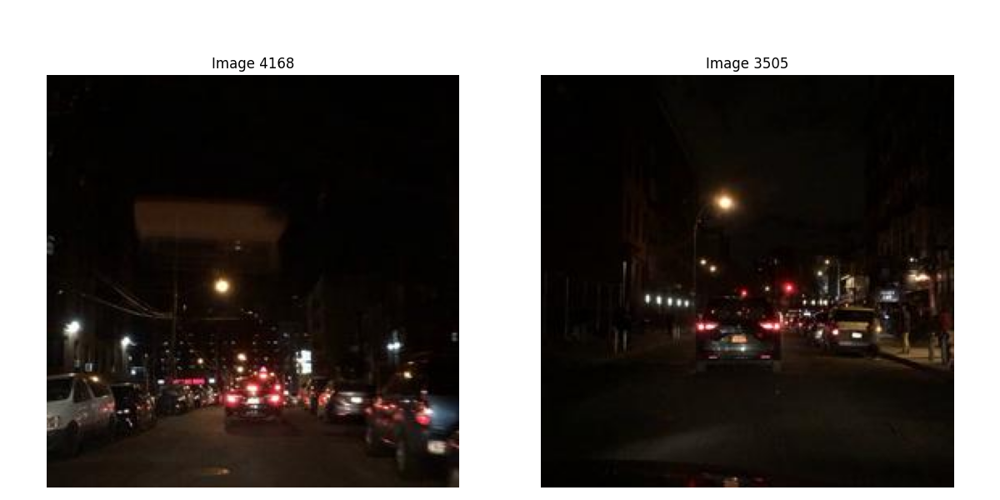
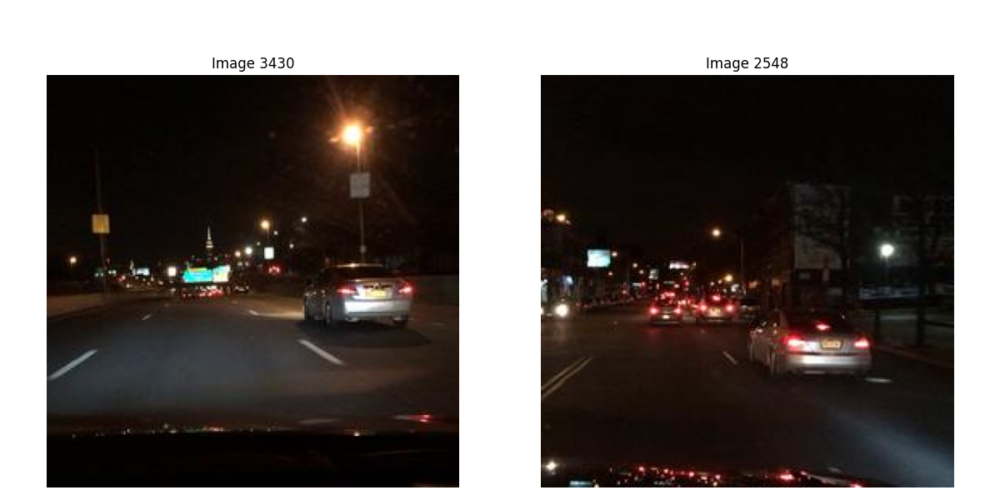
</p>
</div>

<p align="center">
  <strong>Exemplos de imagens muito parecidas na classe noite.</strong>
</p>


**Imagens _Difíceis_**
  * Para _facilitar_ o treinamento da rede, foram excluídas imagens com características consideradas _difíceis_ ou que não ajudam no treinamento: chuva _forte_, túneis, desfoque, objetos bloqueando a visão.
  * Para esta análise as imagens de cada classe foram agrupadas em 20 classes, com **k-Means**. Para cada classe foram sorteadas 36 imagens e foi feita uma análise visual de cada grupo.
  * A partir da análise visual, os grupos que foram considerados _problemáticos_ são novamente divididos com k-means. A análise visual dos subgrupos é que define que conjuntos de imagens são excluídos do treinamento.


<div>
<p align="center">
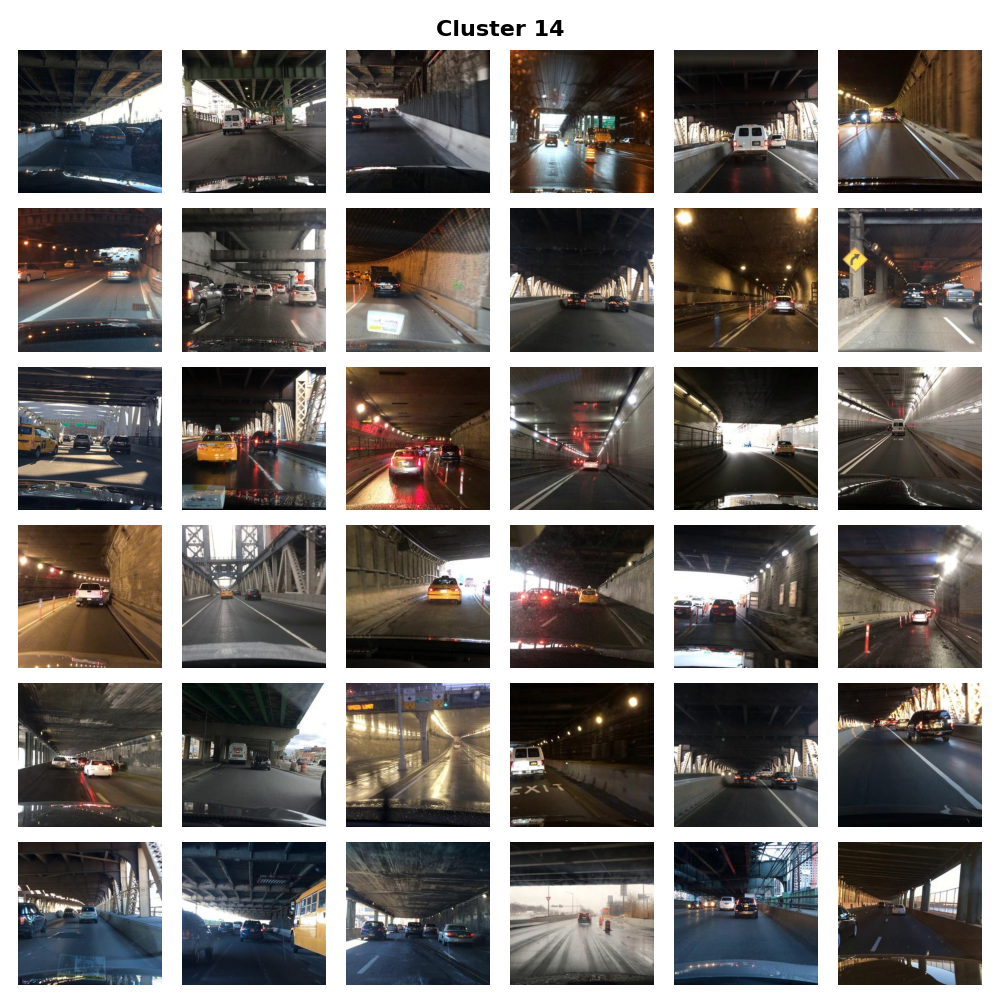
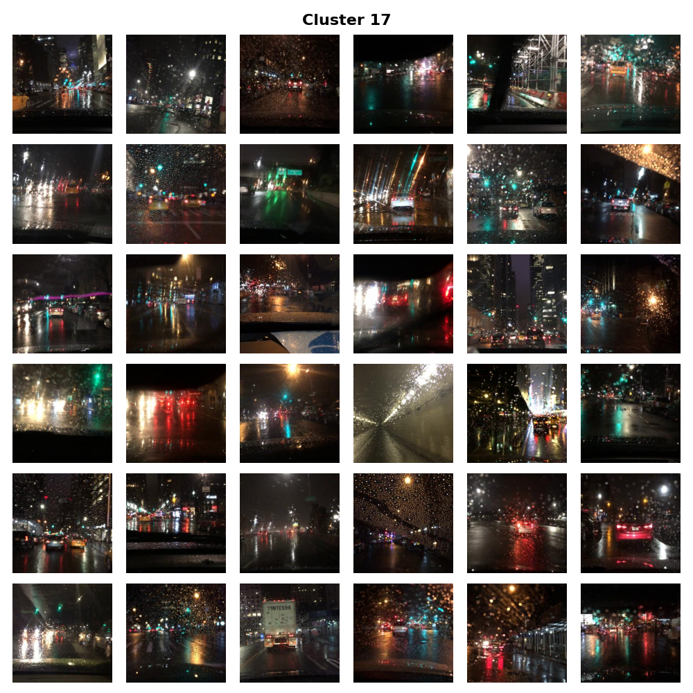
</p>
</div>

<p align="center">
  <strong>Exemplos de grupos de imagens consideradas difíceis para o treinamento.</strong>
</p>


[Notebook](src/notebooks/Filter_DayNight.ipynb)

#### O-Haze, I-Haze e D-Hazy

As imagens das bases de dados **O-Haze**, **I-Haze** e **D-Hazy** não foram trabalhadas neste projeto. **O-Haze** e **I-Haze** tem poucas imagens, e todas de alta resolução (2833×4657). Pode ser feito um processo de aumento de dados (_data augmentation_) nestas imagens, gerando diversas imagens 256x256 a partir das imagens originais. **D-Hazy** tem um número maior de imagens, e mapas de profundidade para cada imagem. Podem ser geradas imagens embaçadas com diferentes níveis de efeitos de embaçamento a partir das imagens originais e os respectivos mapas de profundidade.

<div>
<p align="center">
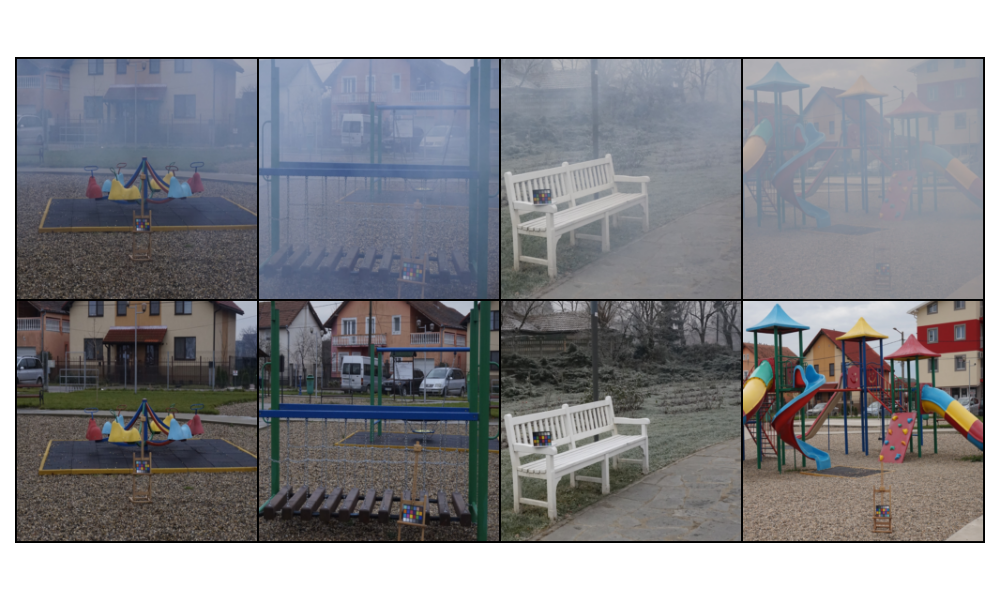
</p>
</div>

<p align="center">
  <strong>Exemplos de imagens da base O-Haze (blur acima e sharp abaixo).</strong>
</p>


### Workflow
<!--
Use uma ferramenta que permita desenhar o workflow e salvá-lo como uma imagem (Draw.io, por exemplo). Insira a imagem nessa seção.
Você pode optar por usar um gerenciador de workflow (Sacred, Pachyderm, etc) e nesse caso use o gerenciador para gerar uma figura para você.
Lembre-se que o objetivo de desenhar o workflow é ajudar a quem quiser reproduzir seus experimentos.
-->

Para cada uma das tarefas propostas, as imagens de treino são utilizadas para treinar a ReCycleGAN. A qualidade das imagens geradas pela rede é avaliada comparando com as imagens de teste.

Para monitorar e registrar os logs e resultados dos treinamentos e avaliações é utilizada a plataforma [Weights & Biases](https://wandb.ai/site).

<div>
<p align="center">
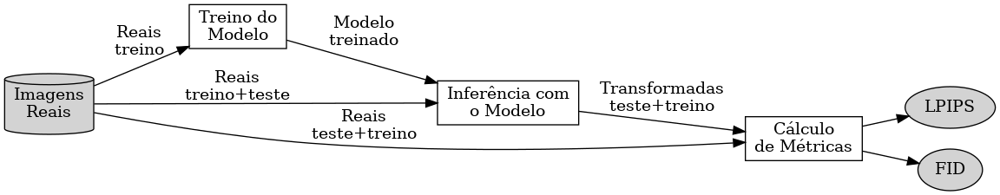
</p>
</div>

<p align="center">
  <strong>Workflow de trabalho.</strong>
</p>


## Experimentos, Resultados e Discussão dos Resultados
<!--
Na entrega parcial do projeto (E2), essa seção pode conter resultados parciais, explorações de implementações realizadas e
discussões sobre tais experimentos, incluindo decisões de mudança de trajetória ou descrição de novos experimentos, como resultado dessas explorações.

Na entrega final do projeto (E3), essa seção deverá elencar os **principais** resultados obtidos (não necessariamente todos), que melhor representam o cumprimento
dos objetivos do projeto.

A discussão dos resultados pode ser realizada em seção separada ou integrada à seção de resultados. Isso é uma questão de estilo.
Considera-se fundamental que a apresentação de resultados não sirva como um tratado que tem como único objetivo mostrar que "se trabalhou muito".
O que se espera da seção de resultados é que ela **apresente e discuta** somente os resultados mais **relevantes**, que mostre os **potenciais e/ou limitações** da metodologia, que destaquem aspectos
de **performance** e que contenha conteúdo que possa ser classificado como **compartilhamento organizado, didático e reprodutível de conhecimento relevante para a comunidade**.
-->

Até o momento não foi treinada nenhuma rede. Um resultado preliminar importante é o das métricas implementadas (FID e LPIPS). Foram feitos diversos testes com as imagens **Nexet** para avaliar a _escala_ de cada métrica. Observou-se que ambas métricas apresentaram resultados coerentes. Os valores das métricas comparando as imagens transformadas pela rede `CycleGAN-turbo` com as imagens de teste (**4** e **5**) tem valores entre a comparação das imagens de treino e teste da mesma categoria (**1** e **2**) e a comparação entre imagens de treino de categorias distintas (**3**).

|#|Imagens 1 |Imagens 2 | FID | LPIPS |
|-|----------|----------|----:|------:|
|**1**|Treino **dia**   | Teste **dia**            |     20.0 | 0.666 ± 0.0531 |
|**2**|Treino **noite** | Teste **noite**          |     17.4 | 0.594 ± 0.0590 |
|**3**|Treino **dia**   | Treino **noite**         |    101.0 | 0.722 ± 0.0567 |
|**4**|Teste **dia**    | CycleGAN-turbo **dia**   |     72.4 | 0.681 ± 0.0467 |
|**5**|Teste **noite**  | CycleGAN-turbo **noite** |     49.6 | 0.595 ± 0.0510 |

Outro resultado importante de nota é que para ambas métricas a transformação de imagens em **noite** pela **CycleGAN-turbo** tiveram melhor desempenho que a transformação em **dia**.

<div>
<p align="center">
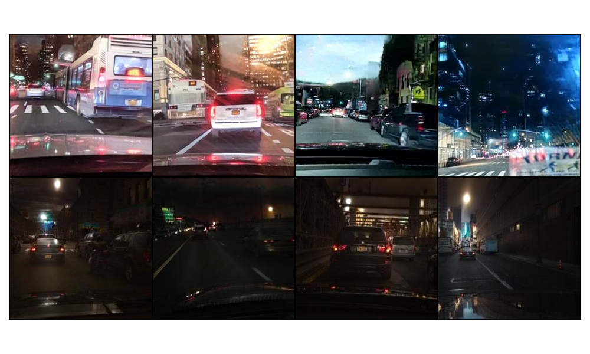
</p>
</div>

<p align="center">
  <strong>Exemplos de imagens transformadas com a CycleGAN-turbo (de noite para dia acima e de dia para noite abaixo).</strong>
</p>

## Conclusão
<!--
A seção de Conclusão deve ser uma seção que recupera as principais informações já apresentadas no relatório e que aponta para trabalhos futuros.
Na entrega parcial do projeto (E2) pode conter informações sobre quais etapas ou como o projeto será conduzido até a sua finalização.
Na entrega final do projeto (E3) espera-se que a conclusão elenque, dentre outros aspectos, possibilidades de continuidade do projeto.
-->

A primeira etapa do projeto, de levantamento de alternativas, se mostrou bastante desafiadora por conta da necessidade de adaptação dos códigos encontrados para uma única estrutura. A base de dados **Nexet** já foi reorganizada para ser utilizada neste projeto.

Com os principais elementos já organizados (CycleGAN _Vanilla_, métricas FID e LPIPS, e uma das bases de dados), o próximo passo será o de treinar a rede para a tarefa de transferência de estilo. Diferentes opções de estrutura para o treinamento estão em avaliação (Colab, Modal, AWS).

Os resultados da rede CycleGAN-turbo apontam para uma maior dificuldade na transformação de imagens de noite para dia do que o contrário.

## Referências Bibliográficas
<!--
Apontar nesta seção as referências bibliográficas adotadas no projeto.
-->

[1] Unpaired Image-to-Image Translation using Cycle-Consistent Adversarial Networks.<br>
Jun-Yan Zhu, Taesung Park, Phillip Isola, Alexei A. Efros. In ICCV 2017.<br>
[[Paper]](https://arxiv.org/abs/1703.10593) [[Github]](https://github.com/junyanz/pytorch-CycleGAN-and-pix2pix)

[2] Cycle-Dehaze: Enhanced CycleGAN for Single Image Dehazing. <br>
Deniz Engin, Anıl Genç, Hazim Kemal Ekenel. Proceedings of the IEEE conference on computer vision and pattern recognition workshops. 2018 <br>
[[Paper]](https://arxiv.org/pdf/1805.05308v1) [[Github]](https://github.com/engindeniz/Cycle-Dehaze)

[3] Ultrasound Image Enhancement Using CycleGAN and Perceptual Loss <br>
Shreeram Athreya, Haobo Wu, Xiaoyang Wang, Baoyuan Wang. arXiv, 2023.<br>
[[Paper]](https://arxiv.org/pdf/2312.11748v1) [[Github]](https://github.com/ShreeramAthreya/CDX-USChallenge)

[4] O-HAZE: A Dehazing Benchmark with Real Hazy and Haze-Free Outdoor Images <br>
Codruta O. Ancuti, Cosmin Ancuti, Radu Timofte, Christophe De Vleeschouwer. In CVPR 2018 Workshops.<br>
[[Paper]](https://arxiv.org/pdf/1804.05101v1) [[Site]](https://data.vision.ee.ethz.ch/cvl/ntire18//o-haze/)

[5] I-HAZE: A Dehazing Benchmark with Real Hazy and Haze-Free Indoor Images <br>
Codruta O. Ancuti, Cosmin Ancuti, Radu Timofte, Christophe De Vleeschouwer. In CVPR 2018 Workshops.<br>
[[Paper]](https://arxiv.org/pdf/1804.05091v1) [[Site]](https://data.vision.ee.ethz.ch/cvl/ntire18//i-haze/)

[6] D-HAZY: A Dataset to Evaluate Quantitatively Dehazing Algorithms <br>
Codruta O. Ancuti, Cosmin Ancuti, Christophe De Vleeschouwer. IEEE Transactions on Image Processing, 2016.<br>
[[Paper]](https://ieeexplore.ieee.org/document/7532754) [[Site]](https://www.semanticscholar.org/paper/D-HAZY%3A-A-dataset-to-evaluate-quantitatively-Ancuti-Ancuti/9451d0b1bfbba5f3e19c083866f1394aabf7d06c)

[7] StyTr²: Image Style Transfer with Transformers.<br>
Yingying Deng, Fan Tang, Weiming Dong, Chongyang Ma, Xingjia Pan, Lei Wang, Changsheng Xu. IEEE Conference on Computer Vision and Pattern Recognition (CVPR) 2022.<br>
[[Paper]](https://arxiv.org/abs/2105.14576) [[Github]](https://github.com/diyiiyiii/StyTR-2)

[8] Splicing ViT Features for Semantic Appearance Transfer.<br>
Narek Tumanyan, Omer Bar-Tal, Shai Bagon, Tali Dekel. IEEE Conference on Computer Vision and Pattern Recognition (CVPR) 2022.<br>
[[Paper]](https://arxiv.org/abs/2201.00424) [[Github]](https://github.com/omerbt/Splice) [[Site]](https://splice-vit.github.io/)

[9] One-Step Image Translation with Text-to-Image Models.<br>
Gaurav Parmar, Taesung Park, Srinivasa Narasimhan, Jun-Yan Zhu. In arXiv 2024.<br>
[[Paper]](https://arxiv.org/abs/2403.12036) [[Github]](https://github.com/GaParmar/img2img-turbo)

[10] Analyzing and Improving the Image Quality of StyleGAN.<br>
Tero Karras, Samuli Laine, Miika Aittala, Janne Hellsten, Jaakko Lehtinen, Timo Aila. IEEE Conference on Computer Vision and Pattern Recognition (CVPR) 2022.<br>
[[Paper]](https://arxiv.org/abs/1912.04958) [[Github]](https://github.com/NVlabs/stylegan2)

[11] Gans trained by a two time-scale update rule converge to a local nash equilibrium.<br>
Heusel, Martin, et al. Advances in neural information processing systems 30 (2017).<br>
[[Paper]](https://arxiv.org/abs/1706.08500) [[Github]](https://github.com/mseitzer/pytorch-fid)

[12] The unreasonable effectiveness of deep features as a perceptual metric.<br>
Zhang, Richard, et al. Proceedings of the IEEE conference on computer vision and pattern recognition. 2018.<br>
[[Paper]](https://arxiv.org/abs/1801.03924) [[Github]](https://github.com/richzhang/PerceptualSimilarity) [[Site]](https://richzhang.github.io/PerceptualSimilarity/)

[13] Deep Residual Learning for Image Recognition.<br>
Kaiming He, Xiangyu Zhang, Shaoqing Ren, Jian Sun. IEEE Conference on Computer Vision and Pattern Recognition (CVPR) 2016.<br>
[[Paper]](https://doi.org/10.1109/CVPR.2016.90)