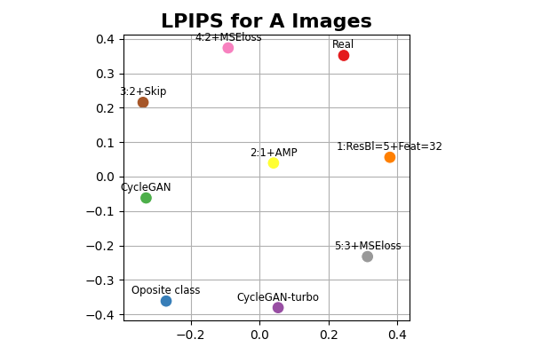
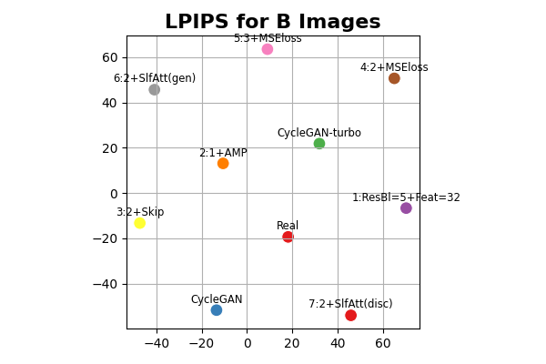

# Resultados

A tabela abaixo apresenta um resumo dos principais resultados obtidos na comparação das imagens geradas por cada modelo testado com as imagens reais (e.g.: imagens da classe B, noite, transformadas em imagens da classe A, dia, comparadas com as imagens reais da classe A). Todas as métricas foram calculadas usando as imagens de treino e de teste.

|Transformação |Modelo | FID | LPIPS |
|-|-|-:|-:|
|A?B|CycleGAN |     .0 | 0. ± 0. |
||ReCycleGAN 1 |     .0 | 0. ± 0. |
||ReCycleGAN 2 |     .0 | 0. ± 0. |
||ReCycleGAN 3 |     .0 | 0. ± 0. |
||ReCycleGAN 4 |     .0 | 0. ± 0. |
||ReCycleGAN 5 |     .0 | 0. ± 0. |
||ReCycleGAN 6 |     .0 | 0. ± 0. |
||ReCycleGAN 7 |     .0 | 0. ± 0. |
||ReCycleGAN 8 |     .0 | 0. ± 0. |
||ReCycleGAN 9 |     .0 | 0. ± 0. |
|B?A|CycleGAN-turbo |     .0 | 0. ± 0. |
||CycleGAN |     .0 | 0. ± 0. |
||ReCycleGAN 1 |     .0 | 0. ± 0. |
||ReCycleGAN 2 |     .0 | 0. ± 0. |
||ReCycleGAN 3 |     .0 | 0. ± 0. |
||ReCycleGAN 4 |     .0 | 0. ± 0. |
||ReCycleGAN 5 |     .0 | 0. ± 0. |
||ReCycleGAN 6 |     .0 | 0. ± 0. |
||ReCycleGAN 7 |     .0 | 0. ± 0. |
||ReCycleGAN 8 |     .0 | 0. ± 0. |
||ReCycleGAN 9 |     .0 | 0. ± 0. |
||CycleGAN-turbo |     .0 | 0. ± 0. |

A coluna das transformações é preenchida apenas na primeira linha do respectivo conjunto de resultados para reduzir a poluição visual da tabela. Para a métrica LPIPS são apresentados o valor médio e o desvio padrão.

## Mapas de Modelos

*Abusando* da ideia de distâncias das métricas, são montados mapas 2d com a posição relativa dos modelos. O mapa é construído a partir das distâncias entre todos os possíveis conjuntos de imagens (reais x modelos, modelos x modelos) e aplicando MDS (Multidimensional scaling) para reduzir a informação a duas dimensões.

  <strong>Mapa dos modelos avaliados com FID para imagens da classe A.</strong>

  <strong>Mapa dos modelos avaliados com FID para imagens da classe B.</strong>

Os mapas de modelos baseados nas médias da métrica LPIPS não geraram bons resultados. Foi preciso introduzir um ajuste antes de montar o mapa das distâncias. A média dos valores de LPIPS não é zero quando se compara um conjunto de imagens com o mesmo conjunto. Desta forma o LPIPS se aproxima mais de uma medida de *coerência* entre as imagens do que uma distância.

O formato dos histogramas dos valores de LPIPS é aproximadamente de uma Gaussiana. Optou-se por usar a distância de Wasserstein como medida de distância entre a distribuição das imagens reais entre si ($G_{RR}$) e a distribuição entre as imagens reais e as imagens falsas ($G_{RF}$).

$$
  W(G_{RR},G_{RF}) = \sqrt{(\mu_{RR} - \mu_{RF})^2 + (\sigma_{RR} - \sigma_{RF})^2}
$$

  

    
  

  

    <strong>Mapa dos modelos avaliados com LPIPS para imagens da classe A.</strong>
  

  

    
  

  

    <strong>Mapa dos modelos avaliados com LPIPS para imagens da classe B.</strong>
  

## Histogramas de LPIPS

Uma outra tentativa de análise dos resultados foi comparar as distribuições dos valores de LPIPS entre as imagens reais e falsas, por modelo testado.

  

    
  

  

    <strong>Histogramas de valores de LPIPS para imagens da classe A.</strong>
  

  

    
  

  

    <strong>Histogramas de valores de LPIPS para imagens da classe B.</strong>
  

## Amostragem de Imagens

A última análise foi a da coerência do LPIPS com a qualidade perceptual das imagens. Foi construído um histograma do valor médio do LPIPS entre todas as imagens reais e cada uma das imagens falsas geradas por um dos modelos de teste. Foram amostradas imagens com diferentes valores de LPIPS médio.

  

    
  

  

    <strong>Amostras com diferentes valores de LPIPS médio para imagens da classe A geradas com o modelo XXXXX.</strong>
  

  

    
  

  

    <strong>Amostras com diferentes valores de LPIPS médio para imagens da classe B geradas com o modelo XXXXX.</strong>
  

## Exemplos

Exemplos de imagens transformadas aleatórias são apresentados abaixo.

  

    
  

  

    <strong>Exemplos de imagens transformadas de dia para noite.</strong>
  

  

    
  

  

    <strong>Exemplos de imagens transformadas de noite para dia.</strong>
  

