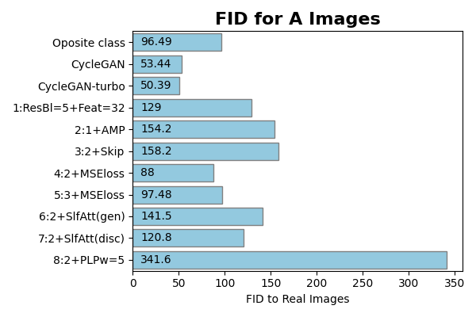
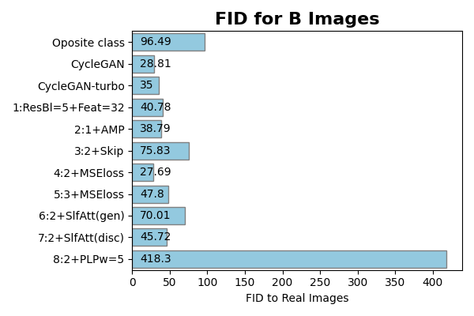
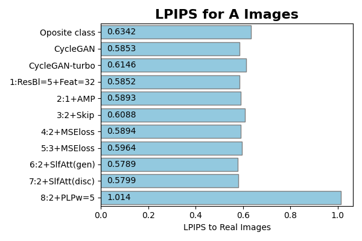
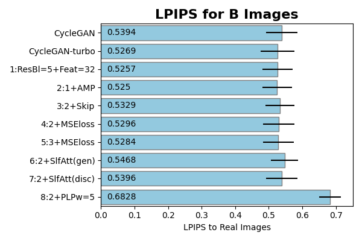
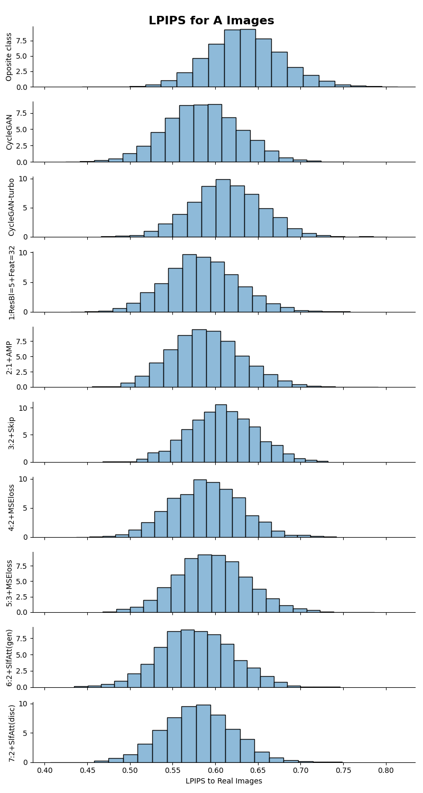
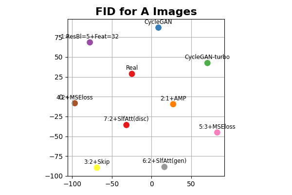
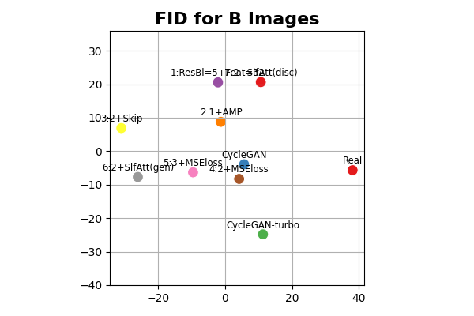
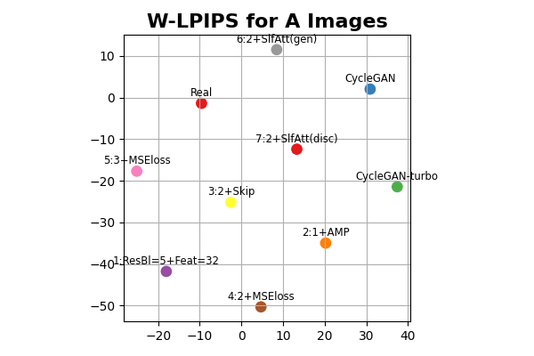
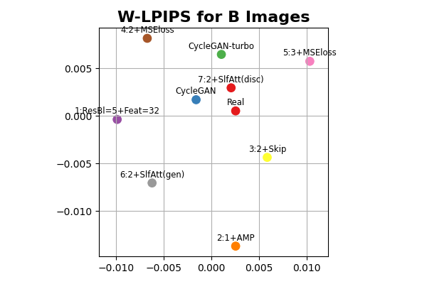

# Resultados

A tabela abaixo apresenta um resumo dos principais resultados obtidos na comparação das imagens geradas por cada modelo testado com as imagens reais (e.g.: imagens da classe B, noite, transformadas em imagens da classe A, dia, comparadas com as imagens reais da classe A). Todas as métricas foram calculadas usando as imagens de treino e de teste. Para a métrica LPIPS são apresentados o valor médio e o desvio padrão.

|Modelo | Épocas | FID A→B | LPIPS A→B | FID B→A | LPIPS B→A |
|-|:-:|:-:|:-:|:-:|:-:|
|CycleGAN       | 41  |    53,44   |    0,5853   ± 0,04370 |    28,81   |   0,5395   ± 0,04669 |
|CycleGAN-turbo |     |  **50,39** |    0,6146   ± 0,04229 |    35,00   |   0,5282   ± 0,05043 |
|ReCycleGAN 1   | 40  |   129,0    |    0,5852   ± 0,04327 |    40,78   |   0,5275   ± 0,04426 |
|ReCycleGAN 2   | 38  |   154,2    |    0,5893   ± 0,04163 |    38,79   | **0,5253** ± 0,04411 |
|ReCycleGAN 3   | 42  |   158,2    |    0,6088   ± 0,03889 |    75,83   |   0,5332   ± 0,04321 |
|ReCycleGAN 4   | 49  |    88,00   |    0,5894   ± 0,04110 |  **27,69** |   0,5289   ± 0,04685 |
|ReCycleGAN 5   | 49  |    97,48   |    0,5964   ± 0,04294 |    47,80   |   0,5287   ± 0,04546 |
|ReCycleGAN 6   | 49  |   141,5    |  **0,5789** ± 0,04261 |    70,01   |   0,5472   ± 0,04025 |
|ReCycleGAN 7   | 49  |   120,8    |    0,5799   ± 0,04065 |    45,72   |   0,5394   ± 0,04551 |
|ReCycleGAN 8   | 32  |   341,6    |    1,0140   ± 0,03567 |   418,3    |   0,6833   ± 0,03227 |

Os melhores resultados estão destacados em negrito.

Os resultados são apresentados em forma gráfica abaixo.

  

    
    
  

  

    <strong>FID para imagens da classe A e B.</strong>
  

  

    
    
  

  

    <strong>LPIPS para imagens da classe A e B. As barras representam os valores médios, e as linhas horizontais indicam o respectivo desvio padrão.</strong>
  

O caso de teste 8 (termo de regularização na função de perda) teve comportamento divergente, gerando imagens transformadas de baixa qualidade. Este modelo é ignorado nas avaliações que seguem.

## Histogramas de LPIPS

Uma outra tentativa de análise dos resultados foi comparar as distribuições dos valores de LPIPS entre as imagens reais e falsas, por modelo testado.

  

    
    
  

  

    <strong>Histogramas de valores de LPIPS para imagens das classes A e B.</strong>
  

## Mapas de Modelos

*Abusando* da ideia de distâncias das métricas, foram montados mapas 2D com a posição relativa dos modelos. O mapa é construído a partir das distâncias entre todos os possíveis conjuntos de imagens (reais x modelos, modelos x modelos). A matriz de distância é transformada em uma lista de coordenadas com MDS (Multidimensional scaling), e então é aplicado T-SNE para reduzir a informação a duas dimensões. A transformação direta da matriz de distâncias em um mapa 2D não gerou bons resultados.

  <strong>Mapa dos modelos avaliados com FID para imagens das classes A e B.</strong>

Os mapas de modelos baseados nas médias da métrica LPIPS não geraram bons resultados. Foi preciso introduzir um ajuste antes de montar o mapa das distâncias. A média dos valores de LPIPS não é zero quando se compara um conjunto de imagens com o mesmo conjunto. Desta forma o LPIPS se aproxima mais de uma medida de *coerência* entre as imagens do que uma distância.

O formato dos histogramas dos valores de LPIPS é aproximadamente de uma Gaussiana. Optou-se por usar a distância de Wasserstein como medida de distância entre a distribuição das imagens reais entre si ($G_{RR}$) e a distribuição entre as imagens reais e as imagens falsas ($G_{RF}$).

$$
  W(G_{RR},G_{RF}) = \sqrt{(\mu_{RR} - \mu_{RF})^2 + (\sigma_{RR} - \sigma_{RF})^2}
$$

  

    
    
  

  

    <strong>Mapa dos modelos avaliados com LPIPS para imagens das classes A e B.</strong>
  

Mapas em 3D são apresentados nos links abaixo:

* [FID das imagens A](https://raw.githack.com/TiagoCAAmorim/dgm-2024.2/documentation/projetos/ReCycleGAN/docs/assets/evaluation/fid_map3D_images_A.html)
* [FID das imagens B](https://raw.githack.com/TiagoCAAmorim/dgm-2024.2/documentation/projetos/ReCycleGAN/docs/assets/evaluation/fid_map3D_images_B.html)
* [LPIPS das imagens A](https://raw.githack.com/TiagoCAAmorim/dgm-2024.2/documentation/projetos/ReCycleGAN/docs/assets/evaluation/w-lpips_map3D_images_A.html) (baseado na distância de Wasserstein).
* [LPIPS das imagens B](https://raw.githack.com/TiagoCAAmorim/dgm-2024.2/documentation/projetos/ReCycleGAN/docs/assets/evaluation/w-lpips_map3D_images_B.html) (baseado na distância de Wasserstein).

<!-- Atualizar para documentação final: https://raw.githack.com/ -->

## Exemplos

Exemplos de imagens transformadas são apresentados abaixo.

  <strong>Exemplos de imagens transformadas de dia para noite (A) e de noite para dia (B).</strong>

