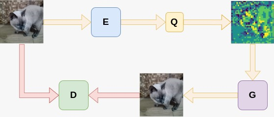
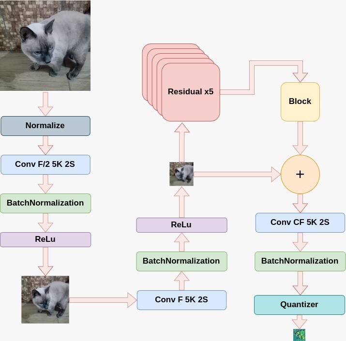
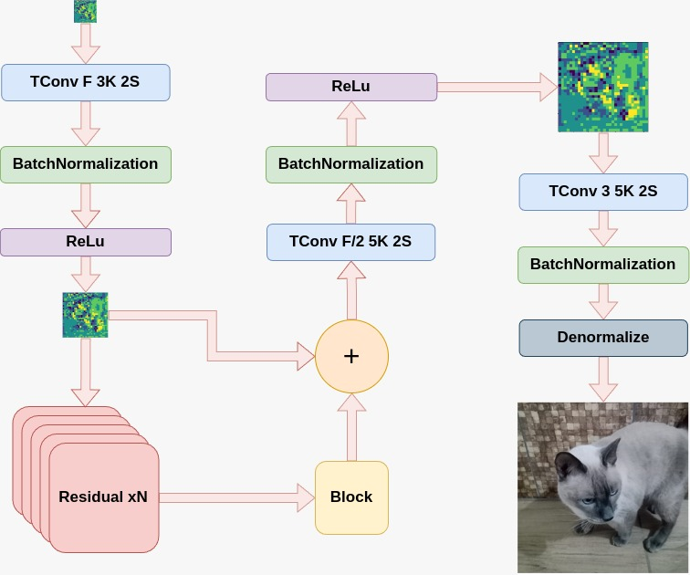
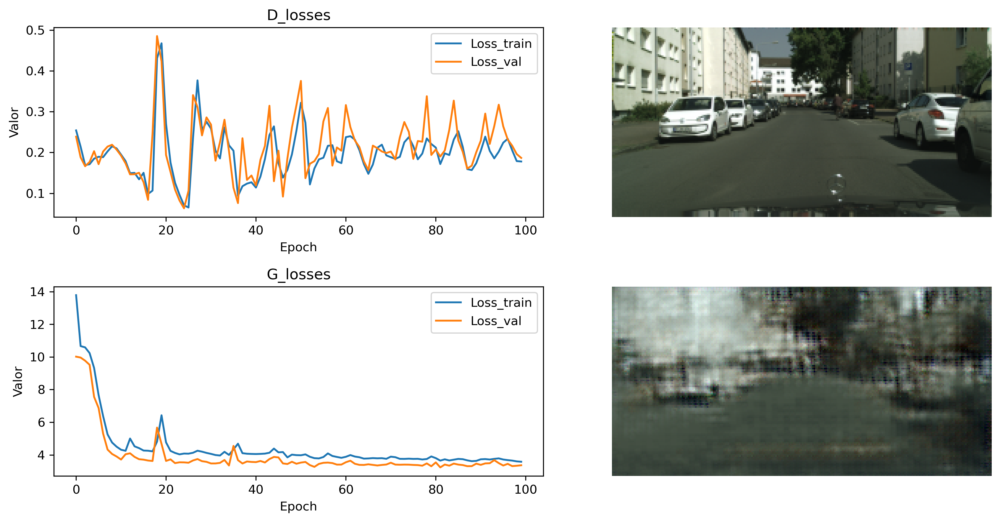

# `Compressão Semântica`
# `Semantic Compression`

## Apresentação

O presente projeto foi originado no contexto das atividades da disciplina de pós-graduação *IA376N - IA generativa: de modelos a aplicações multimodais*, 
oferecida no segundo semestre de 2024, na Unicamp, sob supervisão da Profa. Dra. Paula Dornhofer Paro Costa, do Departamento de Engenharia de Computação e Automação (DCA) da Faculdade de Engenharia Elétrica e de Computação (FEEC).

> |Nome  | RA | Especialização|
> |--|--|--|
> | Antonio César de Andrade Júnior  | 245628  | Eng. de Computação |
> | Eduardo Nunes Velloso  | 290885  | Eng. Elétrica |

## Resumo (Abstract)

A compressão semântica é uma operação de crescente importância no contexto de comunicações orientadas a tarefa, selecionando os aspectos mais relevantes de uma mensagem. Em se tratando de imagens, modelos gerativos possiblitam reconstruções sintéticas que preservam o conteúdo semântico da imagem original. Nesse trabalho propomos estudar o comportamento de modelos gerativos baseados em GAN. Serão avaliados os desempenhos de variações da formulação original em termos de MS-SSIM (distorção sintática) e intersection-over-union (IoU; distorção semântica). Os resultados parciais obtidos até então revelam que é possível reconstruir imagens urbanas sem alimentar a GAN com nenhuma segmentação semântica, mas com distorções sintáticas significativas.

## Descrição do Problema/Motivação

A compressão de dados, e em particular a compressão de imagens, é um componente fundamental para as novas gerações de comunicação móvel.
Aplicações de natureza crítica, como a telemedicina e os carros autônomos, envolvem decisões que precisam ser tomadas imediatamente com base em uma transmissão de imagens contínua, proveniente de vários sensores simultâneamente.
Para viabilizar essas aplicações, uma compressão a taxas extremamente baixas (menos de 0.1 bit por pixel ou bpp) se faz necessária.
Embora nesse caso já não seja possível preservar o conteúdo estrutural das imagens, essas tarefas estão interessadas somente em certos atributos da imagem, os quais constituem o valor semântico embutido na imagem.

A tarefa da compressão semântica, portanto, é a de projetar um codificador capaz de extrair essa informação semântica e um decodificador capaz de gerar uma imagem reconstruída com o mesmo conteúdo essencial.
O projeto de tais decodificadores pode ser desenvolvido por meio de modelos generativos.

Em [[1]](#1), os autores introduziram uma proposta inicial da utilização de GANs para compressão semântica, tanto utilizando segmentação semântica para sintetizar regiões de interesse (por exemplo, para sintetizar fundos de videochamadas) quanto comprimindo apenas uma sequência de bits (por exemplo, para sintetizar detalhes de partes da imagem).
O trabalho de [[2]](#2) propôs uma arquitetura chamada DSSLIC, também utilizando GANs, que combina a utilização dos mapas semânticos com os resíduos da própria compressão como entradas da rede decodificadora.
Já em [[3]](#3), é utilizado um modelo de difusão latente (LDM), codificando um colormap quantizado da imagem original para auxiliar na reconstrução a partir do vetor semântico extraído.

Este projeto tem como objetivo realizar um estudo comparativo de modelos de compressão semântica baseados nos mencionados acima.

[Link para apresentação de slides](https://www.canva.com/design/DAFLAnYRo_I/-onPe1fuMSMTnykgfkM3zg/edit?utm_content=DAFLAnYRo_I&utm_campaign=designshare&utm_medium=link2&utm_source=sharebutton)

## Objetivo

### Objetivo geral

Contruir e comparar modelos gerativos voltados para compressão semântica de dados.

### Objetivos específicos

* Montar e treinar uma GAN simples que reconstrua uma imagem a partir do espaço latente da original;
* Montar e treinar uma GAN/cGAN que construa uma imagem semanticamente parecida com a imagem original;
* Comparar o comportamento e desempenho dos modelos implementados ao variar a função de distorção e a codificação semântica.

## Metodologia

> Descrever de maneira clara e objetiva, citando referências, a metodologia proposta para se alcançar os objetivos do projeto.
> Citar algoritmos de referência.
> Justificar os porquês dos métodos escolhidos.
> Apontar ferramentas relevantes.
> Descrever metodologia de avaliação (como se avalia se os objetivos foram cumpridos ou não?).

Diante do contexto apresentado, a proposta deste projeto será implementar diferentes abordagens de redes generativas e compará-las de maneira padronizada com um modelo de referência de compressão tradicional e entre si.

Para isso, será primeiramente analisado um modelo simples baseado em GAN sem rede de segmentação e um modelo mais sofisticado baseado em GANs condicionais (cGANs) para síntese de regiões de interesse da imagem original, como em [[1]](#1).
A extração de informação semântica se dará por uma modificação da arquitetura ResNet de identificação de objetos em cenas, como foi feito pelo CLIP [[4]](#4) e pela PSPNet [[5]](#5).
Além disso, como modelo de referência, será usado um codec de compressão WebP.

Finalmente, a avaliação se dará de maneira quantitativa através de dois grupos de métricas.
Isso se deve ao compromisso matemático existente entre a **distorção** observada entre valores de pixels individuais e a **percepção** da qualidade da imagem [[8]](#8).
Para medir a distorção entre as imagens reconstruídas e as imagens originais, serão usadas as métricas usuais de PSNR (peak signal-to-noise ratio) e MS-SSIM (multi-scale structural similarity).
Já no caso da percepção, será comparada a representação semântica obtida nas imagens reconstruídas pelo reuso do codificador com a representação semântica da imagem original, através da relação IoU (intersection-over-union) dos vetores latentes encontrados.
Também serão usadas métricas adversárias (e.g. Feature Matching) e a rede MUSIQ [[9]](#9), que computa uma métrica de qualidade da imagem reconstruída.

* A métrica PSNR é uma medida utilizada na avaliação da qualidade de imagens e vídeos comprimidos ou processados. Ela compara a similaridade entre uma imagem ou vídeo original e sua versão comprimida ou modificada. É definida como $10*log _{10}\Big(\frac{MAX^2}{MSE}\Big)$, onde $MAX$ é máximo valor que um pixel pode ter;

* O MS-SSIM expande o SSIM ao calcular a similaridade estrutural em diferentes escalas, obtidas através de um processo de subamostragem ou redimensionamento da imagem em várias resoluções. O objetivo é capturar as informações tanto de detalhes finos quanto de padrões globais da imagem. É definido como $`MS-SSIM(x,y) = \prod_{j=1}^M [l(x,y)]^{\alpha_j}*[c(x,y)]^{\beta_j}*[s(x,y)]^{\gamma_j}`$, onde $l(x,y)$, $c(x,y)$ e $s(x,y)$ são luminância, contraste e estrutura, respectivamente, e $\alpha_j$, $\beta_j$ e $\gamma_j$ são os pesos para cada escala. O range é 0-1;

* O IoU é uma métrica utilizada para avaliar a precisão de modelos de detecção e segmentação de objetos em visão computacional. Ela mede a sobreposição entre a área prevista pelo modelo e a área real do objeto, sendo um indicador de quão bem o modelo localizou ou delimitou o objeto. É definido como $IoU=\frac{Área \_ de \_ Interseção}{Área \_ de \_ União}$. O range é 0-1;

* A métrica MUSIQ é um método mais recente para avaliar a qualidade perceptiva de imagens. Diferente de métricas tradicionais como PSNR e SSIM, que calculam a qualidade com base em medidas objetivas de diferenças entre pixels, o MUSIQ é um modelo baseado em aprendizado profundo que captura a percepção de qualidade visual de forma mais próxima ao que os humanos experimentam. Ele foi treinado em grandes conjuntos de dados contendo anotações de qualidade de imagens fornecidas por observadores humanos, permitindo uma avaliação mais precisa da qualidade subjetiva. O range é 0-100;

Em uma avaliação de ordem qualitativa para teste inicial do conceito também serão consideradas imagens da base de dados da Kodak, comumente utilizada para benchmarks de compressão de imagens.

### Bases de Dados e Evolução
|Base de Dados | Endereço na Web | Resumo descritivo|
|----- | ----- | -----|
|Cityscapes [[6]](#6) | https://www.cityscapes-dataset.com/ | 5 mil imagens urbanas contendo objetos de 30 classes e respectivas segmentações |
| COCO-Stuff 10K v1.1 [[7]](#7) | https://github.com/nightrome/cocostuff10k | 10 mil imagens contendo objetos de 182 classes e respectivas segmentações |

As imagens da base Cityscapes possuem todas as mesmas dimensões em pixels (2048x1024) e são subdivididas em 2975 imagens de treino, 1525 de validação e 500 de teste.
Como pré-processamento, estas foram redimensionadas para 256x128.
A média e variância do conjunto de imagens de treino foi determinada para cada canal de cor, e o resultado foi utilizado para normalizar as imagens de entrada para distribuições gaussianas aproximadamente unitárias.
O acesso foi obtido gratuitamente por meio de cadastro, embora a licença não permita a redistribuição pública das imagens utilizadas.

As imagens da base pública COCO-Stuff serão utilizadas posteriormente no trabalho.
As imagens são de dimensões e aspectos variados, e o pré-processamento delas incluiu uma etapa de cropping para permitir a redução padronizada a 256x256.
Sendo uma base mais diversa em termos de tipos de cenas, traz com isso vantagens e desvantagens: permite potencialmente uma melhor generalização do modelo treinado, mas também dificulta mais o processo de treinamento.

### Workflow
Na figura abaixo, mostramos a visão geral do modelo baseado em GAN implementado, ainda sem utilização de informações semânticas:

Trata-se de um autoencoder no qual o decoder consiste em uma GAN.
Além disso, um quantizador permite o controle da taxa de bits utilizada na representação latente da imagem comprimida.

Mais especificamente, um vetor latente $w = E(x)$ é gerado a partir do encoder $E$; esse vetor é quantizado em $L$ níveis de quantização pelo quantizador $Q$, a partir da qual o gerador G gera uma imagem reconstruída $\hat{x}=G(\hat{w})$. 
Os níveis do quantizador são fixos a priori e seu gradiente é ignorado durante a retropropagação, já que não é uma operação diferenciável.
Durante o treinamento, o discriminador $D$ busca maximizar os acertos no discernimento entre imagens reais e geradas, enquanto o autoencoder minimiza esse mesmo objetivo somado a uma distorção entre as imagens de entrada e saída.
De fato, o problema de otimização característico pode ser escrito na forma:

$$\min_{E,G} \max_{D} \mathbb{E}[(D(x)-1)^2] + \mathbb{E}[D(\hat{x})^2] + \lambda d(x,\hat{x})$$

As arquiteturas utilizadas para o autoencoder são baseadas em blocos residuais da ResNet, como ilustram os diagramas a seguir:

O número de filtros $F$ e o número de blocos residuais $N$ constituem hiperparâmetros que definem a complexidade do modelo a ser treinado.
Além destes, as taxas de aprendizado, o número $C$ de canais de saída do encoder, e o número $L$ de níveis de quantização também são hiperparâmetros a serem otimizados.

A entropia das possíveis entradas latentes da GAN, isto é, o número de bits necessários para representar as imagens comprimidas, é limitada pelas dimensões da imagem:

$$\mathcal{H}(\hat{w}) \leq \dfrac{H}{8} \times \dfrac{W}{8} \times C \times \log_2(L),$$
em que $H,W$ são as dimensões da imagem original e o fator 8 vem da redução introduzida pelas convoluções no encoder.
A partir dessa entropia máxima é possível estimar a taxa de compressão em bits por pixel.

## Experimentos, Resultados e Discussão dos Resultados

A arquitetura descrita na seção anterior foi implementada por meio do framework Keras. Os hiperparâmetros relativos a complexidade da rede foram variados entre 3 configurações: pequena (32 filtros, 3 blocos), média (64 filtros, 4 blocos) e grande (128 filtros, 5 blocos). A taxa de aprendizado de cada otimizador foi variada entre duas opções: 1E-3 ou 1E-4. Os treinamentos foram realizados durante 100 épocas, e as funções custo referentes ao discriminador e ao autoencoder foram registradas separadamente para cada caso.

Observamos que quando o otimizador do discriminador tem uma taxa de aprendizado mais rápida, ele tende a convergir sua função custo para um dos dois extremos no qual sua saída é independente da imagem gerada.
O aumento da complexidade da rede também levantou comportamentos indesejados no treinamento, levando ao sobreajuste do conjunto de treino.

Dentre as opções analisadas, o modelo pequeno com taxas 1E-4 para o discriminador e 1E-3 para o autoencoder se mostrou com melhor desempenho.
A figura abaixo mostra a evolução de suas funções custo, com o discriminador convergindo para um equilíbrio em torno de 0.25 e o autoencoder sendo capaz de reduzir quase monotonicamente a distorção (foi utilizado fator $\lambda=10$). 
No lado direito, mostramos também um exemplo de reconstrução para uma imagem do conjunto de teste do Cityscapes, ilustrando qualitativamente a significância desse nível de distorção 

## Conclusão

Estando implementada a base da arquitetura do compressor (autoencoder com discriminador), a perspectiva para o restante do trabalho envolve seguir os seguintes passos:

1. Avaliar o efeito de alimentar o discriminador com a informação semântica durante o treinamento (permanece desnecessária ao uso do autoencoder);
2. Alimentar o gerador com a informação semântica (condicionando a GAN);
3. Implementar e treinar um rede de segmentação semântica baseada na arquitetura pre-existente da PSPnet [[5]](#5);
4. Treinar as mesmas arquiteturas a partir de uma função de distorção semântica;
5. Aplicar as métricas de avaliação aos resultados obtidos em cada cenário.

### Cronograma
>| Tarefa          | Data de Finalização     | Número de Semanas| Progresso  |
>|-----------------|------------|-----------|------------|
>| Revisão bibliográfica        | 17/09/2024 | 2 | ██████████ 100% |
>| Webp | 24/09/2024 | 1 | ██████████ 100% |
>| Desenvolvimento GAN | 08/10/2024 | 2 | █████████░ 90%  
>| Entrega 2          | 08/10/2024 | 0 | ██████████ 100% |
>| Rede de segmentação semântica | 15/10/2024 | 1 | ░░░░░░░░░░ 0% |
>| Desenvolvimento cGAN    | 29/10/2024 | 2 | ░░░░░░░░░░ 0%  |
>| GAN/cGAN com distoção semântica    | 12/11/2024 | 2 | ░░░░░░░░░░ 0%  |
>| Análise dos resultados    | 25/11/2024 | 2 | ░░░░░░░░░░ 0%  |
>| Montar entrega 3   | 25/11/2024 | 0 | ░░░░░░░░░░ 0%  |

## Referências Bibliográficas

<a id="1">[1]</a> E. Agustsson, M. Tschannen, F. Mentzer, R. Timofte, and L. Van Gool, “Generative adversarial networks for extreme learned image compression,” in Proc. IEEE/CVF Int. Conf. Comput. Vis. (ICCV), Oct. 2019, pp. 221–231, https://ieeexplore.ieee.org/document/9010721

<a id="2">[2]</a> M. Akbari, J. Liang, and J. Han, “DSSLIC: Deep semantic segmentation-based layered image compression,” in Proc. IEEE Int. Conf. Acoust., Speech Signal Process. (ICASSP), May 2019, pp. 2042–2046, https://ieeexplore.ieee.org/document/8683541

<a id="3">[3]</a> : T. Bachard, T. Bordin and T. Maugey, "CoCliCo: Extremely Low Bitrate Image Compression Based on CLIP Semantic and Tiny Color Map," 2024 Picture Coding Symposium (PCS), Taichung, Taiwan, 2024, pp. 1-5, doi: 10.1109/PCS60826.2024.10566358., https://ieeexplore.ieee.org/document/10566358

<a id="4">[4]</a> : T. Bachard and T. Maugey, "Can Image Compression Rely on CLIP?," in IEEE Access, vol. 12, pp. 78922-78938, 2024, doi: 10.1109/ACCESS.2024.3408651., https://ieeexplore.ieee.org/abstract/document/10545425

<a id="5">[5]</a> H. Zhao, J. Shi, X. Qi, X. Wang, and J. Jia, “Pyramid scene parsing network,” in Proc. IEEE Conf. Comput. Vis. Pattern Recognit. (CVPR), Jul. 2017, pp. 2881–2890

<a id="6">[6]</a> M. Cordts, M. Omran, S. Ramos, T. Rehfeld, M. Enzweiler, R. Benenson, U. Franke, S. Roth, and B. Schiele, "The cityscapes dataset for semantic urban scene understanding," in Proc. IEEE Conf. Comput. Vis. Pattern Recognit. (CVPR), 2016, pp. 3213–3223, https://ieeexplore.ieee.org/document/7780719

<a id="7">[7]</a> H. Caesar, J. Uijlings, and V. Ferrari, "COCO-Stuff: Thing and stuff classes in context," in Proc. IEEE Conf. Comput. Vis. Pattern Recognit. (CVPR), 2018, https://ieeexplore.ieee.org/document/8578230

<a id="8">[8]</a> Y. Blau and T. Michaeli, “Rethinking lossy compression: The rate-distortion-perception tradeoff,” in Proc. Int. Conf. Mach. Learn., vol. 97, Jun. 2019, pp. 675–685, 

<a id="9">[9]</a> J. Ke, Q. Wang, Y. Wang, P. Milanfar, and F. Yang, “Musiq: Multi-scale image quality transformer,” in Proceedings of the IEEE/CVF International Conference on Computer Vision, 2021, pp. 5148–5157, https://ieeexplore.ieee.org/document/9710973
