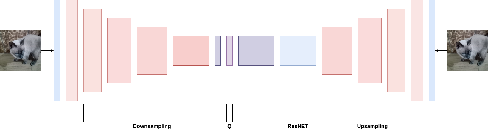
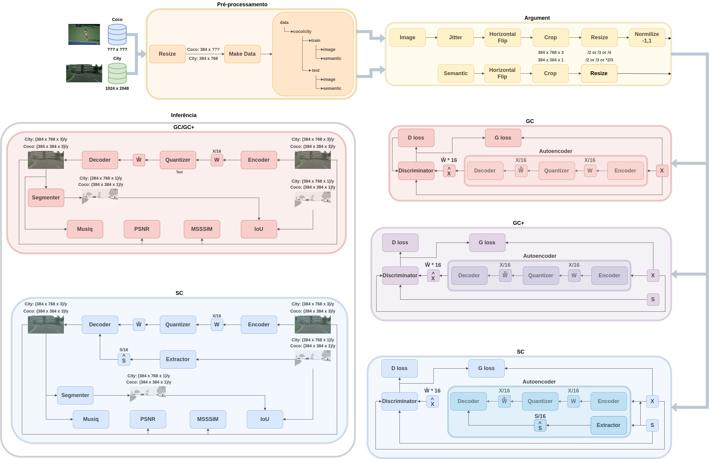
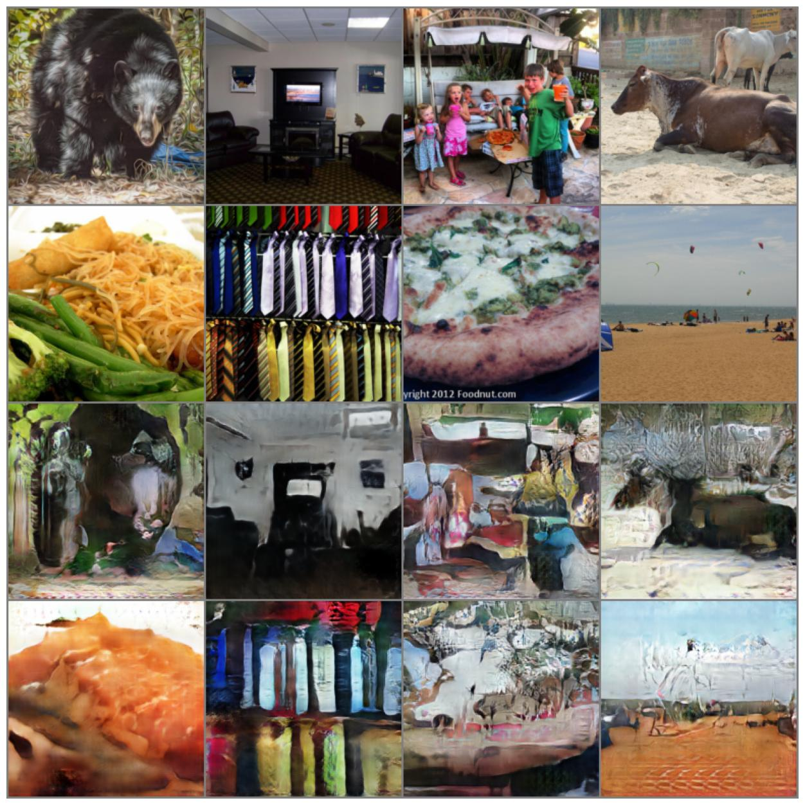
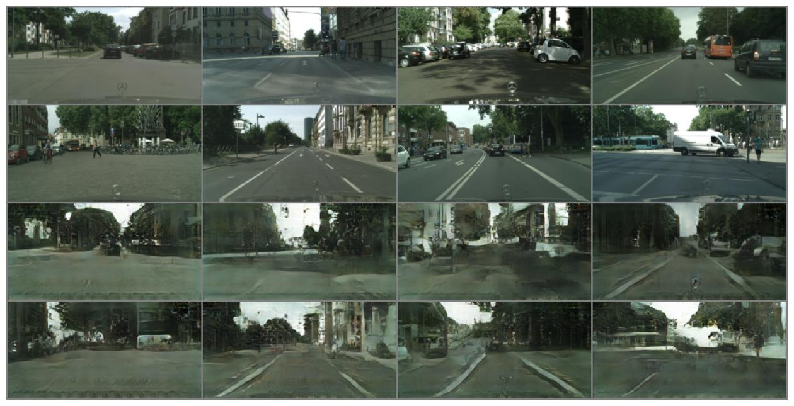

# `Compressão Semântica`
# `Semantic Compression`

## Apresentação

O presente projeto foi originado no contexto das atividades da disciplina de pós-graduação *IA376N - IA generativa: de modelos a aplicações multimodais*, 
oferecida no segundo semestre de 2024, na Unicamp, sob supervisão da Profa. Dra. Paula Dornhofer Paro Costa, do Departamento de Engenharia de Computação e Automação (DCA) da Faculdade de Engenharia Elétrica e de Computação (FEEC).


> |Nome  | RA | Especialização|
> |--|--|--|
> | Antonio César de Andrade Júnior  | 245628  | Eng. de Computação |
> | Eduardo Nunes Velloso  | 290885  | Eng. Elétrica |

### Uso

1. Clonar o repositório:

```
git clone https://github.com/dioph/dgm-2024.2.git
cd projetos/Semantic-Compression
```

2. Instalar os requisitos:

```
pip install -r requirements.txt
```

3. Preparar o dataset:

```
make data/city
make data/coco
```

4. Editar `config.py` com os parâmetros desejados.

5. Treinar no conjunto de dados escolhido:

```
cd semantic-commpression
python -m modeling.train
```

6. Avaliar no conjunto de teste escolhido:

```
python -m modeling.predict
```

## Resumo (Abstract)

A compressão semântica é uma operação de crescente importância no contexto de comunicações orientadas a tarefa, selecionando os aspectos mais relevantes de uma mensagem.
Em se tratando de imagens, modelos gerativos possiblitam reconstruções sintéticas que preservam o conteúdo semântico da imagem original.
Nesse trabalho propomos estudar o comportamento de modelos gerativos baseados em GAN.
Foram avaliados os desempenhos de variações da formulação original em termos de distorção sintática, distorção semântica, e percepção.
Os resultados obtidos revelam que o modelo resultante é fortemente enviesado pelas características do conjunto de dados utilizado para treinamento, e que a qualidade da rede de segmentação pode limitar a obtenção de mapas semânticos significativos após a reconstrução.


## Descrição do Problema/Motivação

A compressão de dados (e, em particular, a compressão de imagens) é um componente fundamental para as novas gerações de comunicação móvel.
Aplicações de natureza crítica, como a telemedicina e os carros autônomos, envolvem decisões que precisam ser tomadas imediatamente com base em uma transmissão de imagens contínua, proveniente de vários sensores simultâneamente.
Para viabilizar essas aplicações, uma compressão a taxas extremamente baixas (menos de 0.1 bit por pixel ou bpp) se faz necessária.

O problema da compressáo de dados pode ser formalizado como o projeto de um **codificador** $f:\mathcal{X}\rightarrow[1,2^R]$ e um **decodificador** $g:[1,2^R]\rightarrow\mathcal{X}$ de tal forma a garantir que a **distorção** média $\mathbb{E}d(x,g(f(x)))$ seja inferior a uma dada tolerância $D_x$.
Shannon [[1]](#1) demonstra que a **taxa de compressão** $R$ mínima que possibilita a existência de uma solução é dada pelo problema de otimização da informação mútua:

$$R=\sup_{f,g} I(X;\hat{X}) = \sup_{q}\mathbb{E}\log\left(\dfrac{q(\hat{x}|x)}{\sum_x p(x)q(\hat{x}|x)}\right),$$
sujeito a restrição $\mathbb{E}d(x,\hat{x})\leq D_x$.

O problema da **compressão semântica** surge da constatação que, para a maioria das tarefas de interesse, é suficiente a reconstrução de um estado intrínseco $S$ contido na observação extrínseca $X$. Isso permite obter codificadores viáveis com taxas $R$ extremamente baixas, a partir de uma restrição sobre a distorção semântica $\mathbb{E}d(s,\hat{s})\leq D_s$. 

Seja $\varphi:\mathcal{X}\rightarrow\mathcal{S}$ uma função **segmentadora** que representa a distribuição condicional $p(s|x)$, e seja $h:\mathcal{S}\rightarrow[1,2^R]$ um **extrator de características** para o espaço de estados semânticos, análogo ao codificador.
Então $\hat{w}=f(x,s)$, $\hat{v}=h(s)$, e $\hat{x}=g(\hat{w},\hat{v})$ constituem um modelo de compressão condicionado à variável $S$.
O objetivo passa a ser projetar $f$, $g$ e $h$ sob uma dada tolerância de **distorção semântica** $\mathbb{E}d(\varphi(x),\varphi(\hat{x}))$ de maneira a minimizar a taxa de compressão $R$.
Uma vez que os pixels de uma imagem não são variáveis independentes, uma baixa distorção média entre pixels não necessariamente garante uma baixa distorção semântica, e vice-versa.

O projeto dos modelos de compressão de imagens pode ser realizado por redes neurais.
Mentzer et al. [[2]](#2) propuseram um autoencoder que também aprende um "mapa de importância" associado à entropia de cada subconjunto de pixels nas imagens originais, determinando assim quais regiões tem maior prioridade durante a reconstrução.
A partir dessa proposta, Agustsson et al. [[3]](#3) incluíram um treinamento adversarial ao autoencoder com o objetivo de tornar as imagens reconstruídas visualmente mais realistas.
Outra proposta que utilizou redes adversariais (GANs) foi a DSSLIC [[4]](#4), incluindo resíduos da compressão como entradas para a rede decodificadora.
Já em [[5]](#5), é utilizado um modelo de difusão latente (LDM), codificando um colormap quantizado da imagem original para auxiliar na reconstrução a partir do vetor semântico extraído.

Neste projeto realizamos um estudo de modelos generativos de compressão semântica baseados nos mencionados acima.

[Link para apresentação de slides](https://www.canva.com/design/DAGXPszR-uE/QFLI4NdCQgBdT4qFYjf_HA/edit?utm_content=DAGXPszR-uE&utm_campaign=designshare&utm_medium=link2&utm_source=sharebutton)

## Objetivo

Diante do contexto apresentado, o objetivo desse projeto é desenvolver modelos gerativos baseados em autoencoders e GANs condicionais para compressão semântica de imagens.
Especificamente, dado uma taxa de compressão fixa $R$, queremos projetar as funções $f$, $g$ e $h$ que minimizem a distorção semântica $d(\varphi(x),\varphi(\hat{x}))$, gerando imagens próximas das originais e visualmente realistas.

## Metodologia

Os objetivos apresentados foram abordados da seguinte forma.
Definimos como "estado intrínseco" $S$ o mapa semântico de instâncias segmentadas e classificadas nas imagens correspondentes.
Essa variável contempla simultaneamente o conteúdo (quais classes estão presentes) e a organização (qual a posição das classes presentes) das imagens.
O espaço $\mathcal{S} \subset \mathcal{C}^{H\times W}$, em que $\mathcal{C}$ é o conjunto de possíveis classes observadas nas imagens, e $H$ e $W$ são as suas dimensões em pixels.

Dada uma imagem de entrada $x \in \mathcal{X} \subset [0,255]^{H\times W}$, a função segmentadora $\varphi$ é simplesmente uma rede neural segmentadora *off-the-shelf* pré-treinada para um determinado conjunto de classes $\mathcal{C}$.
No nosso caso, utilizamos a Pyramid Scene Parsing Network (PSPNet) [[6]](#6) e a DeepLab [[7]](#7), conforme detalhado nas seções subsequentes.

O modelo de compressão neural utilizado foi baseado em redes completamente convolucionais (FCNs), cujas arquiteturas são detalhadas na subseção do Workflow.
1. O **encoder** $f$ realiza um downsample da imagem original concatenada ao seu mapa semântico para um tensor $w$ com $C$ canais de dimensões $\left(\dfrac{H}{2^{N_\mathrm{conv}}},\dfrac{W}{2^{N_\mathrm{conv}}}\right)$, em que $N_\mathrm{conv}$ corresponde ao número de camadas convolucionais.
2. O **extrator de características** $h$ realiza uma operação análoga no mapa semântico $s=\varphi(x)$, gerando um tensor $v$ com as mesmas dimensões de $w$.
3. Em seguida, o **quantizador** realiza uma operação diferenciável para obter $\hat{w}$ e $\hat{v}$ a partir de $w$ e $v$, utilizando $L$ níveis de quantização fixos e igualmente espaçados.
4. O **gerador** $g$ utiliza uma rede ResNet [[8]](#8) com $N_b$ blocos residuais seguida  por $N_\mathrm{conv}$ camadas convolucionais transpostas para realizar o upsample da concatenação de $\hat{w}$ e $\hat{v}$ para uma imagem reconstruída $\hat{x}$, com uma função de ativação $\tanh$ que mantém a saída entre -1 e 1.
5. O **discriminador** $D:\mathcal{X}\times\mathcal{S}\rightarrow[0,1]$ realiza um downsample análogo ao encoder, com uma função de ativação sigmoide na saída, sendo treinado para classificar imagens entre reais e sintéticas.

A taxa de compressão é portanto limitada por $$R \leq \dfrac{H}{2^{N_\mathrm{conv}}}\times\dfrac{W}{2^{N_\mathrm{conv}}}\times C \times \log_2(L),$$
de forma que $\mathrm{bpp}\leq \log_2{L}\times C/4^{N_\mathrm{conv}}$.

O treinamento se deu através do uso de dois otimizadores AdamW [[9]](#9) em paralelo, um responsável pelo ajuste de parâmetros do autoencoder e o outro pelos parâmetros do discriminador.
As respectivas funções custo utilizadas foram:

$$\begin{cases}\mathcal{L}_\mathrm{AE} &=  \mathbb{E}(\lambda ||x-\hat{x}||^2 + \ell(D(\hat{x},s),\mathrm{REAL})) \\ \mathcal{L}_\mathrm{D} &= \mathbb{E}(\ell(D(x,s),\mathrm{REAL}) + \ell(D(\hat{x},s),\mathrm{FAKE}))\end{cases},$$
em que $\ell(\cdot,\cdot):[0,1]\times[0,1]\rightarrow\mathbb{R}$ é alguma medida de divergência baseada nos rótulos $\mathrm{REAL},\mathrm{FAKE}\in[0,1]$ e $\lambda>0$ é um termo de regularização que pondera a relevância da distorção sintática na reconstrução. 

O treinamento descrito pode ser interpretado das seguintes formas: por um lado, trata-se de um simples autoencoder que minimiza a distorção das imagens recontruídas, ao qual é concatenado um discriminador responsável por aproximar as distribuições de probabilidade observadas nas imagens de entrada e saída, melhorando a **percepção** das reconstruções; por outro lado, trata-se de uma DCGAN [[10]](#10) cuja amostragem do espaço latente não é aleatória, mas sim baseada na codificação de imagens reais, e o termo de distorção estabiliza o treinamento evitando colapso de modos.

Também diferenciamos dois cenários de operação segundo o uso dos mapas semânticos verdadeiros como informação lateral: a **compressão seletiva** (SC), na qual $f$, $g$ e $D$ têm acesso a $s=\varphi(x)$, e a **compressão gerativa** (GC), na qual passamos $s=0$ em todos os blocos. Enquanto o modo SC possibilita o condicionamento da reconstrução a semântica desejada, o modo GC possibilita a aplicação do compressor a qualquer imagem externa ao conjunto de dados, para a qual $\varphi$ pode não ser bem definido.

Os modelos treinados foram avaliados segundo as seguintes métricas:

1. **PSNR**

    Nada mais é que $10\log_{10}(||x-\hat{x}||^{-2})$, uma medida do inverso do erro médio quadrático em decibel. Útil para verificar o funcionamento adequado do autoencoder.

2. **MS-SSIM**

    Multi-Scale Structural Similarity, uma medida de distorção sintática $d(x,\hat{x})$ que leva em conta a dependência estrutural dos pixels, sendo assim mais correlacionada com o desempenho da tarefa *downstream* de interesse.

3. **IoU**

    Intersection-over-Union, uma medida de distorção semântica $d(s,\hat{s})$ que mede a taxa percentual de acertos da segmentação da reconstrução em relação a original.

4. **MUSIQ** [[11]](#11)

    Uma medida da percepção $\Psi(\hat{x})$, a qual tem uma relação de compromisso matemático com a distorção [[12]](#12). É determinada a partir de uma rede neural treinada sobre dados de avaliação perceptual humana.

Além disso, várias técnicas de treinamento foram consideradas e seu efeito no desempenho final foi avaliado por um estudo de ablação:

1. **Pré-treino**

    Considera a possibilidade de treinar exclusivamente o autoencoder apenas com relação ao custo de reconstrução $||x-\hat{x}||^2$ durante metade do número total de épocas de treinamento, buscando obter uma inicialização mais adequada ao processo de treinamento global.

2. **Divergência adversarial $\ell$**

    Considera a utilização do erro médio quadrático (MSE) e da entropia cruzada binária (BCE).

3. **Dropout**

    Considera a inclusão de camadas de dropout com probabilidade 30\% para regularizar o treinamento do discriminador.

4. **Rótulos adversariais suaves**

    Considera o uso dos rótulos $\mathrm{REAL}=0.95$ e $\mathrm{FAKE}=0.10$ em vez de $\mathrm{REAL}=1$ e $\mathrm{FAKE}=0$, para estabilizar os valores do contradomínio de $\ell$ e seus respectivos gradientes.

5. **Adição de ruído**

    Considera ruído aditivo gaussiano de variância $0.01$ na entrada do discriminador.

6. **Modo GC+**

    Para o cenário de compressão gerativa (GC), considera fornecer os mapas semânticos verdadeiros $s=\varphi(x)$ somente para o discriminador, de forma que a operação durante a inferência permanece independente de $\varphi$.

7. **Redução de $\lambda$**

    Considera usar $\lambda=5$ em vez de $\lambda=10$ como regularizador.

### Bases de Dados e Evolução
|Base de Dados | Endereço na Web | Resumo descritivo|
|----- | ----- | -----|
|Cityscapes [[13]](#13) | https://www.cityscapes-dataset.com/ | 5 mil imagens urbanas contendo objetos de 30 classes e respectivas segmentações |
| COCO-Stuff 10K v1.1 [[14]](#14) | https://github.com/nightrome/cocostuff10k | 10 mil imagens contendo objetos de 182 classes e respectivas segmentações |

Todas as imagens da base Cityscapes possuem as mesmas dimensões em pixels (1024x2048), enquanto as imagens da base COCO-Stuff possuem dimensões variadas.
Durante a preparação de dados, ambas as bases são divididas entre um conjunto de treino com 90\% do total de imagens e um conjunto de teste com os demais 10\%.
Além disso, as imagens do COCO-Stuff são recortadas com base no quadrado central de maneira a padronizar os aspectos, e em seguida todas as imagens de ambas as bases são redimensionadas de forma a seu menor lado ter 384 pixels de comprimento (384x768 no caso do Cityscapes, 384x384 no caso do COCO-Stuff).

O treinamento é realizado com apenas uma das bases, de acordo com a configuração escolhida.
Durante o treinamento, foram realizadas transformações sobre os dados de maneira a diversificar as imagens encontradas pela rede a cada época; é feita uma variação de brilho aleatória de até 50\% seguida de uma reflexão horizontal com probabilidade 50\%.
As imagens de entrada também são normalizadas uniformemente para o intervalo $[-1,1]$ antes do treinamento.

No caso da base Cityscapes, o segmentador utilizado foi a PSPNet com 101 camadas de ResNet pré-treinada nesse mesmo conjunto de dados.
Já no caso do COCO-Stuff, o segmentador utilizado foi a DeepLab com 101 camadas de ResNet, também pré-treinada nessa mesma base.
Em outras palavras, não foi necessário nenhum treinamento adicional dos pesos das redes segmentadores utilizadas em ambos os cenários.  

As características particulares de cada base de dados trazem consigo vantagens e desvantagens.
As imagens do Cityscapes são mais uniformes, o que facilita a segmentação, mas também significa que errar pequenos detalhes pode ter um impacto significativo.
O acesso foi obtido gratuitamente por meio de cadastro, embora a licença não permita a redistribuição pública das imagens utilizadas.
Já no caso do COCO-Stuff, sendo uma base mais diversa em termos de tipos de cenas, permite potencialmente uma melhor generalização do modelo treinado, mas também dificulta o processo de treinamento.


### Workflow

Conforme mencionado anteriormente, a arquitetura proposta é baseada em FCNs, nas quais utilizamos $N_\mathrm{conv}=4$ blocos convolucionais em cada processo de downsample/upsample e $N_b=6$ blocos residuais na ResNet do gerador.
Cada bloco convolucional consiste em uma camada convolucional seguida por uma normalização por instância e uma ativação ReLU.

Especificamente, a arquitetura proposta é detalhada abaixo:
* Encoder $f$: `c7s1-(F/16) d-(F/8) d-(F/4) d-(F/2) d-F c3s1-C q`
* Extrator de características $h$: `c7s1-(F/16) d-(F/8) d-(F/4) d-(F/2) d-F c3s1-C q`
* Gerador $g$: `c3s1-F R-F R-F R-F R-F R-F R-F u-(F/2) u-(F/4) u-(F/8) u-(F/16) c7s1-3`
* Discriminador $D$: `c7s1-(F/16) d-(F/8) d-(F/4) d-(F/2) d-F c3s1-1`

Na notação utilizada acima, `cKs1` indica um bloco convolucional que não altera o tamanho da imagem de entrada (passo 1) e cujo kernel é quadrado com tamanho $K$; `d` indica um bloco de downsample (passo 2); `u` indica um bloco de upsample (convolucional transposta com passo 2); `R` indica um bloco residual com 6 camadas convolucionais; o sufixoi `-N` indica que a saída do bloco tem $N$ canais ($N$ filtros); e `q` representa o quantizador diferenciável.

O autoencoder resultante da combinação de $f$ e $g$ acima é ilustrado esquematicamente na Figura 1 abaixo:



A variação de altura dos blocos representa as variações nas dimensões das imagens, enquanto a variação de largura representa o número de canais após cada etapa.

A visão geral do workflow completo do projeto é ilustrada na Figura 2 abaixo:



Na parte superior esquerda, em laranja, temos a etapa de preparação dos dados e pré-processamento, conforme descrita na subseção anterior. Em seguida, em amarelo, temos o restante do processo de data augmentation aplicado separadamente às imagens $x$ e seus mapas $s$.
Ao lado direito, os 3 diagramas representam o treinamento da rede nos cenários de operação GC, GC+ e SC. Por fim, o processo de inferência e cálculo das métricas de avaliação nos conjuntos de teste é ilustrado na parte inferior esquerda para os cenários GC e SC (note que não há diferença entre GC e GC+ durante a inferência).

## Experimentos, Resultados e Discussão dos Resultados

Para o estudo de ablação, foram fixados os hiperparâmetros $F=240$ filtros, $\beta_1=0.5$, $\beta_2=0.999$ e $\eta_\mathrm{AE}=\eta_D=0.0003$ para os otimizadores, além dos valores de $N_b=6$ blocos residuais e $N_\mathrm{conv}=4$ blocos convolucionais mencionados anteriormente.
Os modelos foram treinados no dataset COCO-Stuff com redimensionamento para 192x192 pixels, $C=4$ canais no gargalo, e operação no modo SC.
O quantizador foi projetado com $L=8$ níveis de quantização igualmente espaçados entre -2.1 e +2.1. Isso corresponde a um controle da taxa de compressão para $R=1728$ bits (216 bytes) ou cerca de 0.047 bpp. Para esse teste, o treinamento foi feito por 80 épocas com tamanho de batch igual a 200. 


<style>
    .heatMap {
        width: 70%;
        text-align: center;
    }
    .heatMap th {
        background: grey;
        word-wrap: break-word;
        text-align: center;
    }
    .heatMap tr:nth-child(2) { background: #C6EDC3; }
    .heatMap tr:nth-child(3) { background: #C6EDC3; }
    .heatMap tr:nth-child(4) { background: #ff8080; }
    .heatMap tr:nth-child(5) { background: #ff8080; }
    .heatMap tr:nth-child(6) { background: #C6EDC3; }
    .heatMap tr:nth-child(7) { background: #ff8080; }

</style>

<div class="heatMap">

| pré-treino | $\ell$ | dropout | rótulo suave | ruído | $\lambda$ | PSNR | MS-SSIM | IoU | MUSIQ |
|----- | ----- | -----| -----| -----| -----| -----| -----| -----|-----|
| :x:   | BCE   | :white_check_mark:  | :white_check_mark:  | :white_check_mark:  | 5 | 18.6323 | 0.6840 | 0.0609 | 20.9435 |
| :x:   | BCE   | :white_check_mark:  | :white_check_mark:  | :white_check_mark:   | 10 | 18.5691 | 0.7015 | 0.0767 | 14.3494 |
| :x:   | BCE   | :white_check_mark:  | :white_check_mark:  | :x:  | 10 |  18.8568 | 0.7039 | 0.0741 | 23.4123 |
| :x:  | BCE   | :white_check_mark:  | :x:  | :x:  |  10 | 18.0193 | 0.6771 | 0.0492 | 25.5737 |
| :x:   | BCE   | :x:  | :x:  | :x:  | 10 | 17.7700 | 0.6474 | 0.0588 | 24.9416 |
| :x:   | MSE   | :x:  | :x:  | :x:  | 10 | 18.5598 | 0.6911 | 0.0775 | 26.7606 |
| :white_check_mark:  | MSE   | :x:  | :x:  | :x:  |  10 | 18.6989 | 0.6984 | 0.0583 | 23.4893 |

</div>

A tabela acima mostra os resultados obtidos para cada configuração testada no estudo.
As linhas verdes indicam uma melhora em relação a configuração anterior, e as linhas vermelhas indicam um desempenho pior.
Diante desses resultados, utilizamos o dropout e os rótulos suaves, com $\lambda=10$ e divergência de erro médio quadrático, sem pré-treino e sem adição de ruído.

Treinamos a rede nessa configuração ideal por 160 épocas, em ambos os conjuntos de dados.
Os resultados obtidos pela reconstrução são mostrados abaixo para um subconjunto de 8 imagens de cada dataset. As duas primeiras linhas correspondem às imagens originais e as duas linhas de baixo são as reconstruções correspondentes.






Observamos que os resultados no Cityscapes tendem a alcançar distorções sintáticas mais baixas, devido a maior monotonia das imagens presentes em torno da média. No entanto, o modelo tende a desconsiderar detalhes importantes, como a presença de carros em perspectiva.
Já no COCO-Stuff o modelo tem uma maior dificuldade devido à diversidade de cenas presentes nos dados, e o efeito da GAN no modelo é mais fortemente observado pela presença de artefatos.


## Conclusão

Foi desenvolvido um modelo de compressão semântica de imagens baseado em autoencoder + GAN condicional.
O efeito de diferentes técnicas de treinamento foram comparadas entre si por meio de um estudo de ablação.
Os resultados obtidos pelos melhores modelos ainda não são capazes de ultrapassar 10\% de IoU (distorção semântica), indicando uma limitação de complexidade da arquitetura e também um limite fundamental introduzido pelo gargalo de entropia.

Trabalhos futuros poderão investigar os possíveis benefícios introduzidos pela separação da senântica de conteúdo e de organização na forma de embeddings obtidos por modelos fundacionais.
Além disso, modelos de difusão são opções atraentes para avaliar a capacidade de decodificaçào generativa a partir desses embeddings.


## Referências Bibliográficas

<a id="1">[1]</a> C. Shannon, "Coding Theorems for a Discrete Source with a Fidelity Criterion," IRE International Convention Record, 1959.

<a id="2">[2]</a> F. Mentzer, et al. "Conditional Probability Models for Deep Image Compression," Proceedings of the IEEE Conference on Computer Vision and Pattern Recognition (CVPR), 2018.

<a id="3">[3]</a> E. Agustsson, M. Tschannen, F. Mentzer, R. Timofte, and L. Van Gool, "Generative Adversarial Networks for Extreme Learned Image Compression," Proceedings of the IEEE/CVF International Conference on Computer Vision (ICCV), Oct. 2019, pp. 221–231, https://ieeexplore.ieee.org/document/9010721

<a id="4">[4]</a> M. Akbari, J. Liang, and J. Han, "DSSLIC: Deep Semantic Segmentation-based Layered Image Compression," Proceedings of the IEEE International Conferenece on Acoustic, Speech and Signal Processing (ICASSP), May 2019, pp. 2042–2046, https://ieeexplore.ieee.org/document/8683541

<a id="5">[5]</a> : T. Bachard, T. Bordin and T. Maugey, "CoCliCo: Extremely Low Bitrate Image Compression Based on CLIP Semantic and Tiny Color Map," Picture Coding Symposium (PCS), Taiwan, 2024, pp. 1-5, doi: 10.1109/PCS60826.2024.10566358., https://ieeexplore.ieee.org/document/10566358

<a id="6">[6]</a> H. Zhao, J. Shi, X. Qi, X. Wang, and J. Jia, "Pyramid Scene Parsing Network," Proceedings of the IEEE Conference on Computer Vision and Pattern Recognition (CVPR), Jul. 2017, pp. 2881–2890.

<a id="7">[7]</a> L. Chen, et al. "Deeplab: Semantic Image Segmentation with Deep Convolutional Nets, Atrous Convolution, and Fully Connected CRFs," IEEE Transactions on Pattern Analysis and Machine Intelligence (TPAMI), 2017.

<a id="8">[8]</a> K. He, et al. "Deep Residual Learning for Image Recognition," Proceedings of the IEEE Conference on Computer Vision and Pattern Recognition (CVPR), 2016.

<a id="9">[9]</a> I. Loshchilov, "Decoupled Weight Decay Regularization," arXiv preprint arXiv:1711.05101, 2017.

<a id="10">[10]</a> A, Radford, "Unsupervised Representation Learning with Deep Convolutional Generative Adversarial Networks." arXiv preprint arXiv:1511.06434, 2015.

<a id="11">[11]</a> J. Ke, Q. Wang, Y. Wang, P. Milanfar, and F. Yang, "Musiq: Multi-scale image quality transformer," Proceedings of the IEEE/CVF International Conference on Computer Vision (ICCV), 2021, pp. 5148–5157, https://ieeexplore.ieee.org/document/9710973

<a id="12">[12]</a> Y. Blau and T. Michaeli, "Rethinking Lossy Compression: The Rate-Distortion-Perception Tradeoff," Proceedings of the International Conference on Machine Learning (ICML), vol. 97, Jun. 2019, pp. 675–685.

<a id="13">[13]</a> M. Cordts, M. Omran, S. Ramos, T. Rehfeld, M. Enzweiler, R. Benenson, U. Franke, S. Roth, and B. Schiele, "The Cityscapes Dataset for Semantic Urban Scene Understanding," Proceedings of the IEEE Conference on Computer Vision and Pattern Recognition (CVPR), 2016, pp. 3213–3223, https://ieeexplore.ieee.org/document/7780719

<a id="14">[14]</a> H. Caesar, J. Uijlings, and V. Ferrari, "COCO-Stuff: Thing and Stuff Classes in Context," Proceedings of the IEEE Conference on Computer Vision and Pattern Recognition (CVPR), 2018, https://ieeexplore.ieee.org/document/8578230

