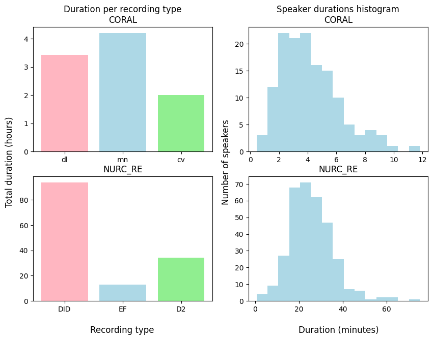
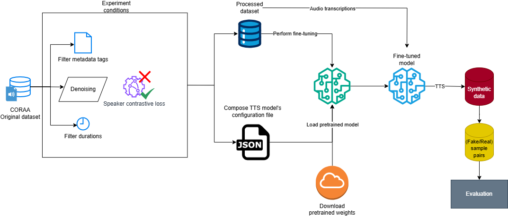

# `Síntese text-to-speech em português brasileiro com variação de sotaque`
# `Text-to-speech synthesis in Brazilian Portuguese with accent variation`

## Apresentação

O presente projeto foi originado no contexto das atividades da disciplina de pós-graduação *IA376N - IA generativa: de modelos a aplicações multimodais*, 
oferecida no segundo semestre de 2024, na Unicamp, sob supervisão da Profa. Dra. Paula Dornhofer Paro Costa, do Departamento de Engenharia de Computação e Automação (DCA) da Faculdade de Engenharia Elétrica e de Computação (FEEC).
 
|Nome  | RA | Especialização|
|--|--|--|
| João Gabriel Teixeira Lima  | 237473  | Eng. de Computação|
| Rita Braga Soares da Silva  | 251627  | Graduação Estatística|

Link para os slides de apresentação da Entrega 3 [aqui](https://docs.google.com/presentation/d/e/2PACX-1vQikFuBtzlrPWVnxrWJvFwhY--e8GFf5YpjGtCYTuwvlJ8whJlT63VM438m4BwytQ/pub?start=false&loop=false&delayms=60000).

> TODO: Atualizar link de apresentação

## Resumo (Abstract)

Este trabalho explora a aplicação de um modelo de síntese text-to-speech (TTS) com o objetivo de gerar fala sintética em português brasileiro com variação de sotaque das regiões de Minas Gerais e Pernambuco. A abordagem adotada baseia-se no fine-tuning, a partir de um corpus de fala espontânea, de um modelo TTS do tipo end-to-end pré-treinado. A fim de avaliar a qualidade das amostras geradas, calculamos métricas objetivas associadas à prosódia e à representação mel-cepstral dos áudios. Analisamos, a partir dessas métricas e de observações qualitativas, o efeito do uso da função de perda speaker contrastive loss e da realização de um procedimento de remoção de ruído das amostras originais de treinamento.

> TODO: Adicionar resultados

## Descrição do Problema/Motivação

Técnicas de deep learning vêm promovendo grandes aprimoramentos no campo da síntese de fala e habilitando possibilidades inovadoras, como conversão de voz e TTS zero-shot, além de alcançar maiores níveis de expressividade e melhor representação de diferentes estilos de fala. No entanto, embora modelos de síntese atuais sejam capazes de capturar grande variabilidade na fala, aplicações mainstream dessa tecnologia têm uma tendência a gerarem amostras de fala que se alinham à variedade padrão da língua alvo. Assim, a síntese de fala com variação de sotaques é algo interessante devido a uma série de fatores.

Do ponto de vista comercial, é possível pensar que a geração de fala semelhante à variedade local dos usuários pode provocar maior penetração e aceitação de produtos que implementam essa tecnologia. Já em relação a políticas linguíticas, a difusão de modelos dessa natureza seria uma ação no sentido de combater estereótipos forjados a partir da visão preconceituosa de que somente a variedade padrão da língua é "correta", além de contribuir para a manutenção de identidades regionais.

Os maiores desafios associados a esse problema estão relacionados à variabilidade entre sotaques no que se refere ao mapeamento de realização fonética dos grafemas e às diferenças prosódicas. 

## Objetivo

O objetivo principal deste projeto é implementar um modelo de síntese de fala capaz de gerar amostras com sotaques de diferentes variedades do português brasileiro.

## Metodologia

A metodologia adotada é inspirada pelo modelo de TTS SYNTACC **[1]**, que é capaz de produzir amostras de fala em inglês com sotaque de falantes estrangeiros.

O SYNTACC é um modelo de TTS end-to-end, ou seja, que realiza todas as etapas de conversão texto-fala em um único procedimento de treinamento. Para isso, integra vários componentes distintos que são otimizados em conjunto. A fim de inserir a variação de sotaque no treinamento, são produzidos embeddings de sotaque que são concatenados às saídas do componente de encoding textual. A experimentação dos autores no trabalho original de proposição do modelo, que tomamos como referência, é composta por duas etapas principais, uma primeira na qual realizam fine-tuning a partir de pesos de um modelo originalmente treinado exclusivamente com 44 horas de gravações de inglês padrão, e uma segunda na qual aplicam um procedimento denominado weight factorization, cuja finalidade é integrar pesos de sotaque compartilhados e específicos.

Este trabalho busca reproduzir o procedimento de fine-tuning descrito em **[1]**. Para isso, utilizamos ferramentas disponíveis através da biblioteca Coqui TTS **[2]** para realizar tarefas de processamento de áudio e texto, carregamento de modelos e fine-tuning a partir de checkpoints disponíveis do YourTTS, modelo no qual o SYNTACC se baseia. O checkpoint utilizado é a versão padrão do YourTTS [disponibilizada publicamente](https://github.com/coqui-ai/TTS/releases/download/v0.5.0_models/tts_models--multilingual--multi-dataset--your_tts.zip) cujo pré-treinamento foi realizado utilizando amostras de fala multilíngues em inglês, francês e português. Conforme reportado em **[4]**, os dados em português utilizados para este checkpoint somam um volume total de apenas 10 horas, fato cujo impacto será discutido nas seções seguintes.

Devido à condição ruidosa de muitas das amostras de áudio da base de dados utlizada para fine-tuning, foi realizado um procedimento de remoção de ruído utilizando o modelo [Resemble Enhance](https://github.com/resemble-ai/resemble-enhance), uma ferramenta executável via terminal de comando que tem esse propósito específico.

As métricas objetivas selecionadas para avaliação das amostras geradas foram calculadas por meio dos programas disponibilidados no repositório [TTS Objective Metrics](https://github.com/AI-Unicamp/TTS-Objective-Metrics?tab=readme-ov-file). As métricas selecionadas estão listadas abaixo, juntamente à sua definição:

|Métrica | Descrição | Referência |
|----- | ----- | -----|
|F0 Frame Error (FFE) | Proporção de frames do áudio sintético que contêm diferença de pitch (frequência fundamental) acima de 20% em relação ao real ou erro de vozeamento (produção de som sintético vozeado quando o som na amostra real é surdo ou vice-versa) | **[5](https://ieeexplore.ieee.org/document/4960497)** |
| Mel Cepstral Distortion (MCD) | Erro quadrático médio calculado entre 13 coeficientes mel-cepstrais (MFCCs) extraídos de frames dos áudios sintético e real| **[6](https://ieeexplore.ieee.org/document/407206)**|
| Mel Spectral Distortion (MSD)| Semelhante ao MCD, porém calculado utilizando espectrogramas em escala log-mel em vez de MFCCs. Captura conteúdo harmônico. | **[7](https://arxiv.org/pdf/2011.03568)**|

Os dados de treinamento foram extraídos da base CORAA **[3]**, que agrega amostras de áudio transcrito e validado de corpora variados, abrangendo variedades do português de Minas Gerais, São Paulo (capital e interior) e Pernambuco.

Para cálculo das métricas, foram selecionadas 100 amostras de um falante de Recife e 31 amostras de um falante mineiro de acordo com um único critério: ter duração acima 3 segundos. As transcrições das amostras selecionadas foram, então, utilizadas para gerar as amostras sintéticas correspondentes a partir de cada uma das versões dos modelos treinados e o cálculo das métricas foi realizado para cada par (real/sintético) de áudios.

> TODO: mencionar a análise estatística

### Bases de Dados e Evolução

|Base de Dados | Endereço na Web | Resumo descritivo|
|----- | ----- | -----|
|NURC Recife (EFs) | [Link](https://fale.ufal.br/projeto/nurcdigital/) | Corpus da variedade de Pernambuco. Foram consideradas apenas gravações da modalidade "elocução formal", que correspondem a monólogos do falante alvo em fala espontânea. Gravações são bastante antigas e algumas utilizam aparelhos de gravação de baixa qualidade. Há também casos de gravações em ambientes ruidosos ou com eco |
| C-ORAL Brasil | [Link](https://www.c-oral-brasil.org/)| Corpus da variedade de Minas Gerais. Há modalidades de gravação em que apenas o locutor alvo fala (monólogos), além de diálogos e conversações. Muitas amostras apresentam ruído intenso.|

A distribuição do volume total de amostras disponíveis pode ser observado na seguinte figura:




#### Considerações importantes
* Modificação em relação a E1: embora estejam disponíveis na base CORAA, optou-se por não trabalhar com amostras da variedade de São Paulo pois não há como inferir a tag de identidade de falante a partir do modo como a tabela de metadados está anotada originalmente
* Os áudios estão transcritos em trechos curtos. Eliminamos trechos com duração inferior a 1,5 (devido à baixa quantidade de informação fornecida ao modelo) e superior a 10 segundos (devido à grande exigência computacional)
* Apesar de não ser o ideal, realizamos experimentos utilizando dados da categoria de diálogos do dataset de fala mineira. Essa categoria consiste de gravações em que o locutor alvo interage com o documentador, o que pode gerar representações inexatas do speaker encoder. Contudo, verificando que as falas dessa categoria são majoritariamente do locutor alvo, decidimos utilizar esses dados com o propósito de aumentar o volume de dados da variedade mineira 
* Realizamos um procedimento de remoção de ruído nos datasets utilizados com o intuito de tentar minimizar a geração de ruído nas amostras sintéticas.
* Todos os áudios foram amostrados a 16kHz e normalizados para -27dB (configuração do SYNTACC)
* As transcrições devem passar por um tratamento a fim de converter caracteres especiais e numerais para grafemas (ex.: R$2 -> dois reais). Coqui implementa isso nos argumentos do modelo.
* Para usar os formatadores de dataset existentes no Coqui, é necessário organizar os diretórios do dataset da maneira exigida por cada formatador. A estrutura adotada foi a seguinte, apropriada para utilização com o formatador `vctk_old`:

> TODO: referenciar o script que faz o arranjo dos dados

```
root_path/
├── txt/                      # Folder containing transcription files
│   ├── p225/                 # Speaker-specific folder
│   │   ├── p225_001.txt      
│   │   ├── p225_002.txt      
│   │   └── ...               
│   └── ...                   
├── wav48/                    # Folder containing audio files
│   ├── p225/                 
│   │   ├── p225_001.wav      
│   │   ├── p225_002.wav      
│   │   └── ...               
│   └── ...
```
### Workflow



## Experimentos, Resultados e Discussão dos Resultados

Partindo da observação de que a quantidade e a qualidade dos áudios da base CORAA teriam grande influência para a qualidade final das amostras geradas, a experimentação desempenhada neste trabalho teve como principal propósito avaliar o impacto das seguintes variações de configuração do processo de fine-tuning do modelo:

- Inclusão de dados da categoria de diálogos da variedade mineira (DLG)
- Realização de remoção de ruído (DNS)
- Utilização da função de perda speaker contrastive loss, definida em   **[4]**. Essa função compara embeddings de falante extraídos das amostras reais e das geradas a partir de um modelo pré-treinado baseado no wav2vec 2.0. Levantamos a hipótese de que, caso os áudios reais tenham ruído persistente, essa propriedade seria capturada pelo embedding de falante, logo a utilização dessa função de perda poderia encorajar o modelo a produzir amostras igualmente ruidosas (SCL)
- Seleção de áudios com base em diferentes parâmetros presentes na tabela de metadados da base CORAA. Esses parâmetros foram anotados manualmente por avaliadores humanos e indicam fatores como presença de ruído dos áudios, realização de pausas preenchidas, hesitações do falante, dentre outros. As anotações julgadas relevantes são:
	+ Votos negativos (NEG)
	+ Votos para pausa preenchida (PSP)
	+ Votos para hesitação (HES)
		
		(A inserção de cada tag indica seleção  exclusiva de amostras com 0 votos de cada anotação)

Assim, realizamos 4 treinamentos diferentes, de acordo com as seguintes especificações:

|Treinamento (run) | Configurações |
|----- | ----- |
| 01 | NEG + SCL|
| 02 | NEG + PSP + HES + DLG |
| 03 | NEG + PSP + HES + DLG + DNS|
| 04 | NEG + PSP + HES + DLG + DNS + SCL |

>TODO: resultados


## Conclusão

>TODO: conclusão

## Referências Bibliográficas
**[1]** NGUYEN, T.-N.; PHAM, N.-Q.; WAIBEL, A. SYNTACC : Synthesizing Multi-Accent Speech By Weight Factorization. In: ICASSP 2023 - 2023 IEEE INTERNATIONAL CONFERENCE ON ACOUSTICS, SPEECH AND SIGNAL PROCESSING (ICASSP), jun. 2023. ICASSP 2023 - 2023 IEEE International Conference on Acoustics, Speech and Signal Processing (ICASSP) [...]. [S. l.: s. n.], jun. 2023. p. 1–5. Disponível em: https://ieeexplore.ieee.org/document/10096431/?arnumber=10096431. Acesso em: 9 set. 2024.

**[2]** https://github.com/coqui-ai/TTS

**[3]** CANDIDO JUNIOR, Arnaldo et al. CORAA ASR: a large corpus of spontaneous and prepared speech manually validated for speech recognition in Brazilian Portuguese. Language Resources and Evaluation, v. 57, n. 3, p. 1139-1171, 2023. Disponível em: https://doi.org/10.1007/s10579-022-09621-4. Acesso em: 07 out. 2024.

**[4]** Casanova, E., Weber, J., Shulby, C. D., Junior, A. C., Gölge, E., & Ponti, M. A. (2022, June). Yourtts: Towards zero-shot multi-speaker tts and zero-shot voice conversion for everyone. In International Conference on Machine Learning (pp. 2709-2720). PMLR.

**[5]**  Chu, Wei and Alwan, Abeer. Reducing f0 frame error
 of f0 tracking algorithms under noisy conditions with
 an unvoiced/voiced classification frontend. In Acoustics,
 Speech and Signal Processing, 2009. ICASSP 2009. IEEE
 International Conference on, pp. 3969–3972. IEEE, 2009.
 
**[6]** R. Kubichek, "Mel-cepstral distance measure for objective speech quality assessment," Proceedings of IEEE Pacific Rim Conference on Communications Computers and Signal Processing, Victoria, BC, Canada, 1993, pp. 125-128 vol.1, doi: 10.1109/PACRIM.1993.407206.

**[7]** Weiss, R. J., Skerry-Ryan, R. J., Battenberg, E., Mariooryad, S., & Kingma, D. P. (2021, June). Wave-tacotron: Spectrogram-free end-to-end text-to-speech synthesis. In ICASSP 2021-2021 IEEE International Conference on Acoustics, Speech and Signal Processing (ICASSP) (pp. 5679-5683). IEEE.

