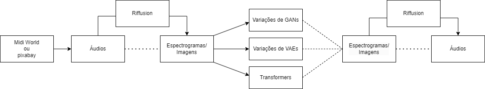

# `Sintetizando novos gêneros musicais`

## Apresentação

 
> |Nome  | RA | Curso|
> |--|--|--|
> | Mariana Ap. Ferreira| 183670 | Eng. de Computação|
> | Leonardo Colussi Mazzamboni| 220129 | Aluno Especial|

## Resumo (Abstract)

> O objetivo é sintetizar novos estilos musicais a partir de sons de entrada. A metodologia será composta pela tradução do sons em espectrogramas (para capturar as texturas, sons e melodias de cada gênero musical) e depois utilizaremos técnicas de geração de dados, como GANs e VAEs.

## Descrição do Problema/Motivação

> O interesse do grupo para essa aplicação vêm pois trabalhar com áudio (e sinais) é algo ainda não explorado.

## Objetivo

> O objetivo da aplicação do projeto é geração de ritmos musicais diferentes a partir de um ritmo de entrada. Por exemplo, a partir de uma música de jazz conseguir sintetizá-la no ritmo rock.

> Espera-se que a rede consiga aproveitar as informações da música de entrada e a transforme em novas músicas utilizando seu ritmo, melodia, harmonia, acordes e instrumentos musicais.

## Metodologia

> A partir da literatura de referência, o grupo decidiu trabalhar com imagens de espectrogramas dos áudios que serão capturados para o projeto, via [pixabay](https://pixabay.com/music/search/music/) / [Midi World](https://www.midiworld.com/) evitando violar direitos autorais. Para a transformação do áudio em seus respectivos espectrogramas será utilizado o [Riffusion](https://github.com/riffusion/riffusion-hobby).

> Em uma primeira abordagem prática, o grupo decidiu trabalhar com CycleGANs (como presente neste [repositório](https://github.com/moslehi/deep-learning-music-style-transfer)) devido a aspectos de simplicidade quando comparado a outras técnicas mais sofisticadas.
Assim, se essa primeira abordagem for bem sucedida, serão explorados as demais técnicas que, provavelmente, trarão resultados mais satisfatórios.

### Datasets

> Para o início dos testes, um gênero musical será fixado e escolhido um conjunto de músicas para a avaliação dos resultados iniciais. O escolhido para os primeirs testes são músicas "relaxantes", com notas de jazz.
> Conforme a evolução das redes, o dataset será aumentado gradativamente com diferentes gêneros musicais de entrada.

### Possíveis abordagens

**Variantes das GANs:**
- CycleGAN (Zhu et el., 2017)
- WaveGAN (Donahue et el., 2019);
- SpecGAN (Donahue et el., 2019).

**Variantes dos VAEs**

**Técnicas "híbridas"**
- VAE-GAN

**Para inspiração:**
- Jukebox, OpenAI;
- MuseNet, OpenAI

### Métricas de avaliação

**Quantitativas**
- Inception score;
- Nearest Neighbor Comparisons.

**Qualitativas:**
- Será selecionada uma amostra de pessoas (a definir), bem como uma amostra de músicas sintéticas;
-As pessoas deverão classificar a partir de quais músicas as amostras sintéticas vieram e, também, o estilo musical do áudio gerado (rock, jazz, clássico etc).

### Bases de Dados e Evolução
> Elencar bases de dados utilizadas no projeto.
> Para cada base, coloque uma mini-tabela no modelo a seguir e depois detalhamento sobre como ela foi analisada/usada, conforme exemplo a seguir.

|Base de Dados | Endereço na Web | Resumo descritivo|
|----- | ----- | -----|
| Pixabay | https://pixabay.com/music/search/music/ | Milhares de trechos de músicas royalty-free|

> O formato da base são faixas de áudios de diferentes durações. É possível pesquisar por diversos gêneros musicais. As primeiras feixas selecionadas foram músicas "relaxantes", com notas de jazz e instrumentais.

### Workflow

## Experimentos, Resultados e Discussão dos Resultados

Até o momento desta entrega parcial do projeto (E2), explorou-se teoricamente diferentes aplicações de *Music Style Transfer*, ainda não tendo contato essencialmente prático por parte do grupo. Devido ao deste projeto ser de aplicação inusitada pela dupla, algumas dificuldades foram encontradas e atrasando o cronograma proposto.

Link da apresentação: https://docs.google.com/presentation/d/1Lmz1MJK1Uv_xe4088bim_Fi-xjDIJQS_qYM_uYwuQuc/edit#slide=id.g2d3fc101b55_0_71

## Referências

Brunner, Gino, et al. "MIDI-VAE: Modeling dynamics and instrumentation of music with applications to style transfer." arXiv preprint arXiv:1809.07600 (2018).

Dhariwal, Prafulla, et al. "Jukebox: A generative model for music." arXiv preprint arXiv:2005.00341 (2020).

Donahue, Chris, Julian McAuley, and Miller Puckette. "Adversarial audio synthesis." arXiv preprint arXiv:1802.04208 (2018).

Dash, Adyasha, and Kathleen Agres. "AI-Based Affective Music Generation Systems: A Review of Methods and Challenges." ACM Computing Surveys 56.11 (2024)

