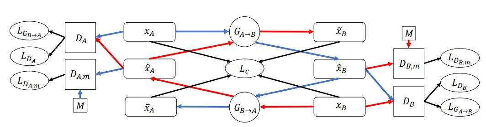
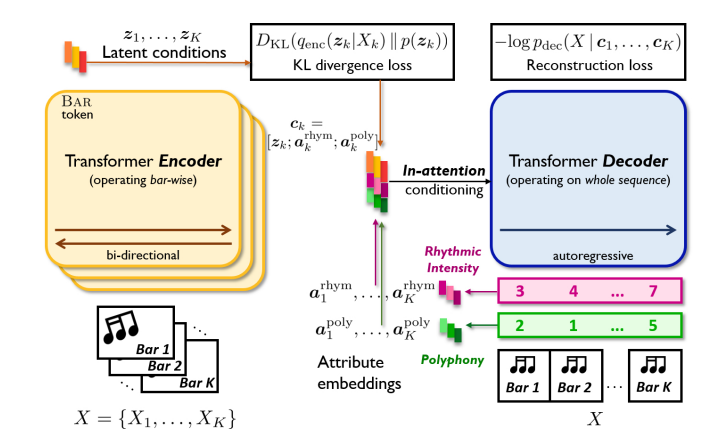
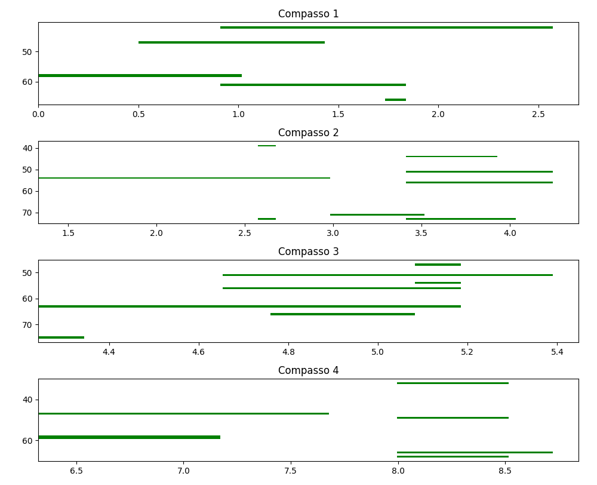

# `Sintetizando novos gêneros musicais`

**Leonardo Colussi Mazzamboni (220129)**, **Mariana Aparecida Ferreira (183670)**

Instituto de Computação -- Universidade Estadual de Campinas (Unicamp)

[Link](https://docs.google.com/presentation/d/1b1SgfHnqVQIU_on1VeyIp8biBsLkpgM4pq8h6LIzWmY/edit#slide=id.g2d613a0c77d_0_34) apresentação. O relatório técnico tem o mesmo conteúdo do read.me e uma melhor visualização das tabelas e imagens, use-o para avaliar os resultados.

---

## Resumo

Este trabalho tem como objetivo explorar técnicas de inteligência artificial, com foco em geração de dados sintéticos. Mais especificamente, na geração de transferência de estilos musicais. O trabalho abordou duas arquiteturas (GANs e VAEs) e apresentou os resultados obtidos, comparações e todas as limitações durante as execuções. Os áudios gerados com a VAE foram os mais coesos quando comparados com a GAN, mesmo com as limitações do treinamento da arquitetura.

---

## Introdução

A geração e transferência de estilos musicais é um campo emergente dentro da inteligência artificial (IA), que busca utilizar modelos de aprendizado de máquina para criar ou transformar músicas em diferentes estilos. Esses modelos são particularmente interessantes no contexto da IA generativa, onde a ideia é aprender padrões e estruturas de dados existentes para produzir novos exemplos sintéticos, com aplicações tanto artísticas quanto práticas. Neste trabalho, explorou-se a aplicação de dois modelos de aprendizado profundo amplamente utilizados para essa tarefa: o CycleGAN e o VAE. Esses modelos oferecem abordagens distintas para gerar e transferir estilos musicais e suas aplicações têm se mostrado promissor para criar novas composições musicais, realizar transformações ou até gerar variações de gêneros musicais existentes.

O primeiro modelo generativo testado foi a CycleGAN *(Cycle-Consistent Generative Adversarial Network)*, que é um tipo de rede neural capaz de transformar imagens de um tipo em imagens de outro tipo, sem precisar de pares de imagens correspondentes. Em modelos tradicionais de redes neurais, é necessário ter imagens que combinem entre si, como uma foto e sua versão em preto e branco, para que o modelo aprenda a fazer a transformação. Porém, a CycleGAN consegue aprender essa transformação sem precisar desses pares de imagens.

A principal ideia por trás da CycleGAN é um conceito chamado consistência cíclica. Isso significa que, ao transformar uma imagem de um tipo (por exemplo, uma foto) em outro tipo (como uma pintura), e depois transformar novamente essa imagem para o primeiro tipo (foto), a imagem original precisa ser recuperada. Esse processo ajuda a garantir que a transformação mantenha as características importantes da imagem original. A CycleGAN usa duas redes que geram as imagens e duas redes que avaliam se as imagens geradas são reais ou não. O modelo foi criado para trabalhar em situações em que é difícil ou até impossível encontrar pares de imagens correspondentes para treinar, o que acontece, por exemplo, quando não há uma correspondência exata entre os dois tipos de imagens.

O artigo de [referência](https://arxiv.org/pdf/1809.07575) mostra que a CycleGAN é bastante eficaz em várias tarefas de transformação de imagens, como transformar fotos em pinturas ou converter paisagens em mapas, sem precisar de imagens emparelhadas. A principal inovação da CycleGAN é sua capacidade de gerar imagens convincentes e realistas, mesmo sem exemplos diretamente correspondentes, o que amplia bastante as possibilidades de uso dessa tecnologia.

Embora as implementações mais conhecidas da CycleGAN lidem com imagens, recentemente houve adaptações para o processamento de música simbólica, utilizando representações como sequências de notas ou matrizes de piano rolls (cujo eixo vertical representa o tempo, enquanto o eixo horizontal representa as notas). O principal desafio na geração musical é a necessidade de tratar a música de forma que as transformações estilísticas ainda preservem a musicalidade e a estrutura rítmica original.

Já o segundo modelo testado, o VAE [*(Variational Autoencoder)*](https://arxiv.org/pdf/2105.04090), oferece uma abordagem probabilística para gerar novos dados a partir de uma distribuição latente aprendida. A principal ideia por trás dos VAEs é que, em vez de apenas aprender a reconstruir os dados de entrada (como em autoencoders tradicionais) e as GANs, que são baseadas em um jogo adversarial entre um gerador e um discriminador, eles aprendem a gerar novos dados a partir de uma distribuição latente que representa as características fundamentais dos dados. Em vez de aprender uma simples cópia dos dados de entrada, o modelo VAE cria uma distribuição de probabilidade sobre os dados, permitindo que ele gere novos exemplos a partir dessa distribuição.

O modelo é treinado para maximizar a evidência dos dados observados, utilizando a função de verossimilhança (log-verossimilhança) enquanto minimiza a divergência entre a distribuição latente e uma distribuição prior conhecida, como a normal multivariada, utilizando a divergência Kullback-Leibler (KL).

No contexto da música, a tarefa é gerar sequências de notas ou acordes que sigam uma estrutura musical coesa. A vantagem do VAE nesse tipo de tarefa é que ele pode modelar a complexidade da música, aprendendo padrões de harmonia, ritmo e melodia de maneira eficaz. A estrutura latente do modelo permite manipulações interessantes, como alterar o estilo ou a tonalidade de uma música gerada, ou criar variações de uma peça sem perder a consistência musical.

Para a aplicação dos VAEs os dados musicais também podem ser representados de várias formas, como sequências de notas ou matrizes de piano rolls. O [**MuseMorphose**](https://arxiv.org/pdf/2105.04090), nome da arquitetura apresentada pelos autores combina aprendizado profundo, redes neurais e controles interativos, permitindo que o usuário ajuste características musicais como ritmo, harmonia, e melodia ao longo do tempo, enquanto o modelo gera a música, permitindo a geração de música condicionada em parâmetros específicos que variam ao longo do tempo. 

Em termos de desafios, a CycleGAN pode enfrentar dificuldades quando se trata de preservar características musicais essenciais, como a harmonia e a melodia, durante a transformação estilística, uma vez que o modelo pode gerar resultados que são estilisticamente coerentes, mas que perdem a musicalidade. O VAE, embora ofereça uma maior flexibilidade e controle sobre o processo de geração, pode ser mais sensível ao processo de treinamento e pode exigir técnicas avançadas de regularização e otimização para garantir que as representações latentes sejam realmente úteis para a transferência de estilo.

---

## Metodologia

Neste projeto, abordou-se duas diferentes técnicas: CycleGAN e VAE. Assim, a metodologia não foi a mesma para as duas abordagens, uma vez que os dados de entrada deveriam atender as respectivas peculiaridades. Logo, nas próximas subseções serão apresentadas as arquiteturas, bem como os aspectos técnicos que constituem cada uma delas.

### CycleGAN

Primeiramente, abordou-se uma técnica mais conhecida pela literatura, as CycleGANs, utilizando como referência o artigo [CycleGAN](https://github.com/Asthestarsfalll/Symbolic-Music-Genre-Transfer-with-CycleGAN-for-pytorch). O conjunto de dados utilizado para o desenvolvimento consiste em 12.341 amostras (90% treino e 10% teste) de dados simbólicos de músicas (MIDI - Musical Instrument Digital Interface), pareados no estilo piano pop e piano jazz. Nesse tipo de arquivo é possível capturar informações de notas, duração e velocidade dos instrumentos, no entanto, sem informação acústica.

Os dados já se encontravam previamente pré-processados no quesito de tempo das notas e com representação *Pianoroll* (auxílio dos pacotes *pretty midi* e *Pypianoroll* do *Python*), em que as músicas são representadas em um formato de matriz bidimensional (tempo x notas), de modo que os valores na matriz indicam a presença ou ausência de notas musicais em um determinado instante. Ainda, foi utilizado uma taxa de amostragem de 16 passos de tempo por compasso (segmento de tempo correspondente a um número específico de batidas), escolha padrão em diversas literaturas, utilizando frases consistindo de 4 barras consecutivas. Como notas de tom abaixo de C1 ou acima de C8 não são muito comuns, os autores do artigo de referência decidiram reter notas apenas entre esse intervalo, que são $p = 84$ notas. Note, então, que a entrada da rede a ser treinada é de $64 \times 84$.

Para a problemática em questão, foi proposto o *workflow* da Figura 1, em que foi adicionado mais dois extras geradores (além dos dois do ciclo), $D_{A,m}$ e $D_{B,m}$, com a finalidade de abordar desafios específicos relacionados à qualidade e realismo da música gerada durante a transferência de gênero musical. Esses discriminadores extras, ao serem treinados com dados de múltiplos domínios (não apenas do domínio alvo), ajudam a regularizar o gerador, evitando que este crie apenas músicas que se mantenham dentro do manifold musical, i.e., previne que o gerador produza características superficiais do gênero musical de origem.

Assim, sejam A e B os conjuntos musicais (Jazz ou Pop), detona-se $X_K$, $K \in \{A, B\}$, as amostras reais de tais conjuntos, $X_{\hat{K}}$ a amostra transferida para o gênero musical $K$ e $X_{\tilde{K}}$ a amostra retornada ao seu gênero musical de origem. Portanto, as equações das funções de perda para os geradores estão presentes na Equação 1.

$$
L_{G_{A \to B}} = \|D_B(\hat{x}_B) - 1\|_2
$$

$$
L_{G_{B \to A}} = \|D_A(\hat{x}_A) - 1\|_2.
$$

Por sua vez, a função perda do ciclo está na Equação 2.

$$
L_c = \|\hat{x}_A - x_A\|_1 + \|\hat{x}_B - x_B\|_1.
$$

Resultando, então, na função perda total dos geradores, Equação 3, em que no treinamento a constante $\lambda$ foi empregada com valor sendo igual a 10.

$$
L_G = L_{G_{A \to B}} + L_{G_{B \to A}} + \lambda L_c.
$$

Agora, na Equação 4 consta as funções de perda para os discriminadores. Para todas as amostras que estes receberam, foi adicionado um ruído com distribuição Normal padrão, servindo para estabilizar o aprendizado do modelo.

$$
L_{D_A} = \frac{1}{2} \left( \|D_A(x_A) - 1\|_2^2 + \|D_A(\hat{x}_A)\|_2^2 \right)
$$

$$
L_{D_B} = \frac{1}{2} \left( \|D_B(x_B) - 1\|_2^2 + \|D_B(\hat{x}_B)\|_2^2 \right).
$$

A Equação 5 representa as duas funções de perda extra dos discriminadores.
 
$$ L_{D_{A,m}} = \frac{1}{2} \left( \left| D_{A,m}(x_M) - 1 \right|_2^2 + \left| D_{A,m}(\hat{x}_A) \right|_2^2 \right) $$

$$ L_{D_{B,m}} = \frac{1}{2} \left( \left| D_{B,m}(x_M) - 1 \right|_2^2 + \left| D_{B,m}(\hat{x}_B) \right|_2^2 \right) $$

Por fim, a função de perda total é dada pela Equação 6, em que $\gamma$ foi utilizado como sendo fixo e igual a 1.

$$
L_{D,all} = L_D + \gamma \left( L_{D_{A,m}} + L_{D_{B,m}} \right).
$$

No que tange ao treinamento do modelo, utilizou-se tamanho dos *batches* igual a $16$, otimizador Adam com taxa de aprendizado de $lr=0,0002$ e taxas de decaimento de $0,5$ e $0,999$, durante $25$ épocas. Nas Tabelas 1 e 2 constam as arquiteturas dos discriminadores e geradores da CycleGAN proposta, respectivamente. Todos os hiperparâmetros fixos citados anteriormente foram mantidos do artigo original, em que foi comentado que estas eram as melhores opções apresentadas na literatura para esse tipo de problemática.

Para o treinamento da CycleGAN, utilizou-se uma máquina com processador Ryzen 7 5800X e GPU RTX4060 de 16GB.

#### Arquitetura do Discriminador - CycleGAN

Entrada: (batchsize = 16) x 64 x 84 x 1

| Camada     | Filtro     | Stride   | Canal | Instance Norm. | Func. Ativação |
|------------|------------|----------|-------|-----------------|----------------|
| Conv.      | 4 x 4      | 2 x 2    | 64    | Sim             | LeakyReLU      |
| Conv.      | 4 x 4      | 2 x 2    | 256   | Não             | LeakyReLU      |
| Conv.      | 1 x 1      | 2 x 2    | 1     | Sim             | -              |

Saída: (batchsize = 16) x 16 x 21 x 1

#### Arquitetura do Gerador - CycleGAN

Entrada: (batchsize = 64) x 84 x 1

| Camada            | Filtro     | Stride   | Canal | Instance Norm. | Func. Ativação |
|-------------------|------------|----------|-------|-----------------|----------------|
| Conv.             | 7 x 7      | 1 x 1    | 64    | Sim             | ReLU           |
| Conv.             | 3 x 3      | 2 x 2    | 128   | Sim             | ReLU           |
| Conv.             | 3 x 3      | 2 x 2    | 256   | Sim             | ReLU           |
| 10 x ResNet       | 3 x 3      | 1 x 1    | 256   | Sim             | ReLU           |
| Deconv.           | 3 x 3      | 2 x 2    | 128   | Sim             | ReLU           |
| Deconv.           | 3 x 3      | 2 x 2    | 64    | Sim             | ReLU           |
| Deconv.           | 7 x 7      | 1 x 1    | 1     | Não             | Sigmoid        |

Saída: (batchsize = 64) x 84 x 1

### MuseMorphose

Os Autoencoders Variacionais (VAEs) são uma classe de modelos probabilísticos utilizados para aprender representações latentes dos dados. O objetivo do VAE é modelar a distribuição de probabilidade dos dados de entrada, permitindo a geração de novas amostras semelhantes aos dados de treinamento. O VAE consiste em duas partes principais:

1. **Encoder (Codificador)**: Este componente mapeia a entrada para uma distribuição latente, representando a incerteza na codificação dos dados. O encoder gera dois parâmetros para a distribuição latente: a média $\mu$ e o desvio padrão ($\sigma$), que são usados para amostrar o espaço latente de forma probabilística.

2. **Decoder (Decodificador)**: O decodificador recebe amostras do espaço latente e as transforma de volta para a distribuição original dos dados. O objetivo do decoder é gerar novos dados que se assemelhem aos dados de treinamento.

O treinamento do VAE é baseado em duas principais partes da função de perda:

1. **Perda de reconstrução**: Mede a qualidade da reconstrução dos dados originais a partir das amostras latentes. Em termos de máxima verossimilhança é expresso pela fórmula 7, onde $p(x/z)$ é a distribuição de probabilidade de reconstrução, e $q(z/x)$ é a distribuição do espaço latente dada a entrada $x$:

$$
L_{\text{reconstruction}} = -\mathbb{E}_{q(z|x)}[\log p(x|z)]
$$

2. **Divergência Kullback-Leibler (KL)**: Mede a diferença entre a distribuição latente aprendida e uma distribuição prior (normal multivariada). A perda KL é dada pela fórmula 8, onde $\mu\_j$ e $\sigma\_j$ são os parâmetros do encoder, e $p(z)$ é a distribuição prior (normal):

$$
L_{\text{KL}} = D_{\text{KL}}(q(z|x) \parallel p(z)) = -\frac{1}{2} \sum_{j=1}^{d} \left( 1 + \log(\sigma_j^2) - \mu_j^2 - \sigma_j^2 \right)
$$

A função de perda total é a soma das duas perdas mencionadas, e o VAE aprende a balancea-las durante o treinamento, gerando representações latentes que são ao mesmo tempo precisas e bem comportadas.

$$
L_{\text{total}} = L_{\text{reconstruction}} + L_{\text{KL}}
$$

A arquitetura proposta (chamada de [*MuseMorphose*](https://arxiv.org/pdf/2105.04090)) para a geração de música trata o problema de geração musical como uma tarefa de modelagem autoregressiva condicionada. O modelo considera segmentos da música como a unidade de geração, permitindo que o decoder modele de forma mais flexível e dinâmica a estrutura da música ao longo do tempo. Uma característica importante é o uso da "atenção auto-regressiva", onde cada token de entrada afeta diretamente a geração do token seguinte, permitindo capturar dependências de longo alcance dentro da sequência de música, como pode ser visto na figura abaixo.

A arquitetura é baseado em um VAE (Autoencoder Variacional, apresentado acima também), no qual as entradas de música e controles são passados por um encoder para gerar uma representação latente que é utilizada pelo decoder para gerar a música. A arquitetura está apresentada na tabela 3 em detalhes. Os controles que os autores fazem são da Intensidade rítmica e polifonia, que são dois atributos musicais que têm impacto direto na percepção emocional da música. A intensidade rítmica refere-se à força ou ênfase dos ritmos em uma peça musical, enquanto a polifonia se refere à presença de múltiplas linhas melódicas independentes na música, como em uma composição com vários instrumentos tocando simultaneamente em diferentes registros.

Outros hiperparâmetros de interesse do modelo foram:

**1. Hiperparâmetros do Encoder:**
- Número de camadas do Transformer Encoder: 12
- Número de cabeçalhos de atenção no encoder: 8
- Dimensão do modelo no encoder: 512
- Dimensão das camadas feed-forward no encoder: 2048

**2. Hiperparâmetros do Decoder:**
- Número de camadas do decoder: 12
- Número de cabeçalhos de atenção no decoder: 8
- Dimensão do modelo no decoder: 512
- Dimensão das camadas feed-forward no decoder: 2040
- Dimensão do vetor de embedding: 512
- Dimensão do espaço latente: 128
- Dimensão do embedding de polifonia: 64
- Dimensão do embedding de frequências rítmicas: 64
- Modo de condicionamento no modelo: "in-attn"
- Número máximo de barras que o modelo pode processar: 16

Os resultados que os autores apresentam foram obtidos após treinar o modelo por aproximadamente 20 épocas (processo que durou dois dias completos), com batch de tamanho 4 em GPUs NVIDIA Tesla V100 com 32GB de RAM, que são GPUs de alto desempenho. Nos testes deste projeto, utilizou-se uma RTX2060 com 8GB de RAM e um batch de tamanho 2, que levou os mesmos dois dias para treinar 7 épocas. A taxa de aprendizado inicial foi de $5,0e-6$.

#### Arquitetura do Modelo MuseMorphose: Encoder e Decoder

##### Encoder: Entrada: (batchsize = 64) x 84 x 1

| Camada  | Filtro  | Stride   | Canal | Normalização  | Func. Ativação |
|---------|---------|----------|-------|---------------|----------------|
| Conv.   | 4 x 4   | 2 x 2    | 64    | Instance Norm.| LeakyReLU      |
| Conv.   | 4 x 4   | 2 x 2    | 64    | Não           | ReLU           |
| Conv.   | 3 x 3   | 1 x 1    | 128   | Instance Norm.| LeakyReLU      |
| Conv.   | 3 x 3   | 1 x 1    | 128   | Instance Norm.| LeakyReLU      |

**Transformer Encoder (12 camadas)**

| Camada | - | - | - | Layer Norm. | - |
|--------|---|---|---|-------------|---|

##### Decoder: Entrada: (batchsize = 64) x 84 x 1

| Camada  | Filtro  | Stride   | Canal | Normalização  | Func. Ativação |
|---------|---------|----------|-------|---------------|----------------|
| Deconv. | 4 x 4   | 2 x 2    | 128   | Não           | ReLU           |
| Deconv. | 4 x 4   | 2 x 2    | 64    | Não           | ReLU           |
| Deconv. | 7 x 7   | 1 x 1    | 1     | Não           | Softmax        |

**Transformer Decoder (12 camadas)**

| Camada | - | - | - | Layer Norm. | - |
|--------|---|---|---|-------------|---|

## Métricas de Avaliação

As métricas de avaliação utilizadas neste trabalho são projetadas para avaliar a qualidade das amostras de áudio geradas, e avaliam a similaridade do histograma de pitch, a distância de MFCC, a convergência espectral e a relação sinal-ruído (SNR). A primeira métrica, similaridade do histograma de pitch, calcula a diferença entre os histogramas de pitch ("quão alto ou quão baixo o som está") das amostras geradas e das amostras originais, ou seja, avalia a correspondência entre a distribuição das notas presentes em ambas as amostras. Um valor mais alto indica uma melhor correspondência.

A distância de MFCC *(Mel-Frequency Cepstral Coefficients)*, por outro lado, é usada para comparar a similaridade entre as características espectrais das amostras. Essa métrica calcula a distância entre os coeficientes MFCC das amostras geradas e as amostras originais. Uma distância de MFCC mais baixa sugere uma maior similaridade espectral, ou seja, que as amostras geradas possuem características de timbre e tonalidade mais próximas das originais.

Por fim, a relação sinal-ruído (SNR) é uma métrica que quantifica a relação entre o sinal útil (o som) e o ruído indesejado em uma amostra. Uma SNR alta sugere que o sinal de áudio gerado é claro e de boa qualidade, com pouco ruído perceptível. Valores mais elevados de SNR são desejáveis, pois indicam que a amostra gerada mantém a clareza e a fidelidade do áudio original. Essas métricas têm sido amplamente usadas em tarefas de geração de áudio e avaliação de qualidade de som, como demonstrado em [Jang et al. (2017)](https://ieeexplore.ieee.org/document/7952714) e [Rossi et al. (2020)](https://ieeexplore.ieee.org/document/8954337).

## Resultados

### CycleGAN

Os resultados utilizando a CycleGAN foram bastante distantes do esperado, tendo como *benchamark* os áudios gerados pelo artigo de referência. Dos mais de 1.000 áudios originais de teste, menos de $5\%$ produziram sons de notas de piano factíveis e, quando isso acontecia, as notas eram muito espaçadas, não apresentando uma fluidez no áudio em que houve transferência de gênero musical. Esse último fato fica evidente ao se analisar as Figuras 3 (áudio original no gênero Jazz) e 4 (áudio transferido para o gênero Pop), em que no eixo horizontal está os compassos musicais (tempo em segundo) dentro de cada compasso e o eixo vertical as notas, então o comprimento da linha verde se refere a duração da nota tocada. Note que na primeira Figura 3 há uma sintonia melódica e há poucas notas esparsas, ao contrário da Figura 4.

Ainda, utilizou-se a métrica *Pitch Histogram Similarity*, que mede a similaridade entre os histogramas de *pitch* (frequências fundamentais) das músicas original e transformada, ficando na faixa $[0,15; 0,25]$ o que indica baixa similaridade, provavelmente por ter alterado significativamente os *pitch* dominantes, como melodias ou harmônicos importantes. Também, foi utilizado a métrica *signal-to-noise ratio* (SNR), que mede relação entre o sinal útil e o ruído introduzido pela transformação, é desejável que os valores sejam positivos, no entanto, os obtidos ficaram na faixa $[-2,50; -2,45]$, sinalizando que houve muito ruído presente.

### MuseMorphose

Conseguimos treinar a arquitetura por 7 épocas, que durou quase dois dias inteiros. Os resultados das perdas do modelo estão ilustrados na figura 5. São poucas épocas para conslusões estatisticamente válidas, mas é possível ver que a perda de reconstrução (RC) diminui ao longo das épocas, o que pode indicar que o modelo está melhorando sua capacidade em reconstruir e gerar músicas. Já a perda KL (da divergência de Kullback-Leibler) mede a distribuição latente aprendida pelo modelo e ela parece aumentar nas primeiras épocas, indicando que a distribuição que está sendo aprendida ainda não é satisfatória (provavelmente por uma não convergencia).

Após o treinamento do modelo, gerou-se 5 amostras distintas a partir de um áudio original de entrada. As amostras foram geradas variando o coeficiente de mudança do ritmo e da polifonia. O gráfico da figura 6 é o mesmo apresentado para a CycleGAN (no eixo horizontal estão os compassos - tempos em segundo e no eixo vertical as notas - o tamanho da barra corresponde a duração da nota tocada). É possível ver que a amostra 1 é a mais condizente com o áudio original, pois não geramos o áudio com muitas mudanças. Também, esta amostra é o que apresenta menos notas esparças, em comparação com as amostras 2 e 4, por exemplo.

 
 
 
 
 

Também calculamos as métricas de *Histogram Similarity* e *signal-to-noise ratio (SNR)* para cada uma das amostras em relação ao áudio original, que estão apresentadas na tabela 4. Pode-se ver que o maior valor de similaridade de pitch foi para a amostra 1, que pelo gráfico das notas estava mais similar com o áudio original. Já pela métrica de ruído, todos os áudios são ruídosos quando comparados com o original, provavelmente puxados pelas notas esparsas.

| **Amostra** | **Pitch Histogram Similarity** | **Signal-to-Noise** |
|-------------|---------------------------------|---------------------|
| 1           | 0.69                            | -2.21               |
| 2           | 0.64                            | -2.13               |
| 3           | 0.65                            | -1.63               |
| 4           | 0.61                            | -1.83               |
| 5           | 0.60                            | -1.83               |

## Conclusão

Este projeto foi bastante desafiador para o grupo, uma vez que envolvia um domínio (áudios) que os integrantes apresentavam pouco conhecimento técnico. Ademais, além de aspectos técnicos de inteligência artificial, foi necessário um conhecimento do campo da música, também distante dos conhecimentos do grupo. Embora os resultados tenham sido longe do esperado, o desconhecimento prévio foi, de certa maneira, positivo para a busca de mais um aprendizado - objetivo principal desta disciplina -, fazendo com que a leitura de diversas bibliografias e a tentativa de entendimento mínimo da dinâmica de áudios/música fossem inevitáveis.

A dificuldade em termos de capacidade computacional também foi um grande problema, ressaltando a importância de incentivos de tecnologia para a produção de pesquisas nessa área do conhecimento.

## Referências

1. **Brunner, Gino, Wang, Yuyi, Wattenhofer, Roger, Zhao, Sumu**. "Symbolic Music Genre Transfer with CycleGAN." *2018 IEEE 30th International Conference on Tools with Artificial Intelligence (ICTAI)*, pp. 786--793, 2018. IEEE. [Link para o artigo](https://ieeexplore.ieee.org/document/8608390)

2. **Zhu, Yifan, Jiang, Junbo, Liu, Haoyan, Wang, Ruoming, Zhang, Zhiyong**. "Variational Autoencoders for Music Generation." *arXiv preprint arXiv:2105.04090*, 2021. [Link para o artigo](https://arxiv.org/abs/2105.04090)

3. **Jang, Eunwoo, Kim, Rob, Kim, Yong**. "Tuning Generative Adversarial Networks for Audio Generation." *Proceedings of the IEEE International Conference on Acoustics, Speech and Signal Processing (ICASSP)*, pp. 7420--7424, 2017. IEEE. [Link para o artigo](https://ieeexplore.ieee.org/document/7952714)

4. **Rossi, Davide, Esquivel, Juan, Dufour, Damien**. "Spectral Quality Assessment for Audio Models Using Mel-Frequency Cepstral Coefficients." *IEEE Transactions on Audio, Speech, and Language Processing*, vol. 28, pp. 1102--1113, 2020. IEEE. [Link para o artigo](https://ieeexplore.ieee.org/document/8954337)
