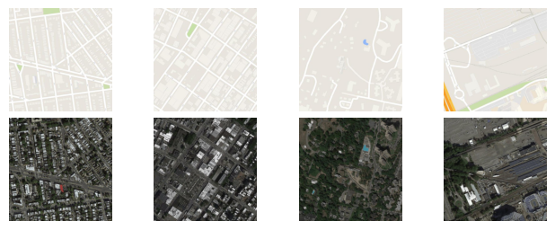
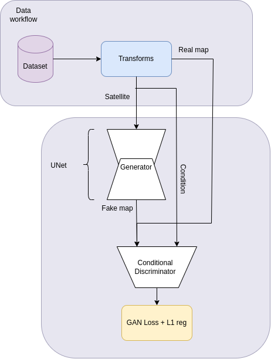

# `Projeto Satellite2Map: Modelos de Traudção de Imagens de Satélite para Mapas (supervisionados e não supervisionados)`

# `Satellite2Map Project: Satellite Image Translation Models for Maps (supervised and unsupervised)`

## Apresentação
O presente projeto foi originado no contexto das atividades da disciplina de pós-graduação *IA376N - IA generativa: de modelos a aplicações multimodais*, 
oferecida no segundo semestre de 2024, na Unicamp, sob supervisão da Profa. Dra. Paula Dornhofer Paro Costa, do Departamento de Engenharia de Computação e Automação (DCA) da Faculdade de Engenharia Elétrica e de Computação (FEEC).

> |Nome  | RA | Especialização|
> |--|--|--|
> | Vinicius Ventura Andreossi  | 195125  | Eng. de Computação|
> | Cosme Rodolfo Roque dos Santos  | 042687  | Doutorado Eng. Elétrica|

Link para os [slides](https://docs.google.com/presentation/d/1wfFYGmEwGVK_7xQVmFo_O_I16TSq4QnFY-srznNGeVQ/edit?usp=sharing)

## Resumo
Com a finalidade de estudar os principais métodos da área de *image-to-image translation* (I2IT), o objetivo deste projeto é explorar o problema da extração de mapas a partir de imagens de  satélite utilizando duas abordagens diferentes: uma supervisionada (Pix2Pix) e outra não supervisionada (CycleGAN).
Os modelos foram implementados e treinados com a base de dados fornecida em seus próprios artigos (ambos usam o mesmo _dataset_). Os resultados obtidos foram imagens coerentes porém distorcidas e com perdas de alguns elementos relevantes para esse tipo de dado, como consistência de ruas, preservação de rotas e alucinações com áreas verdes não existentes.

 ## Descrição do Problema/Motivação
 Uma das subáreas de IA generativa que obteve alguns dos mais impressionantes resultados dos últimos anos tem sido a área de *image-to-image translation* (I2IT) [[1]](#1). Dentro dessa subárea, um problema frequentemente abordado é a obtenção de mapas a partir de imagens de satélite, e vice-versa, devido às suas inúmeras aplicações, por exemplo, ajudando governos a tomarem medidas rapidamente em casos de desastres naturais [[2]](#2).
 A motivação pelo estudo desse problema é avaliar aplicações menos convencionais de modelos generativos, visto que a síntese de dados já é estudada com frequência. Além disso, mapas são um tipo de dado muito rico em informações diversas, sendo relevantes para problemas distintos, desde criação de rotas até segmentação semântica de vegetações. 
 O objetivo principal do projeto será criar um modelo generativo que recebe em sua entrada uma imagem de satélite qualquer e produz como saída uma imagem de mesma dimensão traduzida para um mapa. O mapa obtido deve preservar aspectos julgados como relevantes para esse tipo de dado, como consistência de ruas, preservação de rotas e identificação de propriedades do terreno como presença corpos d'àgua, parques, etc.
 Durante as etapas de treino, validação, testes e inferências, serão utilizados Datasets de imagens de Nova Iorque. Por fim, o modelo será testado com dados novos e desconhecidos, a partir de imagens de satelite da UNICAMP, para avaliação do seu desempenho.

## Objetivo
O objetivo final principal será extrair o mapa de uma localidade a partir de sua foto de satélite e, como objetivo extra, testar a generalização do modelo tentando extrair o mesmo mapa a partir de uma imagem da UNICAMP.
Outros objetivos incluem:
- Familiarização com aplicações menos convencionais de GANs.
- Estudo da avaliação quantitativa e qualitativa de modelos generativos.
- Aprender as etapas do processo de pesquisa na área de modelos generativos.
- Encontrar paralelos e diferenças entre as abordagens supervisionada e não-supervisionada.

## Metodologia

- **Abordagens escolhidas**: As duas abordagens escolhidas são baseadas em métodos consolidados na área de I2IT e até hoje são usados como *benchmarks* para novos trabalhos:
    1. Pix2Pix (2016)[[3]](#3): Possivelmente o framework mais amplamente adotado em problemas de I2IT, o modelo consiste em uma GAN condicionada à imagem de entrada. 
    2. Cycle-GAN (2017)[[4]](#2): proposta pelos mesmos criadores do Pix2Pix, também é uma arquitetura muito utilizada em I2IT e tem um processo de treinamento diferente, buscando otimizar uma loss de "consistência de ciclo" que procura garantir que a imagem original seja a mais próxima possível da imagem obtida pelo mapeamento inverso da imagem traduzida.
- **Ferramentas**: As ferramentas utilizadas estão entre as mais utilizadas na comunidade de Deep Learning atualmente:
    - Criação e treinamento dos modelos: PyTorch
    - Monitoramento de métricas: WandB
- **Resultados esperados**: Devido à quantidade limitada de dados disponíveis e aos dados utilizados não corresponderem a paisagens brasileiras ou próximas das paisagens da Unicamp, é de se esperar um enviesamento do modelo à cidade de Nova Iorque. Esse enviesamento provavelmente será refletido até mesmo em aplicações do modelo a paisagens rurais ou litorâneas. No entanto, espera-se que o modelo consiga extrair mapas qualitativamente bons ainda que apresentem algumas distorções, principalmente em áreas mais rurais.

## Avaliação de resultados
As métricas de avaliação quantitativa que serão utilizadas serão:

**1. Erro Quadrático Médio (MSE)**

O Erro Quadrático Médio é uma métrica comum usada para quantificar a diferença entre a imagem prevista e a imagem real. É definida como:

$$ MSE = \frac{1}{N}\sum_{i=1}^N (y_i - \hat{y}_i)^2 $$
      
onde N é o número total de elementos na imagem, $\hat{y}_i$ é o valor do pixel i da imagem real e $y_i$ é o valor do pixel i da imagem gerada. 
Em tarefas de tradução de imagem, o MSE é usado para avaliar a precisão em nível de pixel das imagens geradas. Um MSE mais baixo indica uma correspondência direta muito próxima com a imagem de verdade, sugerindo que as imagens geradas são próximas em nível de valor de pixels.

**2. Relação Sinal-Ruído de Pico (PSNR)**
      
O PSNR é frequentemente utilizado para medir a qualidade da reconstrução de uma imagem e é inversalmente proporcional ao logarítmo do MSE entre a imagem verdadeira e a imagem gerada: 

$$ PSNR = 20 \cdot \log_{10} \left( \frac{MAX_I}{RMSE(y, \hat{y})} \right)$$

onde $MAX_I$ é o valor máximo possível para um pixel (255 para imagens de 8bits). Geralmente, um valor alto de PSNR sugere uma melhor qualidade de reconstrução da imagem, mas pode enganar por não levar em consideração aspectos estruturais das imagens. Isso pode fazer com que imagens visualmente incoerentes tenham valores de PSNR altos.

**3. Índice de Similaridade Estrutural (SSIM)**

O SSIM baseia-se na ideia de que o sistema visual humano é altamente sensível às informações estruturais nas imagens. Essa métrica é baseada em luminância, contraste e mudanças na informação estrutural e tem como hipótese a ideia de que um pixel é altamente correlacionado aos pixels vizinhos. O SSIM é calculado usando três componentes: luminância, contraste e estrutura:

$$ SSIM(y, \hat{y}) = \frac{(2 \mu_y \mu_{\hat{y}}  + C_1) (2 \sigma_{y \hat{y}} + C_2)}{(2 \mu^2_y + \mu^2_{\hat{y}}  + C_1)(\sigma^2_{y} + \sigma^2_{\hat{y}} + C_2)}$$
      
Onde $\mu$ representa a média das imagens, $\sigma$ são os desvios padrões, $\sigma_{y \hat{y}}$ denota a covariância entre as duas imagens e $C_1$ e $C_2$ são constantes para evitar instabilidade numérica. Evidentemente o SSIM reflete melhor a perspectiva visual humana do que as métricas anteriores.

O SSIM é particularmente útil em tarefas de tradução de imagem, pois fornece uma abordagem mais centrada no ser humano para avaliar a qualidade da imagem. Ao contrário do MSE e do PSNR, que podem ser sensíveis a pequenos erros pixel por pixel, o SSIM captura diferenças perceptuais na estrutura e no padrão, tornando-se uma métrica valiosa para avaliar a qualidade das imagens geradas que devem ser visualmente similares às suas correspondentes reais. Nesta métrica os resultados variam entre 0 e 1, e quanto maior o valor, melhor é a qualidade da imagem gerada em relação à imagem de referência.
  
**4. Acurácia Pixel a Pixel (PA)**

Esta métrica se baseia na diferença absoluta pixel a pixel entre uma imagem gerada e a imagem de referência, com uma tolerância de erro, em que um pixel é considerado "correto" se a diferença absoluta entre o valor gerado e o valor real é menor que um limite pré-definido (delta). 

$$ PA = \frac{1}{N} \sum_{i=1}^N (|y_i - \hat{y}_i| < \delta) $$
      
onde $\delta$ é o limite de tolerância que define se um pixel é correto ou não.  Nesta métrica os resultados variam entre 0 e 1, e quanto maior o valor, melhor é a acurácia da imagem gerada em relação à imagem de referência.

## Bases de Dados e Evolução

|Base de Dados | Endereço na Web | Resumo descritivo|
|----- | ----- | -----|
| Pix2pix maps | [Link](http://efrosgans.eecs.berkeley.edu/pix2pix/datasets/) | 2196 pares de imagens de satélite e mapas da cidade de Nova Iorque com dimensões 600x600 e são separadas em conjuntos de treino, teste e validação com, respectivamente, 1099, 550 e 547 imagens. |

A base de dados é pensada para modelos supervisionados (que aprendem a partir de imagens pareadas nos dois domínios de interesse). Apesar da CycleGAN não necessitar de bases pareadas, o uso desse tipo de base de dados permite uma avaliação objetiva das métricas quantitativas.

As transformações aplicadas às imagens foram o redimensionamento para 256x256 e normalização para o intervalo [-1, 1]. Adicionalmente, foram aplicadas inversões verticais e horizontais com probabilidade de 0.5 para cada.

Exemplos de pares de imagens da base de dados:

## Workflow Pix2pix

## Treinamento e Validação:

- **CycleGAN**:

  -- Evolução da Loss do Gerador:

  -- Evolução da Loss do Discriminador:

  -- Resultado Parcial da Época 10:

  -- Resultado Parcial da Época 50:

  -- Resultado Parcial da Época 90:

- **Pix2Pix**:
  -- Evolução da Loss (Gerador e Discriminador):

  -- Resultado Parcial da Época 10:

  -- Resultado Parcial da Época 50:

  -- Resultado Parcial da Época 90:

- **Resultados:  Métricas**:

Abaixo se encontram os valores obtidos para as métricas propostas para cada um dos modelos. As métricas foram calculadas utilizando todo o conjunto de teste. O procedimento utilizado para o cálculos das métricas pode ser visualizado nos notebooks com sufixo "eval".

> | | MSE | PSNR| SSIM | PA |
> |--|--|--|--|--|
> | Pix2pix | 0.0 | 0.0 | 0.0 | 0.0 |
> | CGAN  | 0.0 | 0.0 | 0.0 | 0.0 |

De forma geral, destaca-se que o Pix2Pix apresentou um desempenho melhor em todas as métricas avaliadas, conforme visualizado na tabela acima.

Um dos motivos que explica este desempenho inferior da CGAN se deve ao fato deste modelo ser mais complexo, e como consequência demandar um período de treinamento maior do que o adotado neste trabalho.

## Conclusão

Apesar dos resultados obtidos não possuírem um nivél qualitativamente bom, pode-se dizer que o Pix2pix conseguiu sim capturar a distribuição de probabilidade condicional desejada. Os resultados obtidos são limitados principalmente pela falta de conjuntos de dados mais diversificados e por limitações do próprio modelo, visto que o Pix2pix deixou de ser o estado-da-arte a muitos anos. Ainda assim, pode-se dizer que o Pix2pix atingiu o objetivo que seus autores propõem: de ser um framework de I2IT simples, leve e generalista.

No entanto, para nosso projeto, desejamos resultados quantitativa e qualitativamente melhores. Para isso, o primeiro passo será testar o Pix2pix quantitativamente com as métricas propostas e, se houver tempo o suficiente, monitorar as métricas ao longo do treinamento. O segundo passo será repetir todo o processo realizado nessa entrega com a CycleGAN, uma abordagem mais moderna dos próprios criadores do Pix2pix (no entanto, também não é o estado-da-arte e nem apresenta competitividade perto dos modelos atuais.)

Finalmente, podemos dizer que até agora foi possível adquirir muito conhecimento sobre o pipeline de pesquisa com modelos generativos, aumentar a familiaridade com conceitos chave da área como arquiteturas de redes neurais, datasets, métricas quantitativas, etc. e também foi possível desenvolver habilidades práticas como monitoramento de métricas, desenvolver visualizações dos resultados, armazenamento de checkpoints, etc.

## Referências Bibliográficas
<a id="1">[1]</a>
Hoyez, H.; Schockaert, C.; Rambach, J.; Mirbach, B.; Stricker, D. "Unsupervised Image-to-Image Translation: a Review". *Sensors*. **2022**, 22, 8540

<a id="2">[2]</a>
Jieqiong Song, Jun Li, Hao Chen, and Jiangjiang Wu. "MapGen-GAN: A Fast Translator for Remote Sensing Image to Map Via Unsupervised
Adversarial Learning", in
*IEEE Journal of Selected Topics in Applied Earth Observations and Remote Sensing*. **2021**, 14, 2341.

<a id="3">[3]</a>
P. Isola, J. -Y. Zhu, T. Zhou and A. A. Efros, "Image-to-Image Translation with Conditional Adversarial Networks," 2017 *IEEE Conference on Computer Vision and Pattern Recognition (CVPR)*, Honolulu, HI, USA, 2017, pp. 5967-5976, doi: 10.1109/CVPR.2017.632.

<a id="4">[4]</a>
J. -Y. Zhu, T. Park, P. Isola and A. A. Efros, "Unpaired Image-to-Image Translation Using Cycle-Consistent Adversarial Networks," 2017 *IEEE International Conference on Computer Vision (ICCV)*, Venice, Italy, 2017, pp. 2242-2251, doi: 10.1109/ICCV.2017.244.

<a id="5">[5]</a>
Song, J.; Li, J.; Chen, H.; Wu J. RSMT: A Remote Sensing Image-to-Map Translation Model via Adversarial Deep Transfer Learning. *Remote Sensing*. **2022**, 14, 919.

<a id="6">[6]</a>
Wang, Z., Bovik, A. C., Sheikh, H. R., & Simoncelli, E. P. (2004). "Image quality assessment: From error visibility to structural similarity." IEEE Transactions on Image Processing.

<a id="7">[7]</a>
Wang, Z., & Bovik, A. C. (2006). "Mean Squared Error: Love it or Leave it?" IEEE Signal Processing Magazine.

<a id="8">[8]</a>
Zhang, Z. et al. (2012). "A survey of image denoising methods." Proceedings of the IEEE.

<a id="9">[9]</a>
Shapiro, J. (2001). "Embedded Image Coding using the Coder/Decoder." IEEE Transactions on Image Processing.